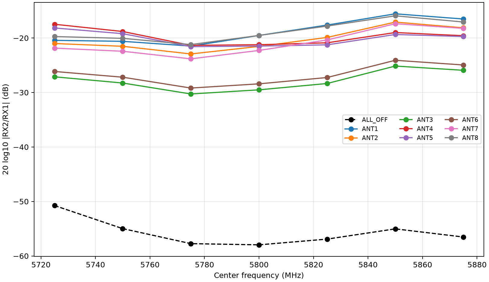
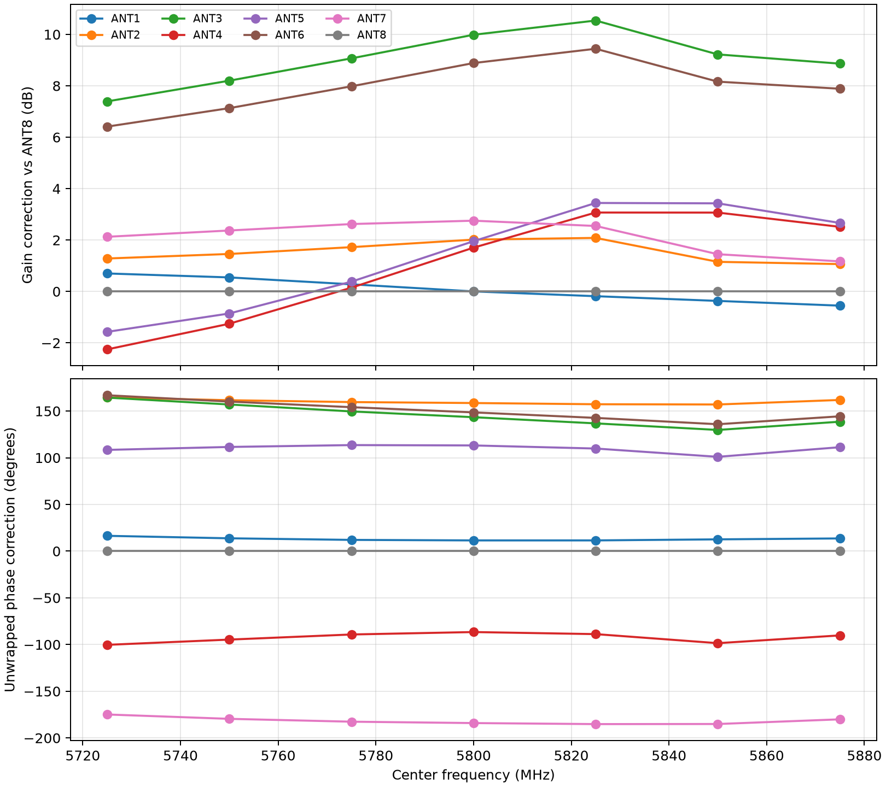
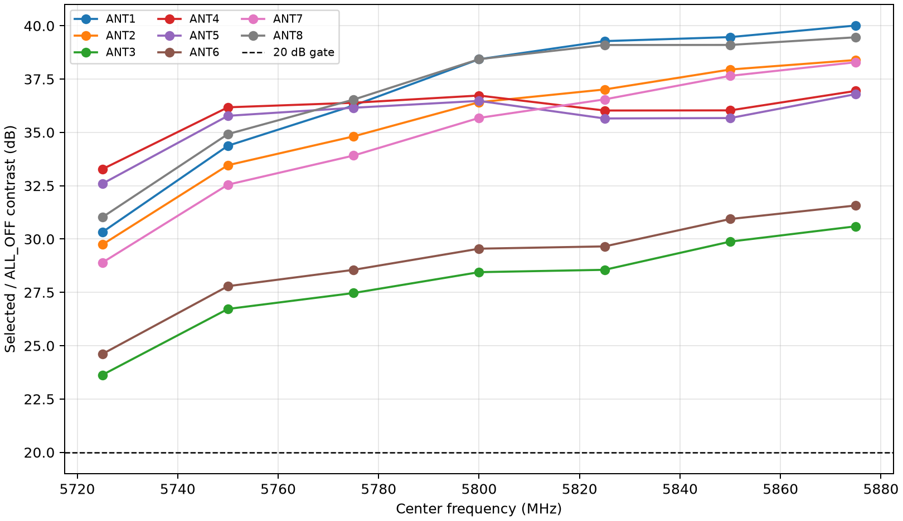
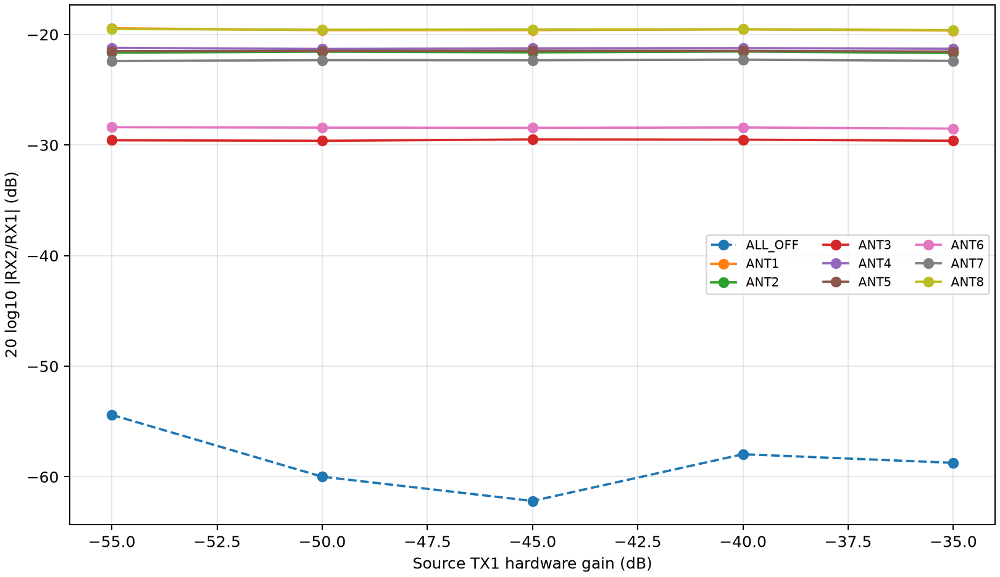
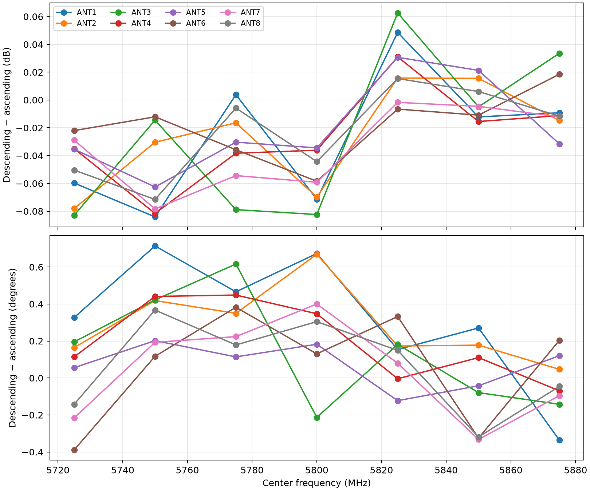

# External-source 5.8 GHz selector campaign

**Date:** 2026-08-30

**Campaign ID:** `external-5g8-20260830`

**Acquisition source freeze:** `42fb89fc9ca560f693ed0eaca19a1c79d4a8f9c3`

**Disposition:** **5.8 GHz engineering calibration works; hardware-path attribution and held-out closure remain before production coefficient deployment.**

## Executive result

The board no longer exhibits the original 5.8 GHz calibration failure when it is measured with an
independent Pluto source and the corrected conducted fixture. All eight selected paths are visible,
repeatable, power-linear, and phase-stable. The point-estimate selected-to-`ALL_OFF` contrast exceeds
20 dB for every path at every tested frequency from 5.725 through 5.875 GHz.

The original failure was therefore not an optimizer-seed problem or a general inability of the
AD9361/selector chain to operate at 5.8 GHz. The evidence accumulated during fixture debugging
identified two physical problems:

1. transmitting and receiving on the same Pluto produced a roughly -21 dB RX2 contamination floor
   even with RX2 terminated; and
2. the downstream 8-way/selector path was initially terminated or otherwise connected incorrectly,
   making selected states indistinguishable from `ALL_OFF`.

Using `.173` as an independent TX1 source removed the first mechanism. Correcting the downstream
fixture restored the selected path. The full campaign then produced 381/381 admitted captures with
no analysis, selector, identity, or cleanup failure.

This is an engineering calibration campaign, not yet a production release. ANT3 and ANT6 carry a
stable broadband loss penalty, and the campaign supplies point estimates rather than the confidence
bounds required by the earlier formal release plan. Several weak-path contrasts are also below the
35.1629 dB conservative one-degree leakage objective. Those issues do not prevent experimentation,
but they should be resolved or explicitly accepted before relying on the board for precision bearing
work.

## Conducted setup

```text
Pluto .173 TX1
      |
      v
  2-way splitter
      |-------------------- 10 dB attenuator ----> Pluto .15 RX1
      |
      v
  8-way splitter
      |  |  |  |  |  |  |  |
      +--+--+--+--+--+--+--+----> selector ANT1..ANT8
                                      |
                                      v
                                 selector COMMON ----> Pluto .15 RX2
```

- Source: `.173`, serial `104473b80a16000de6ff2000f8a6beca79`, TX1 only.
- Receiver: `.15`, serial `104000b29905000e17000800065934759d`, simultaneous RX1/RX2.
- Selector: `stm32c011-4c0055000950313950363920`.
- ST-Link: `002D003A3335511035383531`.
- Source TX2 and receiver TX2 were terminated. Receiver transmitters remained exactly muted.
- Source and receiver clocks were independent. Each capture acquired the actual pilot from RX1 and
  projected both simultaneous channels at the same estimated frequency before forming `RX2/RX1`.
- The result calibrates the conducted splitter/cable/selector chain. It does not measure free-space
  antenna patterns, mutual coupling, enclosure effects, or installed-array geometry.

## Campaign matrix

| Cohort | Conditions | Captures |
|---|---|---:|
| Muted control | 7 frequencies x `ALL_OFF` x 3 repeats | 21 |
| Ascending band | 7 frequencies x 9 states x 3 repeats at -40 dB | 189 |
| Descending band | 7 frequencies x 9 states x 1 repeat at -40 dB | 63 |
| Extra power levels | 4 gains x 9 states x 3 repeats at 5.800 GHz | 108 |
| **Total** | 5.725-5.875 GHz; -55 through -35 dB | **381** |

The -40 dB center-frequency rows in the ascending band cohort are the fifth power level. Raw IQ is
kept outside Git under the local lab-run root. The normalized evidence includes a SHA-256 digest and
size for every raw IQ file. Total raw IQ size is 1,598,219,562 bytes.

## Admission and safety result

Every run used the pinned identities above and acquisition commit `42fb89f`. Every observation had:

- the requested selector code acknowledged and applied;
- a finite two-channel capture of the expected shape;
- exact receiver mute after capture;
- exact source mute after external-source capture; and
- an immediate return to selector `ALL_OFF`.

All seven runs ended with both Pluto transmitters at `-80 dB`, all eight DDS scales at zero, and the
selector at `ALL_OFF` with no lease active. There were zero analysis errors. The maximum driven peak
component was 221 ADC counts, so the -35 dB headroom test was far from clipping.

The muted RX2 RMS stayed between about 8.18 and 8.52 counts across the band. Muted RX1 was normally
8.65-8.94 counts but rose repeatably to 10.79 counts at exactly 5.800 GHz. This narrow RX1-only rise
did not corrupt the normalized selected transfer and should be tracked as a receiver/fixture spur in
future absolute-power work.

## Band result



At 5.800 GHz, the three-repeat mean complex transfer was:

| State | `20 log10 |RX2/RX1|` | Phase | Repeat span |
|---|---:|---:|---:|
| `ALL_OFF` | -57.96 dB | -56.76 degrees | 1.03 dB / 7.48 degrees |
| ANT1 | -19.53 dB | -21.43 degrees | 0.010 dB / 0.270 degrees |
| ANT2 | -21.54 dB | -168.52 degrees | 0.009 dB / 0.094 degrees |
| ANT3 | **-29.51 dB** | -153.34 degrees | 0.027 dB / 0.332 degrees |
| ANT4 | -21.23 dB | +76.68 degrees | 0.012 dB / 0.080 degrees |
| ANT5 | -21.48 dB | -123.11 degrees | 0.041 dB / 0.095 degrees |
| ANT6 | **-28.41 dB** | -158.49 degrees | 0.046 dB / 0.150 degrees |
| ANT7 | -22.28 dB | +174.13 degrees | 0.011 dB / 0.315 degrees |
| ANT8 | -19.53 dB | -9.93 degrees | 0.024 dB / 0.049 degrees |

Selected-state repeatability across the entire band was excellent:

- maximum three-repeat magnitude span: **0.0727 dB**;
- maximum three-repeat phase span: **0.4155 degrees**;
- maximum descending-minus-ascending magnitude difference: **0.0841 dB**; and
- maximum descending-minus-ascending phase difference: **0.7141 degrees**.

These values show that the path-dependent gain and phase are deterministic enough to calibrate.
They also show that a single center-frequency correction is not the best representation: the
relative gain and phase vary with frequency, so software should use the seven complex correction
knots and interpolate unwrapped phase between them.

## Frequency-indexed calibration



The normalized evidence contains a complex correction `C_i(f) = H_ANT8(f) / H_i(f)` for every
selected state and frequency. Applying `C_i` maps each path onto ANT8 at the same frequency.

The 5.800 GHz corrections are:

| State | Gain correction | Phase correction |
|---|---:|---:|
| ANT1 | +0.002 dB | +11.50 degrees |
| ANT2 | +2.017 dB | +158.59 degrees |
| ANT3 | **+9.986 dB** | +143.41 degrees |
| ANT4 | +1.705 dB | -86.61 degrees |
| ANT5 | +1.956 dB | +113.18 degrees |
| ANT6 | **+8.885 dB** | +148.56 degrees |
| ANT7 | +2.754 dB | +175.94 degrees |
| ANT8 | 0 dB | 0 degrees |

ANT3 requires 7.39-10.54 dB of correction across the tested band and ANT6 requires 6.41-9.44 dB.
That costs useful dynamic range and is too large to dismiss as ordinary repeat variation. Because
the deficit is smooth and broadband, the leading candidates are the corresponding splitter outputs,
cables/adapters, connector launches, or selector paths—not DSP instability.

## Isolation result



The selected-to-`ALL_OFF` point-estimate contrast ranged from **23.63 to 40.01 dB** over all 56
selected path/frequency cells. At 5.800 GHz the range was 28.45-38.43 dB. Therefore every measured
cell clears the earlier 20 dB point-estimate screen.

This does not yet prove the formal release requirement that the lower confidence bounds of both raw
and path-specific contrasts exceed 20 dB. It also does not clear the conservative 35.1629 dB
one-degree leakage objective for every cell; ANT3 and ANT6 are below that threshold throughout the
band. The appropriate conclusion is that the fixture and selector now work at 5.8 GHz, while
precision phase deployment still benefits from removing the weak-path loss and repeating a held-out
closure campaign.

## Power linearity and headroom



The RX1 coherent amplitude slope from -55 through -35 dB was **1.0042 dB/dB**, essentially ideal.
Across the same 20 dB stimulus range, the largest selected-path transfer span was only **0.2073 dB**.
The `ALL_OFF` ratio moves more because its coherent phasor is close to the residual leakage/noise
floor; it must not be interpreted as a linear selected signal.

The stable selected ratios demonstrate that the observed path differences are passive fixture/board
properties rather than compression, AGC action, or a TX-gain-dependent contamination mechanism.

## Sweep-direction closure



The reverse sweep reproduced the ascending result to better than 0.085 dB and 0.72 degrees for every
selected cell. There is no meaningful evidence of selector history, LO tuning order, or short-term
thermal drift in this campaign.

## Disposition and next experiments

The board is ready for engineering signal-tracking experiments using frequency-indexed complex
corrections, provided the software retains quality gates and does not represent these coefficients as
production-certified antenna calibration.

Before final coefficient deployment:

1. **Locate the ANT3/ANT6 loss.** With both radios muted and the selector at `ALL_OFF`, swap only the
   selector-end cables `ANT1 <-> ANT3` and `ANT8 <-> ANT6`, then repeat those four states. If the loss
   follows the cables, inspect the 8-way outputs/cables. If it remains on ANT3/ANT6, inspect the PCB
   launches and switch paths.
2. **Repeat after restoration.** Restore the original cable map, record the physical mapping, and run
   the same four-state screen to prove restoration.
3. **Re-run the full band if hardware changes.** Any cable, adapter, splitter port, or PCB repair
   invalidates the corresponding complex coefficients.
4. **Perform held-out closure.** Calibrate from one set of captures and apply the coefficients to a
   source-distinct set acquired later. Report corrected gain RMS, phase RMS, and lower confidence
   bounds for selected/`ALL_OFF` contrast.
5. **Calibrate the installed antenna array.** The present conducted coefficients remove electronics
   and fixture mismatch. Radio direction finding still needs antenna phase-center, cable, mutual-
   coupling, enclosure, and geometry calibration in the final installation.

## Reproduction

The acquisition command is implemented by
[`scripts/run_pinned_static_screen.py`](../../scripts/run_pinned_static_screen.py). The committed
analyzer is [`scripts/analyze_pinned_5g8_campaign.py`](../../scripts/analyze_pinned_5g8_campaign.py).
Normalized evidence and raw-IQ digests are in
[`data/campaign-results.json`](data/campaign-results.json).

The seven source run IDs are:

```text
20260830T204449.295123Z  muted band control
20260830T204546.900334Z  ascending band, -40 dB
20260830T205304.310658Z  descending band, -40 dB
20260830T205548.385460Z  5.800 GHz, -55 dB
20260830T205657.822685Z  5.800 GHz, -50 dB
20260830T205805.215466Z  5.800 GHz, -45 dB
20260830T205915.272123Z  5.800 GHz, -35 dB
```

Raw IQ is intentionally not committed. Re-analysis requires those run directories under the local
static-screen lab-run root. The normalized JSON is sufficient to audit the published statistics,
calibration table, run identities, safety closure, file sizes, and raw-file SHA-256 bindings.

The exact report regeneration command is:

```bash
RUN_ROOT="$HOME/.local/state/smateway/lab-runs/network-192.168.1.15/static-screen"
uv run --extra report python scripts/analyze_pinned_5g8_campaign.py \
  --muted-run "$RUN_ROOT/20260830T204449.295123Z/run.json" \
  --band-run "$RUN_ROOT/20260830T204546.900334Z/run.json" \
  --reverse-run "$RUN_ROOT/20260830T205304.310658Z/run.json" \
  --power-run "$RUN_ROOT/20260830T205548.385460Z/run.json" \
  --power-run "$RUN_ROOT/20260830T205657.822685Z/run.json" \
  --power-run "$RUN_ROOT/20260830T205805.215466Z/run.json" \
  --power-run "$RUN_ROOT/20260830T205915.272123Z/run.json" \
  --output-json docs/5g8_external_fixture_campaign/data/campaign-results.json \
  --figure-dir docs/5g8_external_fixture_campaign/png
```
