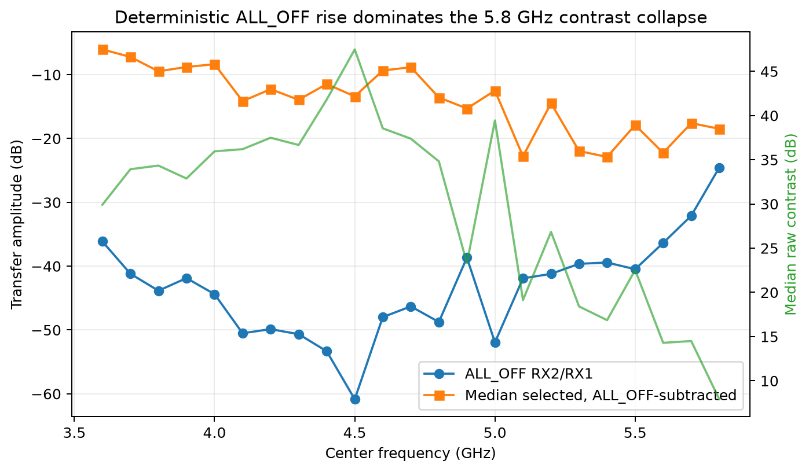
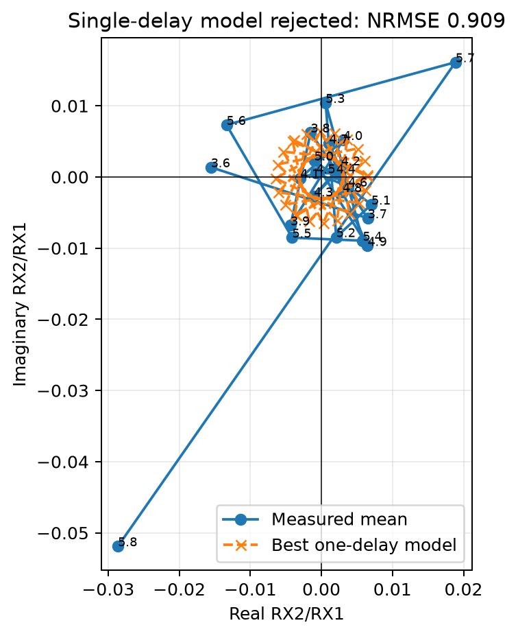
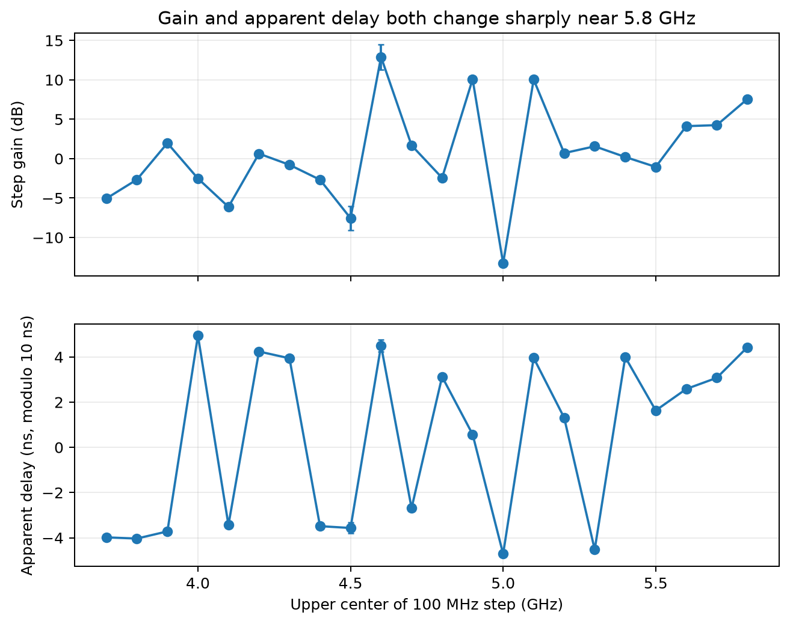
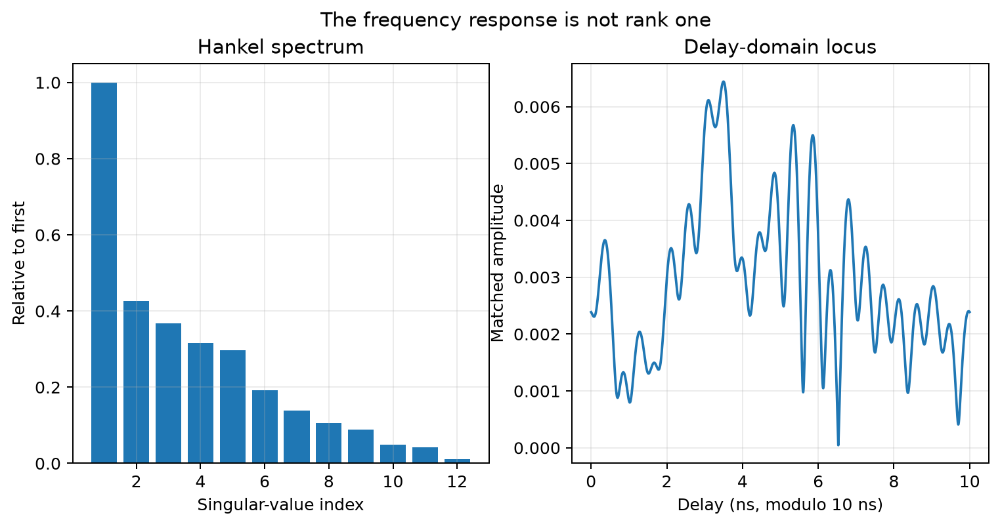
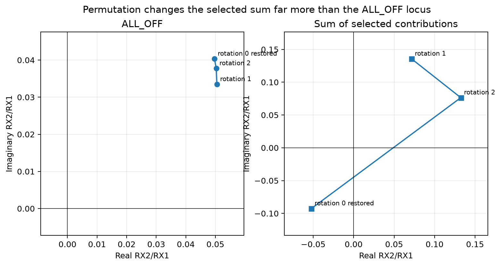
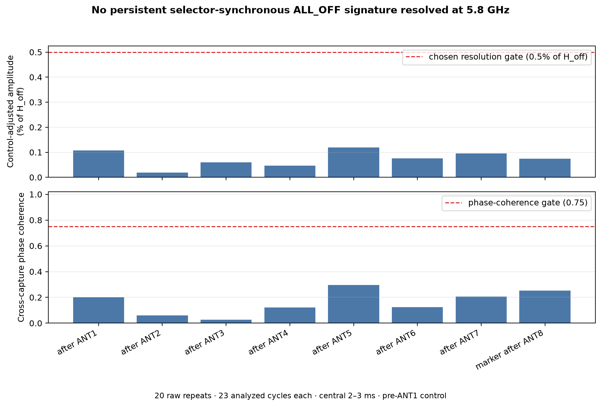
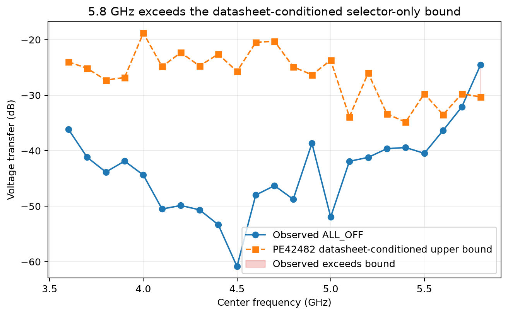

# 5.8 GHz calibration: current status and physical root-cause plan

Engineering checkpoint and handoff:

- [`2026-08-30-campaign-tooling-status-and-handoff.md`](2026-08-30-campaign-tooling-status-and-handoff.md) — completed work, verification state, remaining release gates, and exact restart point.

| Field | Value |
|---|---|
| Status | **IN PROGRESS — physical attribution pending** |
| Evidence snapshot | 2026-08-29 |
| Selector board | `stm32c011-4c0055000950313950363920` |
| Pluto serial | `104000b29905000e17000800065934759d` |
| Calibration disposition | Exact 5.8 GHz remains rejected; no coefficients may be deployed |

## Introduction

This report evaluates whether the Pluto RX2 eight-way selector can support coherent calibration
and direction finding at exactly 5.8 GHz. It consolidates the retained conducted sweeps, gain
controls, feed permutations, raw-IQ audits, model tests, and selector-synchronous diagnostics for
one Pluto and one selector board. It also defines the physical experiments needed to identify the
remaining leakage path.

The current answer is unambiguous: **exact 5.8 GHz is not qualified for calibration or direction
finding**. The measured response is deterministic enough to analyze and subtract in an unchanged
fixture, but its raw state isolation is too poor and its physical source is not yet localized. No
5.8-GHz coefficients from this work may be deployed.

Authoritative campaign runners use the separate
[shared root-owned run-ledger authority](shared_global_ledger_authority.md) to reserve and burn
run identities outside caller-owned state. The implementation and offline tests are complete;
host provisioning remains an explicit operator action and has not been performed by this work.

## Background

The principal experiment is a conducted closed loop. Pluto TX1 drives a matched two-way splitter;
one attenuated branch provides the RX1 phase reference and the other drives all eight selector
inputs through a 2–8 GHz splitter. The selector common port returns to RX2. TX2 is muted and
terminated. For each selected state and `ALL_OFF` interval, the analysis estimates the coherent
transfer `H = RX2 / RX1` at the commanded tone and separates the raw baseline `H_off`, selected
response `H_selected`, and leakage-subtracted path `H_path = H_selected - H_off`.

This distinction matters because repeatable subtraction is not the same as physical isolation.
An uncontrolled emitter does not provide a contemporaneous conducted reference or a guaranteed
baseline, so direction finding depends on the raw selector states remaining observable. The
physical transceiver is reported as an AD9363, whose official range ends at 3.8 GHz; operation at
5.8 GHz is therefore experimental even if an empirical fixture eventually passes.

## Motivation

The board is intended to recover relative phase from a rapidly switched antenna array. A stable
per-port phase table is useful only when the intended antenna path dominates leakage, pickup, and
other coherent paths. At 5.8 GHz the array currently fails both the report's 20 dB operational
contrast gate and the 35.1629 dB leakage ratio associated with a one-degree worst-case coherent
phase-error bound. Locating the excess baseline is therefore a prerequisite to useful calibration,
not a post-processing refinement.

## Approach

The investigation combines four complementary lines of evidence:

1. audit every retained exact-5.8-GHz raw capture for identity, byte integrity, format, headroom,
   and gap-free timing continuity;
2. replay the 3.6–5.8 GHz conducted sweep and quantify baseline, selected path, contrast,
   repeatability, and competing frequency-response models;
3. use TX/RX gain controls, physical feed permutations, TX2-antenna removal, and
   selector-synchronous `ALL_OFF` guards to reject explanations that the existing fixture can
   distinguish; and
4. localize the unresolved contribution with terminated physical boundaries A–C, a one-hot
   selector matrix D, and simultaneous-feed complex closure E.

The first three lines are complete offline. The fourth is implemented and safety-gated, but no
physical A–E result has yet been accepted.

## Methods

The main broadband corpus contains 20 paired observations at each of 23 frequencies from 3.6 to
5.8 GHz in 100 MHz steps. An exhaustive local audit additionally inventories 130 unique
exact-5.8-GHz raw captures (`3,648,800,000` bytes). Coherent pilot phasors are normalized by RX1;
all complex subtraction is performed before magnitude or phase reporting. Retained artifacts are
admitted only after their identities, SHA-256 values, sample formats, continuity metadata, timing
quality, and ADC headroom satisfy the source-specific contract.

The analysis tests more than repeatability. It fits and rejects a constant complex-gain/single-delay
model, tests rank-one structure with a Hankel decomposition, compares `ALL_OFF` behavior under
physical feed permutations, calculates a deliberately adverse PE42482 datasheet-conditioned
upper bound, and searches the clean centers of nominally identical `ALL_OFF` guards for a
state-history-dependent term. Physical attribution will use independent repeats, complex
bootstrap uncertainty, simultaneous amplitude/phase/vector-residual gates, and an independent
perturbation or VNA confirmation before any causal claim is accepted.

The arm-preserving D2 analyzer currently emits only its recursively admitted `C_i`/`D2_i`
fragment. Its legacy `--global-h-c`, `--observed-e`, and `--d1-cohort` inputs are explicitly
disabled: those files are summary cohorts and do not recursively reopen their producer plans,
manifests, condition records, SigMF metadata, and raw IQ. They cannot support full closure merely
by declaring their own hashes or authority. Full closure remains fail-closed until an upstream
adapter performs that complete source-bound admission.

## Executive conclusion

The exact-5.8-GHz problem is a real, repeatable, coherent baseline rise at the commanded TX1
tone. It is not adequately explained by random receiver noise, the antenna formerly connected
to TX2, or only a selector-timing label error. The component follows TX1 gain, passes through
the RX analogue-gain path, and remains stable enough for repeatable complex subtraction. Raw
selected-to-`ALL_OFF` contrast nevertheless falls as low as `1.62 dB` in the twenty-repeat
rotation-0 corpus and to `-8.76 dB` in the conducted permutation experiment. Subtraction cannot
turn that physical isolation failure into an accepted calibration.

The frozen offline analysis now rejects four simple explanations. One constant complex gain
and delay has complex NRMSE `0.909`, `7.64 dB` magnitude-error RMS, and `74.98°` phase-error
RMS; it underpredicts the observed 5.8 GHz baseline by `19.27 dB`. A Hankel test retains only
`63.13%` of response energy in rank one and leaves a `60.72%` relative residual. Physical-feed
permutations move the selected coherent-sum phase far more than the `ALL_OFF` phase, rejecting
a uniform frequency-independent selector-sum coefficient. Finally, the observed 5.8 GHz
`|H_off| = 0.059257` exceeds the ideal PE42482 datasheet-conditioned coherent eight-input upper
bound of `0.030493` by `5.77 dB`. Thus a datasheet-conforming ideal switch cannot be the sole
source of the measured baseline.

An additional source-bound replay tests the nominally identical short `ALL_OFF` guards after
each selector state. No central-dwell stratum exceeds the fixed `0.5%`-of-`H_off` amplitude and
`0.75` phase-coherence gates; the largest is `0.119497%` with coherence `0.295711`. This rejects
a resolved persistent selector-state-history term as the dominant baseline, but it cannot
separate a state-independent selector-common-launch path from Pluto- or cable-local leakage.

The present data narrows the leading physical paths, in priority order, to:

1. a common TX1-to-RX2 path in the Pluto, RX2 cable, or selector common launch;
2. a degraded selector or PCB assembly, including connector, solder, exposed-pad, or RF-ground
   defects;
3. a combination of common-path pickup and finite selector leakage; and
4. splitter, cable, load-mismatch, or standing-wave interactions.

The existing fixture cannot distinguish those paths because its normal state drives all eight
selector inputs simultaneously. Physical attribution therefore remains pending. The decisive
next experiment is a terminated topology ladder followed by a one-hot input matrix and a
complex vector-closure test. No result from those tests is claimed in this report yet.

## Current disposition

| Classification | Current conclusion |
|---|---|
| **Proven by retained data** | A coherent component appears at the commanded TX1 offset and grows with TX1 power; the 5.8 GHz raw baseline is repeatable; the 5.7→5.8 GHz contrast collapse is baseline-driven; one constant gain/delay and a rank-one response are rejected; a uniform frequency-independent selector sum is rejected; an ideal datasheet-conditioned PE42482 alone is insufficient; no selector-state-following central `ALL_OFF` stratum crosses the fixed offline diagnostic gates; leakage-subtracted selected responses are repeatable but physically isolation-limited; no admissible exact-5.8-GHz HexRay timing or calibration matrix exists. |
| **Strongly disfavored as the dominant cause** | TX1-to-TX2-antenna reradiation, unrelated Wi-Fi, random noise, a schedule false lock, a resolved persistent selector-state-history term, a single fixed delay, a simple uniform selector sum, and a datasheet-conforming ideal selector acting alone. |
| **Unresolved** | A common Pluto/cable/PCB path, a degraded selector or assembly, a combination of common-path pickup and finite selector leakage, and splitter/mismatch effects. |
| **Not established** | A board-only root cause, a corrected 5.8 GHz operating envelope, a deployable 5.8 GHz coefficient table, or manufacturer-qualified AD9363 operation at 5.8 GHz. |

“Disfavored” is not the same as physically impossible. In particular, no calibrated external
spectrum survey has certified the absence of all interference. The exact commanded-frequency
and gain-tracking evidence merely makes unrelated Wi-Fi a poor explanation for the dominant
component.

## Scope and reference planes

The conducted fixture used for the principal frequency and permutation evidence was:

```text
Pluto TX1
   |
   +-- 2-way splitter -- attenuated branch --> Pluto RX1 reference
   |
   +-- 8-way splitter --> F1..F8 --> board ANT1..ANT8
                                      |
                                PE42482/common
                                      |
                                  Pluto RX2

Pluto TX2: muted and terminated
```

For one capture, define the coherent transfer

```text
H = RX2 pilot phasor / RX1 pilot phasor
```

and keep three quantities distinct:

- `H_off`: the raw transfer during a true selector `ALL_OFF` interval;
- `H_selected`: the raw transfer during a selected antenna dwell; and
- `H_path = H_selected - H_off`: the leakage-subtracted selected-path response.

Preserve two contrast definitions:

```text
C_raw  = 20 log10(|H_selected| / |H_off|)
C_path = 20 log10(|H_path| / |H_off|)
```

Historical aggregates call `C_raw` “raw selected-to-ALL_OFF contrast.” It is useful for state
observability and is retained unchanged for provenance. The coherent phase-error bound is
physically a function of leakage relative to the desired path, `C_path`. The two are nearly
equal when leakage is small, but can diverge through vector addition or cancellation in the
present low-contrast regime. The final analysis must report both rather than applying a
high-isolation approximation at 5.8 GHz.

A repeatable `H_path` establishes that the coherent vector can be subtracted in an unchanged
setup. It does not establish that `H_off` is small enough for phase metrology,
switching-state observability, or an uncontrolled emitter.

Some historical sidecars call RX1 an OTA reference antenna. That label is inaccurate for the
conducted splitter fixture above. The raw channel data remain usable, but new topology records
must describe RX1 as the attenuated conducted reference branch.

## Evidence inventory

### Evidence packages

The historical packages below are committed evidence. The compact offline-RCA package was
published in Smateway commit `2b551fa60500c54e71ccc963b17d283e9a1396ce`. This report revision
also adds a deterministic raw-capture inventory, a source-bound paired-TX OTA control, and a
selector-synchronous `ALL_OFF` guard stratification. Their capture populations overlap and must
not be added without raw-hash deduplication.

| Package | Durable evidence | Relevant use |
|---|---|---|
| [Rotation-0 broadband repeatability](../closed_loop_frequency_sweep_repeatability/README.md) | [Twenty-pass aggregate](../closed_loop_frequency_sweep_repeatability/data/rotation0-repeatability-20pass-results.json) | Twenty repeat observations at every 3.6–5.8 GHz point, contrast and selected-path repeatability |
| [Conducted permutation calibration](../closed_loop_permutation_calibration/README.md) | [Result](../closed_loop_permutation_calibration/data/closed-loop-calibration-results.json) and [manifest](../closed_loop_permutation_calibration/data/closed-loop-permutation-manifest.json) | Three physical mappings, exact-5.8-GHz diagnostic fit, and raw-baseline behavior |
| [HexRay centered calibration](../hexray_tx_in_middle_calibration/README.md) | [Rejected 5.8 GHz summary](../hexray_tx_in_middle_calibration/data/hexcal-v2.4-5g8-experiment-summary.json) | RX- and TX-gain screens, safety evidence, and TX2-antenna removal control |
| HexRay phase diagnostic | [Exploratory phase result](../hexray_tx_in_middle_calibration/data/hexcal-v2.4-5g8-phase-leakage-results.json) | Repeated leakage-subtracted fingerprint; explicitly not a calibration |
| [Current system status](../current_calibration_and_df_status/README.md) | Evidence synthesis at Smateway commit `2aa04d348caafa9478c04ef5e0ff66be2e9e0091` | Present qualification boundary and cross-report interpretation |
| 5.8 GHz offline RCA | [Frozen observations](data/frequency-domain-observations.json) and [analysis result](data/frequency-domain-analysis.json), committed at `2b551fa` | Source-bound 23-frequency × 20-repeat replay, model rejection, paired uncertainty, permutation phases, and selector bound |
| Exact-5.8 raw inventory | [Evidence inventory](data/evidence-inventory.json) | Hash-, size-, format-, and continuity-verified index of all 130 retained exact-5.8 captures |
| Paired-TX OTA control | [ALL_OFF control](data/paired-tx-ota-all-off-control.json) | Ten retained TX1/TX2 OTA captures reprojected from raw IQ; diagnostic only, not conducted-path attribution |
| Selector-synchronous guard stratification | [Guard-stratification result](data/selector-synchronous-all-off-guard-stratification.json) | Twenty exact-5.8-GHz rotation-0 captures tested for a persistent `ALL_OFF` term dependent on the immediately preceding selector state |

The key evidence file hashes at Smateway commit `2b551fa` are:

| File | SHA-256 |
|---|---|
| `rotation0-repeatability-20pass-results.json` | `359f22070647ac8201b7d62845a175931c1eabfa18f075620282b69c01adf64b` |
| `closed-loop-calibration-results.json` | `1b5fb00488085a634b7ed89d27f901b320d36bcb6a571fe901825c89e2822c55` |
| `closed-loop-permutation-manifest.json` | `28470a30f7a3f14aca3bc407cf39e0b5d3295db2203c700780ed01e54efd7e53` |
| `hexcal-v2.4-5g8-experiment-summary.json` | `fb4ddd510e941c9511f2f27ac7348e0a2e7c50f5b19ee5dc786a05e3c7019b98` |
| `hexcal-v2.4-5g8-phase-leakage-results.json` | `13e47b803c3029704c83a30aac6cf37bf43881b688e1bb090f72bf6626f525bc` |
| `frequency-domain-observations.json` | `6eccec0b01808a0724520d303392bdc56e56d04106f116d4c8775f8792f73f51` |
| `frequency-domain-analysis.json` | `f401854e01b9f4395f1fe56c7bbe6ec96abf9ea1f6356145c0d376bf8b7cb841` |

### Local raw-storage audit

A read-only audit of the current Raspberry Pi storage found `130` unique exact-5.8-GHz raw
captures with `130` unique artifact identities and raw-data SHA-256 values, totalling
`3,648,800,000` bytes:

| Local evidence family | Unique captures |
|---|---:|
| RX-gain qualification ladders | 63 |
| Later TX-gain stimulus ladders | 24 |
| Rotation-0 broadband runs | 26 |
| Conducted physical permutations | 6 |
| Dual-TX localization runs | 10 |
| Earlier unreferenced phase trial | 1 |
| **Total** | **130** |

The repository-normalized [evidence inventory](data/evidence-inventory.json) makes that audit
reproducible. It records all 130 artifact IDs, computed and declared raw SHA-256 values, relative
source paths, family/source classification, companion sidecar hashes for all 43 long captures,
and ABI-2 continuity summaries without embedding the local storage root. All 130 raw identities
are unique; all format, byte-size, path-identity, declared-hash, and gap-free continuity checks
passed. The earliest phase trial has no external manifest and is explicitly classified from its
SigMF description only, rather than assigned stronger provenance.

## Results

### The contrast collapse is primarily a baseline rise

The [frozen offline analysis](data/frequency-domain-analysis.json), replayed from the
[compact observation snapshot](data/frequency-domain-observations.json), contains 20 paired
observations at each of 23 frequencies from 3.6 through 5.8 GHz:

| Center | `|H_off|` | `H_off` dB | Median `|H_path|` | `H_path` dB | `C_raw` | `C_path` |
|---:|---:|---:|---:|---:|---:|---:|
| 5.6 GHz | 0.015218 | -36.353 dB | 0.077217 | -22.246 dB | 14.295 dB | 14.107 dB |
| 5.7 GHz | 0.024825 | -32.102 dB | 0.132074 | -17.584 dB | 14.498 dB | 14.519 dB |
| 5.8 GHz | 0.059257 | -24.545 dB | 0.119179 | -18.476 dB | 7.911 dB | 6.069 dB |

The paired 5.7→5.8 GHz changes make the attribution statistically sharp:

| Paired change, 20 runs | Mean | 95% confidence interval | Sample SD |
|---|---:|---:|---:|
| `ALL_OFF` amplitude | +7.557 dB | [+7.545, +7.569] dB | 0.025 dB |
| Leakage-subtracted selected median | -0.892 dB | [-0.974, -0.810] dB | 0.176 dB |
| Raw median contrast | -6.587 dB | [-6.682, -6.492] dB | 0.202 dB |

Thus the sharp contrast loss is dominated by a coherent baseline rise; selected-path weakness
is secondary. The wider response is comb-like rather than monotonic, but that observation alone
does not locate the responsible paths.



### One constant gain and delay is rejected

A least-squares fit of `H_off(f) = A exp(-j2πfτ)` over all 23 frequency points finds
`τ = 3.4972 ns` modulo the `10 ns` alias period imposed by the 100 MHz grid. The fit is poor:

| Fit diagnostic | Result |
|---|---:|
| Complex NRMSE | 0.9092 |
| Magnitude-error RMS | 7.639 dB |
| Phase-error RMS | 74.979° |
| 5.8 GHz prediction error | -19.275 dB |

The negative 5.8 GHz error means the model underpredicts the observed baseline by `19.27 dB`.
This is not a noise-sensitive rejection: across the 20 separate runs, fitted NRMSE is
`0.90916 ± 0.00050` sample SD and aliased delay is `3.49725 ± 0.00171 ns` sample SD. The delay
is only an alias-class fit parameter, not a measured propagation distance.



The adjacent-frequency gain and apparent-group-delay steps also change abruptly rather than
following the constant-amplitude, constant-delay model.



### The frequency response is not rank one

A 12×12 Hankel decomposition supplies a model-independent check. Rank one explains only
`63.13%` of energy and leaves a `60.72%` relative Frobenius residual. The first five singular
values relative to the largest are `1.000`, `0.425`, `0.368`, `0.316`, and `0.297`. Meanwhile,
per-run complex-vector deviation from the mean is only `1.95%` on average and `3.85%` at worst.
The structure is therefore deterministic and repeatable, but it cannot be represented as one
frequency-independent complex gain and one delay. The finite 2.2 GHz span and 100 MHz sampling
do not support assigning a physical path count or distance from this rank test.



### The 5.8 GHz result is repeatable but not isolated

Across the twenty repeat captures represented by the committed broadband aggregate:

| Metric | Result |
|---|---:|
| Captures with unambiguous legacy high-band alignment | 20/20 |
| Selected-path relative phase standard deviation, median | 0.0667° |
| Selected-path relative phase standard deviation, maximum | 0.2339° |
| Selected-path relative amplitude standard deviation, median | 0.0166 dB |
| Selected-path relative amplitude standard deviation, maximum | 0.0411 dB |
| Raw selected-to-`ALL_OFF` contrast, minimum | 1.6228 dB |
| Raw selected-to-`ALL_OFF` contrast, median | 7.9148 dB |
| Raw selected-to-`ALL_OFF` contrast, maximum | 9.4153 dB |
| Paths passing the 20 dB operational contrast gate | 0/160 |
| Paths passing the 35.1629 dB one-degree bound | 0/160 |

The frozen offline replay gives mean `|H_off| = 0.059257`, amplitude sample standard deviation
`0.000386` (`0.652%` of the mean), and `1.159°` phase sample standard deviation. These figures
are now portable in the compact observation and analysis JSON rather than depending on local
sidecars.

Low scatter after subtraction is useful diagnostic evidence. It does not reduce the raw
coherent error that an uncontrolled source, changed fixture, or imperfect baseline estimate
would experience.

### Physical feed permutations leave a common baseline

The following diagnostic replay uses exact artifact identities retained by the frozen
permutation manifest. The rejected rotation-2 attempt failed one selected-state phase-spread
gate; its continuous, headroom-safe raw `ALL_OFF` phasor is listed only as a baseline
diagnostic.

| Physical condition | Artifact ID | Raw `H_off` |
|---|---|---:|
| Rotation 1, RX40 screen | `bfa6cbcfbbac4c7b95f18a02dd635bf7` | `0.059195` |
| Rotation 1, RX50 | `bcd1bcc3d46742c289b77487598ebdd6` | `0.060595 ∠ 33.522°` |
| Rotation 1, immediate RX50 repeat | `e75edaf3164a4c0e81adfdeb734995b2` | `0.060543 ∠ 33.397°` |
| Rotation 2, rejected selected-state attempt | `22123095fd9a4846a8de99e48ecd597e` | `0.062969 ∠ 37.008°` |
| Rotation 2, accepted retry | `3f9d9dbb249041e18906273c88c7b879` | `0.062877 ∠ 36.888°` |
| Restored rotation 0 | `089c96119d6b4daeb3a0004de7796c62` | `0.064000 ∠ 39.051°` |

For the three accepted mappings, compare the raw `ALL_OFF` phasor with the coherent sum of the
eight leakage-subtracted selected-path phasors:

| Mapping | `H_off` amplitude / phase | Selected coherent-sum amplitude / phase | Ideal conditioned bound | Observed over bound |
|---|---:|---:|---:|---:|
| Rotation 1 | 0.060595 / 33.522° | 0.153303 / 62.157° | 0.022950 | +8.433 dB |
| Rotation 2 | 0.062877 / 36.888° | 0.152870 / 29.988° | 0.023203 | +8.659 dB |
| Restored rotation 0 | 0.064000 / 39.051° | 0.106341 / -119.431° | 0.024294 | +8.414 dB |

The `ALL_OFF` phase moves only `+3.366°` and then `+2.163°`, whereas the selected coherent-sum
phase moves `-32.169°` and then `-149.419°` after wrapping. This rejects a simple model in which
`H_off` is one frequency-independent scalar times the uniform selected sum. It does not reject
arbitrary per-port leakage coefficients, which require the one-hot matrix.



The near-identical immediate repeats and small `H_off` movement under remapping favor a stable,
mapping-independent common path over one bad splitter arm or one bad board input as the sole
cause. They do not prove a Pluto-internal path: physical mapping, reconnection, and time were
not orthogonal experimental variables, and all eight inputs remained driven in every accepted
mapping.

After `ALL_OFF` subtraction, the 24-observation exact-5.8-GHz permutation model fits to
`0.158 dB RMS` and `0.812° RMS`. Raw contrast nevertheless spans `-8.76` to `+9.19 dB`. The
small model residual shows a deterministic selected-path structure; it does not qualify the
result as a board calibration.

### The component follows the commanded transmitter

The committed v2.4 screens used RX gain `60 dB`, TX1 gains from `-35` through `-10 dB`, and
exact-zero TX2 DDS scales. RX2 peak counts rose monotonically with TX1 power:

| TX1 gain | Screen A, TX2 antenna attached | Screen B, attached | TX2 antenna removed |
|---:|---:|---:|---:|
| -35 dB | 52 | 51 | 49 |
| -30 dB | 65 | 81 | 63 |
| -25 dB | 103 | 103 | 101 |
| -20 dB | 146 | 147 | 154 |
| -15 dB | 224 | 221 | 239 |
| -10 dB | 376 | 390 | 389 |

The observed component lies at the commanded approximately `+100 kHz` offset and rises with
the commanded TX1 ladder. Increasing RX gain from `30` to `60 dB` moved the strongest RX2 peak
from `7` counts into the approximately `383`-count range, showing that the component traverses
the RX analogue gain path rather than appearing only after the ADC.

Removing the antenna formerly connected to TX2 changed the strongest RX2 result from an
attached mean of `383` counts to `389`, or `+1.57%`. It changed the local RF environment but did
not reduce the response blocking RX2 state discrimination. TX1-to-TX2-antenna reradiation is
therefore not supported as the dominant path.

### Paired OTA transmitter-localization observation

A deterministic read-only replay of a separate retained OTA localization set contains five TX1
repeats and five TX2 repeats. The replay validates every raw-data hash and ABI-2 continuity
ledger, projects both receivers at the retained refined pilot, and measures the coherent raw
RX2/RX1 transfer only inside complete-cycle `ALL_OFF` dwell interiors:

| Active transmit configuration | Repeats | Original full-state phase gate passed | Median raw `ALL_OFF` RX2/RX1 | Cross-repeat phase coherence |
|---|---:|---:|---:|---:|
| TX1 | 5 | 5/5 | -8.091 dB | 0.9999996 |
| TX2 | 5 | 2/5 | +9.681 dB | 0.9999994 |

The durable result is
[paired-tx-ota-all-off-control.json](data/paired-tx-ota-all-off-control.json), SHA-256
`67d21f17f1558beaf1958b2d3cc28d3a03e839e31b89ca4e448a791bc6f80207`. It binds the ten
artifact IDs, their raw and sidecar hashes, the source manifest hash, the Fast20 profile hash,
generated header hash, and every behavior-bearing local analysis-module hash without embedding a
host-specific storage path. The source manifest is
`phase-distributions/dualband-phase-20260825-a/manifest.json`, SHA-256
`5bc8711d295eb28d2a8e0c52d1114d1c61f8e3ce226bc12d6e78894280f331f6`.

Three TX2 captures failed the original whole-cycle, all-selected-state phase-quality gate. They
are admitted for this narrower diagnostic by a separate contract: the computation does not reuse
the rejected selected-state estimates; it fail-closes on sidecar/raw/profile identity mismatch;
it independently verifies gap-free raw continuity, timing confidence, even/odd agreement,
jackknife stability, and recomputed cycle count; and it repeats the result at marker-phase offsets
of `-2`, `0`, and `+2 ms`. Across all ten captures the perturbation changes amplitude by at most
`0.0651 dB` for TX1 and `0.0522 dB` for TX2, and phase by at most `0.1787 degrees` and
`0.2182 degrees`, respectively. Within-capture `ALL_OFF` cycle phase coherence is at least
`0.9999953` and cycle phase RMS is at most `0.177 degrees`. This admits the descriptive
`ALL_OFF` control only; it does not overturn the failed full-state phase decisions.

The observation establishes that both transmit configurations produced a stable coherent
`ALL_OFF` component at RX2 in that OTA setup. It is not a controlled TX-port comparison: the TX
antennas and source geometry differed, and the active transmitter changed illumination of the
RX1 normalization antenna. The approximately `17.772 dB` difference therefore cannot be assigned
to Pluto-internal TX1/TX2 isolation, selector leakage, or any single physical path. It does not
localize the later conducted closed-loop fault and is not merged numerically with that corpus.

### No persistent selector-history term is resolved

The strongest previously unused offline discriminator is whether nominally identical
`ALL_OFF` intervals retain a complex signature from the selector state that immediately
preceded them. A source-bound replay stratifies the seven short guards after ANT1 through ANT7
and the long-marker entry after ANT8, then compares their central `2–3 ms` against a marker-only
complex baseline. It uses `0.1 ms` coherent bins, linear interpolation between bracketing marker
anchors, 23 interior cycles from each of 20 exact-5.8-GHz captures, and a no-transition pre-ANT1
guard as a negative control.

| Fixed diagnostic | Result |
|---|---:|
| Resolution gate | `0.5%` of `H_off` amplitude **and** `0.75` cross-capture phase coherence |
| Largest state-following robust residual | `0.119497%` of `H_off`, after ANT5 |
| Phase coherence of that residual | `0.295711` |
| No-transition control | `0.046578%` of `H_off`, coherence `0.290054` |
| Strata passing both gates | `0/8` |

This is a resolution-bounded non-detection, not proof that every selector-dependent transient is
absent. It does show that no persistent central-dwell state-history term large enough to explain
the approximately `|H_off| = 0.0593` baseline is resolved in this corpus. Edge-adjacent samples
were deliberately excluded from this artifact, so it makes no quantitative claim about switching
transients.

The null does not favor a Pluto-internal explanation. Existing observations still identify only
the sum

```text
H_off = H_Pluto/direct + H_RX2-cable/common-launch + H_selector/input-fixture
```

and any state-independent selector-common-launch term remains observationally interchangeable
with a Pluto-local term. Stages A, B, and C are therefore still the first causal discriminator.



## Device, fixture, and board expectations

### Physical AD9363 operating boundary

The physical transceiver is reported as an AD9363 while the software uses an AD9361
extended-band profile. Analog Devices documents the AD9363 operating range only through
3.8 GHz. Exact 5.8 GHz is therefore experimental and outside the physical part's official
range. Passing an empirical fixture test would not become manufacturer qualification, and no
numeric internal TX-to-RX isolation guarantee has been identified for this exact configuration.

### PE42482 and coherent input summation

The PE42482 is absorptive but has finite high-band isolation. The exact-part datasheet gives
different `ALL_OFF` common-to-port isolation and insertion-loss limits across its eight paths.
The 5.8 GHz calculation uses the 4–6 GHz band, 50-ohm datasheet conditions, minimum isolation,
maximum insertion loss, and the deliberately adverse assumption that all eight leakage voltages
are perfectly phase aligned:

| 4–6 GHz limit | ANT1 | ANT2 | ANT3 | ANT4 | ANT5 | ANT6 | ANT7 | ANT8 |
|---|---:|---:|---:|---:|---:|---:|---:|---:|
| Minimum `ALL_OFF` isolation, dB | 29 | 30 | 33 | 38 | 38 | 33 | 30 | 29 |
| Maximum insertion loss, dB | 1.9 | 2.3 | 2.2 | 2.2 | 2.2 | 2.2 | 2.3 | 1.9 |

```text
single-path leakage voltage ratio = 10^(-isolation_dB / 20)
simultaneous leakage voltage       = complex sum of all driven path leakages
```

Under those conditions, the ideal datasheet-conditioned upper bound for the simultaneous
selector contribution is `0.030493` in the report's RX2/RX1 transfer normalization. The measured
5.8 GHz baseline is `0.059257`, exceeding the bound by `5.771 dB`. If the fabricated switch and
fixture actually meet those datasheet conditions and limits, the triangle inequality requires
at least `0.028764` additional common-path voltage: `48.54%` of the observed voltage magnitude.
An ideal datasheet-conforming PE42482 acting alone is therefore insufficient.

This is a conditioned planning bound, not a fabricated-board measurement. The datasheet does
not specify simultaneous leakage phases; board mismatch, launch coupling, degraded RF ground or
assembly, or the project's weaker `25 dB` first-article target can exceed it. Consequently the
result does not prove that the excess is external to the selector PCB. It separates two remaining
families: a common Pluto/cable/PCB path, or selector/assembly behavior worse than the ideal
datasheet-conditioned case, potentially in combination. The one-hot experiment and VNA matrix
are still required.



### Splitter, cable, and mismatch terms

The eight-way splitter is user-reported as rated from 2–8 GHz. A frequency range alone does not
establish output-to-output isolation, phase balance, insertion-loss balance, return loss, or
behavior with eight imperfect loads. The exact two-way splitter, attenuator, and termination
S-parameters are also unavailable. Analog Devices' arbitrary-load analysis shows that mismatch
can degrade switch isolation by several decibels and can make a reflective multiport network
highly configuration-dependent.

The sharp, repeatable frequency structure is compatible with standing-wave and vector-sum
effects. A cable touch between intact grounded SMA shields is not itself evidence of a fault,
but loose connectors, damaged shields, common-mode current, long parallel routes, or a poor
termination can create or rephase a bypass path.

### Selector PCB evidence and remaining physical risks

The following are retained CAD facts, not RF measurements:

- The mutable source and sealed v0.2.1 PCB are byte-identical, with SHA-256
  `e2d1deaf4052b18b84df02d1b5cab48e131c6debbd70a03678c3ed918b24c2d5`.
- The routes are branch-free top-layer CPWG over an adjacent continuous ground plane, with no RF
  vias or stubs, passing return-via fences, and a nine-via filled/capped U1 exposed pad.
- The retained field solver uses effective permittivity `3.13660852672` and a modeled delay of
  approximately `5.90758 ps/mm`. This is a layout model, not measured group delay.
- The authoritative realized lengths are `14.503822 mm` for `RF_COMMON` and `36.557345 mm` for
  either `RF_ANT4` or `RF_ANT5`. The corresponding connector-to-connector CAD path is
  `51.061167 mm`. The older routing journal contains stale nominal lengths and is not used here.

The [sealed realized-length report](https://github.com/misko/circuits/blob/main/projects/pluto-rx2-8way-v5/07_releases/v0.2.1-2026-08-14/verification/rf/realized/report.json)
and [RF geometry contract](https://github.com/misko/circuits/blob/main/projects/pluto-rx2-8way-v5/03_src/rules/rf.yaml)
are the sources for those values.

The following wavelength coincidences are calculations from those CAD values:

| Modeled copper path | Length | Derived coincidence | Modeled phase at 5.8 GHz, wrapped modulo 360° |
|---|---:|---:|---:|
| `RF_COMMON` | 14.503822 mm | `lambda_g/2` at 5.835500 GHz | 178.905 degrees |
| `RF_ANT4/5 + RF_COMMON` | 51.061167 mm | `3 lambda_g/4` at 2.486343 GHz; `7 lambda_g/4` at 5.801467 GHz | 269.841 degrees |

The second coincidence is close to the observed approximately 2.480 GHz middle-path feature
and the 5.800 GHz leakage failure. It is a useful falsifiable lead, not evidence that the PCB is
a resonator. These pad-centre lengths omit connector electrical length, package delay, launch
discontinuities, dielectric dispersion, and the external fixture. Most importantly, a matched
line does not resonate or generate leakage solely because its length is an odd quarter-wave or
half-wave. A reflection, coupling path, or other discontinuity is required.

There is also an important countercheck. The same simple odd-quarter-wave series for the
`51.061167 mm` model path predicts approximately `0.8288`, `2.4863`, `4.1439`, and
`5.8015 GHz`. The frozen broadband observations nearest the third prediction have `ALL_OFF`
levels of only `-50.505 dB` at 4.1 GHz and `-49.871 dB` at 4.2 GHz, versus `-24.545 dB` at
5.8 GHz. The low-band evidence has median raw contrast `27.861 dB` at 2.5 GHz, not a
5.8-GHz-like collapse. Those retained observations do not support a simple isolated
quarter-wave resonator. They still permit a narrow feature missed by 100 MHz samples or a
multi-path, reflection, and cancellation mechanism. The terminated VNA micro-sweeps at no more
than 1 MHz spacing are the falsifier.

Two implementation details deserve targeted tests:

- PE42482 pin 1, `LS`, affects RF isolation. U1 pad 1, UUID
  `5430d7b4-cda1-4a51-aa8a-57bedb0e10aa`, is grounded by a `1.015 mm` top-copper run to via
  UUID `84cf13a3-dbed-4747-8956-4fe14b39eee0`. It has no explicit solid zone-connect override,
  unlike several other U1 RF-ground pads. This is a testable risk, not proof of a bad ground.
  The exposed pad itself has a dense 3-by-3 filled/capped-via array.
- Each SMA signal launch uses a `2.4 mm` all-layer land with a `1.5 mm` drill feeding a
  `0.295 mm` trace, an `8.14:1` width transition, plus four ground posts on a `5.08 mm` square.
  No explicit launch taper or tuned plane cutout is present. Launch and solder discontinuities
  are omitted from the realized-length model.

Exposed-pad voiding, LS/package solder, SMA ground joints, and U1 supply/control coupling remain
unmeasured. The local U1 bypass is one `100 nF` 0402 capacitor, and no retained impedance model
establishes its behavior at 5.8 GHz. These are ranked assembly/layout hypotheses, not
established causes. Board-only VNA data, near-field scanning, inspection, or controlled rework
is required before assigning blame.

The detailed cross-project design review is
[RF isolation, leakage paths, and a v6 mitigation strategy](https://github.com/misko/circuits/blob/main/projects/pluto-rx2-8way-v5/01_docs/reports/2026-08-27-rf-isolation-and-v6-mitigation.md).
The reviewed report exists at Circuits `origin/main` commit
`8b2f02bdd987685fc1a3a3cf9d4646249f398784`; it explicitly records that a fabricated-board VNA
matrix is still owed. A repository-history audit found no implemented v6 schematic or KiCad
board: v6A, v6B, and v6C in that report are proposals only, so no v5-to-v6 measured or geometric
improvement may be claimed.

## Competing hypotheses and falsifiers

| Rank | Hypothesis | Evidence for it | Evidence against or missing | Decisive falsifier |
|---:|---|---|---|---|
| 1 | Common TX1→RX2 path in Pluto, RX2 cable, or selector common launch | Stable mapping-independent phasor; ideal-selector bound leaves at least `0.028764` unexplained if its conditions hold | No terminated Stage A/B/C boundary capture exists | Stages A–C localize no repeatable increment capable of supplying the excess |
| 2 | Degraded selector or PCB assembly | Observed baseline is `5.77 dB` above the ideal conditioned switch bound; LS ground, exposed pad, SMA and solder are unmeasured | CAD routing review is otherwise strong; no fabricated-board VNA matrix exists | One-hot and VNA cells meet the datasheet-conditioned bounds, and controlled inspection/rework produces no delta |
| 3 | Common-path pickup plus finite selector leakage | Multiple deterministic frequency terms and stable `ALL_OFF` behavior allow coherent contributors to coexist | Contributions have not been measured separately | Complex increments from A–D fail to close to the simultaneous fixture within uncertainty |
| 4 | Splitter/load mismatch or standing wave | Comb-like response; splitter and load S-parameters are unknown; the ANT4/5-plus-common CAD length has derived odd-quarter-wave coincidences near both observed features | A matched line cannot create a resonance from length alone; connector, switch, and fixture electrical lengths are unmeasured | Matched pads, known cable-length changes, and changed terminations neither move nor suppress the feature; a deliberately changed path length on a coupon leaves it stationary |
| 5 | One cable or connector defect | High-frequency faults can be strongly configuration-dependent | Physical permutations did not isolate a single arm | Known-good cable/load substitutions produce no repeatable complex change |
| 6 | TX2-antenna reradiation | It was a physically plausible nearby radiator | Removal changed strongest RX2 result by only `+1.57%` | Already disfavored as dominant by the removal control |
| 7 | External Wi-Fi | 5.8 GHz is an occupied external band | Exact offset and TX-gain tracking are inconsistent with unrelated Wi-Fi | A TX-muted or shielded control retains the same coherent component |
| 8 | Timing/analysis false lock | Historical low-band analysis had a false-lock mode | Gain-screen tone existence and peak tracking do not depend on a valid selector marker | Marker-independent terminated stages do not reproduce the tone |

The data additionally reject a single fixed-delay response, a rank-one frequency response, and
a uniform frequency-independent selector-sum coefficient. Those are model rejections, not a
count or location of physical paths; arbitrary per-port leakage coefficients remain possible.
Several coherent contributors may coexist and cancel. The final report must not assign
“percentage of power” as though they were incoherent. It should report complex stage increments,
uncertainty, and counterfactual total magnitude with each term removed.

## Next steps

The decisive next work is the physical topology ladder below. Each stage changes one RF boundary
while retaining the same bounded TX1 tone and conducted RX1 reference, so the measured complex
increments can localize the excess baseline rather than merely describe it.

All stages retain the same bounded TX1 tone and conducted RX1 reference. TX2 stays exactly
muted and 50-ohm terminated. No antennas are present in Stages A through E. Every unused RF port
uses a termination specified through 5.8 GHz.

### Implementation status — not physical results

| Item | Current retained status |
|---|---|
| Offline RCA package | Committed in Smateway `2b551fa`; the observations, analysis, figures, committed ladder runner, and tests are no longer working-tree-only artifacts. |
| Stage A immutable plan | Historical six-condition plans were planning evidence only; no capture was executed or accepted. The hardened runner now freezes ten conditions: the six-gain linearity ladder plus four additional `-20 dB` captures, for five independent attribution repeats total. A fresh plan bound to the final clean tooling revision is required before execution. `selector_calibration_claim` is false. |
| Dedicated one-hot runner | Implemented as `scripts/run_5g8_one_hot_path_ladder.py` plus `src/smateway/one_hot_ladder.py`, with live-preflight and path-provenance behavior covered by focused tests and independent review. It remains unexecuted and is tooling, not physical evidence. |

The historical Stage A plan is local machine state and planning provenance, not current execution
authority or a committed/accepted result. Both retained plans have zero attempts; `-a` binds the
initial offline-RCA revision and `-b` binds the superseded pre-fixture-v2 tooling revision:

```text
/home/pi/.local/state/smateway/boards/stm32c011-4c0055000950313950363920/
  5g8-leakage-ladder/5g8-rca-stage-a-20260829-a/plan.json
plan_contract_sha256 = 7b11cde871e15361370b3739465ebdbe2cac50a445cb96f58925f00e0089c134
plan_file_sha256     = 8cfba82ddef766d1afc489a872dd48c0dc2a17918d2ff081ca3ee8832007882e
manifest             = same directory, manifest.json

/home/pi/.local/state/smateway/boards/stm32c011-4c0055000950313950363920/
  5g8-leakage-ladder/5g8-rca-stage-a-20260829-b/plan.json
plan_contract_sha256 = 3ac2bb37ba9e8930c25b75f31e14741d1abe8d386d787ed45f56ba2012c6009f
plan_file_sha256     = 80147616e08bfb6b35c5f22e2e3321e1052ca5710e9648c5d9a83bf61b8160b8
manifest             = same directory, manifest.json
```

### Stage A — frozen RX2 receiver-chain boundary

```text
TX1 -> matched 2-way -> attenuator -> RX1
                  |
                  +-> 50 ohm

RX2 -> [optional fixed RX2 attenuator] -> 50 ohm at the fixture-facing boundary
selector RF and RX2 cable disconnected; selector bench power off; control/ground harness removed
```

The bracketed attenuator is not assumed. If `shared_fixture.rx2_attenuator.state` is `absent`, the
load is directly at the Pluto RX2 reference plane and all three optional fields are null. If it is
`present`, the exact rated asset, attenuation, labelled-port orientation, Pluto-side connection,
and fixture-facing endpoint are mandatory; the Stage-A load terminates that outer endpoint. The
same explicit state and graph are preserved through A/B/C/E.

Every A/B/C/E plan requires both `--fixture-manifest PATH` and
`--setup-attestation PATH`. The manifest uses fixture schema v2 and binds one `campaign_id` and
`comparable_fixture_group_id`. Start from
[`fixture_manifest_v2.stage-a.template.json`](fixture_manifest_v2.stage-a.template.json) and
[`setup_attestation_v1.template.json`](setup_attestation_v1.template.json); placeholders are not
executable values.

The shared fixture is exact, not descriptive. It freezes the Pluto serial and TX1/TX2/RX1/RX2
port IDs; distinct TX1, RX1, and RX2 reference planes; the TX1 two-way splitter; RX1 attenuator;
the explicit present/absent RX2 attenuator state; TX2 termination; and four mandatory
port-to-port connections. When the RX2 attenuator is present, its separately identified
Pluto-side connection and orientation are also part of the shared graph. Every component and
interconnect has its own ID, 5.8-GHz-containing frequency range, power rating, port map, and
characterization record.
The physical port IDs within every Pluto or passive-component port map must be unique; two
logical roles cannot alias the same physical connector.
The conducted reference is the attenuated splitter branch connected to RX1; it is not an
"RX1 load". The other TX1 splitter branch is the stimulus branch.

The stage delta freezes the components and edges changed for that topology. Selector RF,
bench-power, and control-harness states are separate fields:

| Stage | Selector RF state | Bench power | Control/ground harness |
|---|---|---|---|
| A/B | `rf_disconnected` | `bench_power_off` | `disconnected` |
| C/E | `rf_connected` | `bench_power_on` | `connected_static_all_off` |

For C/E the selector record additionally freezes the physical board ID and hardware revision,
bench-supply and output-channel IDs, voltage and current limit, and positive, power-ground, and
control-ground reference IDs. The static mailbox firmware/profile evidence is still required;
it does not replace physical board and power identity.

Stages B/C/E must name the immediately prior immutable `plan.json` and its exact file, contract,
and fixture hashes. The runner derives and stores a canonical cross-stage comparison anchor:

- A→B preserves the exact TX1 stimulus termination and its connection;
- A→B preserves the explicit RX2 attenuator state and, when present, its exact rated asset,
  attenuation, orientation, Pluto-side edge, and fixture-facing endpoint;
- A→B also preserves the exact RX2 50-ohm termination identity, ratings, port map, and
  characterization while allowing only the intended direct-adapter-to-added-cable topology
  change;
- B→C preserves those items and the RX2 cable connection ID, Pluto-side endpoint, interconnect
  identity, ratings, and characterization; only its far endpoint changes from load to selector;
- C→E preserves the exact selector, including its power identity, the complete
  RX2-to-selector-common connection, and the hashed selector-control contract.

A substituted load, cable, selector board, supply setting, or connection therefore fails before
RF. A common shared-fixture hash alone is not sufficient comparison evidence.

The authored B/C/E `prior_stage_binding` contains only `stage`, `run_id`, absolute or
manifest-relative `plan_path`, `plan_file_sha256`, `plan_contract_sha256`, and
`fixture_evidence_sha256`. Do not hand-author the derived comparison anchor. Stage deltas use
these exact role sets:

| Stage | Component roles | Connection roles |
|---|---|---|
| A | TX1 stimulus termination; direct RX2 termination | stimulus branch→termination; RX2→direct termination |
| B | same TX1 stimulus termination; RX2 far-end termination | same stimulus edge; RX2→far-end termination through the fixed cable |
| C | same TX1 stimulus termination; physical selector; eight identified input terminations | same stimulus edge; fixed RX2 cable→selector common; eight selector-input→load edges |
| E | same physical selector; 2–8 GHz eight-way splitter | same RX2 cable→selector common; stimulus branch→splitter; eight individually identified splitter→selector cables |

Each asset characterization is either `characterized` or `uncharacterized`. An explicitly
uncharacterized asset has null evidence, S-parameter, and 5.8-GHz return-loss fields. A
characterized asset requires hashed evidence, an S-parameter hash, and a finite non-negative
5.8-GHz return-loss value. Screening capture is allowed with explicitly uncharacterized assets,
but `causal_attribution_claim` remains false unless both current and prior-stage fixtures meet
the characterization gate.

The separate setup attestation must be unique and bound to exactly one run. It freezes a
timezone-qualified descriptive timestamp, run/campaign/group/stage IDs, fixture/shared/delta
hashes, the complete observed component and connection ID inventories, and a hashed
setup-evidence file. The runner does **not** impose a wall-clock age or timestamp-freshness
guarantee; recency comes from operator inspection plus the run-specific hashes and
`--confirm-no-movement`, not from comparing clocks. Paths may be relative to the JSON file that
declares them. Planning resolves and hashes the files; execution reconstructs the fixture from
disk before USB identity or RF. A missing, changed, or swapped file or ID burns the run ID
without opening the radio.

After replacing every template value and hashing the final files, prepare Stage A from a clean
Smateway worktree:

```bash
scripts/run_5g8_leakage_ladder.py \
  --run-id REPLACE_RUN_ID \
  --board-id REPLACE_BOARD_ID \
  --serial REPLACE_EXACT_PLUTO_SERIAL \
  --uri REPLACE_CURRENT_USB_URI \
  --stage direct_rx2_termination \
  --fixture-manifest /absolute/path/to/fixture.json \
  --setup-attestation /absolute/path/to/setup.json \
  --plan-only
```

Execution must replace `--plan-only` with `--execute` and use the same identity/file arguments,
the exact stage/token confirmations,
`--confirm-no-antennas`, `--confirm-tx1-matched-conducted`,
`--confirm-tx2-terminated-muted`, `--confirm-rx1-conducted-reference`, and
`--confirm-no-movement`. C/E additionally require the frozen bench/OpenOCD/profile files and
`--confirm-selector-static-all-off`. Never reuse a run ID after any failed attempt.

For C/E, the general runner and the one-hot runner use the same exclusive selector-bench lock.
After acquiring that lock, the general runner first performs a read-only mailbox status query.
The selector must already be valid, lease-free static `ALL_OFF`; the runner does not repair a
different initial state and then continue. Before each capture it preserves the pre-command
status, the zero-lease `ALL_OFF` command acknowledgement, and the before-capture readback. It
also preserves a read-only after-capture readback and a commanded `ALL_OFF` cleanup readback.
Final and exception paths mute the exact Pluto and command/read back `ALL_OFF` while still under
the lock. Lock contention touches neither radio nor selector.

Every failed run also publishes a create-only, atomically installed, read-only
`failed-run.tombstone.json` before the mutable failed manifest is written. Deleting or rolling
back `manifest.json` therefore cannot make that run ID executable again. `--plan-only` is
idempotent only while the original plan and prepared manifest remain intact; it refuses to
recreate a manifest when a plan, run directory, capture root, tombstone, or other run history
already exists.

The native capture ABI is equally fail-closed. The runner starts with `/usr/local/lib` first in
the loader path, proves from `/proc/self/maps` that the process uniquely mapped
`/usr/local/lib/libiio.so.0.25`, requires libiio version `0.25` and
`iio_device_get_kernel_buffers_count`, and requires binary SHA-256
`d0a18bddcb54d182262acb2a9e31a88c81618cb43789320b8381c149777bef89`. That full attestation
and its canonical hash are frozen in `plan.json`, checked again before identity/RF, and copied
into every accepted condition record/result. A system `libiio.so.0.24`, changed 0.25 build, or
loader ambiguity is a pre-RF failure.

If the full coherent tone remains here, the dominant path is upstream of the RX2 connector
reference plane: Pluto/transceiver internal coupling or a direct field path local to the radio.

### Stage B — RX2 cable

```text
RX2 -> fixed test cable -> 50 ohm at the cable far end
selector RF disconnected, bench power off, control/ground harness disconnected
```

The complex increment `H_B - H_A` estimates cable/common-mode pickup under the fixed geometry.
A second known-good cable, separation change, and immobilized repeat provide independent
confirmation.

### Stage C — powered selector, all inputs terminated

```text
RX2 -> fixed cable -> selector common
selector powered in ALL_OFF
ANT1..ANT8 -> individual 50-ohm terminations
no selector input is driven
```

The exact C-stage selector board, supply output, voltage/current limit, and ground references
must carry forward unchanged into E. An unpowered selector is not a valid terminated `ALL_OFF`
condition. The increment
`H_C - H_B` measures pickup added by the powered board/common launch when no RF is deliberately
injected into an antenna port.

### Stage D — one-hot input matrix

Drive one selector input at a time from the matched TX1 branch and terminate the other seven.
Use the same characterized feed arm and cable for every input, or characterize the HMC253
automation network before treating it as transparent.

The minimum useful matrix is eight inputs by two selector states:

- `ALL_OFF`, measuring driven-input leakage `h_i`; and
- matching selected state, measuring the through path and contrast.

The exhaustive matrix is eight driven inputs by nine selector states: `ALL_OFF` plus ANT1–ANT8.
It maps 8 `ALL_OFF` cells, 8 intended through cells, and 56 wrong-state cells. Repeat the
attribution gain at least three times without moving the cables. The implemented immutable plan
uses six TX gains for every state plus two additional fresh-stream repeats at `-20 dB`, giving
72 captures per manually confirmed driven-input row and 576 captures (approximately `1.38 GB`)
for all eight rows. Cross-row aggregation fails unless the board, Pluto, source/dependency,
selector firmware/profile, OpenOCD, fixture, reference-plane, and acquisition identities match.

### Stage E — simultaneous eight-way feed

Restore the normal 2–8 GHz eight-way splitter and all eight selector feeds. With
`H_D,i` denoting the one-hot `ALL_OFF` result for input `i`, predict the simultaneous result as

```text
H_E,pred = H_C + sum_i(H_D,i - H_C)
```

Agreement between `H_E,pred` and measured `H_E` identifies coherent summation of independently
measured input leakages. Failure of closure points to splitter output interactions, changed
loads, common-mode pickup, or a non-linear/configuration-dependent path.

The committed general ladder runner covers A, B, C, and E. The separate Stage D one-hot runner
has been implemented and reviewed but not executed. Stage D remains mandatory before a
full-fixture rise can be attributed uniquely to the selector rather than the multiport fixture.

### Stage F — installed array

Only after the conducted chain passes its raw-isolation gate should antennas or HexRay be
restored. Repeat the selected frequencies and compare the installed-array increment against the
conducted baseline. Then acquire a fresh exact-5.8-GHz timing pair and calibration matrix under
a separately frozen protocol; no rejected v2.4 artifact can be promoted retrospectively.

## Acquisition and acceptance gates

### Safety and topology identity

- Resolve the current USB IIO URI at runtime and bind the exact Pluto serial.
- Persist the complete immutable plan before enabling TX1.
- Require an explicit operator confirmation token for the exact physical stage.
- Require a unique run-bound setup attestation and `--confirm-no-movement` after inspecting every
  frozen component, connection, reference plane, supply, and ground identity. Treat its timestamp
  as descriptive; no wall-clock freshness window is enforced.
- Start at the weakest TX1 condition; never exceed the predeclared bounded ladder.
- Hold TX2 at `-80 dB`, set all TX2 DDS scales exactly to zero, and terminate TX2.
- Mute and read back the exact radio before the run, after every condition, and finally.
- On `ENODATA`, interruption, continuity failure, or mute failure, accept no partial artifact and
  do not splice captures.
- Store captures only below the immutable run-specific local-Raspberry-Pi capture root. Resume
  skips a condition only after revalidating the exact planned condition, SigMF data/metadata and
  condition-record byte hashes, ABI-2 continuity, RF readback, mute evidence, stream ID, every
  selector initial/pre-command/before/after/cleanup attestation, and all plan/fixture bindings.
  Duplicate streams/artifacts/hashes, orphan directories, partial output, or any changed byte are
  quarantined; a failed run ID cannot retry. Candidate and nested symlinks, or any path resolving
  outside the exact run root, are rejected and are never moved, hashed, or sealed through their
  targets.

These path guarantees cover ordinary single-user execution and fail closed on paths observed as
unsafe. They are not a proof against a hostile same-UID process replacing filesystem entries in
the interval between validation and rename; eliminating that time-of-check/time-of-use class
would require directory-descriptor-based `openat2`/`renameat2` operations in both Smateway and
the capture dependency.

The current planned diagnostic ladder uses exact 5.800 GHz centre, an approximately `+100 kHz`
TX1 DDS tone, `1 MS/s`, `800 kHz` bandwidth, `0.3 s` per condition, eight kernel buffers,
manual RX gain `60 dB`, DDS scale `0.125`, and TX hardware gains `-35` through `-10 dB` in 5 dB
steps. The `-20 dB` point is acquired five times as five separately identified, fresh ABI-2
streams; there are ten conditions and no automatic retries. These remain experimental settings,
not an operating recommendation.

### Stream and RF admission

- Use a fresh stream for every condition and metadata ABI 2.
- Prove monotonic FPGA sample sequence and exact sample counts; host timestamps are not
  continuity evidence.
- Require zero clipped samples and retain conservative ADC headroom; stop before a stronger
  condition if headroom fails.
- Require RX1 reference-tone SNR of at least `20 dB`.
- Require block phase coherence of at least `0.995` and phase RMS no greater than `6°` for a
  detected attribution phasor.
- Estimate the actual pilot from RX1 near the DDS readback before complex projection. Existing
  5.8 GHz artifacts show about a 1 Hz-scale difference, enough to rotate substantially over a
  0.3 s capture if the readback alone is treated as exact.
- Treat an absent RX2 tone as a valid isolation outcome and report a noise-derived upper bound;
  do not force a detection in a successful termination test.
- Acquire at least three independent repeats at the selected attribution gain.

The hardware-free analyzer's permissive detection defaults may be useful for screening, but
they are not causal-attribution gates. The stricter values above must be frozen in the plan or
applied by a separate source-bound attribution analysis.

### Causal attribution and calibration re-entry

- Claim a stage contribution only when its complex increment repeats and its confidence
  interval excludes zero.
- Target no worse than `0.2 dB / 2°` residual for the one-hot board model.
- Target no worse than `0.2 dB / 2°` closure between the one-hot vector sum and simultaneous
  feed. Tighten amplitude closure to `0.1 dB` if repeat data support it before acquisition.
- Confirm the leading result with an independent intervention: cable replacement, shielding,
  controlled rework, second receiver, or VNA measurement as appropriate.
- Require at least `20 dB` for both raw state observability, `C_raw`, and desired-path physical
  contrast, `C_path`, before operational switching tests.
- Require `C_path` of at least `35.1629 dB` to bound worst-case coherent leakage contribution
  below one degree. Do not use `C_raw` as a substitute in the low-contrast regime.
- After physical isolation passes, acquire a fresh two-replicate timing qualification before a
  calibration matrix.
- Retain exact 5.8 GHz as experimental even after empirical success because it remains outside
  the physical AD9363's official range.

The selector first-article VNA plan remains the fastest board-only authority. Calibrate at the
SMA mating planes and terminate every unused port in a characterized 50-ohm load. Use dense
sweeps over `2.35–2.55 GHz` and `5.4–6.2 GHz` at no more than `1 MHz` spacing. Preserve exact
samples at the observed and CAD-derived targets:

- `2.480000 GHz`, the observed low-band feature;
- `2.486343 GHz`, the modeled ANT4/5-plus-common `3 lambda_g/4` coincidence;
- `5.800000 GHz`, the observed system failure;
- `5.801467 GHz`, the modeled ANT4/5-plus-common `7 lambda_g/4` coincidence; and
- `5.835500 GHz`, the modeled common-route `lambda_g/2` coincidence.

Measure S11 and S22 alongside the eight intended S21 paths, eight `ALL_OFF` paths, 56
wrong-state paths, and useful input-to-input cells. Retain complex data and apply time-domain
gating to distinguish launch-, switch-, and fixture-distance features. The existing project
criterion is at least 25 dB isolation near 5.9 GHz; that board criterion and the stricter system
contrast needed for phase metrology must be reported separately.

The dimensional hypothesis has specific perturbation falsifiers. Add a characterized matched
pad at J2, change one external cable by a known electrical length, and repeat with deliberately
changed source/load return loss. A mismatch-supported mode should change amplitude, phase, or
frequency; a Pluto-internal additive term should not follow a passive board resonance. On a
coupon or future layout, change only the ANT4/5 path length: a geometric mode should move by
approximately `delta_f/f = -delta_L/L`, whereas an external/common leak should remain fixed.
A controlled LS solid-ground rework is meaningful only after the VNA matrix implicates U1; it
must be compared blind before/after with every other variable held fixed.

## Decision logic and corrective action

| Observed ladder result | Dominant location supported | Independent confirmation | Likely corrective action |
|---|---|---|---|
| Stage A approximately equals full fixture | Pluto/transceiver or very local direct coupling | Second receiver/radio, direct shielded termination, or VNA/spectrum measurement | Do not rely on this Pluto at 5.8 GHz; add isolation or use qualified RF hardware |
| A is low; B rises | RX2 cable/common-mode pickup | Known-good cable and controlled reroute/separation | Replace cable, improve shielding/strain relief, separate TX/RX routes |
| A/B are low; C rises | Selector common launch or board field pickup | VNA/near-field scan, shield-can test | Repair assembly/grounding or add a bonded RF shield boundary |
| C is low; one-hot `ALL_OFF` cells are high | PE42482/board input-to-common leakage | VNA `ALL_OFF` matrix and board comparison | Improve switch/ground implementation or select a higher-isolation architecture |
| One-hot terms vector-close to E | Coherent eight-input summation | Repeat with characterized feed phases | Calibrate only if raw contrast passes; otherwise improve per-path isolation or avoid simultaneous calibration feed |
| E does not vector-close | Splitter/load interaction or common bypass | Alternate splitter, S-parameters, cable-phase perturbation | Replace/characterize fixture and control return loss |
| Rework changes the relevant stage and VNA cell | Assembly or LS/EP/SMA defect | Blind before/after repeat or second board | Correct footprint, solder, via, or assembly process |

A dominant root-cause statement requires both localization and confirmation. The largest
observed phasor alone is insufficient because removing one coherent contributor can make the
total amplitude rise through reduced cancellation.

## Offline analysis package and pending physical artifacts

The compact, hash-bound frequency-domain package is committed at Smateway
`2b551fa60500c54e71ccc963b17d283e9a1396ce`. It is the source for the broadband fits, bounds,
permutation replay, and Figures 1–6. The exact-5.8-GHz inventory, paired-TX control, guard
stratification, and Figure 7 are current-revision additions listed below. Neither publication
status implies that any topology-ladder or one-hot physical result exists.

| Data artifact | SHA-256 | Purpose |
|---|---|---|
| [Frozen frequency-domain observations](data/frequency-domain-observations.json) | `6eccec0b01808a0724520d303392bdc56e56d04106f116d4c8775f8792f73f51` | Portable 23-frequency × 20-repeat observations and permutation inputs |
| [Frequency-domain analysis](data/frequency-domain-analysis.json) | `f401854e01b9f4395f1fe56c7bbe6ec96abf9ea1f6356145c0d376bf8b7cb841` | Fits, uncertainties, bounds, rejections, and source identities |
| [Exact-5.8 evidence inventory](data/evidence-inventory.json) | `486468af1b85e1d3c4897584d9b3316639eb0ec78bab1f2496e833475ed3d319` | Exhaustive index of 130 retained raw captures with source classification and integrity/continuity checks |
| [Paired-TX OTA ALL_OFF control](data/paired-tx-ota-all-off-control.json) | `67d21f17f1558beaf1958b2d3cc28d3a03e839e31b89ca4e448a791bc6f80207` | Raw-IQ replay of five TX1 and five TX2 OTA controls; diagnostic only |
| [Selector-synchronous guard stratification](data/selector-synchronous-all-off-guard-stratification.json) | `a77e7ada0351e31f1b426c8c62c97f8a00e67f484f998e0116d745fe13acc491` | Source- and generation-environment-bound 20-capture replay of state-following `ALL_OFF` interiors; resolution-bounded null, not physical attribution |

The analysis generator is
[`scripts/analyze_5g8_frequency_domain.py`](../../scripts/analyze_5g8_frequency_domain.py),
SHA-256 `eb523b7c4d7d346c91dc67b32b4008dd16f2082e3a4ca79e4117a384b4da6bed`.
The exhaustive inventory generator is
[`scripts/generate_5g8_evidence_inventory.py`](../../scripts/generate_5g8_evidence_inventory.py),
SHA-256 `0ad31e8b8a13fa7506bf78a6c606606f675f76b3d2a9b66a36f48e33b13e8017`. The paired-TX
control generator is
[`scripts/analyze_5g8_paired_tx_ota_control.py`](../../scripts/analyze_5g8_paired_tx_ota_control.py),
SHA-256 `2db4872fb8418d54082aa4bda61c742d6949096c1a0a53a389c2380d7c12c62b`.
The selector-synchronous replay is
[`scripts/analyze_5g8_all_off_guard_stratification.py`](../../scripts/analyze_5g8_all_off_guard_stratification.py),
SHA-256 `0686ca56c184758d40917bd1ea5a4e3bbeb9df5c8c02462dc366f13859911a24`,
with pure analysis module
[`src/smateway/guard_stratification.py`](../../src/smateway/guard_stratification.py),
SHA-256 `eeeea3d0c78638ce95653ef59093271ea1d42a28da537f6166b96e9b8913c1ab`.
The result also freezes the project lockfiles, Python/NumPy/Matplotlib versions, Agg renderer,
and exact regular/bold font identities used to reproduce the PNG.

| Generated figure | SHA-256 |
|---|---|
| [Figure 1 — baseline, selected path, and contrast](png/fig01_all_off_selected_contrast.png) | `bc255a41127a2b4424a157bb53b87a059a064c4a94c794d056252d3b3e9abf85` |
| [Figure 2 — complex locus and single-delay fit](png/fig02_complex_locus_single_delay_fit.png) | `3f5e325a803d8996098b0eddfc972b669f35a081953257c8bbccdb2a5502e6c6` |
| [Figure 3 — step gain and apparent group delay](png/fig03_step_gain_and_group_delay.png) | `352e8f25edc636934695a8d853a57ec3cb97a4adfbc2c2ae6cc97ac243766372` |
| [Figure 4 — Hankel rank and aliased delay spectrum](png/fig04_hankel_rank_delay_spectrum.png) | `ea626cc77174bc9c63675e234053c84fcf9908c96bf22fc3f2e9bb6b19b24113` |
| [Figure 5 — selector conditioned bound](png/fig05_selector_datasheet_conditioned_bound.png) | `54ad32974bf1b4f7c26279a6845df7a4c9e293a0626e4791486f1125e5dfe4ab` |
| [Figure 6 — permutation invariance](png/fig06_permutation_invariance.png) | `bafb2f36c7bf8ad01eae55aa13c38165af6641c8be571c0c48862dbad62e4395` |
| [Figure 7 — selector-synchronous guard stratification](png/fig07_all_off_guard_stratification.png) | `3b05f2f908858c0969864f617f0dfbce9242547412af2058d676a8ae4db4e75e` |

The following repository-normalized physical-attribution artifacts remain planned and do not
yet carry results. The prepared local Stage A plan described above has not yet been promoted into
this package:

```text
docs/5g8_root_cause_analysis/data/topology-ladder-plan.json
docs/5g8_root_cause_analysis/data/topology-ladder-results.json
docs/5g8_root_cause_analysis/data/hypothesis-disposition.json
docs/5g8_root_cause_analysis/data/figures-manifest.json
docs/5g8_root_cause_analysis/png/fig08_physical_stage_attribution_and_disposition.png
```

The committed general physical runner is
[`scripts/run_5g8_leakage_ladder.py`](../../scripts/run_5g8_leakage_ladder.py), SHA-256
`98c0bd8c5b22cb74f038fbeb0cb50206495ce95dda0592939e2d4a3b81a574d8`, with the pure analyzer
[`src/smateway/leakage_ladder.py`](../../src/smateway/leakage_ladder.py), SHA-256
`da9aac88c0ff2a54bc6a58dd1b16525f6af371117d867d0d04105d9b8b00166d`. Both general and
one-hot runners use
[`src/smateway/native_iio_attestation.py`](../../src/smateway/native_iio_attestation.py),
SHA-256 `91236375e0329c8853450a1fa27ab1b14354a943a814a4b0d8b5b7309c01ede3`, for the same
native-library identity contract. The historical
Stage A plan is identified above, but it was not executed; a fresh clean-revision plan and accepted
physical artifact are still required. The dedicated one-hot runner and its analyzer/tests have not been
executed; passing software gates do not constitute an RF result.

The hardware-free staged classifier is
[`src/smateway/leakage_attribution.py`](../../src/smateway/leakage_attribution.py), SHA-256
`c06e20faa40b62e0c06448b128d85d71b856194276e49c27a7dc0e96b3a103b6`. It requires five
source-distinct repeats for each of A, B, C, and a contemporaneous E reference; exact shared
fixture/provenance equality; phase-free upper bounds for nondetections; independent complex
bootstrap uncertainty; and simultaneous amplitude, phase, and vector-residual equivalence gates.
It remains software admission logic until physical manifests exist. Algebraic decompositions are
explicitly point-only and are never presented as independently measured closure.

The Stage D sources are
[`scripts/run_5g8_one_hot_path_ladder.py`](../../scripts/run_5g8_one_hot_path_ladder.py),
SHA-256 `0c8492bae07145acff78b9f6906da41ec8c6e2dd4aef2c3b43c0eeca21413a82`, and
[`src/smateway/one_hot_ladder.py`](../../src/smateway/one_hot_ladder.py), SHA-256
`cd24920f84d64ced4744eb584a02db4210eba44a80b899c219c479dae67c22ef`.

## Limitations

1. No Stage A direct-RX2 termination result exists yet, so the physical root cause is not known.
2. No fabricated-board VNA matrix or calibrated one-hot matrix exists.
3. The eight-way and two-way splitter S-parameters, attenuator bandwidth/value, cable return
   loss, and load return loss are not fully identified.
4. Exact 5.8 GHz is outside the physical AD9363's official operating range.
5. The stock Pluto documentation does not constitute qualification of this exact Pluto-derived
   hardware implementation or its second receive path.
6. External Wi-Fi is disfavored but has not been excluded by a calibrated spectrum survey.
7. The full 2.6–5.8 GHz switching corpus has not been audited with the current strict v2 timing
   pipeline. Marker-independent topology stages avoid relying on that missing timing evidence.
8. Local raw storage is currently more complete than the committed portable evidence package.
9. Peak ADC counts cannot be compared across RX-gain settings as though they shared one absolute
   RF reference plane.
10. A comb or fitted delay peak is not a measured cable length. The sweep has finite bandwidth,
    100 MHz spacing, multiple coherent paths, and possible delay aliases.
11. Existing evidence covers one board and one Pluto. Transportability is unknown.
12. The source-bound baseline analysis rejects one constant gain/delay, rank one, and a uniform
    selector sum, but it does not determine the number or physical location of contributors.
    Terminated boundary captures, one-hot closure, and VNA evidence remain necessary.
13. The selector-synchronous guard replay resolves no state-history term above its fixed gates,
    but a null cannot distinguish Pluto-local leakage from state-independent RX2 cable or selector
    common-launch pickup.

## Authoritative sources

- [pSemi PE42482 data sheet](https://www.psemi.com/pdf/datasheets/pe42482ds.pdf): exact-part
  topology, test conditions, insertion loss, settling, and high-band isolation.
- [Analog Devices AD9361/AD9363 user guide](https://wiki.analog.com/resources/eval/user-guides/ad9361):
  official AD9363 frequency boundary and device/profile distinctions.
- [Analog Devices Pluto hardware notes](https://wiki.analog.com/university/tools/pluto/hacking/hardware):
  stock Pluto revisions and second-channel evidence boundary. This is context, not automatic
  qualification of the present Pluto-derived hardware.
- [AD9361 data sheet](https://www.analog.com/media/en/technical-documentation/data-sheets/AD9361.pdf):
  comparison for the extended software profile, not qualification of the physical AD9363.
- [ADI AN-2558 — RF switch performance with arbitrary loads](https://www.analog.com/en/resources/app-notes/an-2558.html):
  manufacturer analysis of mismatch and absorptive/reflective switch behavior.
- [Circuits RF-isolation and v6 mitigation report](https://github.com/misko/circuits/blob/main/projects/pluto-rx2-8way-v5/01_docs/reports/2026-08-27-rf-isolation-and-v6-mitigation.md):
  released-PCB review, device matrix, fabrication evidence boundary, and VNA plan.

## Exit criteria for this report

Change the status from **IN PROGRESS** only after:

1. Stages A through E have immutable plans and repeated, continuity-proven artifacts;
2. the one-hot matrix and simultaneous-feed complex closure are complete;
3. the dominant contributor has an independent physical confirmation;
4. all source artifacts, hashes, analyses, thresholds, and figures are reproducible from the
   committed compact evidence;
5. final exact-radio mute passes; and
6. the report states whether 5.8 GHz remains rejected, is accepted only as an empirical
   experimental condition, or requires a hardware change.

Until all six are met, the correct calibration status is: **exact 5.8 GHz rejected; physical
attribution pending**.
