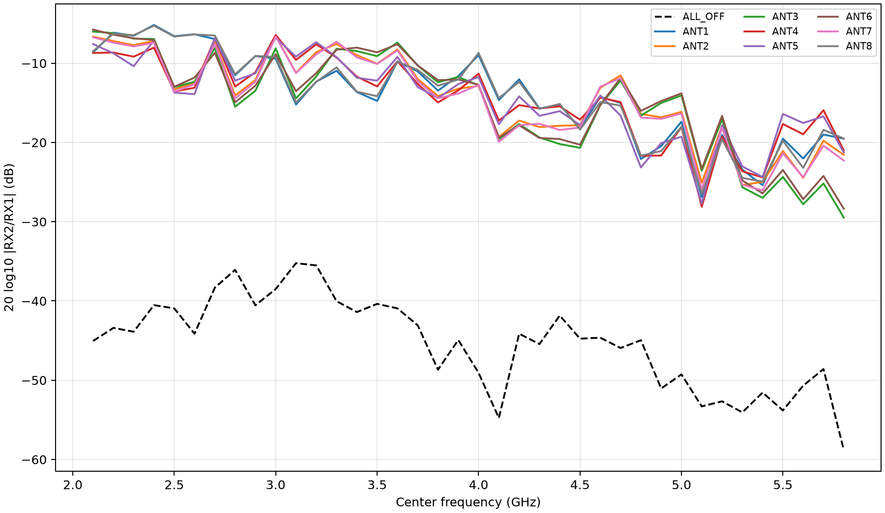
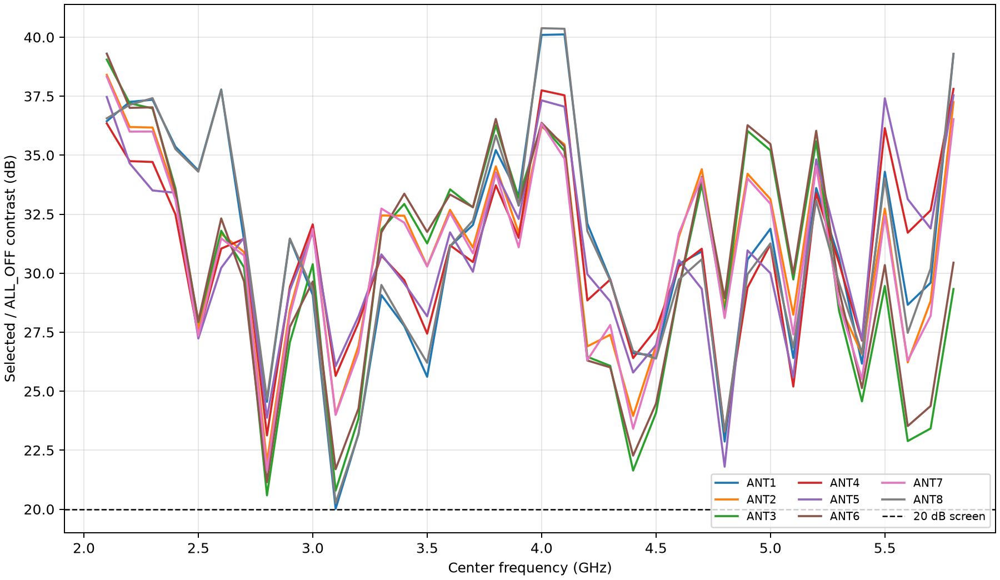
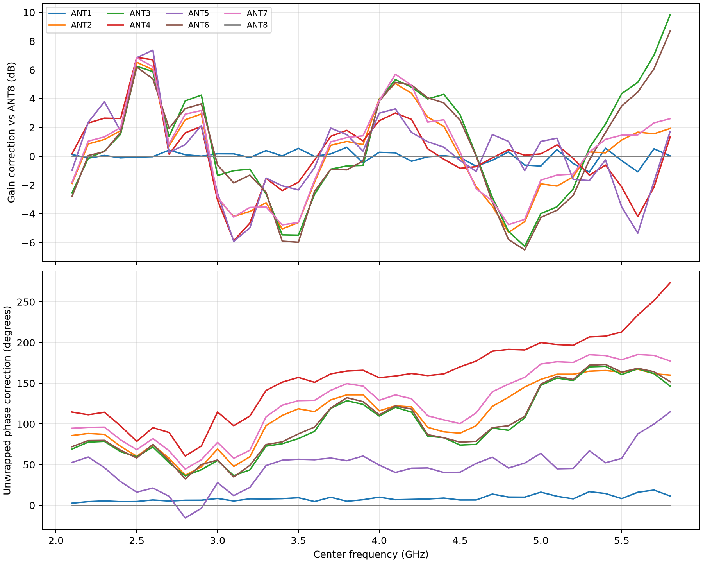
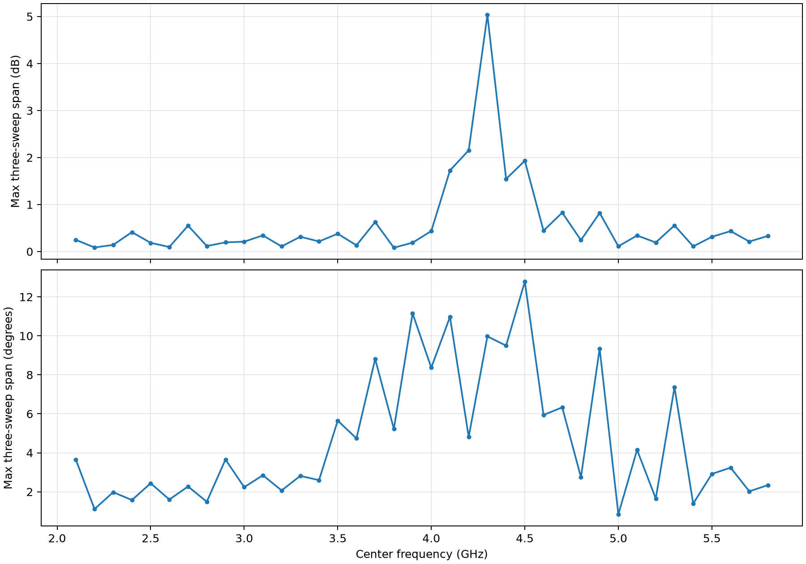
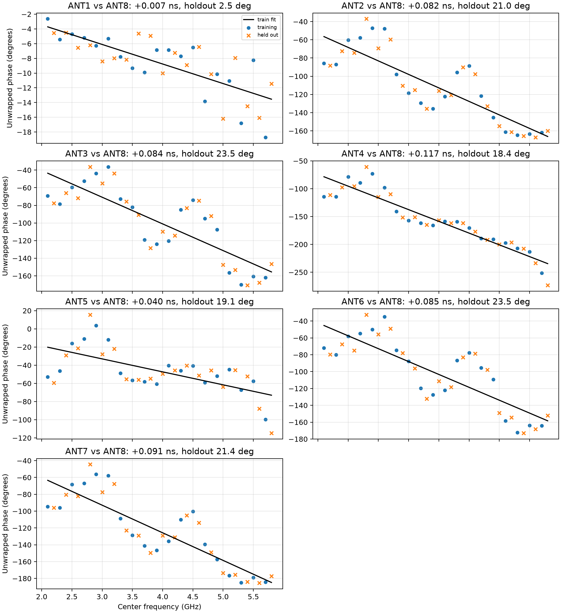
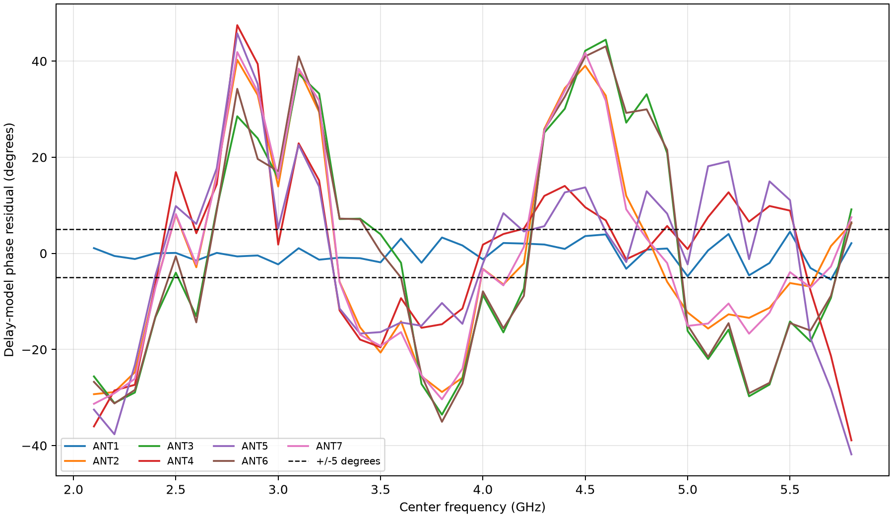
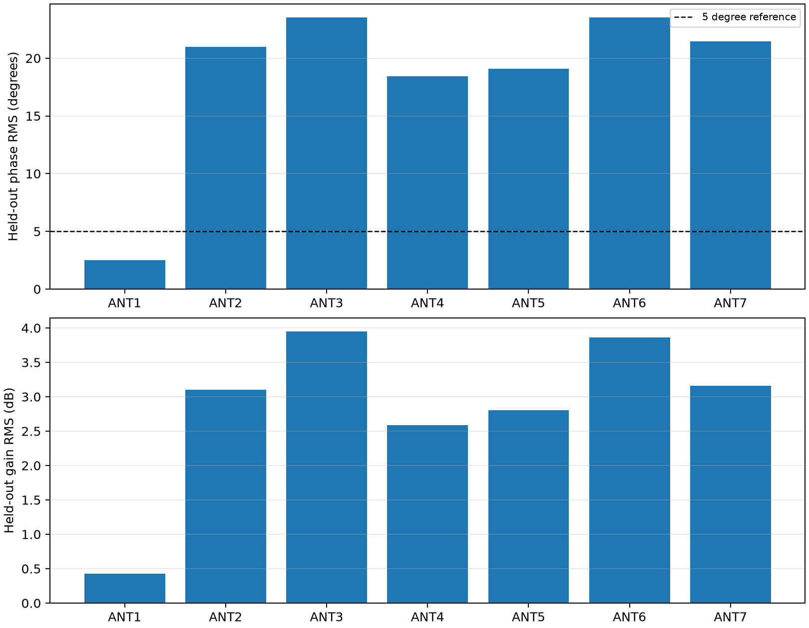

# Three-pass external-source sweep: 2.1–5.8 GHz

**Date:** 2026-08-30

**Campaign ID:** `external-broadband-2g1-5g8-20260830`

**Acquisition source freeze:** `4a163644ab54c804680e2784da1f73dcb1c2167a`

**Evidence boundary:** **This report uses only the three sweep runs listed below. Every number,
table, plot, fit, and conclusion is derived from their 1,026 captures. No measurements or inferred
causes from an earlier campaign are included.**

**Disposition:** **All eight selected paths were measurable at 5.8 GHz. Retain both raw and
`ALL_OFF`-subtracted frequency-indexed calibration candidates for held-out comparison; a single
path-length model is not accurate enough for ANT2–ANT7.**

## Executive result

Three consecutive complete sweeps were acquired from 2.1 through 5.8 GHz in exact 100 MHz steps.
Each sweep measured static `ALL_OFF` and ANT1 through ANT8 states, giving 38 frequencies × 9 states
× 3 sweeps = **1,026 captures validated by this report**. All captures passed the pinned
lattice/identity, finite-IQ, raw-replay, and exact-cleanup checks. Both radios were muted and the
selector was lease-free `ALL_OFF` after every observation and at final exit.

At 5.8 GHz in these three sweeps:

- `ALL_OFF` averages **−58.80 dB** in `RX2/RX1`;
- leakage-subtracted selected-path contrast is **29.39–39.23 dB**;
- every path clears the 20 dB engineering screen;
- ANT3 and ANT6 are repeatable but require **+9.84 dB** and **+8.70 dB** gain correction relative to
  ANT8; and
- worst three-sweep relative-calibration span is **0.145 dB / 0.738°** at this frequency.

The broadband result is more nuanced. The transfer contains repeatable notch/lobe structure, ANT3
and ANT6 roll off sharply above 5.4 GHz, and a constant-gain/constant-delay model leaves 18.4–23.5°
held-out phase RMS and 2.6–4.0 dB held-out gain RMS on ANT2–ANT7. Only ANT1 relative to ANT8 is close
to a simple path: 2.51° held-out phase RMS and 0.42 dB gain RMS. The model is useful as a diagnostic
average slope; it is not a replacement for frequency-specific complex coefficients.

## Conducted setup

```text
Pluto .173 TX1
      |
      v
  2-way splitter
      |-------------------- 10 dB attenuator ----> Pluto .15 RX1
      |
      v
  8-way splitter
      |  |  |  |  |  |  |  |
      +--+--+--+--+--+--+--+----> selector ANT1..ANT8
                                      |
                                      v
                                 selector COMMON ----> Pluto .15 RX2
```

| Role | Pinned identity |
|---|---|
| Independent source | `.173`, serial `104473b80a16000de6ff2000f8a6beca79`, TX1 |
| Simultaneous receiver | `.15`, serial `104000b29905000e17000800065934759d`, RX1/RX2 |
| Selector | `stm32c011-4c0055000950313950363920` |
| ST-Link | `002D003A3335511035383531` |

The source used −40 dB TX1 hardware gain and a 100 kHz DDS tone. RX1 and RX2 were captured
simultaneously at 2 MS/s with 262,144 samples/channel and fixed 60 dB receive gain. Source and
receiver clocks were independent. Each observation acquired the actual pilot from RX1, refined its
frequency, projected both channels at the same frequency, and formed `H = RX2/RX1`.

This ratio removes source amplitude and common oscillator drift within an observation. It still
contains the 2-way reference arm and attenuator, the 8-way splitter, all cables/adapters, the
selector, connector launches, receiver-channel mismatch, and network reflections. This campaign
does **not** measure antenna patterns, mutual coupling, enclosure response, or a direction-finding
manifold.

## Campaign matrix and chronology

| Sweep | Run ID | UTC observation interval | Captures |
|---:|---|---|---:|
| 1 | `20260830T211358.287767Z` | 21:14:02–21:27:46 | 342 |
| 2 | `20260830T212857.254746Z` | 21:29:01–21:42:51 | 342 |
| 3 | `20260830T214309.897237Z` | 21:43:14–21:57:01 | 342 |
| **Total** | 3 consecutive ascending sweeps | about 43 minutes | **1,026** |

The exact frequency grid is 2.1, 2.2, …, 5.8 GHz. Each frequency used the exact state order
`ALL_OFF, ANT1, …, ANT8`. A “repeat” here means a new complete 342-observation sweep, not adjacent
captures inside one state loop. This exposes slow pass-to-pass drift, but the shared ascending order
does not separate frequency order, state order, and time.

## Admission, raw replay, and safety

Every `run.json` was checked for:

- exact source, receiver, selector, ST-Link, configuration, source commit, frequency order, state
  order, and observation count;
- requested selector command/applied code before capture;
- selected-state lease and lease-free `ALL_OFF` semantics;
- exact receiver and source mute after capture;
- immediate selector return to `ALL_OFF` after capture;
- exact final mute and final lease-free `ALL_OFF`; and
- a finite successful analysis record.

The analyzer does not merely trust those stored phasors. It hashes and loads every NPZ with pickle
disabled, requires exact `complex64` RX1/RX2 vectors of 262,144 finite samples, reruns the independent-
clock pilot estimator, recomputes `RX2/RX1`, and compares it to the stored value. The maximum complex
replay difference across all 1,026 captures is **0.0**.

Raw IQ totals **4,303,866,852 bytes** and remains outside Git. The normalized JSON records size and
SHA-256 for every NPZ, a canonical per-run artifact-manifest digest, the run-document digests, the
analyzer digest, and the capture-runner digest. These hashes bind the bytes observed during report
generation. There was no external capture-time seal, so they cannot independently prove that bytes
were unchanged between acquisition and this first hashing pass.

| Run | `run.json` SHA-256 | Artifact-manifest SHA-256 |
|---|---|---|
| Sweep 1 | `21c17f36641fbc1793c0c6469b70c4d8307afacbe0b58d8ad4a1549b47866d7b` | `9147a296a59e9505f88a7250f842756007d4135078726de19c1ea61c09b8298f` |
| Sweep 2 | `1b6b28dce8059e54cbdbb2ec6a47bab6629564a122808ddcc9ce5359365203ea` | `7c38ac3d475b10ab8a42e7d3c2a407d900f740bc27f8a403a60ecb87087e52bd` |
| Sweep 3 | `b41deb6c9396ef7cf85859e61b5dbec87d42143f9df23f1b5b4bfed092d41e54` | `261767511091f756868d659d09f6736d5457abd98cccd06efa85f6941fb1d777` |

The maximum observed component was 507 ADC counts, far from clipping. No analysis error, identity
error, selector error, mute error, or final-cleanup error occurred.

## Analysis definitions

For sweep `r`, frequency `f`, and selector state `i`:

```text
H_i,r(f) = RX2_i,r(f) / RX1_i,r(f)
P_i,r(f) = H_i,r(f) - H_ALL_OFF,r(f)
C_i,r(f) = P_ANT8,r(f) / P_i,r(f)
R_i,r(f) = P_i,r(f) / P_ANT8,r(f)
```

`P` subtracts the coherent `ALL_OFF` baseline within the same sweep/frequency. This assumes the
`ALL_OFF` phasor is the same additive component when a path is selected; that has not yet been proven.
`C` is therefore a candidate complex coefficient that maps a selected path onto ANT8. The normalized
evidence also retains the raw `H8/Hi` coefficient. Calibration is calculated per sweep first and then
complex-averaged, so run pairing is preserved. Raw selected/`ALL_OFF` and leakage-subtracted
`P_i/ALL_OFF` contrasts are also calculated per sweep before summarization.

Only three sweep observations exist per cell. The report therefore gives point estimates and spans,
not confidence intervals.

## Broadband transfer



The selected transfer is not flat. Broad, paired structure appears across the full fixture:

- ANT2/ANT7 and ANT3/ANT6 track in similar families;
- broad relative minima appear around 2.5–2.6 and 4.1–4.3 GHz;
- relative lobes appear around 3.1–3.4 and 4.8–4.9 GHz; and
- ANT3/ANT6 lose substantial relative amplitude above 5.4 GHz.

`ALL_OFF` is also frequency selective, ranging from **−35.23 dB at 3.1 GHz** to **−58.80 dB at
5.8 GHz**. This baseline is part of the complete fixture and must be retained in analysis rather than
replaced by one isolation number.

These features are end-to-end transfer behavior; this campaign does not prove that they are PCB
resonances. A 100 MHz grid locates a broad extremum only to roughly ±50 MHz, cannot measure the Q of
a narrow feature, can miss narrow features, and provides no S11/S22 or de-embedding. A matched line
does not resonate merely because its length is a wavelength fraction; a reflection, discontinuity,
or coupling path is also required.

## Selected-state contrast



Across the 304 frequency/path cells, the three-sweep mean leakage-subtracted contrast ranges from
**20.05 to 40.44 dB**. Across the 912 individual sweep cells:

- minimum: **19.873 dB**;
- median: **31.027 dB**;
- maximum: **40.793 dB**; and
- one result is below 20 dB: sweep 3, 3.1 GHz, ANT1.

The raw selected/`ALL_OFF` numbers are nearly identical: 19.823–40.845 dB across individual cells.
The single borderline result means the complete band cannot honestly be described as clearing 20 dB
on every individual observation, even though every three-sweep cell mean clears it.

## Exact 5.8 GHz result

| State | Mean `H` | Phase | Raw three-sweep span | `C` gain vs ANT8 | `C` phase | Path/`ALL_OFF` |
|---|---:|---:|---:|---:|---:|---:|
| `ALL_OFF` | −58.80 dB | −54.95° | 0.509 dB / 9.98° | — | — | — |
| ANT1 | −19.52 dB | −23.01° | 0.232 dB / 1.98° | +0.025 dB | +11.43° | 39.20 dB |
| ANT2 | −21.56 dB | −170.54° | 0.211 dB / 2.33° | +1.931 dB | +159.99° | 37.30 dB |
| ANT3 | **−29.47 dB** | −155.77° | 0.292 dB / 2.34° | **+9.838 dB** | +146.41° | 29.39 dB |
| ANT4 | −21.00 dB | +74.70° | 0.332 dB / 1.89° | +1.350 dB | −86.52° | 37.88 dB |
| ANT5 | −21.27 dB | −125.38° | 0.306 dB / 2.26° | +1.727 dB | +114.84° | 37.50 dB |
| ANT6 | **−28.36 dB** | −161.53° | 0.306 dB / 2.34° | **+8.705 dB** | +151.91° | 30.52 dB |
| ANT7 | −22.28 dB | +172.10° | 0.222 dB / 2.31° | +2.612 dB | +177.26° | 36.62 dB |
| ANT8 | −19.51 dB | −11.68° | 0.261 dB / 1.85° | 0 dB | 0° | 39.23 dB |

ANT3 and ANT6 are not failed states. They are deterministic weak paths in this complete
splitter/cable/selector fixture. Digital gain correction can equalize their mean, but the 8–10 dB
physical loss reduces available SNR and should still be localized by cable/port substitution.

## Frequency-indexed complex calibration



The normalized evidence contains both `P8/Pi` and raw `H8/Hi` candidates for all eight paths and all
38 frequencies. They differ by as much as 0.857 dB and 7.255° in this band, so held-out closure—not an
assumption—must decide between raw calibration, `ALL_OFF` subtraction, or a fuller nine-state complex
model. The prominent ANT3/ANT6 high-band penalty is frequency dependent rather than a static gain
error:

| Frequency | ANT3 gain correction | ANT6 gain correction |
|---:|---:|---:|
| 5.1 GHz | −3.51 dB | −3.75 dB |
| 5.5 GHz | +4.35 dB | +3.49 dB |
| 5.8 GHz | +9.84 dB | +8.70 dB |

The sign reversal and rapid high-band growth are incompatible with one constant per-port gain. For
engineering use, retain both sets of complex knots and make the subtraction choice explicit. Do not
interpolate blindly across sharp regions; dense follow-up data should determine a valid interpolation
bandwidth.

## Three-sweep repeatability



Absolute selected transfer includes common fixture/reference drift:

- median three-sweep span: **0.199 dB / 2.510°**;
- worst magnitude span: **5.032 dB at 4.3 GHz**; and
- worst phase span: **12.783° at 4.5 GHz**.

Much of the largest 4.3 GHz change is common to multiple selected states. Normalizing each sweep to
its ANT8 observation improves relative calibration substantially:

- median span: **0.0536 dB / 0.480°**;
- worst magnitude span: **0.797 dB**; and
- worst phase span: **9.676° at 4.9 GHz ANT1**.

The tails matter. ANT8 is captured last at every frequency, not interleaved around each tested path.
Several 4.9 GHz states move together relative to ANT8, which is consistent with within-frequency
reference/time drift. Three unchanged ascending passes are good short-term evidence, but not
reconnect closure, calibration-age evidence, randomized-order closure, or a production coefficient
release.

## Can an easy path-length model explain phase?

The tested model is intentionally simple:

```text
R_i(f) = P_i(f) / P_ANT8(f)
R_i(f) = A_i exp(j(phi_i - 2*pi*(f-f0)*tau_i))
```

With this sign convention, positive `tau_i` means path `i` lags ANT8. The model uses a fixed gain,
phase intercept, and delay. It is fit by circular phase residual, not by unwrapping held-out points.
Two folds are scored: even frequency bins train and odd bins are held out, then the roles reverse.
The final descriptive coefficient uses all 38 bins.



| Path vs ANT8 | Fitted delay | Air-equivalent signed length | VF=0.70 equivalent | Held-out phase RMS | Held-out gain RMS |
|---|---:|---:|---:|---:|---:|
| ANT1 | +0.0074 ns | +2.21 mm | +1.55 mm | **2.51°** | **0.42 dB** |
| ANT2 | +0.0824 ns | +24.69 mm | +17.29 mm | 20.98° (max 41.12°) | 3.10 dB |
| ANT3 | +0.0841 ns | +25.22 mm | +17.65 mm | 23.53° (max 45.00°) | 3.95 dB |
| ANT4 | +0.1171 ns | +35.11 mm | +24.58 mm | 18.44° (max 49.21°) | 2.59 dB |
| ANT5 | +0.0396 ns | +11.88 mm | +8.32 mm | 19.10° (max 46.84°) | 2.80 dB |
| ANT6 | +0.0849 ns | +25.44 mm | +17.81 mm | 23.54° (max 43.41°) | 3.86 dB |
| ANT7 | +0.0911 ns | +27.32 mm | +19.12 mm | 21.45° (max 42.80°) | 3.16 dB |





The answer is therefore:

- **ANT1/ANT8:** a simple relative delay is a useful compact approximation over this band;
- **ANT2–ANT7:** the fitted slope summarizes the overall trend, but 18–24° held-out phase RMS and
  multi-dB gain ripple are too large for precision calibration; and
- **all paths:** the equivalent lengths describe the complete conducted network, not PCB copper.

Common source/reference/receiver terms ideally cancel in `Pi/P8`; the fit retains differential
8-way arms, cables, connectors, selector ports, state-dependent loading/reflections, and sequential
drift. Calling these numbers “PCB path lengths” would be physically wrong.

### Delay alias and sign limits

A 100 MHz frequency grid identifies delay only modulo `1 / 100 MHz = 10 ns`. Every alternating-bin
training fold is spaced 200 MHz and aliases every 5 ns. The analyzer therefore predeclares a
board/fixture-scale search interval of **[−2.5, +2.5) ns**. None of the fits touched that boundary.
The reported ~0.1 ns branch is selected by the declared fixture-scale search interval; the samples
alone do not distinguish it from aliases separated by 10 ns.

If the calibration coefficient `C = P8/Pi` is fitted instead of `R = Pi/P8`, the delay sign reverses.
The equation and reference plane must accompany every exported delay.

## Conclusions supported by these three sweeps

1. Static selection, simultaneous two-channel measurement, and the independent source produced
   finite, repeatable observations across the complete 2.1–5.8 GHz grid.
2. At 5.8 GHz, every selected path was 29.39–39.23 dB above its paired coherent `ALL_OFF` phasor
   after subtraction. `ALL_OFF` itself averaged −58.80 dB in `RX2/RX1`.
3. ANT3 and ANT6 are the weakest 5.8 GHz paths, requiring +9.84 dB and +8.70 dB candidate gain
   corrections relative to ANT8. Their behavior is repeatable across these passes and strongly
   frequency dependent.
4. Relative calibration is much more repeatable than absolute transfer: median three-pass span is
   0.0536 dB / 0.480°, with worst observed span 0.797 dB / 9.676°.
5. A constant-gain/constant-delay model is adequate only for ANT1 relative to ANT8. ANT2–ANT7 need
   frequency-indexed complex calibration or a richer model.

These statements apply only to the recorded identities, configuration, conducted fixture, and
observation interval. The three sweeps do not identify which physical component creates a feature,
and they do not establish free-space direction-finding performance.

## Recommended next campaign

1. **Run interleaved held-out closure.** At each frequency use
   `ALL_OFF, ANT8, ANTi, ANT8, ALL_OFF`; rotate or randomize the tested port across passes. Derive
   coefficients from one set and score later source-distinct captures without refitting.
2. **Repeat the tail cells first.** Target 4.2–4.3, 4.5–4.6, and 4.9 GHz before promoting a broadband
   table. Include both ascending and descending frequency order.
3. **Densify actual features.** Use 1–5 MHz steps around 2.45–2.7, 3.0–3.5, 4.0–4.4, 4.7–5.1,
   and 5.5–5.85 GHz. This can measure feature width and define safe interpolation spacing.
4. **Localize ANT3/ANT6 loss.** With both radios muted and the selector `ALL_OFF`, swap only the
   strong/weak fixture pairs `ANT1 ↔ ANT3` and `ANT8 ↔ ANT6`, then repeat those states. A feature that
   follows the arm implicates splitter/cable hardware; one that stays with the selector state
   implicates its connector/PCB/switch path. Restore and prove the original mapping afterward.
5. **Calibrate tracking at the task level.** Install the antennas, survey geometry, capture an
   angular manifold, hold out complete bearings, and report median/p95 bearing error, ambiguity, SNR
   dependence, and calibration-age drift. Conducted coefficients alone are not an antenna-array
   calibration.

For immediate exploratory experiments, preserve `ALL_OFF`, retain per-path quality/SNR weights,
reject frequencies outside measured support, and score both raw `H8/Hi` and subtracted `P8/Pi`
frequency-indexed tables. Do not promote either as the default until held-out closure chooses it.

## Limitations

- Three observations/cell are not enough for formal confidence bounds.
- All passes used the same ascending frequency and state order.
- ANT8 was sequential rather than interleaved with each path.
- The fixture was not disconnected/reconnected between passes.
- The 100 MHz grid can hide narrow structure.
- `ALL_OFF` subtraction assumes its coherent contribution remains stable between sequential states.
- No broadband source-muted control was acquired, so `ALL_OFF` cannot be apportioned among receiver
  floor, coherent external leakage, selector leakage, or fixture coupling.
- This is a stepped single-CW-tone campaign near center +100 kHz, not characterization of the full
  1.6 MHz channel or of modulated signals.
- Raw hashes were first established during report generation, not sealed by an external authority at
  acquisition time.
- The result is a conducted fixture calibration, not a free-space direction-finding validation.

## Reproduction

The acquisition runner is
[`scripts/run_pinned_static_screen.py`](../../scripts/run_pinned_static_screen.py). The broadband
analyzer is
[`scripts/analyze_pinned_broadband_campaign.py`](../../scripts/analyze_pinned_broadband_campaign.py),
with focused tests in
[`tests/test_analyze_pinned_broadband_campaign.py`](../../tests/test_analyze_pinned_broadband_campaign.py).
Normalized evidence, all raw-IQ bindings, calibration cells, model folds, residuals, and summary
statistics are in [`data/campaign-results.json`](data/campaign-results.json).

```bash
RUN_ROOT="$HOME/.local/state/smateway/lab-runs/network-192.168.1.15/static-screen"
uv run --extra report python scripts/analyze_pinned_broadband_campaign.py \
  --run "$RUN_ROOT/20260830T211358.287767Z/run.json" \
  --run "$RUN_ROOT/20260830T212857.254746Z/run.json" \
  --run "$RUN_ROOT/20260830T214309.897237Z/run.json" \
  --output-json docs/broadband_external_fixture_campaign/data/campaign-results.json \
  --figure-dir docs/broadband_external_fixture_campaign/png
```

Focused verification at report generation:

```text
uv run ruff check scripts/analyze_pinned_broadband_campaign.py \
  tests/test_analyze_pinned_broadband_campaign.py
uv run pytest -q tests/test_analyze_pinned_broadband_campaign.py
14 passed
```
