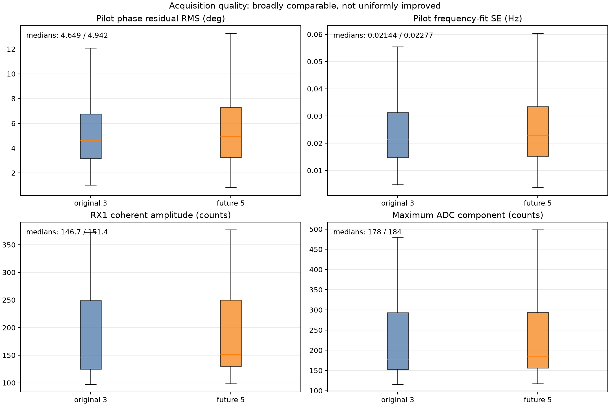
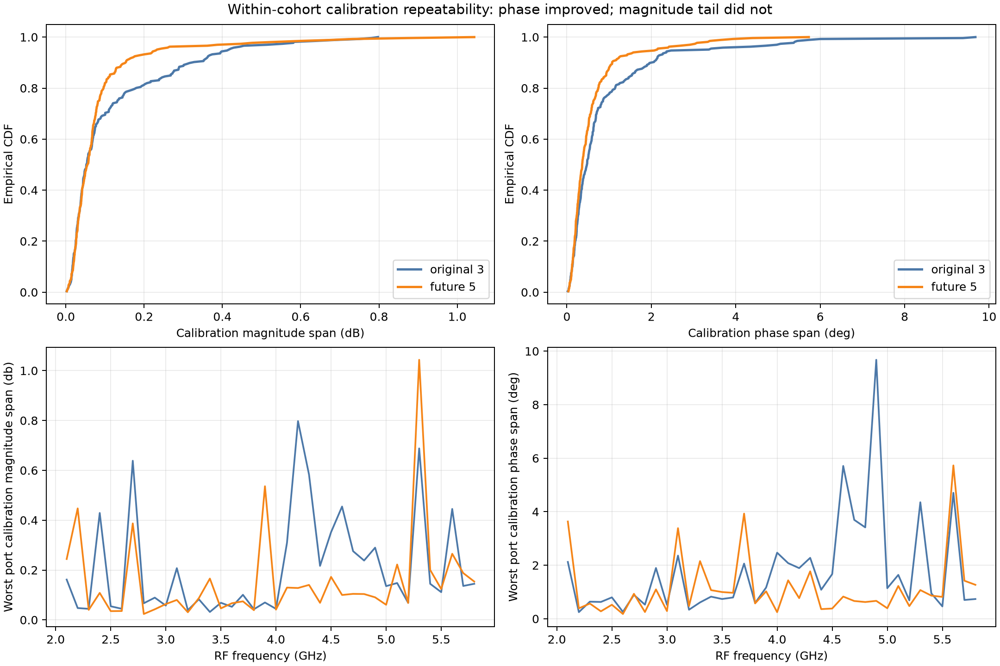
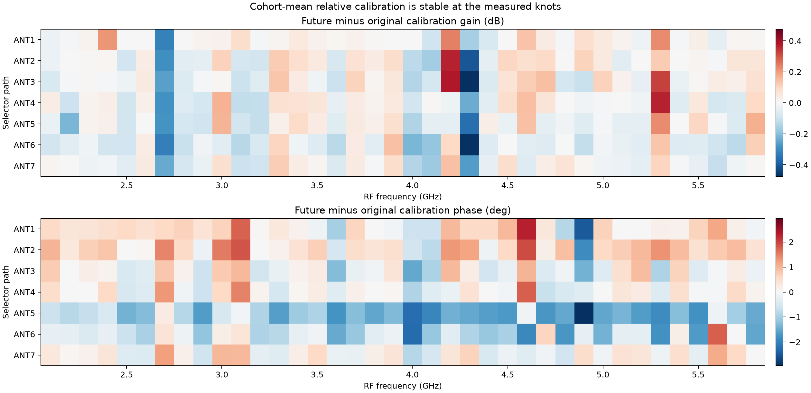
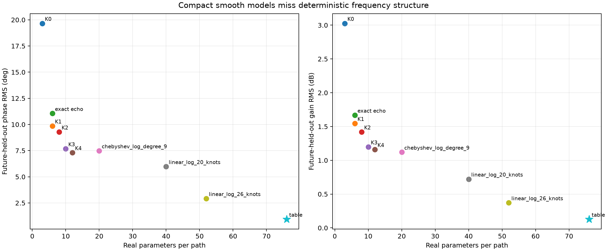
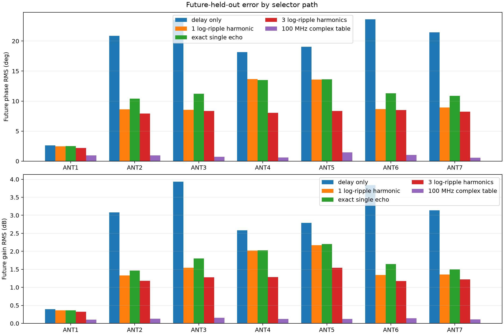
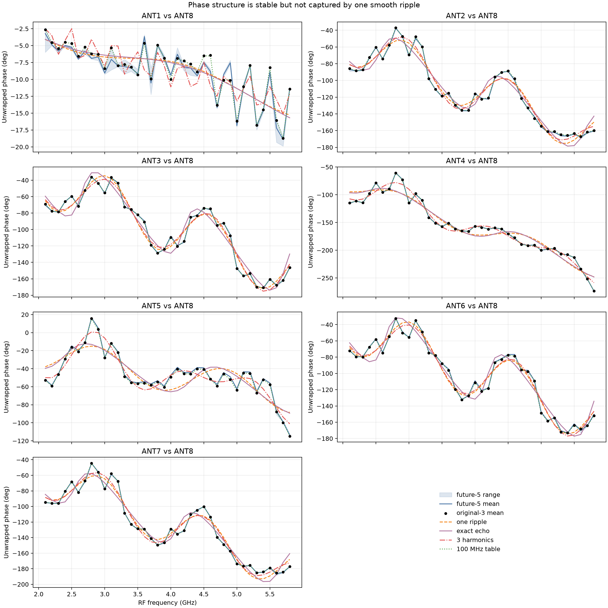
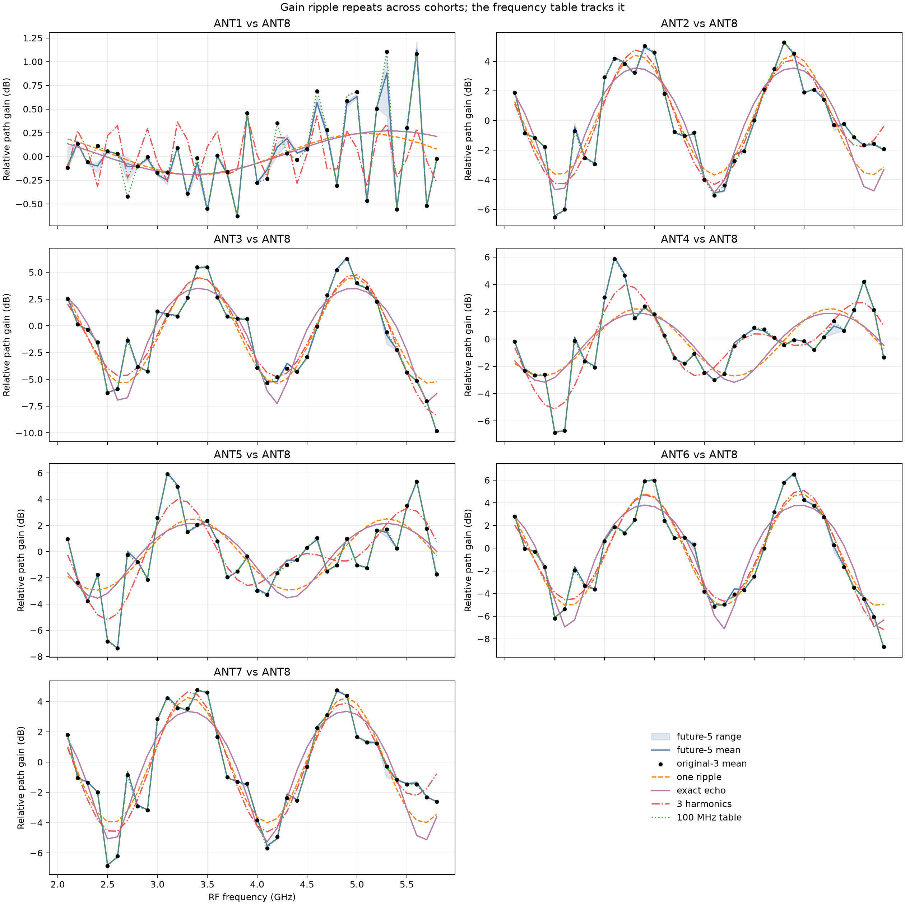

# Original-three versus future-five broadband calibration

Date: 2026-08-31

## Verdict

The new five sweeps confirm that the board's frequency structure is real and repeatable. They do
not support replacing the 100 MHz complex calibration table with a compact ripple model.

At the 38 measured frequencies, the original three-sweep table predicts the five later sweeps with
**0.942° phase RMS and 0.128 dB gain RMS**. The best compact harmonic model tested here still has
**7.31° and 1.16 dB RMS** error. A physically exact single-echo model is worse than the existing
one-log-ripple approximation.

For production calibration:

- store one complex correction per port and measured frequency;
- reject or explicitly flag frequencies outside the table;
- keep the one-ripple fit only as a diagnostic summary;
- do not interpret fitted harmonic delays as physical cable or reflection lengths;
- validate interpolation with denser, unseen frequencies before enabling it.

The new five are better in short-term selected-path and phase repeatability, but not uniformly
better in every metric. Their capture-level pilot quality is broadly equivalent, their worst
calibration-magnitude outlier is larger, and `ALL_OFF` is less stable.

## Exact cohort contract

The original three sweeps are used only to construct models and calibration. The five new sweeps
are used only for future-held-out scoring.

| Role | Run IDs |
|---|---|
| Original training/calibration | `20260830T211358.287767Z`, `20260830T212857.254746Z`, `20260830T214309.897237Z` |
| Future-held-out | `20260830T233718.194719Z`, `20260830T235102.223267Z`, `20260831T000448.252130Z`, `20260831T001833.322413Z`, `20260831T003219.696398Z` |

The intervening run `20260830T231939.843226Z` is explicitly excluded. It preceded the user's
separate request for five more consecutive sweeps and is not silently mixed into either cohort.
All eight admitted `run.json` documents are bound by SHA-256 in
[`comparison.json`](data/comparison.json).

All runs use receiver `ip:192.168.1.15`, source `ip:192.168.1.173`, the same selector, the same
2.1–5.8 GHz/100 MHz lattice, and 342 captures per sweep. The two Git commits differ because the
report/model work was added between campaigns; the capture runner and pilot estimator are
byte-identical. There were no run, analysis, selector, mute, or final-cleanup failures.

## Is the new five-sweep cohort better quality?

The precise answer is **mostly better for the relative port calibration, equivalent at the pilot
estimator, and worse for isolated magnitude/`ALL_OFF` tails**.

### Acquisition and selected transfer

| Metric | Original 3 | Future 5 | Reading |
|---|---:|---:|---|
| Pilot phase-residual median | 4.649° | 4.942° | 6.3% higher in the new cohort |
| Pilot phase-residual p95 | 11.903° | 12.473° | 4.8% higher |
| Pilot phase-residual maximum | 26.221° | 21.644° | better worst tail |
| Pilot frequency-fit SE median | 0.02144 Hz | 0.02277 Hz | essentially equivalent |
| Pilot frequency-fit SE maximum | 0.11946 Hz | 0.09860 Hz | better worst tail |
| Minimum phase-step coherence | 0.9999016 | 0.9999151 | both excellent |
| Selected-transfer magnitude span, p95/max | 1.779/5.032 dB | 0.570/0.719 dB | substantially better |
| Selected-transfer phase span, p95/max | 10.668/12.783° | 3.376/5.403° | substantially better |

The acquisition estimator did not become materially quieter at its median. The much better
selected-transfer tails therefore appear to be real short-term bench stability, not a changed
estimator.



### Relative calibration repeatability

The preferred relative coefficient is

```text
P_i(f) = H_i(f) - H_ALL_OFF(f)
C_i(f) = P_ANT8(f) / P_i(f)
```

The following are spans across the runs in each cohort, evaluated independently for every one of
the 38 frequencies and seven calibrated paths.

| Span statistic | Original 3 | Future 5 | Change |
|---|---:|---:|---:|
| Magnitude median | 0.0530 dB | 0.0559 dB | +5.3% |
| Magnitude p95 | 0.415 dB | 0.232 dB | −44.1% |
| Magnitude maximum | 0.797 dB | 1.043 dB | +30.9% |
| Phase median | 0.476° | 0.363° | −23.9% |
| Phase p95 | 3.140° | 2.120° | −32.5% |
| Phase maximum | 9.676° | 5.729° | −40.8% |

The new magnitude maximum is one localized 5.3 GHz/ANT3 excursion. It should not be hidden by the
better p95. Phase repeatability improves at the median, p95, and maximum despite the new cohort
having five rather than three observations.



`ALL_OFF` is a caution: its magnitude p95/max worsens from 0.830/1.178 dB to
1.349/2.367 dB. Its phase maximum also grows from 17.255° to 18.486°. Sequential `ALL_OFF`
subtraction should therefore continue to be compared against raw `H_ANT8/H_i` and full-manifold
methods in downstream direction-finding validation.

### Agreement between the two calibration means

Across the 266 port-frequency coefficients, the absolute future-minus-original shift is:

| Quantity | Median | p95 | Maximum |
|---|---:|---:|---:|
| Gain | 0.0552 dB | 0.2644 dB | 0.4753 dB |
| Phase | 0.5127° | 1.7688° | 2.9454° |

This agreement is the important engineering result: the detailed frequency pattern reproduced in
a later cohort much more closely than any compact smooth model predicts it.



## Ripple-model comparison

All model parameters are fit to the original three sweeps only. Every score below is computed on
the five later sweeps. Parameter counts are real parameters per calibrated path.

| Model | Parameters | Future phase RMS | Future gain RMS | Max phase | Max gain |
|---|---:|---:|---:|---:|---:|
| Constant gain/phase + delay | 3 | 19.66° | 3.03 dB | 47.68° | 9.22 dB |
| One log-ripple harmonic | 6 | 9.85° | 1.55 dB | 33.89° | 5.07 dB |
| Exact single echo | 6 | 11.05° | 1.67 dB | 32.98° | 5.68 dB |
| Two log-ripple harmonics | 8 | 9.27° | 1.42 dB | 33.50° | 4.58 dB |
| Three log-ripple harmonics | 10 | 7.67° | 1.20 dB | 25.26° | 3.57 dB |
| Four log-ripple harmonics | 12 | 7.31° | 1.16 dB | 23.52° | 3.48 dB |
| Log-Chebyshev degree 9 | 20 | 7.48° | 1.12 dB | 22.20° | 3.67 dB |
| Piecewise-linear log, 20 knots | 40 | 5.97° | 0.72 dB | 23.09° | 3.42 dB |
| Piecewise-linear log, 26 knots | 52 | 2.92° | 0.37 dB | 10.36° | 1.46 dB |
| 38-knot complex table | 76 | **0.94°** | **0.13 dB** | **4.74°** | **1.14 dB** |





### Why the more complex ripple is not the production answer

The existing model is

```text
log R = a + j(phi - 2*pi*(f-f0)*tau)
        + q*exp(-j*2*pi*(f-f0)*delta)
```

It is a useful empirical description of a dominant periodic feature. It is not a validated
one-reflection circuit model. For ANT2–ANT7, the fitted `|q|` is approximately 0.28–0.57, large
enough that higher terms omitted by the first-order log approximation are not negligible.

We therefore also tested the physically exact two-path form with the same six real parameters:

```text
R = b0*exp(-j*2*pi*(f-f0)*tau)
  + b1*exp(-j*2*pi*(f-f0)*(tau+delta))
```

It scores worse than the log approximation. That is evidence against the residual being one clean,
isolated echo. It does not prove that reflections are absent; the measured ratio combines the full
splitter, selector, cables, channels, and reference path.

Three or four shared-period harmonics reduce error, especially for ANT4 and ANT5, but introduce
fundamental/subharmonic ambiguity. For example, ANT2 moves from `delta=0.640 ns` with one harmonic
to `0.223 ns` with three; its third harmonic recreates the original approximately 0.67 ns wave.
ANT4 similarly moves from 0.519 ns to 0.263 ns. Those are alternative bases for the same waveform,
not newly localized reflection paths.

The phase and gain overlays show the key point directly: the future-five mean follows the jagged
original-three frequency signature, while smooth compact fits cut across it.





## Recommended next model experiment

Use the table now at its exact knots. If operation between the 100 MHz knots is required, acquire a
dense interleaved validation campaign before choosing an interpolator:

1. sample the implicated bands at 1–5 MHz spacing;
2. interleave `ALL_OFF`, `ANT8`, and the selected port instead of using a distant sequential guard;
3. randomize port order and sweep direction;
4. hold out contiguous frequency blocks and a later/reconnected campaign;
5. compare log-linear and shape-preserving interpolation against the exact table, exact one echo,
   and a constrained two-echo model;
6. score phase/gain closure and final bearing error, not training residual alone.

The five future sweeps are consecutive, ascending, identically ordered, and use the unchanged
fixture. They establish strong short-term repeatability and future closure over roughly the same
bench session. They do not yet establish reconnect, temperature, day-to-day, or calibration-age
stability.

## Reproduction

```bash
RUN_ROOT=/home/mouse9911/.local/state/smateway/lab-runs/network-192.168.1.15/static-screen

uv run python scripts/analyze_broadband_cohort_comparison.py \
  --original-run "$RUN_ROOT/20260830T211358.287767Z/run.json" \
  --original-run "$RUN_ROOT/20260830T212857.254746Z/run.json" \
  --original-run "$RUN_ROOT/20260830T214309.897237Z/run.json" \
  --future-run "$RUN_ROOT/20260830T233718.194719Z/run.json" \
  --future-run "$RUN_ROOT/20260830T235102.223267Z/run.json" \
  --future-run "$RUN_ROOT/20260831T000448.252130Z/run.json" \
  --future-run "$RUN_ROOT/20260831T001833.322413Z/run.json" \
  --future-run "$RUN_ROOT/20260831T003219.696398Z/run.json" \
  --output-json docs/broadband_future_sweep_comparison/data/comparison.json \
  --figure-dir docs/broadband_future_sweep_comparison/png
```

The analyzer rejects missing, duplicated, substituted, hash-mismatched, or cohort-swapped runs; a
different receiver/source/selector/configuration; an analysis failure; and a non-muted or leased
final state. Its JSON records every plotted sample, model score, future closure cell, and PNG
SHA-256. Raw-IQ replay is not repeated by this lightweight comparison; the source campaign reports
document the successful raw replay that produced the pinned phasors.
