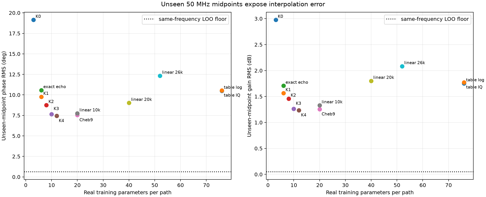
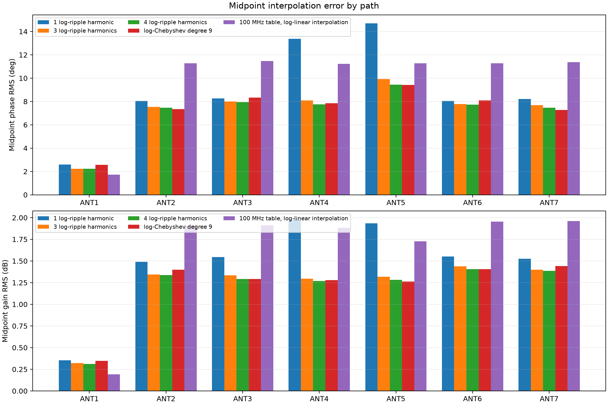
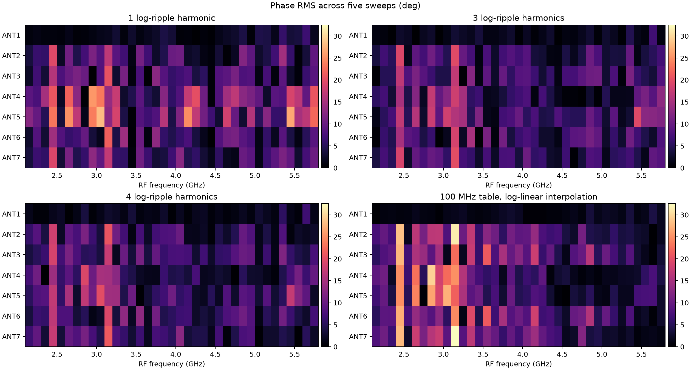
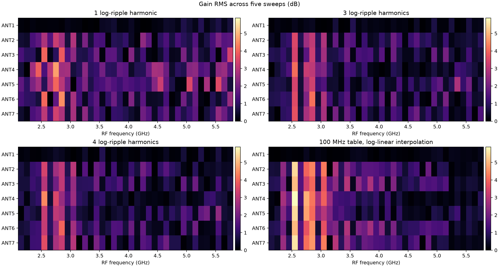
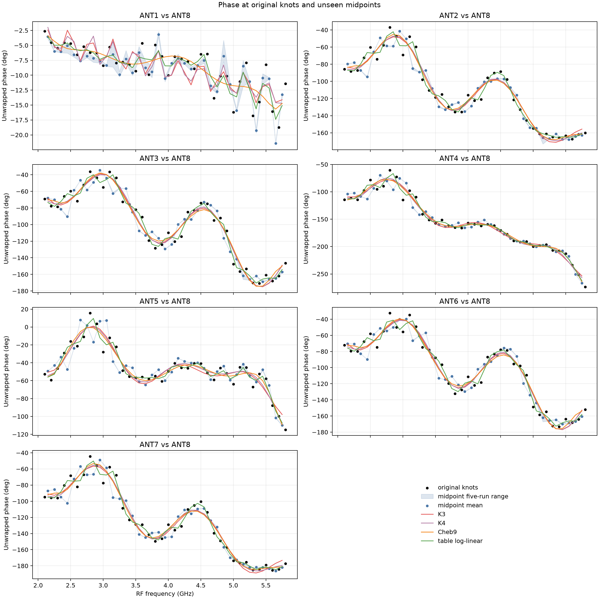
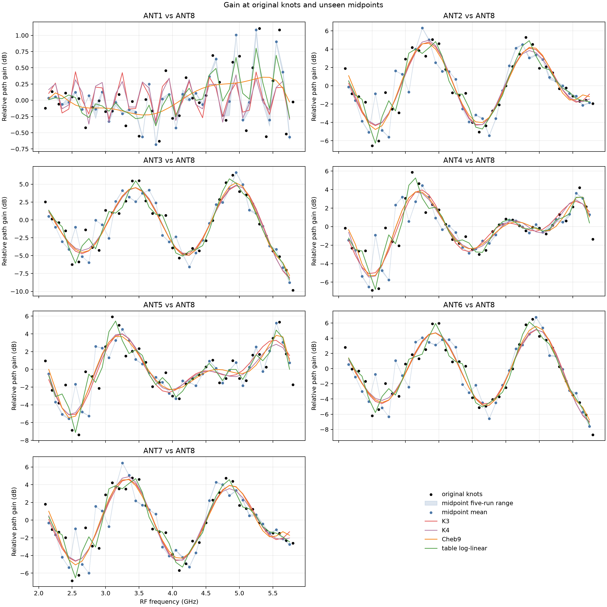

# Unseen 50 MHz midpoint calibration campaign

Date: 2026-08-31

## Outcome

Five complete sweeps were acquired at the 37 previously unmeasured frequencies
2.15, 2.25, …, 5.75 GHz. These are exactly the midpoints between the original 100 MHz calibration
knots. Every model was frozen using only the original three 2.1–5.8 GHz sweeps; no midpoint value
was used for fitting or model selection.

The experiment gives a clear answer:

- **four log-ripple harmonics are the best frozen compact model tested**, at 7.45° phase RMS and
  1.24 dB gain RMS;
- degree-9 log-Chebyshev and three harmonics are statistically indistinguishable for practical
  purposes, at 7.54°/1.25 dB and 7.65°/1.26 dB;
- **interpolating the 100 MHz complex table is not safe**: log-linear interpolation gives
  10.50°/1.75 dB and Cartesian interpolation gives 10.55°/1.77 dB;
- a table calibrated directly at these midpoint frequencies has a five-sweep leave-one-out floor of
  0.62°/0.048 dB RMS, so capture noise is not causing the model errors; and
- the board/fixture has reproducible structure between the old knots that the 100 MHz grid did not
  observe.

The production recommendation changes in one important way: use an exact-frequency complex table
on a **50 MHz grid**, not a 100 MHz table with interpolation. None of the tested compact models is
accurate enough to replace exact-frequency calibration for phase-based tracking.

This is interpolation within the measured 2.1–5.8 GHz band, although the campaign uses the
stronger engineering condition of completely unseen frequencies. It is not out-of-band
extrapolation.

## Exact campaign

| Sweep | Run ID | Captures | Maximum ADC component |
|---:|---|---:|---:|
| 1 | `20260831T012101.150426Z` | 333 | 510 counts |
| 2 | `20260831T013428.712215Z` | 333 | 475 counts |
| 3 | `20260831T014754.522922Z` | 333 | 506 counts |
| 4 | `20260831T020127.934844Z` | 333 | 511 counts |
| 5 | `20260831T021459.216318Z` | 333 | 503 counts |
| **Total** | five consecutive ascending midpoint sweeps | **1,665** | **511 counts** |

Each run contains the exact 37-frequency × 9-state lattice in order:

```text
frequency: 2.15, 2.25, ..., 5.75 GHz
state:     ALL_OFF, ANT1, ANT2, ..., ANT8
```

The receiver remained pinned to `ip:192.168.1.15`, source to `ip:192.168.1.173`, and TX1 source
gain to −40 dB. Every run has zero acquisition/analysis errors, exact receiver/source mute after
each capture, exact final mutes, and a final lease-free selector `ALL_OFF`. A separate live check
after the fifth sweep confirmed the same safe state.

The five immutable `run.json` SHA-256 values and each raw-artifact manifest digest are recorded in
[`campaign-results.json`](data/campaign-results.json).

## Raw-IQ replay and acquisition quality

All 1,665 NPZ files were hashed and replayed. Each contains finite `complex64` RX1/RX2 vectors of
262,144 samples. The independent-clock pilot was re-estimated, both channels were projected at the
same fitted frequency, and `RX2/RX1` was recomputed.

| Check | Result |
|---|---:|
| Raw IQ | 6,984,345,330 bytes |
| Replayed captures | 1,665/1,665 |
| Maximum stored/replayed complex-transfer difference | **0.0** |
| Analysis errors | **0** |
| Maximum ADC component | 511 counts |
| Pilot phase-residual median/p95/max | 4.946° / 12.534° / 23.476° |
| Pilot frequency-fit SE median/p95/max | 0.02282 / 0.05764 / 0.10752 Hz |
| Minimum pilot phase-step coherence | 0.9998139 |

There is no clipping or estimator-quality explanation for the interpolation errors.

## Frozen model results

The relative path response is

```text
R_i(f) = (H_i(f) - H_ALL_OFF(f)) / (H_ANT8(f) - H_ALL_OFF(f))
```

Every parameter below comes from the original three 100 MHz sweeps. The five midpoint sweeps are
used only for scoring. Counts are real training parameters per calibrated path.

| Model | Parameters | Midpoint phase RMS | Midpoint gain RMS | Max phase | Max gain |
|---|---:|---:|---:|---:|---:|
| Gain/phase + delay | 3 | 19.15° | 2.98 dB | 46.16° | 8.04 dB |
| One log-ripple harmonic | 6 | 9.76° | 1.56 dB | 28.18° | 4.70 dB |
| Exact single echo | 6 | 10.58° | 1.71 dB | 29.54° | 5.20 dB |
| Two log-ripple harmonics | 8 | 8.76° | 1.46 dB | 26.02° | 4.60 dB |
| Three log-ripple harmonics | 10 | 7.65° | 1.26 dB | **21.11°** | 4.13 dB |
| Four log-ripple harmonics | 12 | **7.45°** | **1.24 dB** | 22.19° | 4.49 dB |
| Log-Chebyshev degree 5 | 12 | 14.96° | 2.25 dB | 44.74° | 5.56 dB |
| Log-Chebyshev degree 9 | 20 | 7.54° | 1.25 dB | 22.30° | 4.43 dB |
| Log-Chebyshev degree 15 | 32 | 7.60° | 1.29 dB | 26.41° | 4.69 dB |
| Piecewise-linear log, 10 knots | 20 | 7.73° | 1.33 dB | 23.80° | 4.69 dB |
| Piecewise-linear log, 20 knots | 40 | 9.02° | 1.80 dB | 26.74° | 5.03 dB |
| Piecewise-linear log, 26 knots | 52 | 12.33° | 2.08 dB | 46.10° | 8.47 dB |
| 100 MHz table, log-linear interpolation | 76 | 10.50° | 1.75 dB | 32.88° | 5.94 dB |
| 100 MHz table, Cartesian interpolation | 76 | 10.55° | 1.77 dB | 33.00° | 6.03 dB |
| Direct midpoint table, leave-one-sweep-out | midpoint data | **0.62°** | **0.048 dB** | 9.26° | 0.61 dB |





## Interpretation

### The 100 MHz table did not fail at its knots

The earlier future-five experiment showed that the original table closes at its exact measured
frequencies with 0.94°/0.128 dB RMS. This new experiment asks a different question: what happens
halfway between those frequencies?

Both table interpolation rules fail badly there. That means the response between adjacent knots is
not close to a straight line in complex IQ or in log-magnitude/unwrapped-phase. The exact-knot table
was correct; the assumption that 100 MHz spacing adequately samples the response was not.

### More parameters do not guarantee better interpolation

The 26-knot piecewise-linear model was one of the strongest approximations at the old 100 MHz
frequencies, but is the worst interpolator after the simple delay model. It is following
training-knot structure that does not describe the midpoint response. Degree-15 Chebyshev also
fails to improve on degree 9.

This is direct held-out-frequency evidence of overfitting. Selecting model complexity using only
same-frequency or alternating-bin residuals was insufficient.

### Harmonics are useful but still diagnostic

Three and four harmonics provide the best compromise among the tested frozen models. Their
approximately 7.5°/1.25 dB RMS error is still roughly 12× the phase repeatability floor and 25× the
gain floor. The known fundamental/subharmonic ambiguity also remains: their fitted delays should
not be interpreted as reflection locations.

The exact single-echo model again performs worse than the empirical log ripple. The fixture
response is not consistent with one clean two-path echo.





The overlays show the old black 100 MHz knots, blue newly measured midpoint means/ranges, and the
frozen model predictions. ANT1 is comparatively smooth. ANT2–ANT7 contain the important unobserved
structure.





## Midpoint repeatability

Across 259 calibrated port-frequency cells, the five-sweep coefficient spans are:

| Quantity | Median | p95 | Maximum |
|---|---:|---:|---:|
| Magnitude span | 0.0560 dB | 0.2027 dB | 0.6758 dB |
| Phase span | 0.4160° | 2.1546° | 9.6449° |

This is comparable to the recent five-sweep 100 MHz cohort. The midpoint structure is repeatable,
not random scatter.

The maximum same-frequency leave-one-out phase error is 9.26°, even though aggregate RMS is 0.62°.
A production table should retain per-cell repeatability and reject or downweight locally unstable
cells rather than storing only a mean coefficient.

## Recommended next step

Construct a provisional 50 MHz table from two temporally matched cohorts:

- use the recent five 100 MHz sweeps for 2.10, 2.20, …, 5.80 GHz;
- use these five midpoint sweeps for 2.15, 2.25, …, 5.75 GHz;
- retain per-frequency/port covariance and an instability flag; and
- validate the combined table after reconnect, temperature change, and a later day.

Do not interpolate this new 50 MHz table yet. If arbitrary-frequency operation is required, acquire
a second validation lattice at the 25 MHz midpoints and score it without refitting. Continue
halving the spacing until held-out bearing error and phase/gain closure meet the tracking target.

For physical diagnosis, use the tinySA Ultra/VNA to measure the splitter/selector/cable S-parameters
on a much denser grid. That can reveal whether the extra structure comes from mismatch, a notch,
selector package parasitics, or coupled reflections; fitting more unconstrained harmonics to the
radio data cannot uniquely distinguish them.

## Reproduction

```bash
RUN_ROOT=/home/mouse9911/.local/state/smateway/lab-runs/network-192.168.1.15/static-screen

uv run python scripts/analyze_broadband_midpoint_campaign.py \
  --original-run "$RUN_ROOT/20260830T211358.287767Z/run.json" \
  --original-run "$RUN_ROOT/20260830T212857.254746Z/run.json" \
  --original-run "$RUN_ROOT/20260830T214309.897237Z/run.json" \
  --midpoint-run "$RUN_ROOT/20260831T012101.150426Z/run.json" \
  --midpoint-run "$RUN_ROOT/20260831T013428.712215Z/run.json" \
  --midpoint-run "$RUN_ROOT/20260831T014754.522922Z/run.json" \
  --midpoint-run "$RUN_ROOT/20260831T020127.934844Z/run.json" \
  --midpoint-run "$RUN_ROOT/20260831T021459.216318Z/run.json" \
  --output-json docs/broadband_midpoint_campaign/data/campaign-results.json \
  --figure-dir docs/broadband_midpoint_campaign/png
```

The default action replays and hashes all raw IQ. `--skip-raw-replay` exists only for local figure
development and produces a result that explicitly records `raw_replay_performed=false`.
