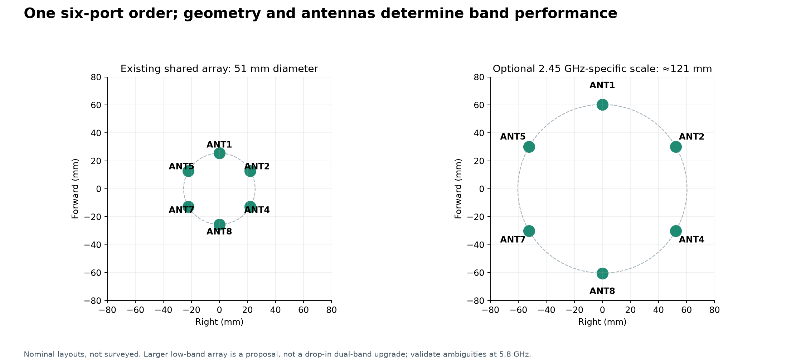
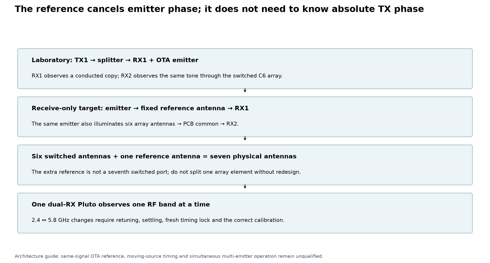
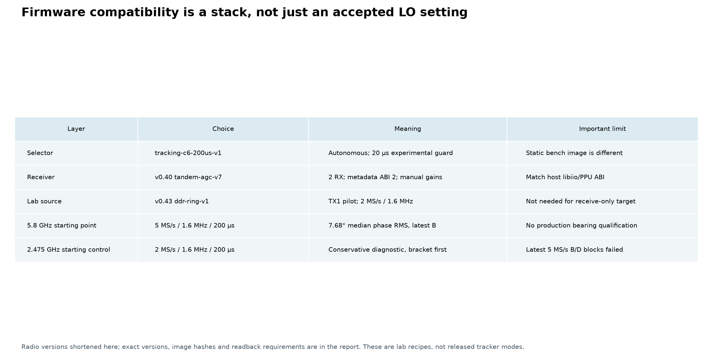
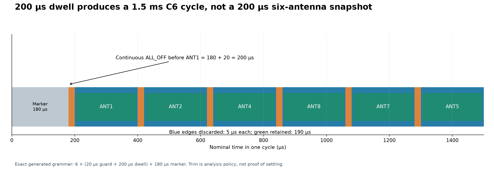
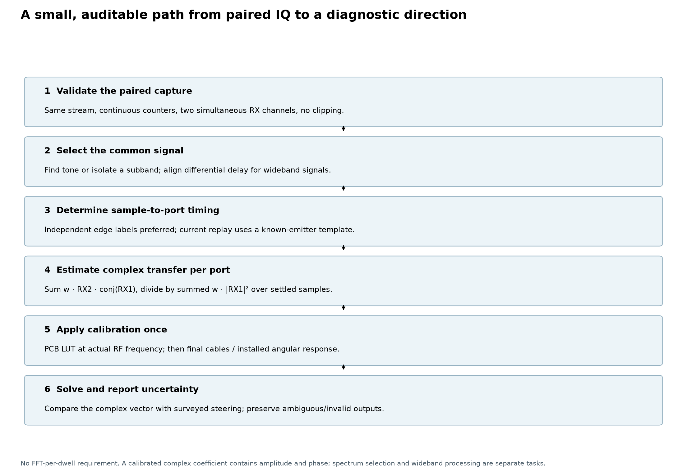
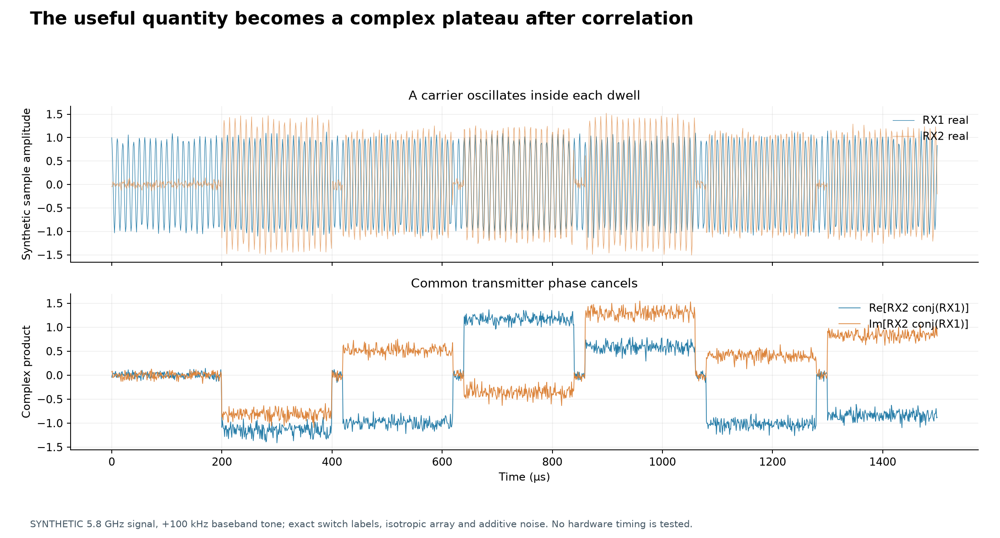
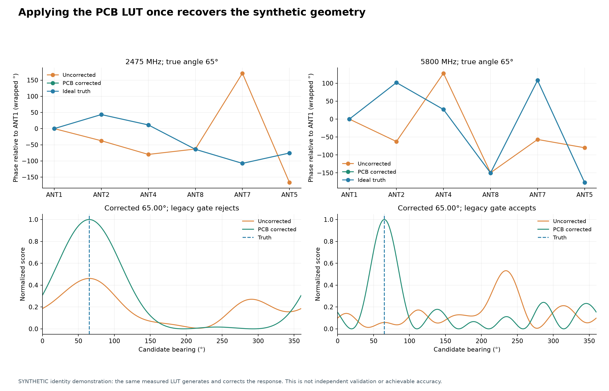
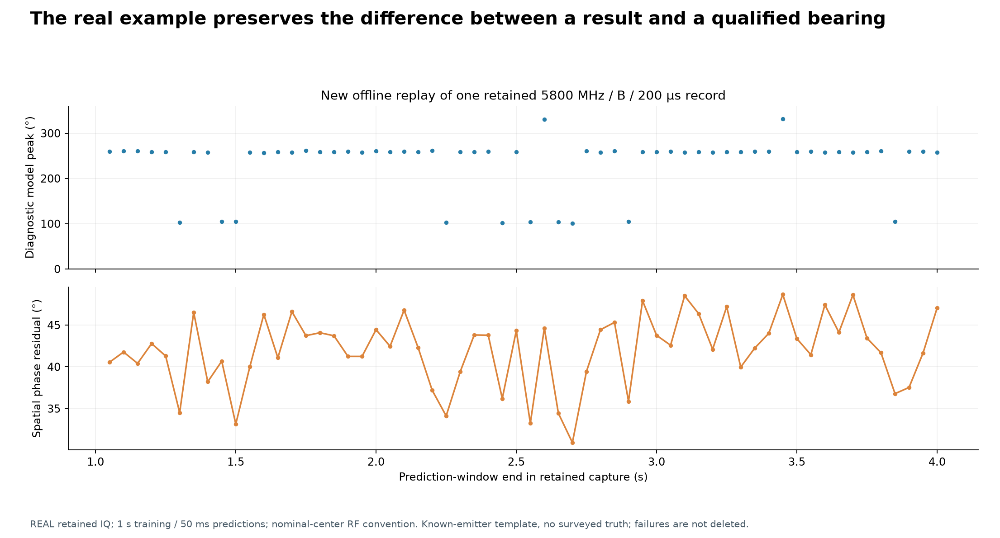
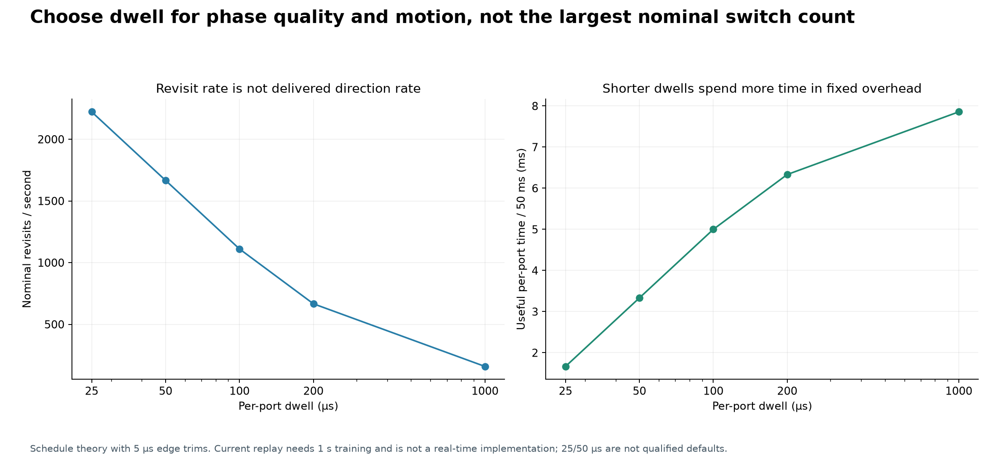
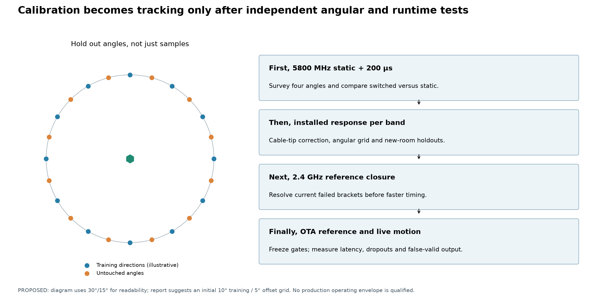

# Practical six-antenna tracking at 2.4 and 5.8 GHz

**September 12, 2026 · Firmware, settings, signal processing and runnable examples**

This guide explains how to use our eight-way PCB as a **six-element circular array
(C6)** with a dual-RX Pluto. It includes ten new PNG figures, a hardware-free synthetic
IQ example, and a newly executed offline replay of one retained hardware capture.

The intended first implementation is a **narrowband, single-emitter azimuth tracker**.
It is not yet a general Wi-Fi/Bluetooth decoder, a simultaneous two-band receiver,
a multiple-emitter locator, or a production-qualified tracker. The current PCB LUT
is useful; final antennas, cables, timing, angular accuracy and live delivery still
need qualification. The [comprehensive evidence report](../calibration_error_budget_and_production_readiness/README.md)
explains that boundary in detail.

No radios were controlled or flashed while preparing this guide. The C6 binary was
verified offline, the examples were executed, and historical capture files were
read without modification. Firmware programming and new RF acquisition below are
**operator procedures, not actions performed by this report**.

## Quick decision

| Question | Recommended starting point |
|---|---|
| Which six PCB inputs? | ANT1, ANT2, ANT4, ANT8, ANT7, ANT5, in clockwise order |
| Which selector firmware? | Experimental `tracking-c6-200us-v1`; build target `tracking-c6` with `TRACKING_C6_DWELL_US=200` |
| Which receiver firmware for the existing capture code? | `v0.40-plutoplus-spf-tandem-agc-v7`, dual RX with metadata ABI 2 and matching host runtime |
| Which 5.8 GHz lab settings? | 5 MS/s, 1.6 MHz RX bandwidth, 200 µs dwell; manual gains selected by headroom/reference checks |
| Which 2.4 GHz starting settings? | 2 MS/s, 1.6 MHz RX bandwidth, 200 µs dwell as a conservative diagnostic; re-establish static/reference closure first |
| Is 2.4 GHz at 5 MS/s ready? | No clean condition in the latest 2475 MHz B/D blocks; do not assume the 5.8 GHz settings transfer |
| Can we increase rate or bandwidth? | Yes; 5 MS/s / 4 MHz passed phase/gain checks at 5800 MHz, but wider/faster settings need their own checks; see Section 5 |
| What output budget? | Start with 50 ms observation windows, not a bearing from every dwell; current replay needs one second of training |
| Production reference? | A fixed RX1 antenna observing the same emitter as the six switched RX2 antennas; not yet qualified |
| Can one Pluto observe both bands simultaneously? | Not with this shared-LO dual-RX arrangement; retune between band-specific measurements |

## 1. Array geometry, port order and antenna selection



**Figure 1.** The left layout is the nominal existing array, not a new surveyed
measurement. The right layout is only a design illustration: scaling 51 mm by
5800/2450 gives approximately 121 mm diameter and comparable electrical aperture
at 2.45 GHz. It is not a validated dual-band replacement; that larger array needs
independent ambiguity analysis at 5.8 GHz.

| Slot, zero-based | PCB input | GPIO code PA3…PA0 | Nominal x (mm) | Nominal y (mm) |
|---:|---|---|---:|---:|
| 0 | ANT1 | `0000` | 0 | +25.5 |
| 1 | ANT2 | `0100` | +22.08365 | +12.75 |
| 2 | ANT4 | `0110` | +22.08365 | −12.75 |
| 3 | ANT8 | `0111` | 0 | −25.5 |
| 4 | ANT7 | `0011` | −22.08365 | −12.75 |
| 5 | ANT5 | `0001` | −22.08365 | +12.75 |
| — | ALL_OFF | `1000` | — | — |

Coordinates are +x right, +y forward, viewed from above. ANT1 is forward; bearing
increases clockwise. Firmware slot index, PCB connector number and physical angular
position are different identifiers. Preserve the above mapping in every capture and
calibration. Machine-readable coordinates are in [port-map.csv](data/port-map.csv).

Use six antennas with suitable performance at the intended band, consistent
polarization, surveyed phase-center positions, and fixed labeled feed cables. A
dual-band antenna does not automatically have the same phase center or pattern in
both bands. Keep ANT3/ANT6 out of the first C6 implementation: their measured PCB
paths have extra loss and worse isolation. An antenna may be dual-band while the
installed-array calibration still must be band-dependent.

The 51 mm aperture is approximately 0.421 wavelength at 2475 MHz and 0.987 wavelength
at 5800 MHz. Lower-band directional sensitivity is therefore weaker for this physical
array; that is not a proof that low-band tracking is impossible. Do not interpret
beamwidth alone as estimation accuracy. Actual accuracy depends on signal strength,
geometry, model mismatch, calibration and ambiguities. [Array-factor background](https://www.analog.com/en/resources/analog-dialogue/articles/phased-array-antenna-patterns-part1.html)

Keep the source in the array plane for the initial azimuth experiment. Out-of-plane
sources require an elevation-aware model; a planar array can have elevation
ambiguities, and unmodeled elevation can bias an azimuth-only fit.

## 2. Wiring and the phase reference



### Laboratory configuration already exercised

```text
Independent source TX1 → two-way splitter → attenuator → receiver RX1
                                        → OTA emitter → six array antennas
                                                        ↓
                                             PCB ANT1/2/4/8/7/5
                                                        ↓
                                              PCB common → RX2
```

The receivers are sampled simultaneously on one dual-RX Pluto. RX1 sees a conducted
copy of the same source that illuminates the array. This lets the cross-product
remove the source's unknown phase evolution. The source radio can have an independent
clock; TX-to-RX clock identity is not required when both RX channels observe the
same narrowband waveform and the receiver channels remain coherent.

### Receive-only target architecture

```text
Unknown emitter → fixed reference antenna ─────────────────────→ RX1
                → six circular-array antennas → PCB selector ─→ RX2
```

This uses **six switched array antennas plus one fixed reference antenna**: seven
physical antennas in total. The reference antenna is not an additional selected PCB
input. It can be placed near the array, but its phase response, coupling and cable
must be considered. Do not split one array element to create the reference without
re-evaluating loading, loss, coupling and the calibration plane.

If strictly limited to six physical antennas, alternatives are five switched plus
one fixed reference, or a substantially different reference-free estimator. Neither
is the current C6 implementation. This distinction must be resolved before packaging.

For a single far-field narrowband source, the reference antenna contributes a
snapshot-common factor; a complex matched-manifold solver can fit that factor.
If RX1 sees a deep fade, an unrelated transmitter, or a differently delayed wideband
signal, simple cancellation can fail. Common receiver timing is necessary but not
sufficient. TX2's coherent laboratory pilot is not proof of reference independence
for a genuinely unrelated emitter.

## 3. Firmware: three separate layers



### 3.1 STM32 selector firmware

Use the generated **`tracking-c6-200us-v1`** image for the first bounded autonomous
tracking experiment. This is frequency-independent digital selection: **the same
selector image works for the 2.4 and 5.8 GHz experiments**. Frequency-specific changes
belong in receiver settings, calibration and the array model, not in a different
GPIO truth table.

Source and build authorities:

- [C6 profile](../../profiles/tracking-c6-200us-v1/control_profile.json) and
  [generated header](../../profiles/tracking-c6-200us-v1/control_profile.h).
- [Profile generator](../../scripts/generate_tracking_c6_profiles.py).
- [Autonomous application](../../firmware/stm32c011/apps/hexcal/main.c), reused by
  the C6 build with the selected generated header.
- [Schedule core](../../firmware/stm32c011/core/high_rate_autonomous_core.c).
- [Makefile](../../Makefile) and [offline image verifier](../../scripts/verify_tracking_c6_firmware.py).

| Selector property | Current 200 µs image |
|---|---|
| MCU | STM32C011F4P6; 16 KiB flash, 6 KiB RAM |
| Timer | TIM3, nominal 1 MHz / 1 µs ticks; HSI-derived clock, not sample-clock synchronized |
| Port sequence | ANT1, ANT2, ANT4, ANT8, ANT7, ANT5 |
| Dwell | 200 µs, compiled into this image |
| ALL_OFF guard before every port | 20 µs |
| Marker body | 180 µs; contiguous with the next 20 µs guard |
| Continuous marker before ANT1 | 200 µs |
| Nominal full cycle | 1,500 µs; approximately 667 revisits/s |
| Excessive lateness policy | Apply ALL_OFF and restart the marker |
| Contract maximum lateness | 5 µs; not a measurement of phase settling |
| Startup | Preload ALL_OFF, validate clock/timer, initialize watchdog, then autonomous loop |
| Control model | Repeated autonomous schedule; not the bench mailbox/lease interface |
| Release status | Experimental 20 µs guard waiver; **not conformant to the released 5 ms guard** |

The profile window allowance is ±5%; it does not imply a precise oscillator
relationship to the Pluto ADC. Recover or independently measure selector timing;
do not label an arbitrarily started IQ file by simply repeating nominal sample counts.

**Verified local 200 µs image:** 1,156 bytes, binary SHA-256:

```text
505ddd97abee775f65dd5766a3c124787a26d379122a22740df9a468b6a1ddbb
```

The fresh offline check passed schedule-byte, symbol, memory and static checks.
Its exact scope and source hashes are in [firmware-200us-verification.json](data/firmware-200us-verification.json).
This verification is not a new physical timing test, a safety release, or confirmation
that this image is currently flashed. The prior campaign recorded restoration of
the original static bench firmware.

Other generated profiles exist at 25, 50, 100 and 1000 µs. Changing the dwell requires
building/flashing the corresponding image, not setting a run-time host sleep. Use
1000 µs as a diagnostic control, 200 µs as the initial scan, and 100 µs only as a
separately qualified candidate. Do not start with 25/50 µs merely because they build.

### 3.2 Receiver Pluto firmware and host runtime

The existing native-rate capture path is tested against:

```text
Receiver serial: 104000b29905000e17000800065934759d
Last recorded URI: ip:192.168.1.15
Firmware: v0.40-plutoplus-spf-tandem-agc-v7
Capture metadata ABI: 2
```

The capture script explicitly calls `verify_metadata_runtime(2, ...)` with that
firmware version. Match receiver image, FPGA/kernel metadata ABI, host libiio/PPU
runtime and parser. Do not install a different image just because its version number
is larger or its name contains "ring". The [capture code](../../scripts/capture_rate_timing.py)
and [frame validation](../../src/smateway/rate_timing.py) are the local authorities.

Use effective AD9361-compatible dual-RX / 2R2T operation. Environment values such as
`mode=2r2t` and `compatible=ad9361` are useful checks, but the `attr_name`/`attr_val`
override differs between firmware variants. Do not blindly set or clear those
variables across all devices. Verify the effective post-reboot device, both RX
channels, requested/read-back LO, rate, bandwidth, manual gain, and metadata ABI.

At 5.8 GHz use appropriately specified or explicitly qualified RF silicon and
front-end hardware. An AD9361 compatibility label alone does not certify physical
AD9363 silicon outside its specification. AD9361's published RX tuning range includes
70 MHz–6 GHz. [Manufacturer specifications](https://www.analog.com/en/products/ad9361.html)

### 3.3 Optional laboratory source Pluto

The retained tests used:

```text
Source serial: 104473b80a16000de6ff2000f8a6beca79
Last recorded URI: ip:192.168.1.179
Firmware: v0.43-plutoplus-spf-ddr-ring-v1
Source settings: 2 MS/s, 1.6 MHz bandwidth
TX1 hardware gain: −35 dB; DDS scale: 0.25
Pilot: nominal +100 kHz; recorded DDS readback approximately +100007 Hz
```

Those TX settings are recorded digital/attenuation settings, **not measured radiated
power** or a general permission to transmit. The source image is not required in
receive-only deployment. Source ring capability does not mean the receiver used a
RAM ring. The latest campaign's RAM staging was on the host, not a receiver-firmware
change.

## 4. Build, verify, program and restore

Run these **offline** commands from the repository root. They do not control radios:

```bash
PYTHONPATH=src .venv/bin/python scripts/generate_tracking_c6_profiles.py --check

make tracking-c6 TRACKING_C6_DWELL_US=200 PYTHON=.venv/bin/python
```

Expected local outputs are under:

```text
build/STM32C011F4P6/tracking-c6-200us/
    pluto_tracking_c6.elf
    pluto_tracking_c6.bin
    pluto_tracking_c6.build.json
```

The build artifacts are local generated files, not a promised downloadable firmware
release. Toolchain changes can change the hash; re-verify and record the new exact
image rather than substituting it silently. To verify an already built image without
rebuilding it:

```bash
.venv/bin/python scripts/verify_tracking_c6_firmware.py \
  build/STM32C011F4P6/tracking-c6-200us/pluto_tracking_c6.elf \
  --profile profiles/tracking-c6-200us-v1/control_profile.json \
  --binary build/STM32C011F4P6/tracking-c6-200us/pluto_tracking_c6.bin \
  --output build/c6-200us-guide-verification.json
```

### Operator-only hardware procedure

First confirm exact radio serials, selector UID, SWD adapter, power arrangement,
attenuation, antenna connections and a recoverable original bench image. Power the
PCB through exactly one intended power input, not a host GPIO supply. Keep TX muted
while flashing. Do not change option bytes or protection settings.

PPU's installed command is `pluto`, not `pluto-plus`. Use its module entry point
below to avoid depending on a console script's old virtual-environment path after
the storage relocation. The syntax was checked locally with `--help`; no inventory
scan was performed for this guide:

```bash
.venv/bin/python -m pluto_plus.cli radio inventory --network --format table
```

Inventory is discovery, not permission to adopt or reconfigure every found radio.
Addresses above are historical; match serials before any operation. The current
flash/restore helpers have these laboratory targets and OpenOCD installation paths
pinned internally. If addresses or hardware changed, review the helper's exact
target checks before use; do not merely retry against another device.

The existing [flash helper](../../scripts/flash_tracking_c6_firmware.py) accepts a
passed build manifest and `--acknowledge-selector-flash`. It mutes the pinned radios,
backs up the full 16 KiB flash, checks identity, programs the image and reads it back.
Its resulting `flash.json` must accompany fast captures. The
[restore helper](../../scripts/restore_tracking_selector_backup.py) accepts that
flash evidence, restores its verified original bench backup, checks the full image,
and requests lease-free ALL_OFF. Use a backup from the same identified board; do not
restore a backup of an intermediate autonomous image as if it were the original bench.

The autonomous firmware does **not** stop scanning because a host capture process
ends. Its ALL_OFF markers are temporary schedule phases, not a terminal safe-hold
state. Finish by muting RF and restoring/verifying the intended bench/ALL_OFF state.
The guard waiver remains experimental even after a successful flash readback.

For a future approved acquisition, prefer the bounded
[block runner](../../scripts/run_comprehensive_block.py), which acquires bracketing
static references, runs interleaved controls and restores the original image in its
cleanup path. It requires a fresh fixture/protocol authorization; historical
attestations and the checked-in protocol with null RF authorization are not fresh
permission. This guide intentionally does not provide a ready-to-run unattended
flash-and-transmit command.

## 5. Receiver settings and what they mean

| Setting | 2.4 GHz initial diagnostic | 5.8 GHz initial diagnostic |
|---|---|---|
| Initial center | 2475 MHz to compare with retained data; other centers need checks | 5800 MHz |
| Sample rate / RF bandwidth | 2 MS/s / 1.6 MHz, profile A | 5 MS/s / 1.6 MHz, profile B |
| Selector dwell | 200 µs | 200 µs |
| Gain control | Manual, fixed during a block; bracket references | Manual, fixed during a block; bracket references |
| Historical gain context | Latest low-band blocks used 40 dB; not a universal value | Latest high-band blocks used 50 dB after headroom screening |
| Integration / prediction | 50 ms observation windows | 50 ms observation windows |
| Edge exclusion | Initial 5 µs per side; independently verify adequate settling | Same |
| First clean baseline needed | Static complex closure and repeatable references | Static angular closure despite recent phase/gain success |
| Firmware/rate claim | Earlier 2 MS/s results support experimentation; current environment still unqualified | Latest B/200 µs median phase RMS 7.68°, controls/brackets passed |

The latest 2475 MHz 5 MS/s B and D conditions did not pass their required controls
and brackets. At 5800 MHz, D = 5 MS/s / 4 MHz passed at 100 µs with median phase RMS
9.90°, close to the 10° criterion; it is not the preferred first angular experiment.
These metrics are phase error, not bearing accuracy. [Measured condition details](../full_5ms_campaign/data/condition-details.csv)

Read back both RX gains, LO, sample rate, analog bandwidth and filter configuration.
Do not run AGC independently per antenna during calibration: gain changes can alter
phase and make the per-port response time-dependent. If AGC is later required,
qualify it and record gain state explicitly. Screen actual ADC headroom and per-port
reference quality; copied gain values are not evidence of appropriate SNR.

Keep both RX channels tuned together at a fixed LO while switching antenna ports.
**Do not retune the LO on every dwell.** To change bands, stop the current estimation
segment, retune both channels, allow and verify settling, select the band-specific
calibration, and reacquire timing/reference state. A single shared-LO Pluto cannot
collect 2.4 and 5.8 GHz at the same instant. Simultaneous bands require another receiver
chain and an appropriate RF routing design, not another selector timing setting.

Use actual signal frequency for physical steering and calibration: for a +100 kHz
tone, `f_signal = f_RX_LO + 100 kHz`. The synthetic examples make that distinction
explicit. The retained campaign historically used nominal LO-center frequency for
its diagnostic manifold; the replay default preserves that convention and exposes
`--rf-offset-hz` for a separately labeled refinement. Do not silently change it when
comparing historical output.

### 5.1 Are these settings fundamental limits?

**No. The A/B settings above are conservative starting recipes, not physical limits
of the six-antenna PCB.** We already have useful 5 MS/s / 4 MHz phase measurements
at 5800 MHz. Capturing more bandwidth, obtaining stable phase and accurately locating
an emitter are three different claims; the last remains unqualified.

Sample rate determines how often the host receives a complex IQ sample. Receiver
bandwidth sets the nominal width of the RF region admitted around the tuned center;
the actual passband and transition depend on the analog and digital filters. Neither
number is the 2.4 or 5.8 GHz carrier frequency: the receiver downconverts the signal
before delivering these baseband samples.

| Sample rate | Sample spacing | Samples in a 200 µs dwell, before trimming | Dual-RX complex-float32 storage |
|---|---:|---:|---:|
| 2 MS/s | 0.5 µs | 400 | 32 MB/s |
| 5 MS/s | 0.2 µs | 1,000 | 80 MB/s |
| 10 MS/s | 0.1 µs | 2,000 | 160 MB/s |

At fixed 1.6 MHz bandwidth and fixed observation duration, the extra samples largely
describe the same filtered waveform. **2.5× more samples does not automatically mean
2.5× more independent information or better angular accuracy.** Sampling the IQ more
densely can help edge localization, but does not make the physical switch settle
faster or increase the time spent observing the source.

These comparisons are not pure software oversampling: the recorded ADC/filter
clocks also changed between A and B. Their FIR readbacks described 128 taps and
decimation by four, not a measured impulse response or proof of identical effective
filters. [Recorded clock/filter settings](../higher_sample_rate_timing_campaign/FINDINGS.md)

Storage numbers above use two channels × eight bytes per complex-float32 value,
not a measured network wire format. Four seconds at 5 MS/s stores 320 MB of IQ.
Preserve continuous sample counters rather than inferring RF time from file-write
or network arrival times.

### 5.2 How sensitive were the actual 5800 MHz measurements?

The latest campaign includes same-round, same-dwell A controls interleaved with each
B/D block. At **5800 MHz and 200 µs dwell**, the comparisons are:

| Main profile | Main sample rate / RX bandwidth | A-control median phase RMS | Main median phase RMS | Matched pairs passing phase/gain/bracket checks |
|---|---|---:|---:|---:|
| B | 5 MS/s / 1.6 MHz | 8.27° | 7.68° | 3/3 |
| D | 5 MS/s / 4 MHz | 8.24° | 8.21° | 3/3 |

A is 2 MS/s / 1.6 MHz in both rows. Each number is the median of three trial-level
phase RMS values, not a pooled RMS. B and D have separate control sets and were
acquired in separate blocks; they are not one simultaneous three-way experiment.
The rolling recipe uses one second of preceding training and 50 ms prediction
windows. [Exact matched pairs and raw-record identities](../full_5ms_campaign/data/paired-controls.csv)

These results show **no large phase-quality penalty for 2 → 5 MS/s or 1.6 → 4 MHz
in those 5800 MHz conditions**. Three pairs do not establish a decisive accuracy
advantage or statistical equivalence. B holds RX bandwidth fixed relative to A;
D changes bandwidth as well as sample rate relative to its A controls.

D also passed the complete phase/gain condition at **100 µs dwell with 9.90° median
phase RMS**, narrowly below the 10° criterion. That supports a separately checked
shorter-dwell candidate, not an automatic 100 µs operating guarantee. No corresponding
condition passed all bearing gates. At 2475 MHz, both B and D failed the latest
required controls/brackets, so we cannot transfer the 5800 MHz conclusion to the
2.4 GHz band. These failures do not establish a fundamental 2 MS/s low-band ceiling.
[Full condition results](../full_5ms_campaign/data/condition-details.csv)

### 5.3 What can wider or faster settings make worse?

**Noise and interference.** For flat noise density and proportionally wider effective
noise bandwidth, 1.6 → 4 MHz admits 2.5× the noise power, approximately
`10 log10(4 / 1.6) = 4 dB`, at unchanged gain. This is an illustrative integrated-noise
calculation, not a measured 4 dB penalty in our phase estimator. The actual effective
bandwidth depends on filter shape. A narrowband pilot gains little useful signal
from the extra spectrum. Matched digital filtering around the emitter can reject
out-of-band noise/interference, but cannot undo front-end overload or clipping.

**Transient memory and timing.** Wider filters can shorten their transient memory,
but internal clocks, filter coefficients and decimation also matter. ADI documents
both the programmable receive-filter chain and its contribution to delay.
[AD9361 reference manual, pp. 33–34](https://www.analog.com/media/en/technical-documentation/user-guides/AD9361_Reference_Manual_UG-570.pdf)
Recheck the relationship between switch edges and IQ sample indices, and verify the
settled part of each dwell after changing a configuration. Express exclusions in
time and convert them at the new rate: 5 µs is 10 samples at 2 MS/s but 25 at 5 MS/s.
Simply keeping the old discarded sample count changes the physical exclusion.
Digital channelization adds its own filter memory and must be included in this check.

**Transport and compute.** The earlier 10 MS/s / 1.6 MHz test accepted the rate but
developed a **250,000-sample gap after 1.75 seconds of accepted RF data**. That is a
failure of the tested continuous acquisition path, not evidence of a PCB speed limit
or identification of network throughput as the sole cause. The 10 MS/s / 8 MHz RF
case was gated out; a radio RAM-ring mode was not qualified by that campaign.
[Acquisition evidence](../higher_sample_rate_timing_campaign/FINDINGS.md)
Even the later 5 MS/s campaign retained metadata failures and used bounded whole-record
recapture. Host RAM staging and offline recovery do not qualify uninterrupted live
tracking. Buffers can absorb finite stalls; they cannot sustain an indefinitely
higher production rate than the downstream consumer can handle.

### 5.4 Does changing sample rate invalidate the PCB LUT?

Not inherently: the PCB's physical paths do not change because the host sample rate
changes. At the same signal RF frequency, keep the existing PCB LUT as the starting
correction. However, the **complete receiver-plus-array response must be checked
for each configuration**, including RX1/RX2 differential response, gains, filter
transients and timing labels. A shared, settled complex factor can be absorbed by
the bearing solver; port-dependent errors and samples contaminated by switching
cannot generally be removed that way.

Start with static and switched reference checks at the proposed settings; a sample-
rate change alone does not justify repeating the entire dense PCB campaign. For a
wider occupied signal, evaluate calibration and steering at the relevant RF subbands
instead of assuming one center-frequency correction describes the whole signal.

**Operating recommendation:** retain **5 MS/s / 1.6 MHz / 200 µs** as the 5800 MHz
narrowband baseline. Use **5 MS/s / 4 MHz** when the intended signal requires that
bandwidth, with fresh references, headroom and settling checks. Re-establish low-band
reference closure before promoting a 2475 MHz mode. Before trying a still faster or
wider setting, prove continuous acquisition, then static/switched phase closure,
then surveyed-angle accuracy. More samples or bandwidth alone will not fix the
current installed-array spatial-model mismatch.

## 6. Timing and post-processing



The nominal C6 cycle is `6 × dwell + 300 µs`. For 200 µs dwell this is 1.5 ms.
Six 20 µs guards plus a 180 µs marker account for the fixed overhead. The first guard
touches the marker, so the observable ALL_OFF interval before ANT1 is 200 µs—not
180 µs. Confusing these definitions shifts all port labels.

A 5 µs leading/trailing trim leaves 190 µs per visit, but that trim is an analysis
choice, not proven hardware settling. Nominal timing suffices only in the synthetic
example, where we generated the sample labels ourselves. Real data require measured
timing, clock drift tracking and rejection on lost lock.



### Step 1: validate acquisition

Check channel ordering, numeric format, stream identity, buffer sequence, first/last
sample counters, missing samples, clipping, settings and calibration identities.
Never concatenate discontinuous frames or separate retry attempts as if contiguous.
The replay example verifies the run/raw hashes, both raw-file sizes, frame continuity,
fixture binding and the recorded selector profile before processing.

### Step 2: isolate the same signal on RX1 and RX2

For a narrowband tone, estimate its location from RX1 or a long-window spectrum and
apply the same signal selection to both channels. Our synthetic example contains
one tone plus noise, so there is no competing signal to isolate. The real replay
reuses the frozen laboratory correlator; it is not a general interference separator.

For modulated signals, channelize a suitable subband and align significant relative
delay before correlation. Receiver/filter memory across port changes must be included
in edge trimming or a validated transient model. Do not independently unwrap noisy
per-sample phase and average it arithmetically.

### Step 3: label settled samples by port

The current laboratory recipe fits only the preceding one second, aligns a separately
measured known-emitter complex template, then predicts complete cycles in the next
50 ms window. Every failed window remains at its original time position. It does not
yet supply an emitter-independent timing detector. A future sample-aligned hardware
marker or otherwise validated source-independent timing path is preferable.

An unsynchronized logic-analyzer trace is not enough to label IQ sample indices.
Measure its relationship to the ADC sample timeline. Do not connect a digital output
directly to an RF input without an appropriate, reviewed electrical interface.

### Step 4: estimate one complex transfer for each port

For settled samples belonging to port i:

\[
\hat h_i = \frac{\sum_n w[n]x_{2,i}[n]x_1[n]^*}
{\sum_n w[n]|x_1[n]|^2+\epsilon}.
\]

If `x2 = h × x1` without noise and with negligible regularization, the numerator is
`h × sum(w × |x1|²)`, so division returns `h`. Its magnitude describes relative gain
and its angle relative phase. A snapshot-common transmitter phase cancels in the
cross-product; the transmitter's absolute phase need not be known.

```python
import numpy as np

# x1 and x2 must already be simultaneous, common-signal, settled samples.
w = np.ones(len(x1))
reference_energy = np.sum(w * np.abs(x1)**2)
if reference_energy <= 0:
    raise ValueError("No reference signal")
h = np.sum(w * x2 * np.conj(x1)) / reference_energy
```

This compact example is implemented with finite-input checks in
[`transfer()`](../../scripts/c6_tracking_example.py). Do not make a missing reference
look valid by adding a large epsilon. Reference noise can bias the ratio; this
least-squares form assumes the reference is sufficiently good and is not a complete
errors-in-variables model.



**Figure 6 is synthetic.** The +100 kHz carrier oscillates within each dwell; the
common-phase-cancelled product is approximately a complex plateau. Summing those
plateaus is why a separate FFT in every dwell is unnecessary.

At 200 µs, a naive full-dwell FFT has approximately 5 kHz bin spacing at either sample
rate: `Δf = Fs/N = 1/T`. Increasing Fs increases N but does not increase the observed
duration. Use FFTs where useful for detection/channelization; use correlation or a
complex matched filter for the selected narrowband transfer. Very short packets that
do not illuminate enough ports cannot become a full-array snapshot merely by running
an FFT. Coherent packet accumulation needs waveform/phase handling and independent
validation; CW results do not certify arbitrary Wi-Fi or Bluetooth tracking.

### Step 5: apply the calibration exactly once

```python
from pathlib import Path
from smateway.tracking.calibration import BoardCalibrationLut

ports = ("ANT1", "ANT2", "ANT4", "ANT8", "ANT7", "ANT5")
lut = BoardCalibrationLut.load(
    Path("docs/pcb_direct_injection_calibration/data/calibration-lut.json")
)
evaluation = lut.evaluate(f_signal_hz, ports)
h_board_corrected = h_ports * evaluation.coefficients
```

The table contains the **inverse correction**, so multiply by its coefficients;
do not divide by them again. Its common reference gauge is harmless to a solver that
fits a common complex scale. Apply final-cable and installed-array response only in
a consistently defined calibration plane. An empirical manifold that already includes
the board must not receive a second board correction.

At exact measured knots the loader reports `exact_knot=True`; between knots it uses
log magnitude/unwrapped phase PCHIP and rejects extrapolation. Independent
interstitial validation exists over 5–6 GHz, not all of 0.5–6 GHz. The loader's
`interpolation_validated` field also returns true for an exact knot: that denotes
frequency support, **not** thermal, reconnect or OTA production qualification.

For a wideband signal use the transfer at each relevant RF subband/bin and its
frequency-specific manifold. One scalar evaluated at the center may be inadequate
across substantial occupied bandwidth. Do not interpolate wrapped phase directly
across ±180° or extrapolate a path-delay fit outside measured support.

### Step 6: compare with the array's complex spatial response

For ideal plane-wave geometry and clockwise bearing θ:

\[
a_i(f,\theta)=\exp\left(j\frac{2\pi f}{c}
[x_i\sin\theta+y_i\cos\theta]\right).
\]

Compute the normalized weighted complex match between the corrected six-port vector
and each candidate steering vector. Our existing
[`solve_bearing()`](../../src/smateway/tracking/bearing.py) fits an unknown common complex
scale and returns the full angular score, model residual and legacy quality gates.
Use surveyed positions or an independently measured installed manifold; an ideal
circle is a diagnostic starting point, not an antenna calibration.

```python
from smateway.tracking.schedule import ArrayGeometry
from smateway.tracking.manifold import far_field_steering
from smateway.tracking.bearing import solve_bearing

geometry = ArrayGeometry.circular("nominal-C6", ports, radius_mm=25.5)
angles = np.arange(0.0, 360.0, 0.25)
steering = far_field_steering(geometry, f_signal_hz, angles)
result = solve_bearing(h_board_corrected, steering, angles)
print(result.bearing_deg, result.valid, result.reasons)
```

The legacy ambiguity gate can reject an exact low-band direction because a point
20° away still belongs to the same broad main lobe. Do not equate `valid=False` with
hardware impossibility, and do not lower its threshold to claim deployment success.
Conversely `valid=True` is only an algorithm gate, not surveyed accuracy. The example
outputs therefore always retain `production_valid=False`.

## 7. Runnable example A: synthetic IQ at both bands

Use the checked-in [example script](../../scripts/c6_tracking_example.py). From the
repository root, these commands generate new JSON outputs without accessing hardware:

```bash
PYTHONPATH=src:scripts OPENBLAS_NUM_THREADS=1 OMP_NUM_THREADS=1 \
  .venv/bin/python scripts/c6_tracking_example.py demo \
  --frequency-hz 2475000000 --sample-rate-hz 5000000 --bearing-deg 65 \
  --output build/c6-demo-2475.json

PYTHONPATH=src:scripts OPENBLAS_NUM_THREADS=1 OMP_NUM_THREADS=1 \
  .venv/bin/python scripts/c6_tracking_example.py demo \
  --frequency-hz 5800000000 --sample-rate-hz 5000000 --bearing-deg 65 \
  --output build/c6-demo-5800.json
```

The script refuses to overwrite an existing output; choose a new filename for a
new run. `--sample-rate-hz 2000000` is also supported. Raw synthetic IQ remains in
memory; the JSON retains vectors, likelihoods, settings and a first-cycle excerpt.

The demo generates 80 exact 200 µs-profile cycles (120 ms), a fixed source at 65°,
common transmitter phase evolution, additive noise on both channels, and a board
response constructed from the inverse of our measured LUT. It uses exact generated
sample-to-port labels, not the real timing decoder. **Using the same LUT as the
synthetic forward model and correction is an identity demonstration, not independent
validation of the PCB.**



Recorded example results with seed 12:

| Synthetic signal | Uncorrected model peak | Corrected model peak | Corrected spatial phase residual | Legacy gate |
|---|---:|---:|---:|---|
| 2475 MHz | 65.25° | 65.00° | 0.013° | Reject: broad-main-lobe limitation |
| 5800 MHz | 234.00° | 65.00° | 0.018° | Accept, but still not production validity |

These tiny errors reflect the controlled simulation, not promised antenna accuracy.
Read the frozen [2475 MHz output](data/demo-2475.json) and
[5800 MHz output](data/demo-5800.json). Inspect `raw_transfer`, `calibrated_transfer`,
`expected_corrected_transfer`, `likelihood`, `legacy_gate_reasons` and the explicit
timing/calibration caveats. The same API supports 2450 MHz and other LUT-supported
frequencies, but software support is not a measured RF operating claim.

## 8. Runnable example B: replay one real retained capture

This command reads an existing four-second, 5 MS/s, 5800 MHz/B, 200 µs TX1 capture
from the completed campaign. It never enables RF and does not overwrite the original
analysis. Raw data must be present under the retained bulk-storage paths:

```bash
PYTHONPATH=src:scripts OPENBLAS_NUM_THREADS=1 OMP_NUM_THREADS=1 \
  .venv/bin/python scripts/c6_tracking_example.py replay \
  --block /srv/bulk/samteway/lab-data/tracking-5ms-full-20260911-resume-v2/block-20260911T212846818552Z.json \
  --configuration B --dwell-us 200 --round 1 \
  --output build/c6-real-5800-B-200us.json
```

The replay selects exactly one non-control capture, binds its manifest and raw-file
hashes, checks sample continuity and clipping, validates the recorded flash/profile,
loads the separately measured before-reference template and frozen A-derived weights,
and preserves before/after bracket results. The copied historical raw data are not
needed in Git. On another machine, retain the dataset layout or use a separately
audited relocation procedure; do not edit hashed manifests casually to repair paths.

It uses the frozen one-second/past-only timing recipe and 50 ms prediction windows.
The historical routine averages per-visit transfer estimates for each output; the
small synthetic example pools sample sums. These are distinct aggregation choices
when reference energy differs between visits. The real example intentionally retains
the existing recipe rather than silently replacing its estimator.



The new replay produced **60/60 analyzed windows**, with **0/60 legacy-gate-valid
bearings**. Its median spatial phase residual was **42.38°**. The diagnostic angular
peaks varied substantially; they are not ground-truth positions. This is exactly
the distinction the tutorial needs to preserve: a complete complex-measurement
pipeline can run while the installed-array spatial model remains inadequate.

Frozen output: [replay-5800-B-200us.json](data/replay-5800-B-200us.json). It contains
every window, failed-window errors if any, useful per-port integration, replay cost,
complex vectors, algorithm gate reasons, calibration status and source identities.
This is one example, not a replacement for the campaign's three trials, controls,
phase/gain closure or full qualification. No surveyed truth is invented.

The replay is deliberately limited to **TX1 same-emitter fast records**. It rejects
other modes and is not an implementation of independent-TX2 tracking. For 2.4 GHz,
use the same command structure with a retained block of that frequency and its exact
configuration; failed brackets remain visible. Do not substitute a 5.8 GHz reference
template into a 2.4 GHz replay.

By default the analysis uses nominal center frequency to preserve historical
comparability. `--rf-offset-hz 100007` gives a separately labeled source-frequency
refinement for this recorded DDS tone. That option changes steering and LUT frequency,
not the IQ stream or template, and is not a timing or calibration rescue.

## 9. How fast should the tracker run?



At 200 µs dwell, the array revisits each antenna approximately 667 times/s, but the
50 ms estimator integrates about 6.33 ms of useful samples per port. A 25 µs dwell
raises nominal revisits while leaving only about 1.67 ms useful per port in 50 ms.
Higher sample rate does not reverse that duty-cycle loss.

For initial tracking, choose a 50 ms output observation budget and measure actual
end-to-end latency. The existing rolling implementation repeatedly fits the preceding
second and is an offline replay, not a fast live scheduler. A one-second startup,
network/storage buffering and compute cost cannot be omitted from latency claims.
The [earlier profiling report](../completed_switching_analysis/README.md) identified
repeated timing search/folding as a major cost.

A future live implementation should maintain timing state, update cross/power sums
incrementally, and relock explicitly. Faster switching is useful only while the
ports remain correctly labeled, useful signal is sufficient, phase is settled, and
motion within the integration window is acceptably small. There is no measured
production maximum angular velocity yet. A narrowband continuous tone result does
not establish performance on a short, hopping or intermittent emitter.

## 10. Calibration and validation before deployment



1. **Freeze the hardware:** label ports/cables, fix cable routing, survey antenna
   coordinates, reference location and polarization, record firmware/readbacks.
2. **Establish 5800 MHz angular closure:** measure a source at known 0°, 90°, 180°
   and 270° bearings with static selection, then compare 200 µs switching in exactly
   the same scene. Start at a measured longer range where practical.
3. **Separate timing from array response:** if static fails, fix installed geometry/
   calibration first. If static works but switching fails, measure sample-aligned
   edges and test forward/reverse/permuted port orders.
4. **Calibrate the final feeds:** direct injection at the final cable tips, plus
   reconnect, warm-up and reboot subsets. Keep the PCB LUT's calibration plane clear.
5. **Measure an installed angular response per band:** an initial 10° training grid
   and untouched 5°-offset grid, refined based on holdout error. Include new room
   positions/ranges; do not learn one room and claim a portable antenna calibration.
6. **Resolve the current 2.4 GHz reference failures:** repeat independent before/after
   static checks at 2475 MHz, then qualify the desired neighboring centers. Change
   one setting at a time; keep an interleaved baseline.
7. **Validate the real reference and signal:** replace the conducted reference with
   an OTA reference of the same independent emitter; progress from a tone to the
   intended waveform and motion, with explicit weak-signal and unlock rejection.
8. **Qualify a narrow operating envelope:** held-out angular accuracy, valid-output
   coverage, false-valid rate, p95/p99 latency, continuity, calibration lifetime and
   environmental limits. Only then broaden frequency/rate/dwell support.

Do not calibrate arbitrary per-port offsets to force one source into its expected
angle. That can absorb multipath and fail at the next angle. Do not change the
bearing gate after viewing holdouts and report those same holdouts as independent.
The goal is a calibrated installed array and honest uncertainty, not merely a
repeatable displayed number.

## 11. Reproduce the figures and tests

The stored example JSON files are sufficient to render the guide without any radios
or bulk raw files. Only a new real replay requires the retained IQ:

```bash
PYTHONPATH=src:scripts OPENBLAS_NUM_THREADS=1 OMP_NUM_THREADS=1 \
  .venv/bin/python scripts/render_c6_tracking_guide.py

PYTHONPATH=src:scripts OPENBLAS_NUM_THREADS=1 OMP_NUM_THREADS=1 \
  .venv/bin/python -m pytest tests/test_c6_tracking_guide.py
```

The [renderer](../../scripts/render_c6_tracking_guide.py) makes all ten PNGs from
the stated schematic/model parameters and frozen example outputs. The
[manifest](data/manifest.json) binds its source files, report, figures and data.
The fresh firmware verification records the exact checked ELF/binary/source hashes;
the replay records raw/run hashes and executed analysis source hashes. Its template
references are hash-bound through the recorded source block.

| Figure | Kind | What it explains |
|---|---|---|
| [01 Geometry](png/fig01_array_geometry.png) | Nominal geometry / proposed alternative | Port mapping and band-dependent electrical aperture |
| [02 Reference architecture](png/fig02_reference_architecture.png) | Wiring / design | Laboratory versus seven-antenna receive-only target |
| [03 Selector timeline](png/fig03_selector_timeline.png) | Generated profile | Marker, guards, dwells and usable samples |
| [04 Firmware/settings](png/fig04_firmware_and_settings.png) | Verified files / measured context | Three firmware layers and starting settings |
| [05 Processing](png/fig05_processing_pipeline.png) | Algorithm guide | IQ integrity through diagnostic bearing |
| [06 IQ/correlation](png/fig06_iq_to_complex_transfer.png) | Synthetic IQ | Why cross-correlation removes common phase |
| [07 Calibration/bearing](png/fig07_synthetic_calibration_and_bearing.png) | Synthetic identity example | Apply LUT once and retain the low-band gate caveat |
| [08 Real replay](png/fig08_real_record_replay.png) | Newly replayed retained IQ | Complete processing does not imply accurate direction |
| [09 Dwell tradeoff](png/fig09_dwell_tradeoff.png) | Schedule arithmetic | Revisit rate versus useful integration |
| [10 Validation plan](png/fig10_validation_plan.png) | Proposed experiments | Angular holdouts, timing isolation and release sequence |

**Bottom line:** use the same experimental C6 selector image at both bands, keep the
receiver and host ABI matched, estimate coherent per-port complex ratios, apply
frequency-specific calibration once, and validate the installed spatial response.
5800 MHz is the best first ground-truth experiment; 2.4 GHz needs renewed reference
closure before we can make comparable operating claims.
