# From a calibrated PCB to a trustworthy direction finder

## Consolidated evidence, error sources, operating limits and next experiments

**Evidence cutoff: September 11, 2026 · Offline synthesis · 16 new PNG figures**

The PCB has a useful, independently tested complex calibration. The installed antenna
array does not yet have a demonstrated, portable relationship between measured phase
and true emitter direction. **No frequency is currently qualified for production
direction finding.** This is a qualification boundary, not a conclusion that the
hardware cannot work.

Our next experiment should establish correct angles at one frequency, with fixed
cables and surveyed geometry. Another broad unsurveyed frequency sweep or a more
elaborate PCB ripple fit is unlikely to resolve the largest remaining uncertainty.

This report is a new synthesis; it does not overwrite historical conclusions or
retroactively change failed trials. All 16 figures are rendered from existing
normalized evidence, explicit geometry calculations, or labeled proposed plans.
There is **no new RF acquisition, firmware change, or full raw-IQ replay** in this
report. Source and output SHA-256 hashes are in [the manifest](data/manifest.json).

### The five most important findings

1. **Controlled PCB correction works substantially better than the OTA spatial fit.**
   Independent 5–6 GHz PCB holdouts give 1.12° spatial phase RMS, whereas the latest
   dense TX1 OTA sweep has a 52.78° median spatial phase residual.
2. **Stable phase is not accurate direction.** The latest TX1 dense sweep passes its
   phase criterion at 149/149 frequencies, yet its spatial model is admitted at 0/149.
3. **The bearing gate itself has a low-band limitation.** A noise-free, exactly modeled
   51 mm C6 array is rejected at 915 and 2475 MHz because a broad main-lobe shoulder
   is treated as a competing direction.
4. **Short dwell is an end-to-end measurement problem, not an established PCB switch
   speed limit.** Timing recovery, transients, useful integration, reference quality,
   and processing all matter. Increasing sample rate alone did not remove these limits.
5. **A practical path exists:** retain the PCB LUT, keep C6, establish static angular
   closure, independently verify timing, calibrate the final installed array, then
   validate an OTA reference and optimize a live estimator.

## Contents

- [1. Evidence map and comparison rules](#1-evidence-map-and-comparison-rules)
- [2. Measurement architecture and calibration planes](#2-measurement-architecture-and-calibration-planes)
- [3. What the PCB measurements establish](#3-what-the-pcb-measurements-establish)
- [4. What the frequency-model experiments establish](#4-what-the-frequency-model-experiments-establish)
- [5. The largest OTA discrepancy](#5-the-largest-ota-discrepancy)
- [6. Latest dwell and sample-rate qualification](#6-latest-dwell-and-sample-rate-qualification)
- [7. Bearing-gate and geometry diagnostics](#7-bearing-gate-and-geometry-diagnostics)
- [8. Timing, processing and data integrity](#8-timing-processing-and-data-integrity)
- [9. Ranked error sources and calibration strategy](#9-ranked-error-sources-and-calibration-strategy)
- [10. Frequency readiness](#10-frequency-readiness)
- [11. Experiments that isolate the causes](#11-experiments-that-isolate-the-causes)
- [12. Minimal production architecture and release gates](#12-minimal-production-architecture-and-release-gates)
- [13. Reproduction, provenance and figure index](#13-reproduction-provenance-and-figure-index)

## 1. Evidence map and comparison rules

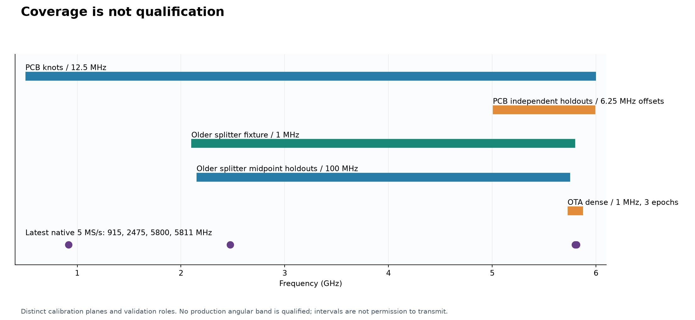

**Figure 1.** Frequency coverage is not an operating envelope. A PCB knot, an
interstitial holdout, a repeat of an unchanged splitter fixture, and an OTA bearing
test establish different things. The narrow high-band OTA strip includes 149
frequencies per source per epoch, not 149 independent deployments.

| Evidence family | Coverage / denominator | Main contribution | Limit |
|---|---|---|---|
| Corrected external-source 5.8 GHz fixture | 381 captures; 5.725–5.875 GHz | Resolves the original calibration collapse; power and short-term stability checks | Splitters and cables are inside the measurement |
| Original three and later five broadband sweeps | 38 frequencies at 100 MHz spacing | Unchanged-fixture repeatability and future closure | Repeats are not independent room, cable, or temperature trials |
| Five complementary midpoint sweeps | 37 unseen frequencies at 100 MHz spacing | Tests predictions between the original knots | Still a splitter-fixture response |
| Conducted 1 MHz sweep | 3,701 frequencies; 33,309 captures | Resolves fine frequency structure; interpolation experiments | One ascending sweep; not a new set of temporal holdouts |
| Direct PCB injection | 4,528 observations: 3,528 knots, 640 holdouts, 360 qualifiers | Best board-plane complex calibration and isolation evidence | Installed antennas, final cables and long-term stability unqualified |
| Original / jittered / latest dense OTA | Each epoch: 149 frequencies × TX1/TX2 | Spatial-model and phase sensitivity across frequency and epochs | No surveyed angular truth; settings and scene changes are confounded |
| Latest native 5 MS/s center tests | 8 blocks; 150 switched records including controls; 34 main conditions | Conservative phase/gain qualification and explicit failure accounting | Not live unknown-emitter tracking |

Historical supporting analyses also matter. Early schedule/permutation work exposed
the importance of correct state labels. Centered-array measurements characterized
one spatial response but did not produce an angular manifold. The higher-rate and
source-muted experiments constrain explanations for short-dwell failure. The older
centered HexRay configuration used a different port map and must not be pooled with
the current C6 array. See the [evidence catalog](#evidence-catalog).

### Rules used throughout this report

- Keep each fixture, reference method, calibration plane, geometry, receiver setting,
  and acquisition epoch identifiable. Do not average different campaigns into a single
  apparent repeatability score.
- Retain failed controls, brackets, decoder outputs, interrupted captures and retries.
  A low RMS from the subset that produced an answer is not a full-condition pass.
- Do not equate common-phase-removed PCB error, raw per-port holdout error, rolling
  phase repeatability, spatial-model residual and angular error against truth.
- Do not convert a median of per-record RMS values into a pooled RMS. Figure 5 also
  explicitly separates pooled midpoint error from the dense sweep's mean of path RMS.
- Phase RMS in degrees is **not** bearing RMS in degrees. Array aperture, direction,
  weighting, reference quality and model mismatch affect their relationship.
- Frequency-neighbor observations are correlated. Admission percentages below are
  descriptive counts, not binomial confidence bounds on deployment reliability.
- We do not infer a percentage contribution to a total error budget: the required
  independent, controlled measurements do not exist yet.

## 2. Measurement architecture and calibration planes

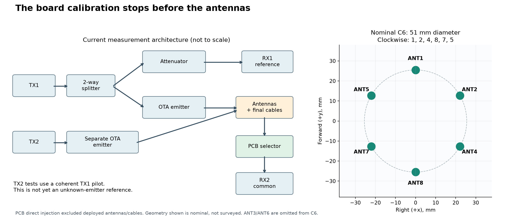

**Figure 2.** Current OTA timing tests use a conducted TX1 reference on RX1 and the
switched array on RX2. TX2 tests use a coherent pilot from the same source radio.
This makes the experiment measurable but is not yet the reference architecture for
an arbitrary independent emitter. The drawing is functional, not a surveyed layout.

Current nominal clockwise C6 order is **ANT1 → ANT2 → ANT4 → ANT8 → ANT7 → ANT5**.
ANT1 is forward; positive bearing is clockwise viewed from above; +x is right and
+y is forward. Rolling analyses use a nominal 51 mm diameter. Historical dense
before/after comparisons retain 49.9654 mm for comparability; a separate 51 mm result
is retained in the latest source CSV. Neither dimension is a surveyed antenna
phase-center measurement.

| Calibration plane | Included | Not established by that measurement |
|---|---|---|
| Old all-port splitter injection | Source split, branch cables, PCB response and loading | Intrinsic PCB versus splitter attribution |
| Direct PCB-input injection | PCB launches, selected path, common output and receive fixture | Final antenna cables, antenna patterns, installed coupling, room |
| Final cable-tip injection, proposed | PCB plus deployed feed cables in their fixed routing | Antenna phase centers and angular response |
| Surveyed installed-array angular calibration, proposed | Stable installed antenna/cable/mounting response | Portability across changing room multipath without holdouts |

During direct injection the non-driven inputs remained attached to the terminated
splitter arrangement. That is a controlled board-plane candidate, not a perfect
multiport de-embedding of arbitrary antenna impedances. Finite switch isolation and
loading remain relevant when antennas replace that fixture.

## 3. What the PCB measurements establish

### 3.1 The original 5.8 GHz collapse is not the current problem

The corrected external-source campaign identified approximately −21 dB same-radio
TX contamination even with RX2 terminated, plus an incorrectly connected/terminated
downstream path. Independent TX and corrected wiring restored distinguishable,
repeatable selected paths: 381/381 admitted captures. These findings supersede an
interpretation of the early collapse as a general inability to calibrate at 5.8 GHz.
They do not prove every subsequent fixture is free of leakage. [Source report](../5g8_external_fixture_campaign/README.md)

### 3.2 Keep the complex LUT

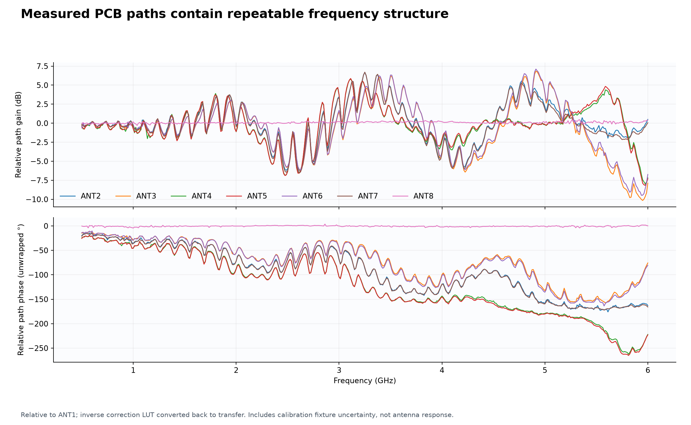

**Figure 3.** The inverse correction LUT is converted back into relative transfer
gain and phase, referenced to ANT1. The structure is not explained by a single line
in phase versus frequency. Physical port-pair symmetry is visible, but a compact
ripple model does not uniquely identify the component producing it.

The recommended representation remains log magnitude and continuous unwrapped phase,
with PCHIP interpolation between the measured 12.5 MHz knots. Reject requests outside
0.5–6.0 GHz. Within that interval, distinguish measured knots from independently
validated interpolation regions; do not call every frequency production-qualified.

| Direct-injection result | Value | Scope |
|---|---:|---|
| Raw holdout phase RMS | 1.31° | 640 independent interstitial observations, 5–6 GHz |
| Spatial holdout phase RMS | 1.12° | Common phase removed; not fitted per-port corrections |
| Spatial absolute phase p95 / maximum | 2.49° / 5.09° | Same holdout cells |
| Magnitude holdout RMS | 0.141 dB | Log-magnitude PCHIP |
| Short-term selected-state phase SD | 0.059–0.137° | Five-repeat 5.8 GHz qualifiers |
| Short-term selected-state magnitude SD | 0.005–0.014 dB | Same qualifiers |
| Delay-only residual, ANT2–ANT7 | Approximately 16–21° RMS | Full 0.5–6 GHz measured response |
| Worst observed ADC component | 1,282 / 2,048 | Direct-injection campaign; no clipping |

The short-term noise floor is much smaller than interpolation and later fixture
uncertainty. More repeats at one unchanged knot are therefore less valuable than
interstitial, reconnect, temperature and installed-array holdouts. The source campaign
independently replayed its raw artifacts; this synthesis reuses those normalized
results rather than claiming another raw replay. [PCB report](../pcb_direct_injection_calibration/README.md)

### 3.3 Loss and leakage constrain port choice

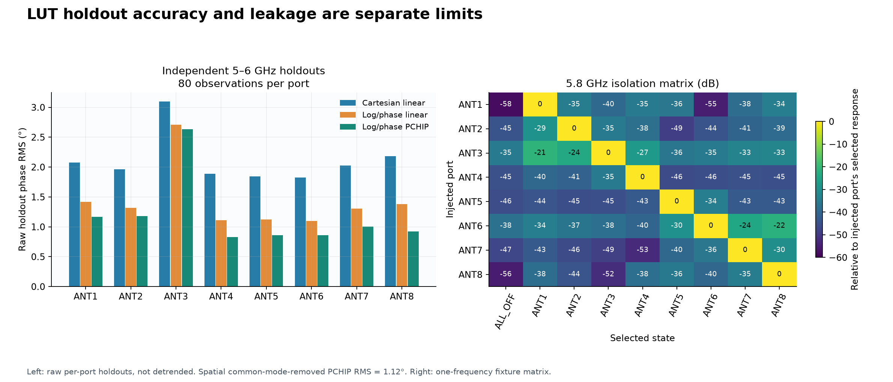

**Figure 4.** Left: raw per-port holdout RMS, without removing a newly fitted affine
trend. Right: measured 5.8 GHz leakage relative to each injected port's selected
response. The matrix here has **injected ports as rows and selected states as columns**;
the active complex forward matrix in the source JSON uses the opposite orientation.

ANT3 and ANT6 have approximately 7–9 dB more loss than the other paths at 5.8 GHz.
Their worst selected-to-wrong-state margins are approximately 21 dB, versus roughly
29.5–35.4 dB for the other paths. ANT3 also has the largest raw PCHIP holdout RMS
(2.63°) and raw absolute p95 (4.49°). Removing an affine trend after observing the
holdout is diagnostic, not an independently validated runtime correction.

The normalized active complex matrix is well-conditioned in this fixture
(condition number 1.180). Start with diagonal complex correction. If held-out
installed-array tests show leakage matters, measure it across frequency and loading,
and incorporate a forward mixing model. Do not blindly invert a one-frequency matrix
and assume noise or loading errors disappear.

For the first deployment candidate use the existing C6 ports. C8 requires new geometry,
weak-path and angular validation; two more physical antennas are not automatically
two equally useful measurements.

## 4. What the frequency-model experiments establish

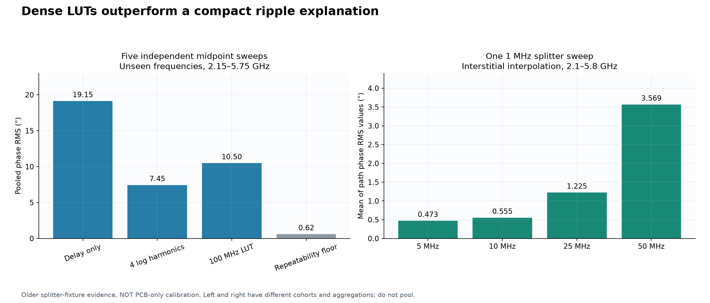

**Figure 5.** Both panels use the older splitter fixture, not direct PCB injection.
Left: prediction of independent midpoint sweeps, with a repeatability floor for context.
Right: omitted-frequency interpolation within one dense sweep. The cohorts and
aggregation statistics differ and are deliberately not joined into one ranking.

| Experiment | Model / comparison | Phase result | Interpretation |
|---|---|---:|---|
| Original three → later five, same knots | Original frequency table predicts later mean | Approximately 0.94° RMS | Strong unchanged-fixture repeatability |
| Five unseen midpoint sweeps | Four log-ripple harmonics | Approximately 7.45° RMS | Compact model misses repeatable structure |
| Same midpoint holdouts | 100 MHz log-linear table | 10.50° RMS | Original grid too coarse for accurate interpolation |
| Same midpoint cohort | Leave-one-sweep-out repeatability | 0.62° RMS | Modeling error exceeds local repeatability |
| Single dense splitter sweep | 10 MHz log-domain interpolation | 0.555° mean path RMS | Dense table predicts omitted frequencies within that sweep |
| Same dense sweep | 5 MHz log-domain interpolation | 0.473° mean path RMS | Some improvement, not new temporal independence |
| Direct PCB campaign | 12.5 MHz PCHIP, independent 5–6 GHz holdouts | 1.12° spatial RMS | Most relevant current PCB-only candidate |

A sum of delayed paths is physically plausible, but finite-band phase/gain fitting
does not uniquely distinguish PCB reflections, splitter imbalance, cables and leakage.
Use such fits to describe scale and guide measurement density—not to infer a unique
physical path length or justify extrapolation outside measured support.

For a narrowband estimator at an intermediate RF frequency, interpolate the complex
calibration through log magnitude and unwrapped phase. For a wideband waveform,
one center-frequency coefficient may be inadequate: correct or model frequency bins
across the occupied bandwidth, with separately validated support. Denser knots should
be added where interstitial holdouts fail, rather than uniformly scanning everything
again. [Future sweeps](../broadband_future_sweep_comparison/README.md),
[midpoints](../broadband_midpoint_campaign/README.md), [dense sweep](../dense_1mhz_campaign/README.md)

## 5. The largest OTA discrepancy

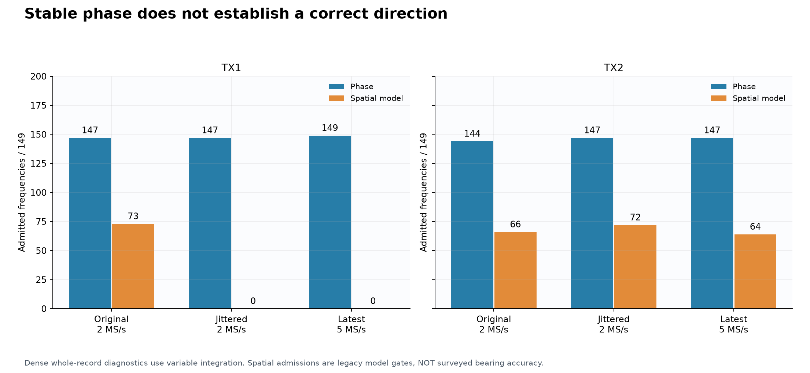

**Figure 6.** All three epochs use the same 149 high-band frequency centers and retain
all rows in the denominator. Phase admission is a whole-record, variable-integration
criterion. Spatial admission applies the legacy model gate. Neither is surveyed
angular accuracy, and neither is a causal 50 ms live-output result.

| Epoch | TX1 phase / spatial admissions | TX2 phase / spatial admissions | TX1 spatial phase residual, median | TX2 residual, median |
|---|---:|---:|---:|---:|
| Original 2 MS/s | 147 / 73 of 149 | 144 / 66 of 149 | 40.54° | 34.73° |
| Jittered 2 MS/s | 147 / 0 of 149 | 147 / 72 of 149 | 53.56° | 28.27° |
| Latest 5 MS/s | 149 / 0 of 149 | 147 / 64 of 149 | 52.78° | 28.83° |

These summaries are recomputed in [dense-epoch-summary.csv](data/dense-epoch-summary.csv).
The approximately 53° latest TX1 residual is not statistically subtractable from
the 1.12° PCB holdout RMS: different experiments, normalizations and errors are
involved. The order-of-magnitude contrast nevertheless points away from PCB
interpolation as the first unresolved problem.

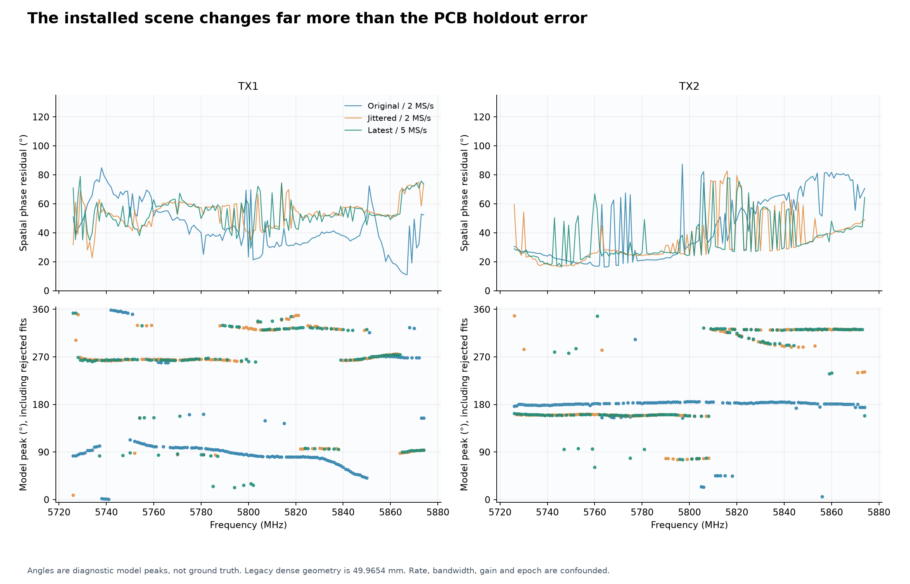

**Figure 7.** Rejected and admitted model peaks are both shown. A peak at a particular
angle is not a measured emitter position. Frequency-dependent and epoch-dependent
changes remain large. Nominal source directions were approximate, and the jitter was
not a controlled rigid-body translation.

The static comparison also changed substantially: at 5800 MHz its equal-weight
51 mm model peak changed from 86.25° before the movement to 262° afterward. The latter
was rejected. That comparison does not depend on short-dwell timing, so fast switching
cannot explain every observed discrepancy. It still cannot isolate propagation,
antenna orientation, cable motion, reference drift or geometry error.

Do not select a set of successful TX2 frequencies after seeing these measurements
and call that set production-ready. That would be selection on the evaluation data,
without surveyed truth or new independent validation.

### Weak-port information must stay visible

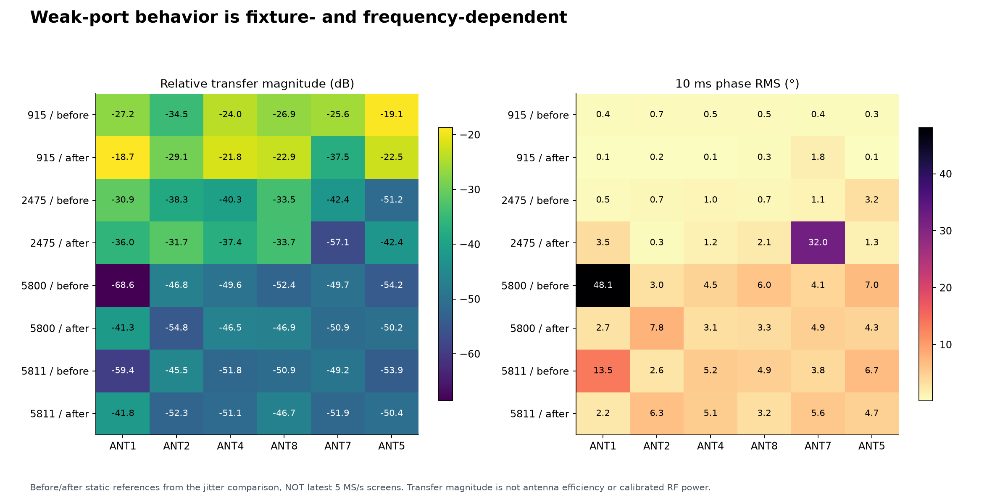

**Figure 8.** These are the jitter campaign's before/after static references, not the
latest 5 MS/s screen. Transfer magnitude is relative to RX1; it is not calibrated
received power, antenna efficiency or noise figure. Static phase RMS is over 10 ms
windows and must not be compared directly with 50 ms rolling phase RMS.

In an earlier higher-rate fixture, ANT1 was approximately 19.2 dB below ANT2 and had
much poorer static phase precision. In later epochs the distribution changed.
Power-weighted aggregate RMS can improve because a weak port receives little weight,
not because all baselines became good. Report every port's strength, uncertainty,
closure and weight, plus the resulting angular observability. Digital gain correction
cannot restore signal-to-noise ratio lost before digitization.

Normalized broadband cross-correlation magnitude is also not a direct SNR meter:
noise, unrelated signals, time-varying relative phase and bandwidth all affect it.
Low correlation alone does not prove external interference. [Jitter report](../jittered_fixture_comparison/README.md),
[higher-rate findings](../higher_sample_rate_timing_campaign/FINDINGS.md)

## 6. Latest dwell and sample-rate qualification

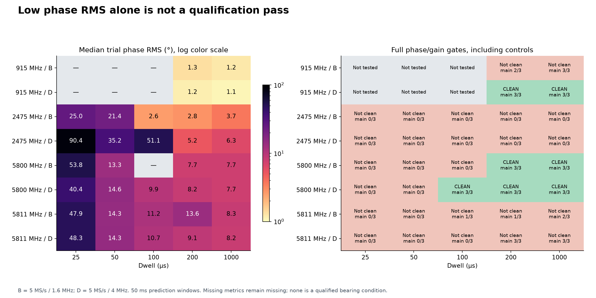

**Figure 9.** Left: median of reported main-trial rolling phase RMS values. A dash is
missing, never zero. Right: full phase/gain qualification requires all three main
trials, all interleaved controls, complete outputs and passing reference brackets.
The small main-trial count does not override failed controls. All joint bearing
conditions remain unqualified.

| Center / profile | Fastest clean tested dwell | Controls | Reference bracket | Median phase RMS at that dwell |
|---|---:|---:|---|---:|
| 915 MHz / B | None | 5/6 | Pass | — |
| 915 MHz / D | 200 µs | 6/6 | Pass | 1.16° |
| 2475 MHz / B | None | 0/6 | Fail | — |
| 2475 MHz / D | None | 0/6 | Fail | — |
| 5800 MHz / B | 200 µs | 6/6 | Pass | 7.68° |
| 5800 MHz / D | 100 µs | 6/6 | Pass | 9.90° |
| 5811 MHz / B | None | 2/6 | Fail | — |
| 5811 MHz / D | None | 5/6 | Pass | — |

B is 5 MS/s with 1.6 MHz RX bandwidth; D is 5 MS/s with 4 MHz RX bandwidth.
The separate A references and interleaved controls are native 2 MS/s, not resampled
5 MS/s main trials. The source remained at 2 MS/s / 1.6 MHz. Across 34 main
conditions, seven pass the full phase/gain gates and zero pass joint phase/bearing
qualification. Individual conditions are retained in [the table](data/latest-conditions.csv).

An earlier 2475 MHz 2 MS/s campaign passed at 100 µs; later measurements did not
reproduce that qualification. Its existence supports feasibility, not a persistent
operating guarantee. Similarly, three successful 5811 MHz/D main trials do not
overrule the failed control in the latest block.

The 5800 MHz/D 100 µs result is near the 10° phase criterion. It is a tested candidate,
not comfortable engineering margin. Use the slower 200 µs condition to establish
angular closure first. The small B/D RMS difference is not a statistically established
sample-rate or bandwidth advantage from three trials.

The final high-band blocks used RX gain 50 dB after conservative headroom screening,
whereas prior dense measurements used different settings. Comparisons across epochs
cannot isolate sample rate. [Full 5 MS/s report](../full_5ms_campaign/README.md)

## 7. Bearing-gate and geometry diagnostics

### 7.1 A broad main-lobe shoulder is not a distinct ambiguity

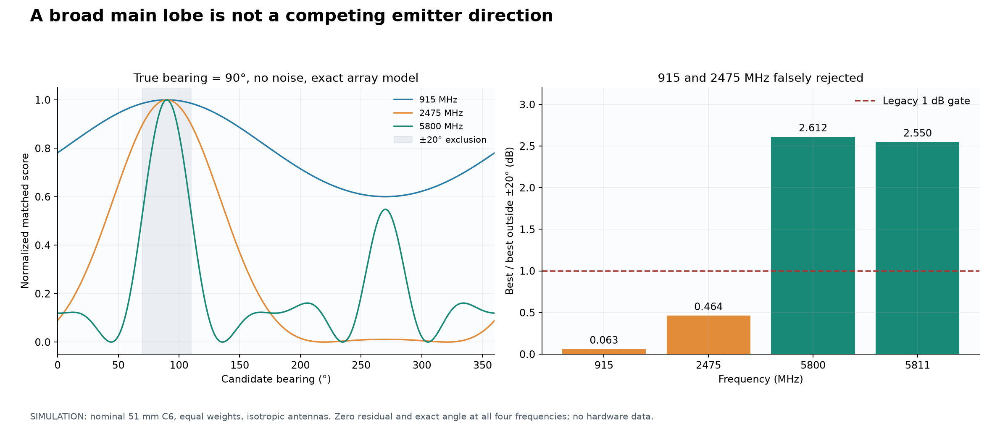

**Figure 10 is a simulation, not RF data.** The current solver is supplied with its
own exact ideal steering vector for a source at 90°. With equal weights, the estimated
bearing is exactly correct and the residual is zero at all four tested frequencies.
Yet its 1 dB margin gate rejects 915 and 2475 MHz.

The implementation takes the largest score outside a fixed ±20° exclusion. At low
frequencies that can be a shoulder of the same broad main lobe. It does not require
a distinct local maximum. The simulation gives margins of approximately 0.063 dB at
915 MHz, 0.464 dB at 2475 MHz and 2.612 dB at 5800 MHz. [Recomputed values](data/ideal-bearing-gate.csv),
[solver](../../src/smateway/tracking/bearing.py)

Replace this with a policy that distinguishes local angular uncertainty from genuine
competing lobes. Validate it on ideal/noisy synthetic cases and untouched surveyed
angles. Do not lower a threshold on historical data and retrospectively label the
array production-qualified. A corrected gate may admit low-band directions but does
not fix a wrong installed manifold.

### 7.2 Aperture and finite range matter, but are not complete explanations

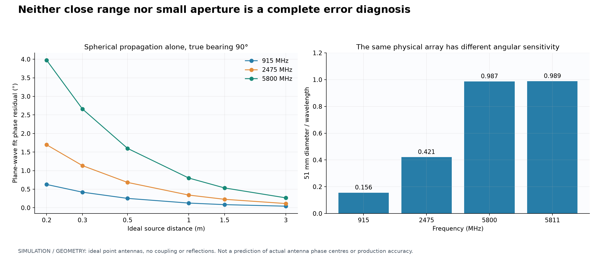

**Figure 11 is geometry and simulation.** The nominal 51 mm diameter is 0.156
wavelength at 915 MHz, 0.421 at 2475 MHz and 0.987 at 5800 MHz. Lower bands therefore
provide less phase variation with direction for this physical aperture. This is
reduced sensitivity, not proof that direction finding is impossible.

For ideal point antennas and a source at 90°, fitting a plane wave to a spherical
source 0.30 m away produces approximately 2.66° phase residual at 5.8 GHz, versus
0.42° at 915 MHz. That specific ideal calculation does not explain the observed
approximately 53° TX1 median by itself. Real phase centers, antenna patterns,
coupling and reflections are not in the simulation. Source positions were not
surveyed, so these numbers are not a correction for the collected data.

For the next experiment use a measured, longer range where practical and compare
spherical and plane-wave models explicitly. Do not infer range from the current
uncontrolled phase residual. A larger or band-specific lower-frequency array is a
reasonable development option, but requires its own geometry, ambiguity and antenna
validation rather than an unconditional spacing rule.

## 8. Timing, processing and data integrity

### 8.1 Dwell, revisit, integration, cadence and latency are different quantities

For six ports with a 20 µs guard per port and a 180 µs marker:

\[
T_{\rm cycle}=6D+6(20\,\mu s)+180\,\mu s=6D+300\,\mu s.
\]

With 5 µs removed from each visit edge, useful time per port per cycle is
\(D-10\,\mu s\). These are nominal schedule calculations, not measured settling times.

| Dwell | C6 cycle | Nominal revisits/s | Useful per-port duty | Useful per-port time in 50 ms |
|---:|---:|---:|---:|---:|
| 25 µs | 450 µs | 2,222 | 3.33% | 1.67 ms |
| 50 µs | 600 µs | 1,667 | 6.67% | 3.33 ms |
| 100 µs | 900 µs | 1,111 | 10.00% | 5.00 ms |
| 200 µs | 1,500 µs | 667 | 12.67% | 6.33 ms |
| 1,000 µs | 6,300 µs | 159 | 15.71% | 7.86 ms |

Reducing dwell from 200 to 25 µs gives approximately 3.8 times less useful integration
per port in a fixed observation window. Under ideal stationary noise assumptions,
that alone could increase phase standard deviation by roughly √3.8 ≈ 1.95. It does
not explain all observed large biases or decoder failures.

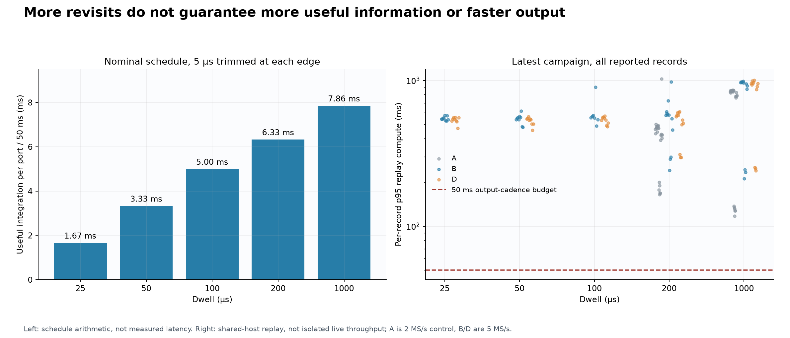

**Figure 12.** Left is schedule theory; right is measured per-record p95 replay cost,
including controls, wherever that metric exists. Failed/missing records are not
assigned zero time. Shared-host contention prevents an isolated rate-scaling claim,
but costs above 50 ms exceed a serial 50 ms output-cadence budget.

At 5 MS/s a 25 µs dwell already contains 125 raw samples. More samples do not ensure
125 independent observations: receiver filtering correlates samples. More sample
rate also does not increase dwell duration or remove spatial-model error.

The PE42482 datasheet describes sub-microsecond switching behavior, but its electrical
test definition is not the settled phase of a complete switched antenna, AD936x
receiver and digital estimator. We have not measured a fundamental 100–200 µs PCB
switching limit. [Manufacturer datasheet](https://www.psemi.com/pdf/datasheets/pe42482ds.pdf)

### 8.2 Timing recovery and receiver response need independent tests

The frozen recipe aligns a separately measured known-emitter six-port template.
Passing this test does not prove source-independent port identity for a moving,
unknown emitter. Some failures are inconsistent switching-harmonic estimates,
requiring three estimates to agree within the decoder's tolerance.

Source-muted 5811 MHz tests retained schedule-dependent low-frequency RX2 features.
Their presence motivates investigating control pickup, receiver DC/tracking response
and ambient signals modulated by selection. It does not identify which mechanism
is dominant. The plotted low-frequency region was not the approximately +100 kHz
pilot band, and noncontemporaneous spectra cannot simply be complex-subtracted.

Exploratory harmonic-decoder and per-visit constant-offset fits did not rescue the
short-dwell results. This rules out those methods as sufficient corrections in those
tests, not every possible transient model. [Completed analysis](../completed_switching_analysis/README.md),
[frozen timing recipe](../comprehensive_fast_switching/REFERENCE-TIMING-VALIDATION-v1.md)

### 8.3 Processing is a separate deployment blocker

Previous 100 µs replays averaged approximately 403 ms at 2 MS/s and 551 ms at 5 MS/s
per 50 ms output window. Profiling located much of the work in repeatedly retraining
and folding the previous second, including FFT decoding and clustering. Extracting
predicted visit sums was much cheaper. These were shared-host offline measurements,
not live I/O benchmarks.

A minimal runtime should maintain timing state and incremental complex accumulators,
reserve a full search for startup/relock, and emit an explicit invalid result when
the lock or signal is insufficient. This is a proposed design, not a measured speedup.

### 8.4 Completed acquisition is not uninterrupted delivery

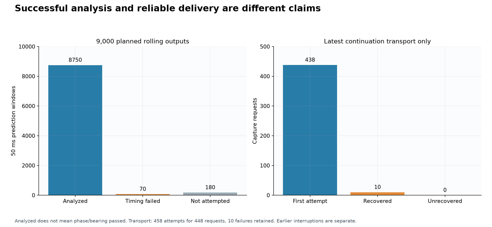

**Figure 13.** The rolling test planned 9,000 outputs: 8,750 were analyzed, 70 failed
timing analysis, and 180 were not attempted after three record-level rejections.
Analyzed does not mean phase/gain passed. Separately, the latest acquisition
continuation completed 448 requests in 458 attempts, retaining 10 metadata-refill
failures and recovering each request. Earlier interrupted blocks remain separate.

Whole-record retries are acceptable for a bounded offline campaign, but they cannot
repair a lost live tracking interval. No frames from separate attempts were joined.
The sample-counter gap in the earlier 10 MS/s continuous test also remains a real
constraint on that tested path: accepted LO/rate readback is not continuous delivery.
That result did not qualify or disqualify every alternative DDR-ring implementation.
[Latest audit](../full_5ms_campaign/data/audit.json),
[higher-rate transport evidence](../higher_sample_rate_timing_campaign/FINDINGS.md)

## 9. Ranked error sources and calibration strategy

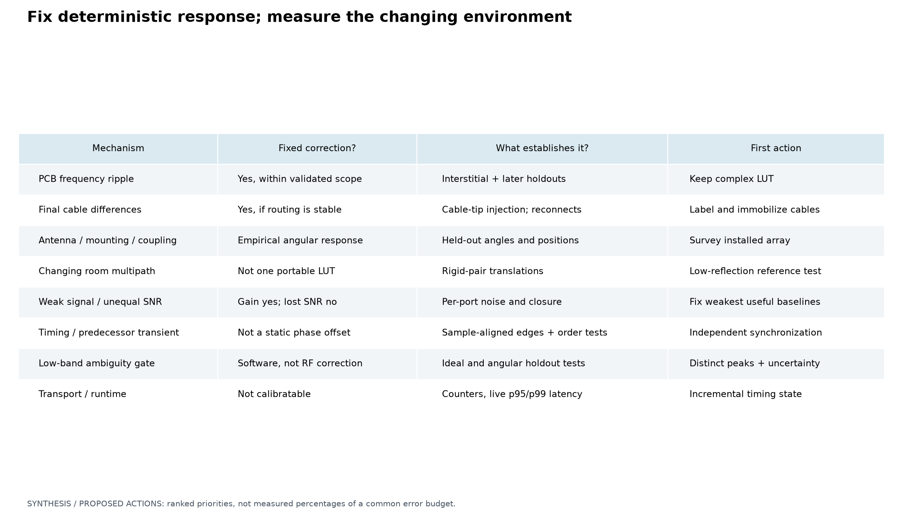

**Figure 14.** This is an engineering synthesis and experiment-selection matrix,
not a measured allocation of error percentages.

| Priority | Mechanism / evidence | Confidence in observation | Attribution still missing |
|---|---|---|---|
| 1 | Large, scene-dependent installed-array spatial mismatch | High: static and switched results, multiple epochs | Relative roles of cables, antennas, coupling, geometry, multipath and drift |
| 2 | Timing recovery and short-dwell corruption | High: rejected records/windows and dwell dependence | Physical transients versus incorrect timing/labels; source-independent lock |
| 3 | Unequal useful signal across ports | High: static measurements and weights | Antenna loss, local nulls, cable response, reference quality and noise contributions |
| 4 | Low-band legacy gate rejects ideal vectors | Directly demonstrated in software simulation | Appropriate deployment-specific uncertainty and ambiguity policy |
| 5 | PCB ripple, finite isolation and calibration stability | High for measured fixture response | Temperature, reconnects, load dependence and lower-band interpolation holdouts |
| 6 | Transport and computation | High for recorded failures and replay timings | Root transport component and isolated end-to-end live latency |

### Correction model and reference requirements

For a narrowband signal during a settled visit, write schematically

\[
\hat h_i(f,t) \approx b_i(f)\,c_i(f)\,a_i(f,\theta,\mathcal E)
\,r(f,t) + e_i(f,t),
\]

where \(b_i\) is PCB response, \(c_i\) is final cable response, \(a_i\) is the installed
antenna/propagation response, \(r\) is a snapshot-common receiver/reference term,
and \(e_i\) includes noise and unmodeled timing, leakage and transient errors. If
leakage is significant, replace the diagonal model with a validated forward matrix.
If the reference is not coherent across visits, \(r\) cannot be treated as a harmless
common phase.

The complex coefficient contains **gain and phase**, not merely a rotation. Under
the simple noiseless relation \(x_{2,i}[n]=h_i x_1[n]\), the weighted cross-correlation
estimate reduces to \(h_i\) when regularization is negligible:

\[
\hat h_i=\frac{\sum_n w[n]x_{2,i}[n]x_1[n]^*}
{\sum_n w[n]|x_1[n]|^2+\epsilon}.
\]

The fixed reference must observe the same signal, with sufficient coherence and
well-understood delay across the occupied bandwidth. The transmitter's absolute
phase need not be known. An unrelated arbitrary TX1 signal cannot automatically
provide the reference for an independent TX2 emitter.

Apply the PCB LUT once, then either combine independently measured cable/antenna
models or use a consistently defined empirical installed response. Do not double
correct the board when an empirical calibration already includes it. Record the
calibration plane, gauge, port order, source hashes, configuration and validity domain.

What a fixed correction cannot recover includes clipped or missing samples, absent
signal energy, unresolved synchronization, changing multipath, a moving scene fitted
as static, or insufficient geometric information. Stable bias can be calibrated;
unobservability cannot be corrected by multiplying by a phasor.

## 10. Frequency readiness

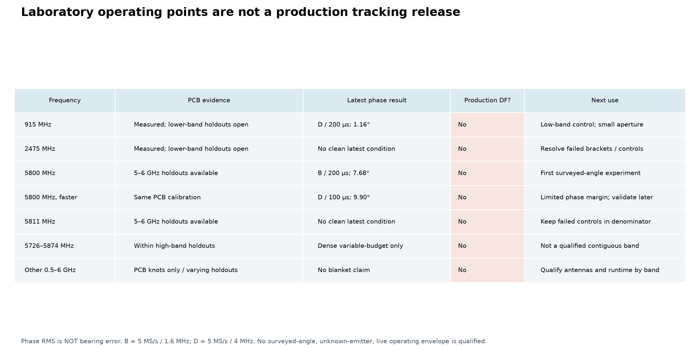

**Figure 16.** The production column is intentionally unqualified throughout.
No combination has yet passed surveyed-angle, independent-reference, live-runtime
and environmental validation. This is not an assertion that all displayed model
peaks are wrong, or that low-band direction finding is impossible.

- **5800 MHz:** preferred first installed-array validation frequency. Begin with
  5 MS/s / 1.6 MHz bandwidth / 200 µs dwell and preserve a 2 MS/s control. It has recent
  clean phase/gain evidence and lies within the PCB's independent holdout region.
- **915 MHz:** useful phase/control experiment. The latest D/200 µs condition is
  strong, but this physical aperture is small and antenna performance remains
  unqualified. Correct the gate before interpreting rejection as a hardware limit.
- **2475 MHz:** resolve failed static brackets and controls before another timing
  optimization. Earlier good trials are not a substitute for current closure.
- **5811 MHz:** retain as a diagnostic center; failed controls prevent a clean latest
  condition despite some successful main trials.
- **Other frequencies:** PCB coverage is not an antenna or tracker operating envelope.
  The dense high-band results do not establish a contiguous production band.

Hardware specifications are a separate release boundary. AD9363 is specified for
325 MHz–3.8 GHz; an AD9361 software compatibility setting does not certify a physical
AD9363 device at 5.8 GHz. The source radio historically identified as AD9363A may
report an overridden model. Verify actual silicon and qualify the hardware chosen
for deployment; this caveat is **not** established as the cause of the present errors.
[Analog Devices specifications](https://www.analog.com/en/products/AD9363.html)

The tinySA Ultra is a swept spectrum analyzer and RF generator, not a vector network
analyzer. It can help diagnose spectral contamination within its verified capabilities,
but cannot supply phase-calibrated cable S21. Older project wording about a tinySA
"VNA mode" should not be relied on. A suitable genuine VNA or the existing direct
complex-ratio injection method is needed for that measurement.
[Official technical description](https://tinysa.org/wiki/pmwiki.php?n=TinySA4.TechnicalDescription)

These are receive/measurement readiness statements, not a statement of permitted
transmit frequencies, power or duty cycle. New OTA transmissions require a separately
checked, location-appropriate bounded test plan.

## 11. Experiments that isolate the causes

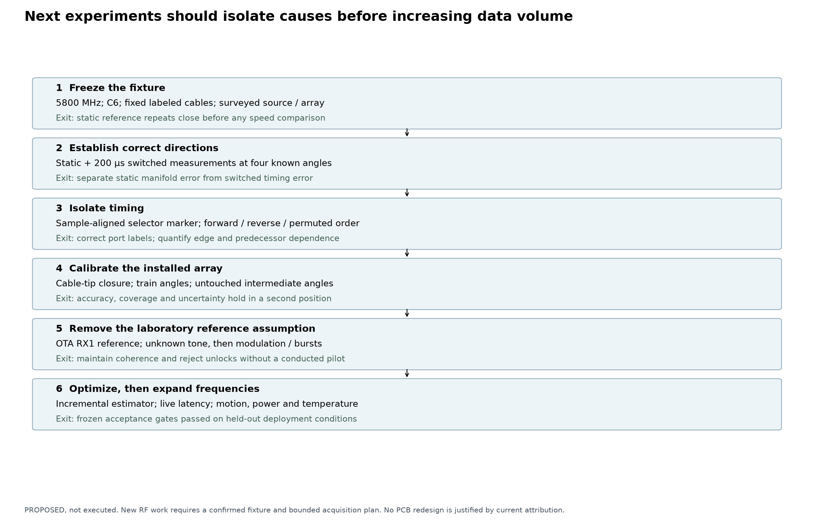

**Figure 15. Proposed, not executed.** Each stage answers a discriminating question.
The plan favors a small amount of well-controlled ground-truth data over another
large collection in an ambiguous scene.

| Stage | Change only / hold fixed | Measurements | Decision enabled |
|---|---|---|---|
| E0: freeze fixture | Label C6 ports/cables; fix bends, mounting and polarization; survey antenna and emitter coordinates | Photographs, coordinates, identities, settings, static brackets | Establish a reproducible baseline and rule out accidental port-map changes |
| E1: static angular closure | One center, initial 5800 MHz; known 0°, 90°, 180°, 270° directions; longer measured range where practical | Static per-port complex vectors, PCB-corrected residuals and bearing errors; source-muted controls | If static fails, prioritize installed response/geometry, not faster dwell |
| E2: switched versus static | Same surveyed scene; 200 µs baseline, then other dwells | Same-port phase/gain closure, independent before/after static references | Separate spatial calibration error from switching corruption |
| E3: independent timing | Sample-aligned hardware marker or validated timing path; forward/reverse/permuted order | Selected edge, label, transient versus predecessor, settled transfer versus time | Distinguish alignment error, electrical transients and order-dependent memory |
| E4: cable-tip closure | Final labeled cables in deployment routing | Per-port complex ratios at selected frequencies; deliberate reconnect subset | Calibrate stable feed response and measure connector/routing sensitivity |
| E5: installed manifold | Surveyed rotation; fixed training angles, untouched interstitial angles | Initial 10° training grid and 5°-offset validation grid; references bracketing each block | Validate angular interpolation without fitting the holdouts |
| E6: environment holdout | Translate the source/array pair with relative geometry preserved; then test another range | Angular error, residual, ambiguity and coverage in each location | Separate portable array response from room-specific propagation |
| E7: production reference | Replace conducted reference with fixed OTA RX1 reference observing the same independent emitter | Tone, then modulated/bursty signals; controlled power changes and motion | Test the actual coherence architecture, not a coherent laboratory surrogate |
| E8: runtime / envelope | Incremental estimator, frozen gates; longer live acquisition | Counters, p95/p99 latency, unlocks, false-valid outputs, warm-up/reboot and environmental holdouts | Define a narrow deployable frequency/rate/geometry/power envelope |

E1 is a sanity check, not a complete angular calibration. E5's angular step sizes
are initial proposals: verify interpolation on held-out angles and refine only if
required. E6 must include scenes outside the training environment; testing only an
intermediate angle in the same room does not establish multipath robustness.

For E3, do not connect an unverified digital marker directly to an RF input. Choose
a electrically safe supported timing interface and record its relationship to the
ADC sample counter; an unsynchronized logic-analyzer trace alone does not establish
which IQ samples belong to a selected port.

At each stage retain both failures and successes. If a reference bracket fails,
stop promoting the block and investigate before spending time on a dense sweep.
If a method is changed after seeing a holdout, that holdout becomes development data
and a new independent validation set is required.

## 12. Minimal production architecture and release gates

The minimal code base should have a clear separation between data integrity,
synchronization, complex measurement, calibration, spatial inference and policy.

| Component | Minimal responsibility | Failure behavior |
|---|---|---|
| Acquisition | Serial-pinned devices; requested/read-back settings; continuous sample counters and timestamps | Preserve gaps and reject invalid windows |
| Timing state | Startup/relock acquisition; incremental edge/clock tracking; explicit port identity | Never silently guess a port permutation |
| Signal estimator | Common signal selection; weighted complex correlation; per-port uncertainty | Mark inadequate reference or signal support |
| Calibration | One versioned complex correction/forward response with explicit plane and frequency bounds | Reject unsupported frequency/configuration |
| Spatial model | Surveyed geometry or independently validated empirical manifold | Retain residual and distinct competing peaks |
| Output policy | Angular uncertainty, quality state, observation timestamp and latency | Emit invalid/ambiguous output rather than a confident wrong angle |

Do not add a large learned model before testing whether geometry, calibration plane
and timing are correct. A well-defined LUT plus an efficient correlator and an honest
angular likelihood is a smaller, more auditable initial design.

### Proposed release criteria — not current achievements

The actual angular accuracy, range, signal class and availability requirements must
be agreed before qualification. As an initial engineering target, consider p95
absolute angular error ≤10° on held-out angles and scenes, with ≥95% valid-output
coverage within a stated signal-strength domain. These are **proposals**, not measured
performance or promises. Report the full tail and false-valid rate, not only RMS.

| Release dimension | Required evidence before declaring production readiness |
|---|---|
| Angular truth | Surveyed, unseen angles and positions; circular error against truth, not against a fitted static vector |
| Calibration lifetime | Interstitial frequency, reconnect, warm-up, reboot and day-to-day holdouts; documented recalibration triggers |
| Reference independence | Same-signal OTA reference or another qualified architecture for genuinely independent emitters |
| Timing | Correct port labels and edge support under motion, weak signals and relock; no known-source template dependence left unqualified |
| Signal scope | Explicit waveform, occupied bandwidth, SNR/power, burst duration and multi-emitter limits |
| Availability | Rejected windows, gaps, acquisition failures and unlocks included in denominators |
| Latency | Timestamped end-to-end capture-to-output latency plus sustained cadence on an isolated representative deployment host |
| Hardware / environment | In-spec or explicitly qualified silicon, antennas, geometry, cable routing, temperature and mounting |

For a 50 ms serial update cadence, processing must sustainably fit its cadence
budget. That is separate from observation age and end-to-end latency: one second of
startup training and accumulated samples must not be omitted from the reported user
experience. Frequency fusion may help only if each likelihood is meaningful; adjacent
frequencies are not automatically independent confidence contributions.

**Recommended immediate action:** run E0–E2 at 5800 MHz with conservative timing.
If static angles do not close, improve the installed calibration. If static closes
but switching does not, prioritize E3. That branch point is the most valuable missing
piece of evidence in the project.

## 13. Reproduction, provenance and figure index

From the repository root:

```bash
PYTHONPATH=src OPENBLAS_NUM_THREADS=1 OMP_NUM_THREADS=1 \
  .venv/bin/python scripts/render_calibration_synthesis.py

PYTHONPATH=src OPENBLAS_NUM_THREADS=1 OMP_NUM_THREADS=1 \
  .venv/bin/python -m pytest tests/test_calibration_synthesis.py
```

The renderer reads repository JSON/CSV results and source reports, never raw capture
buffers or hardware endpoints. It records source hashes before rendering and checks
that they did not change during rendering. Figures, derived tables, renderer and
this report are hashed in [data/manifest.json](data/manifest.json). This makes the
synthesis traceable; it is not a new certification of every source raw-IQ file.
The source campaign reports retain their own raw-audit scopes and identities.

Generated machine-readable results:

- [Dense epoch comparison](data/dense-epoch-summary.csv)
- [Latest condition details](data/latest-conditions.csv)
- [Nominal schedule calculations](data/schedule-theory.csv)
- [Ideal bearing-gate diagnostic](data/ideal-bearing-gate.csv)
- [Ideal finite-range diagnostic](data/ideal-spherical-source.csv)
- [Summary and explicit readiness status](data/summary.json)
- [Source and artifact manifest](data/manifest.json)

| PNG | Evidence type | Purpose |
|---|---|---|
| [01 Coverage](png/fig01_evidence_coverage.png) | Measured coverage | Prevent frequency support from being confused with qualification |
| [02 Fixture / ports](png/fig02_fixture_and_ports.png) | Documented schematic | Show reference architecture and calibration boundaries |
| [03 PCB response](png/fig03_pcb_response.png) | Measured LUT | Show non-delay frequency structure |
| [04 PCB holdout / isolation](png/fig04_pcb_holdout_and_isolation.png) | Independent holdouts and measured matrix | Separate interpolation from loss/leakage |
| [05 Frequency models](png/fig05_frequency_models.png) | Distinct historical validation cohorts | Compare model error without mixing fixtures |
| [06 Phase versus spatial](png/fig06_phase_vs_spatial_admission.png) | Three OTA epochs | Distinguish repeatability from spatial admission |
| [07 Frequency / epoch](png/fig07_ota_frequency_and_epoch.png) | Three OTA epochs | Display model residuals and all diagnostic angle peaks |
| [08 Static port imbalance](png/fig08_static_port_imbalance.png) | Jitter before/after references | Keep weak-port behavior visible |
| [09 Dwell qualification](png/fig09_latest_dwell_qualification.png) | Latest native 5 MS/s results | Preserve controls, brackets and missing metrics |
| [10 Ideal gate](png/fig10_ideal_bearing_gate.png) | Simulation | Demonstrate false low-band rejection |
| [11 Aperture / range](png/fig11_aperture_and_range.png) | Geometry and simulation | Bound one ideal explanation without calling it measured truth |
| [12 Dwell / computation](png/fig12_dwell_and_compute.png) | Theory and measured replay, separate panels | Distinguish revisit rate, useful energy and output cost |
| [13 Failure accounting](png/fig13_failure_accounting.png) | Recorded audit | Keep analysis and transport denominators explicit |
| [14 Calibratability](png/fig14_calibratable_vs_dynamic.png) | Engineering synthesis | Identify what fixed correction can and cannot do |
| [15 Roadmap](png/fig15_experiment_roadmap.png) | Proposed experiments | Isolate causes in a staged sequence |
| [16 Frequency readiness](png/fig16_frequency_readiness.png) | Evidence-based assessment | Define laboratory candidates without a false production claim |

### Evidence catalog

The following reports are retained as separate authorities for their own campaigns;
historical findings are not automatically current operating recommendations.

- [Original 5.8 GHz root-cause work](../5g8_root_cause_analysis/README.md) and
  [corrected external-source resolution](../5g8_external_fixture_campaign/README.md).
- [Original broadband repeats](../broadband_external_fixture_campaign/README.md),
  [future-five comparison](../broadband_future_sweep_comparison/README.md),
  [midpoint validation](../broadband_midpoint_campaign/README.md), and
  [dense conducted sweep](../dense_1mhz_campaign/README.md).
- [Controlled PCB calibration](../pcb_direct_injection_calibration/README.md).
- [Centered HexRay experiment](../hexray_tx_in_middle_calibration/README.md) and
  [two-source tracking verification](../tracking_verification_campaign/README.md).
- [Initial fast timing campaign](../fast_tracking_timing_campaign/README.md),
  [higher-rate measurements](../higher_sample_rate_timing_campaign/README.md),
  [higher-rate findings](../higher_sample_rate_timing_campaign/FINDINGS.md),
  [comprehensive switching](../comprehensive_fast_switching/README.md), and
  [completed timing analysis](../completed_switching_analysis/README.md).
- [915 MHz diagnostic](../subghz_915_diagnostic/README.md) and
  [previous cross-band theoretical synthesis](../cross_band_tracking_analysis/README.md).
- [Moved-fixture comparison](../jittered_fixture_comparison/README.md) and
  [completed native 5 MS/s campaign](../full_5ms_campaign/README.md).
- [Longer-term tracking development plan](../tracking_development_plan/README.md).

The report renderer and verification tests are
[render_calibration_synthesis.py](../../scripts/render_calibration_synthesis.py) and
[test_calibration_synthesis.py](../../tests/test_calibration_synthesis.py).
