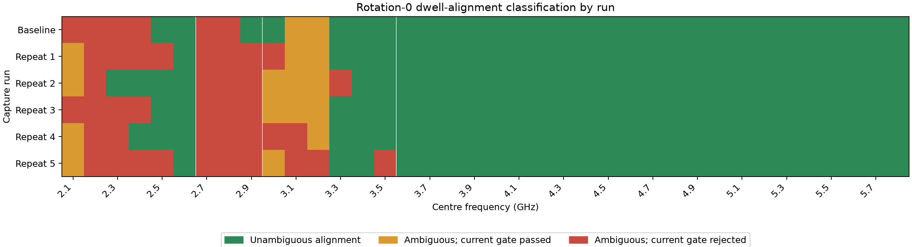
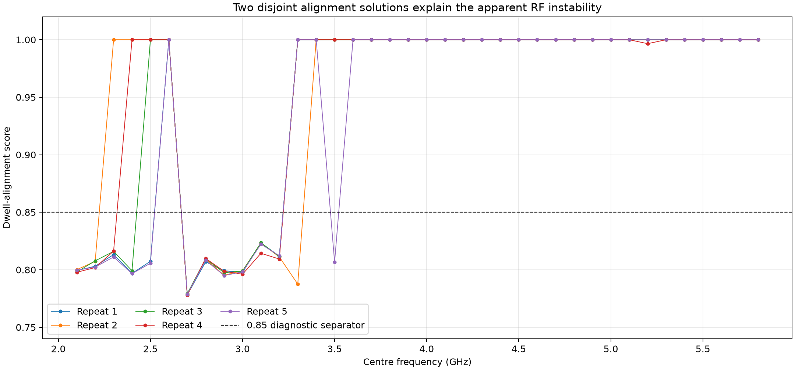
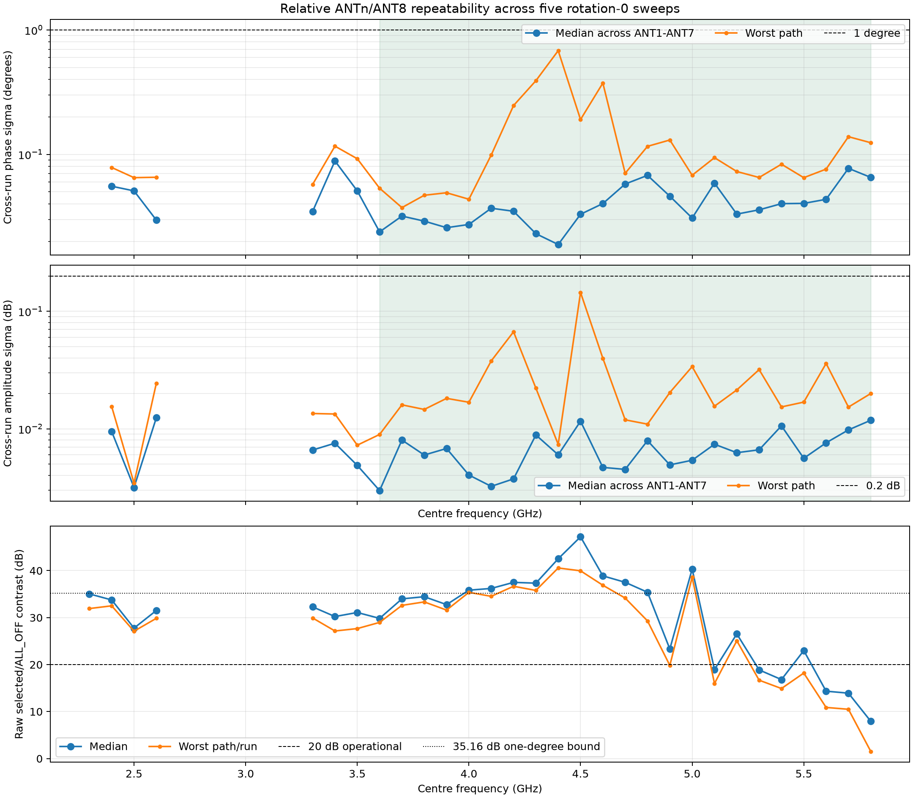
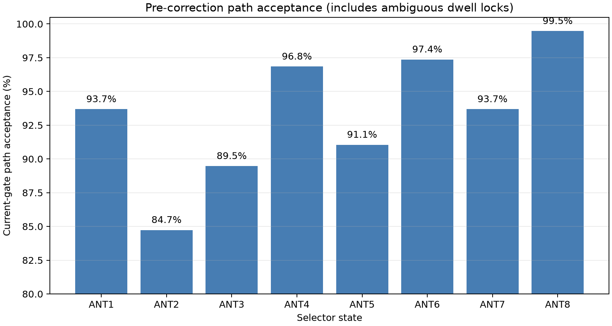

# Rotation-0 broadband repeatability

Date: 2026-08-28  
Board: `stm32c011-4c0055000950313950363920`  
Fixture: conducted closed loop, rotation 0 (`F1→ANT1` … `F8→ANT8`)  
Sweep: 2.1–5.8 GHz in 100 MHz steps, five repetitions

## Result

The RF transfer is highly repeatable when the analysis locks to the correct
20 ms dwell schedule. The dominant failure in the raw five-run result is not
random board drift: it is a second, incorrect dwell-alignment solution that the
existing `0.75` alignment gate admits.

Across 190 repeat captures:

- all 190 artifacts and SHA-256 values are unique;
- every capture passed continuity, ADC-headroom, reference-validity, post-mute,
  and final-mute checks;
- 139 captures have an unambiguous alignment score of `0.9966–1.0000`;
- 51 captures have a separate ambiguous mode at `0.7780–0.8235`;
- 14 of those 51 ambiguous captures passed the existing downstream quality
  gate, so they are false accepts;
- there are no observed scores between `0.8235` and `0.9966`.

A diagnostic `0.85` separator therefore cleanly classifies this dataset. A
production threshold of at least `0.95` is recommended, together with a fix to
the alignment search itself. This threshold is a dataset-supported guard, not
a substitute for correcting the search.





## Repeatability after alignment admission

Only captures in the unambiguous score mode are included in the phase and
amplitude statistics below. Relative phase and amplitude use ANT8 as the
reference and therefore reject capture-wide phase rotation.

| Frequency range | Valid repeats | Median phase σ | Phase σ p95 | Worst phase σ | Median amplitude σ | Amplitude σ p95 | Worst amplitude σ |
|---|---:|---:|---:|---:|---:|---:|---:|
| 3.6–5.8 GHz | 5/5 at every point | 0.0358° | 0.1160° | 0.6815° | 0.00637 dB | 0.02142 dB | 0.14488 dB |

The few worst-path peaks remain below 1° and 0.2 dB. At 2.4 GHz, the two
correctly aligned captures agree to a median `0.0554°` phase σ and `0.0095 dB`
amplitude σ (worst paths `0.0784°` and `0.0154 dB`). The other three 2.4 GHz
captures cannot be used until their dwell alignment is corrected.



The number of usable repeats is:

| Usable repeats | Frequencies (GHz) |
|---:|---|
| 0/5 | 2.1, 2.2, 2.7–3.2 |
| 1/5 | 2.3 |
| 2/5 | 2.4 |
| 3/5 | 2.5 |
| 4/5 | 3.3, 3.5 |
| 5/5 | 2.6, 3.4, 3.6–5.8 |

No RF repeatability conclusion should be drawn at the eight frequencies with
zero correctly aligned repeats. The immutable captures should be reanalysed
after the alignment fix before deciding whether to reacquire them.

## Raw isolation remains a separate limit

Repeatable ALL_OFF-subtracted phase does not prove that a state has enough raw
selected-to-ALL_OFF contrast for deployment. With all five repeats correctly
aligned:

- the 20 dB operational contrast criterion passes at 2.6, 3.4, 3.6–4.8, 5.0,
  and 5.2 GHz;
- the conservative 35.16 dB bound for a leakage contribution below 1° passes
  at 4.0, 4.2–4.6, and 5.0 GHz;
- 4.9 GHz is marginal at 19.83 dB worst-case contrast;
- 5.8 GHz is correctly aligned and repeatable after subtraction, but its
  worst-case raw contrast is only 1.54 dB.

The 5.8 GHz observation therefore confirms the earlier leakage/isolation
finding; it is not an alignment artifact.

## Path-delay model

A single relative path delay is very repeatable from run to run, but it does
not explain the full frequency response. Across ANT1–ANT7 the fitted delay
varies by only `0.039–0.195 ps` between repeats, while the residual phase ripple
after the linear fit is `2.9–24.2° RMS`, depending on the path. Calibration must
therefore retain a per-frequency complex correction table rather than replacing
it with one path-length offset.

Rotation 0 also combines the 8-way splitter arm, individual cable, and board
path. Rotations 1 and 2 are still required to separate those terms after the
alignment issue is fixed.

## Diagnostic path acceptance

The following chart records the old per-state gate result for traceability. It
includes ambiguous dwell locks and must not be interpreted as intrinsic path
reliability.



## Reproduce

The machine-readable result records every source manifest, artifact ID,
artifact SHA-256, analysis SHA-256, and the exact derived statistics:

- [rotation0-repeatability-results.json](data/rotation0-repeatability-results.json)
- [analyze_rotation0_repeatability.py](../../scripts/analyze_rotation0_repeatability.py)

```bash
.venv/bin/python scripts/analyze_rotation0_repeatability.py \
  --baseline-manifest /home/pi/.local/state/smateway/boards/stm32c011-4c0055000950313950363920/closed-loop-frequency-sweeps/broadband-board-calibration-20260828-retry4/manifest.json \
  --repeat-manifest /home/pi/.local/state/smateway/boards/stm32c011-4c0055000950313950363920/closed-loop-frequency-sweeps/broadband-board-calibration-20260828-r0-repeat1/manifest.json \
  --repeat-manifest /home/pi/.local/state/smateway/boards/stm32c011-4c0055000950313950363920/closed-loop-frequency-sweeps/broadband-board-calibration-20260828-r0-repeat2/manifest.json \
  --repeat-manifest /home/pi/.local/state/smateway/boards/stm32c011-4c0055000950313950363920/closed-loop-frequency-sweeps/broadband-board-calibration-20260828-r0-repeat3/manifest.json \
  --repeat-manifest /home/pi/.local/state/smateway/boards/stm32c011-4c0055000950313950363920/closed-loop-frequency-sweeps/broadband-board-calibration-20260828-r0-repeat4/manifest.json \
  --repeat-manifest /home/pi/.local/state/smateway/boards/stm32c011-4c0055000950313950363920/closed-loop-frequency-sweeps/broadband-board-calibration-20260828-r0-repeat5/manifest.json \
  --output docs/closed_loop_frequency_sweep_repeatability/data/rotation0-repeatability-results.json \
  --figure-directory docs/closed_loop_frequency_sweep_repeatability/png
```

## Next action

1. Raise alignment admission to at least `0.95` and fix the alignment search so
   it selects the physical dwell schedule rather than merely rejecting a bad
   solution.
2. Reanalyse all six existing sweeps without modifying the source artifacts.
3. Reacquire only frequencies that still lack valid coverage.
4. Complete rotations 1 and 2, then solve the per-frequency fixture/board
   de-embedding model.
