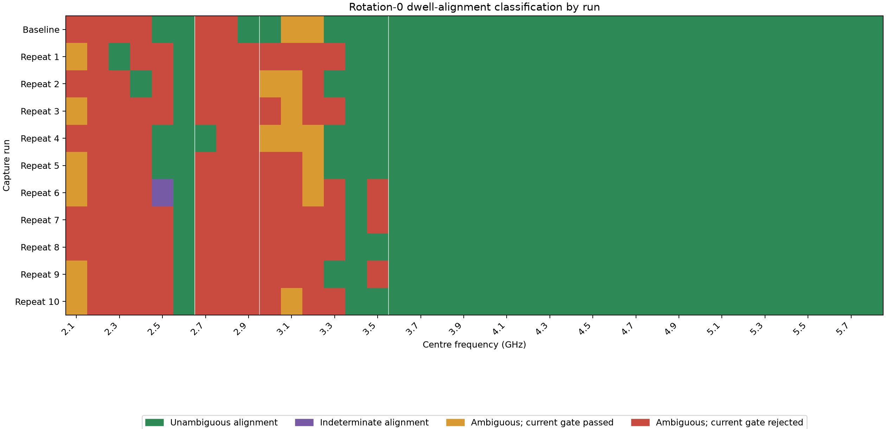
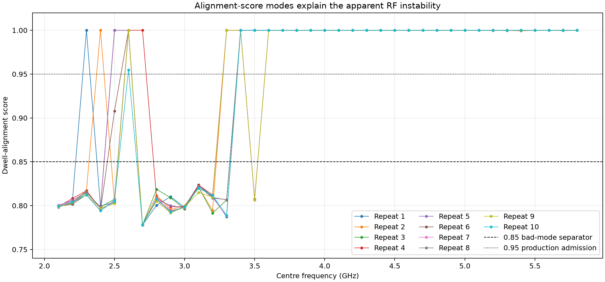
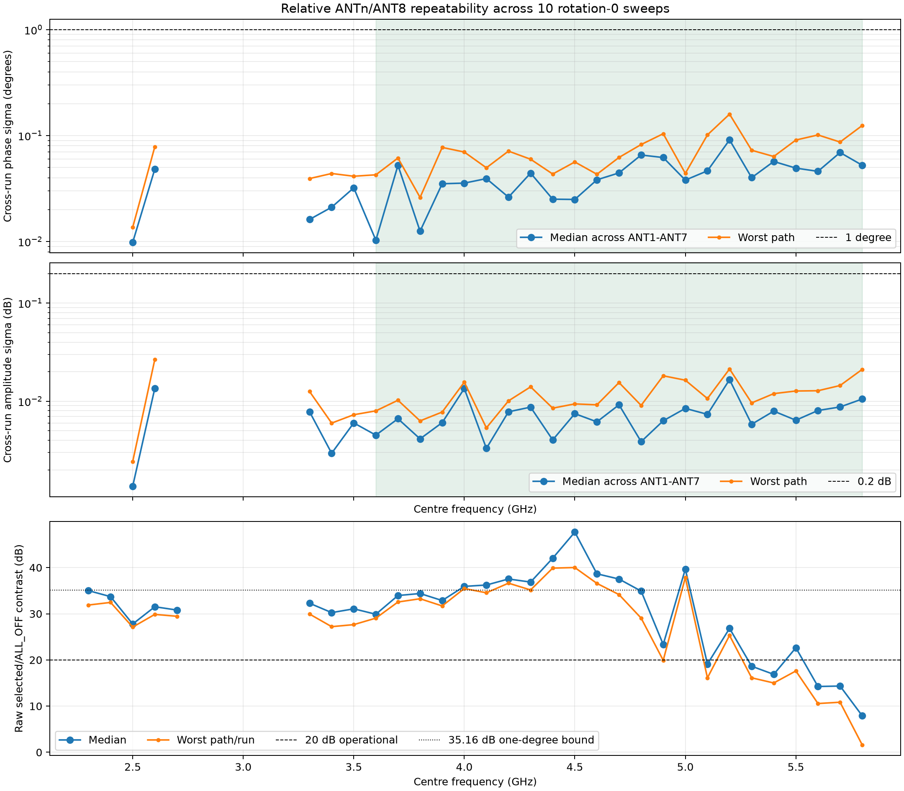
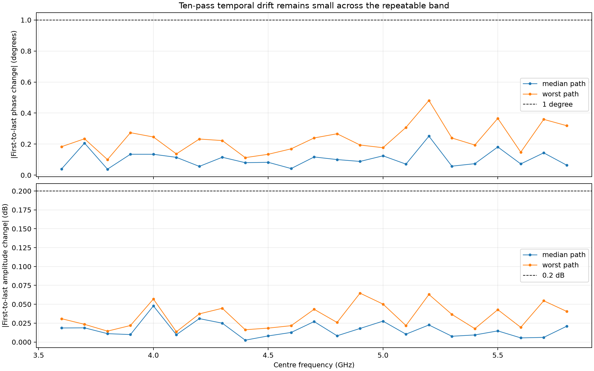
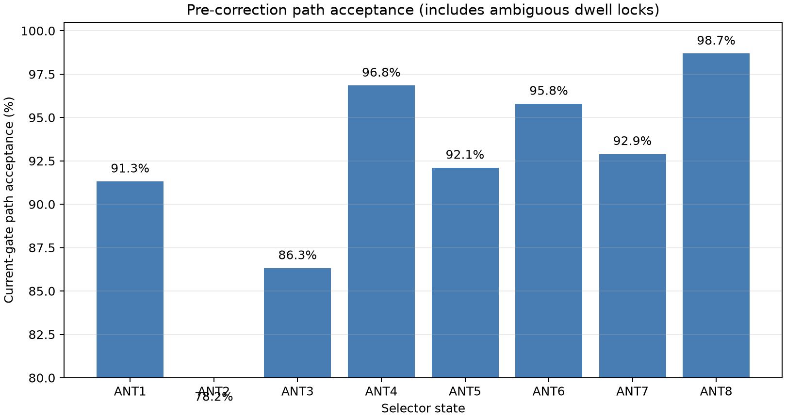

# Rotation-0 broadband repeatability

Date: 2026-08-28  
Board: `stm32c011-4c0055000950313950363920`  
Fixture: conducted closed loop, rotation 0 (`F1→ANT1` … `F8→ANT8`)  
Sweep: 2.1–5.8 GHz in 100 MHz steps, ten new repetitions

## Result

The rotation-0 transfer is extremely stable from 3.6 to 5.8 GHz after
ALL_OFF subtraction. All 23 frequencies in this band produced unambiguous
alignment in all ten passes. The full run also reproduced an incorrect
dwell-alignment mode below 3.6 GHz, confirming that the low-band instability
is primarily an analysis problem rather than random RF drift.

The ten passes ran for approximately 4 h 40 min and produced 380 accepted
captures:

- all 380 artifact IDs and SHA-256 values are unique;
- every accepted capture passed continuity, ADC-headroom, reference-validity,
  post-mute, and final-mute checks;
- each accepted capture contains 24–26 complete switching cycles;
- four of 384 execution attempts (`1.04%`) failed during a libiio buffer refill
  with `ENODATA`;
- all four failed attempts were muted, quarantined without an artifact, and
  succeeded on retry.

The retry behavior protected the dataset, although the underlying USB/libiio
transport fault remains open.

## Dwell-alignment diagnosis

The current `0.75` alignment gate is too permissive. Of the 380 accepted
captures:

| Alignment class | Score | Captures | Existing quality gate passed |
|---|---:|---:|---:|
| Unambiguous | ≥0.95 | 266 | 266 |
| Indeterminate | 0.85–0.95 | 1 | 0 |
| Wrong dwell-lock mode | <0.85 | 113 | 15 |

The wrong mode reaches at most `0.8235`; the valid mode starts at `0.9548`.
The single score of `0.9078` is conservatively retained as indeterminate and
is not used as RF evidence. A production admission threshold of `0.95` is
recommended, followed by a correction to the alignment search itself.





## Repeatability after alignment admission

Relative measurements use ANT8 as the reference and include only captures
with alignment score ≥0.95.

| Frequency range | Valid repeats | Median phase σ | Phase σ p95 | Worst phase σ | Median amplitude σ | Amplitude σ p95 | Worst amplitude σ |
|---|---:|---:|---:|---:|---:|---:|---:|
| 3.6–5.8 GHz | 10/10 at every point | 0.0422° | 0.0937° | 0.1594° | 0.00678 dB | 0.01638 dB | 0.02132 dB |



Usable low-band coverage is uneven because of the alignment search:

| Usable repeats | Frequencies (GHz) |
|---:|---|
| 0/10 | 2.1, 2.2, 2.8–3.2 |
| 1/10 | 2.3, 2.4, 2.7 |
| 2/10 | 2.5 |
| 4/10 | 3.3 |
| 7/10 | 3.5 |
| 10/10 | 2.6, 3.4, 3.6–5.8 |

One additional 2.5 GHz capture is indeterminate. No RF-repeatability failure
should be inferred where valid coverage is sparse or zero. Reanalyse the
immutable captures after fixing the dwell search before reacquiring data.

## Temporal stability

Across the 161 ANT1–ANT7/frequency pairs in the fully admitted 3.6–5.8 GHz
band:

| Change over ten passes | Median | p95 | Worst |
|---|---:|---:|---:|
| Absolute phase slope | 0.0081°/pass | 0.0262°/pass | 0.0449°/pass |
| Absolute first-to-last phase | 0.0908° | 0.2736° | 0.4812° |
| Absolute amplitude slope | 0.00138 dB/pass | 0.00429 dB/pass | 0.00568 dB/pass |
| Absolute first-to-last amplitude | 0.0124 dB | 0.0502 dB | 0.0647 dB |

The worst phase drift was ANT3 at 5.2 GHz; the worst first-to-last amplitude
change was ANT6 at 4.9 GHz. Both remain small compared with practical
calibration tolerances.



## Raw isolation remains a separate limit

Repeatable ALL_OFF-subtracted phase does not prove adequate raw
selected-to-ALL_OFF contrast:

- the 20 dB operational criterion passes in all ten runs at 2.6, 3.4,
  3.6–4.8, 5.0, and 5.2 GHz;
- the conservative 35.16 dB bound for leakage contribution below 1° passes
  in all ten runs at 4.0, 4.2, 4.4–4.6, and 5.0 GHz;
- at 5.8 GHz, phase σ is only `0.0525°` median and `0.1243°` worst, but raw
  contrast is `1.62 dB` minimum and `7.92 dB` median.

Thus 5.8 GHz is repeatable after subtraction but genuinely leakage-limited.
The result reinforces rather than contradicts the earlier isolation finding.

## Path-delay model

The fitted relative delay is stable between runs (`0.032–0.068 ps` sample
standard deviation), but a single delay does not explain the response. Linear
delay-fit residuals span `2.90–24.09° RMS` across ANT1–ANT7. Calibration must
retain a per-frequency complex correction table rather than collapse each path
to one path-length offset.

## Diagnostic path acceptance

This chart records the old downstream quality gate for traceability. It
includes wrongly aligned captures and must not be interpreted as intrinsic
path reliability.



## Reproduce

The machine-readable result records source manifests and hashes, every failed
attempt, alignment classifications, frequency/path statistics, delay fits,
and temporal drift:

- [ten-pass result](data/rotation0-repeatability-10pass-results.json)
- [historical five-pass result](data/rotation0-repeatability-results.json)
- [analysis program](../../scripts/analyze_rotation0_repeatability.py)

```bash
state=/home/pi/.local/state/smateway/boards/stm32c011-4c0055000950313950363920/closed-loop-frequency-sweeps
.venv/bin/python scripts/analyze_rotation0_repeatability.py \
  --baseline-manifest "$state/broadband-board-calibration-20260828-retry4/manifest.json" \
  --repeat-manifest "$state/broadband-board-calibration-20260828-r0-repeat6/manifest.json" \
  --repeat-manifest "$state/broadband-board-calibration-20260828-r0-repeat7/manifest.json" \
  --repeat-manifest "$state/broadband-board-calibration-20260828-r0-repeat8/manifest.json" \
  --repeat-manifest "$state/broadband-board-calibration-20260828-r0-repeat9/manifest.json" \
  --repeat-manifest "$state/broadband-board-calibration-20260828-r0-repeat10/manifest.json" \
  --repeat-manifest "$state/broadband-board-calibration-20260828-r0-repeat11/manifest.json" \
  --repeat-manifest "$state/broadband-board-calibration-20260828-r0-repeat12/manifest.json" \
  --repeat-manifest "$state/broadband-board-calibration-20260828-r0-repeat13/manifest.json" \
  --repeat-manifest "$state/broadband-board-calibration-20260828-r0-repeat14/manifest.json" \
  --repeat-manifest "$state/broadband-board-calibration-20260828-r0-repeat15/manifest.json" \
  --output docs/closed_loop_frequency_sweep_repeatability/data/rotation0-repeatability-10pass-results.json \
  --figure-directory docs/closed_loop_frequency_sweep_repeatability/png/ten-pass
```

## Next action

1. Raise production alignment admission to `0.95` and correct the dwell search.
2. Reanalyse the stored low-band captures; reacquire only if coverage remains
   insufficient.
3. Preserve the per-frequency complex calibration table and its temperature/
   time provenance.
4. Use rotations 1 and 2 only when fixture/board de-embedding is required.
