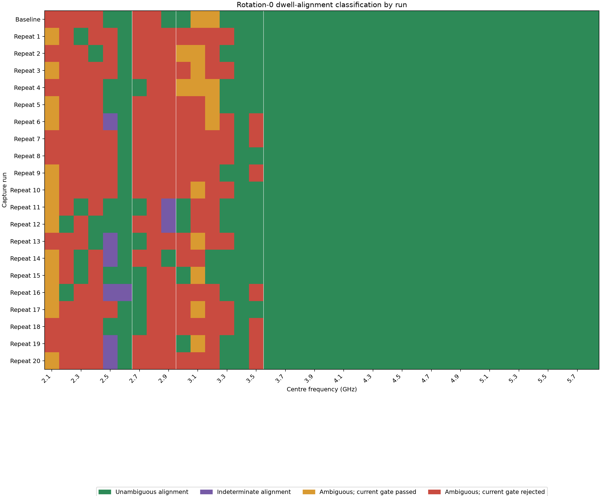
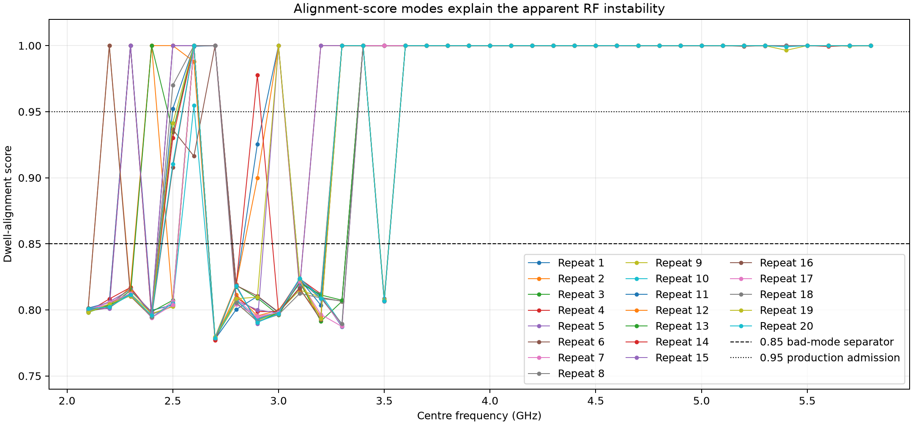
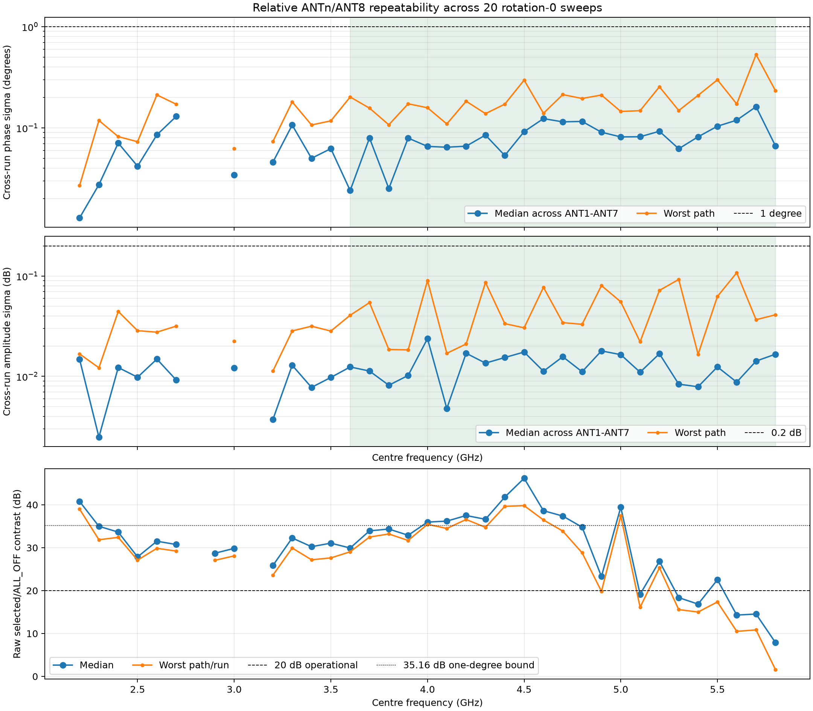
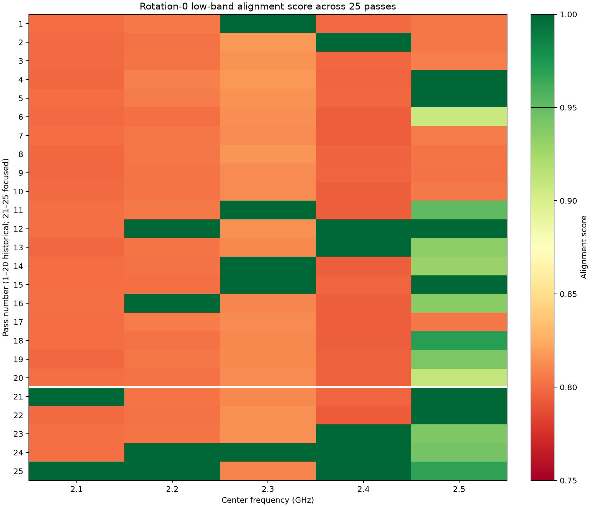
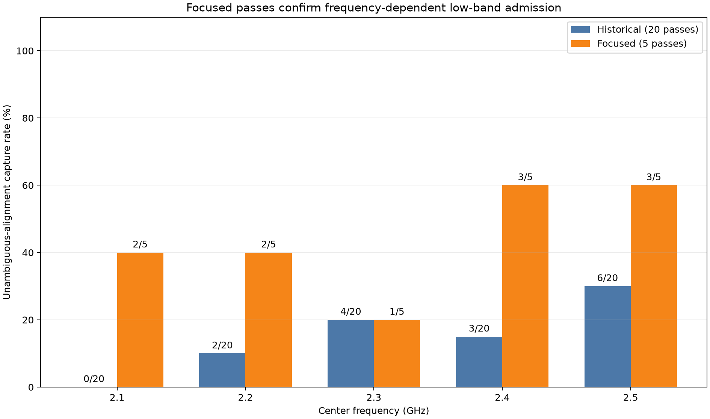
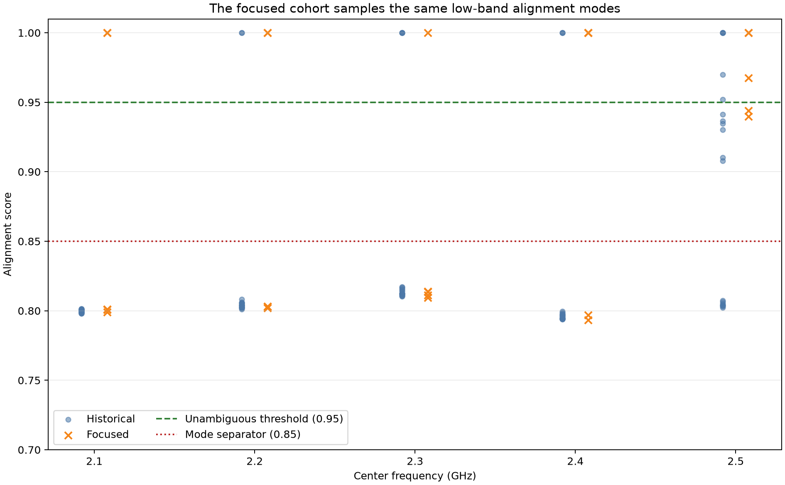
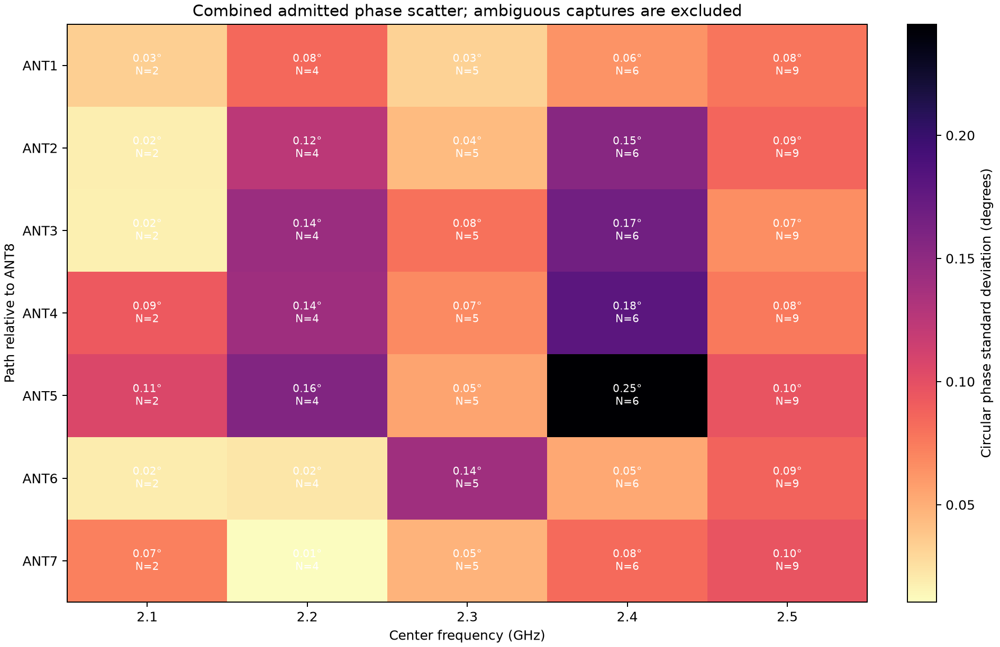
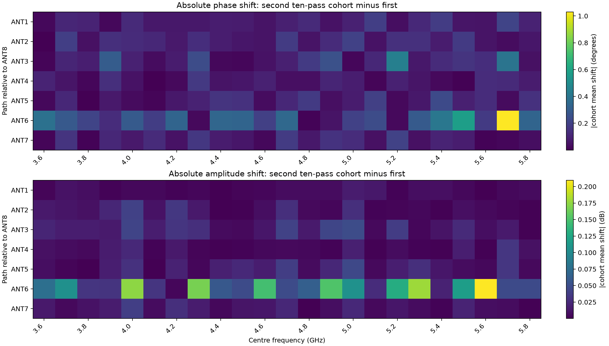
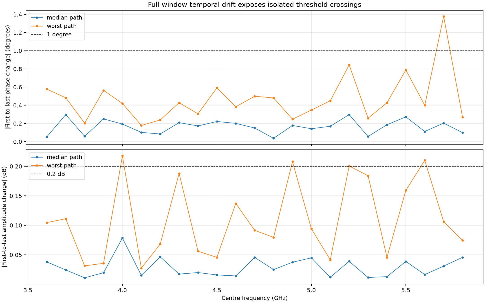
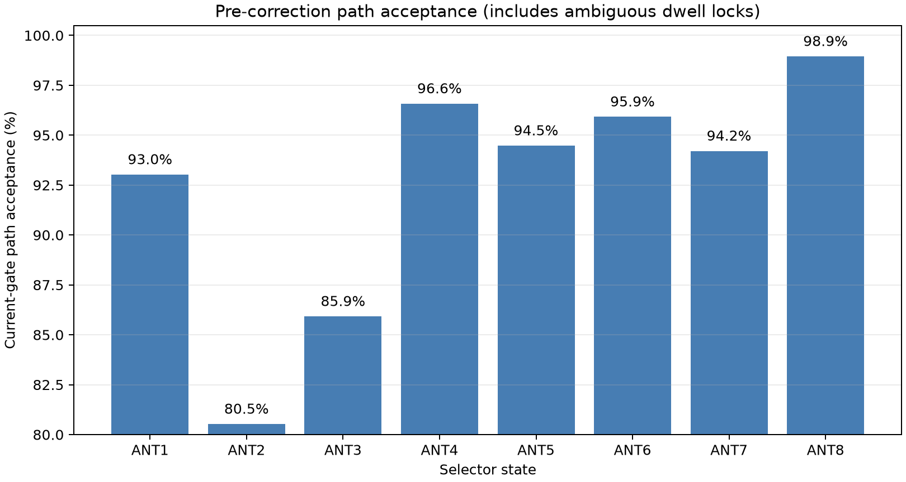

# Rotation-0 broadband repeatability

Date: 2026-08-28  
Board: `stm32c011-4c0055000950313950363920`  
Fixture: conducted closed loop, rotation 0 (`F1→ANT1` … `F8→ANT8`)  
Sweep: 2.1–5.8 GHz in 100 MHz steps, twenty repetitions, plus five focused
2.1–2.5 GHz repetitions

## Result

The rotation-0 transfer remains highly repeatable from 3.6 to 5.8 GHz after
ALL_OFF subtraction: all 23 high-band frequencies produced unambiguous dwell
alignment in all 20 passes. The longer observation window reveals a small but
measurable cohort shift concentrated on ANT6. Short-cohort repeatability is
excellent; maintaining sub-degree calibration over many hours should include
a calibration-age limit or periodic refresh.

The first ten passes ran from approximately 07:40–12:20 UTC. Ten additional
passes ran from 16:03–20:33 UTC, leaving a 3 h 44 min gap between cohorts.
Across all twenty passes:

- 760/760 requested captures were accepted;
- all 760 artifact IDs and SHA-256 values are unique;
- every accepted capture passed continuity, ADC-headroom, reference-validity,
  post-mute, and final-mute checks;
- each accepted capture contains 24–26 complete switching cycles;
- four of 764 execution attempts (`0.52%`) failed during a libiio buffer refill
  with `ENODATA`, all in the first cohort;
- every failed attempt was muted, quarantined without an artifact, and
  succeeded on retry;
- the additional ten sweeps completed 380/380 captures with no execution or
  mute failures.

## Dwell-alignment diagnosis

The current `0.75` production gate remains too permissive. Applying the
analysis admission threshold of `0.95` gives:

| Alignment class | Score | Captures | Existing quality gate passed |
|---|---:|---:|---:|
| Unambiguous | ≥0.95 | 552 | 552 |
| Indeterminate | 0.85–0.95 | 9 | 0 |
| Wrong dwell-lock mode | <0.85 | 199 | 26 |

The wrong mode reaches at most `0.8240`; the valid mode starts at `0.9521`.
Scores of `0.8997–0.9413` are retained as indeterminate and excluded from RF
statistics. The existing gate falsely accepts 26 wrong locks. Production
admission should be raised to `0.95`, followed by correction of the alignment
search itself.





## Aggregate 20-pass repeatability

Relative measurements use ANT8 as the reference and include only captures
with alignment score ≥0.95.

| Frequency range | Valid repeats | Median phase σ | Phase σ p95 | Worst phase σ | Median amplitude σ | Amplitude σ p95 | Worst amplitude σ |
|---|---:|---:|---:|---:|---:|---:|---:|
| 3.6–5.8 GHz | 20/20 at every point | 0.0816° | 0.2098° | 0.5302° | 0.01254 dB | 0.05541 dB | 0.10805 dB |

The aggregate standard deviations remain below 1° and 0.2 dB at every
path/frequency point. They are higher than the first ten-pass result because
the two cohorts have slightly shifted means.



Usable low-band coverage remains controlled by the alignment search:

| Usable repeats | Frequencies (GHz) |
|---:|---|
| 0/20 | 2.1, 2.8, 3.1 |
| 1/20 | 2.9 |
| 2/20 | 2.2, 3.2 |
| 3/20 | 2.4 |
| 4/20 | 2.3, 3.0 |
| 6/20 | 2.5 |
| 7/20 | 2.7 |
| 11/20 | 3.3 |
| 13/20 | 3.5 |
| 19/20 | 2.6 |
| 20/20 | 3.4, 3.6–5.8 |

There are six additional indeterminate captures at 2.5 GHz, one at 2.6 GHz,
and two at 2.9 GHz. No low-band RF failure should be inferred until the stored
captures are reanalysed with a corrected dwell search.

## Five-pass focused 2.1–2.5 GHz extension

Five further rotation-0 sweeps used the same fixture, firmware, `fast20-v1`
profile, 10 s duration, 1 MS/s sample rate, 20 ms dwell, eight kernel buffers,
and 40 dB receiver gain. Only the frequency grid was bounded to 2.1–2.5 GHz.
All 25 requested captures were accepted on their first attempt; all continuity,
headroom, reference-validity, post-mute, and final-mute checks passed. The 25
artifact IDs and hashes are unique.

Combining these captures with the same five frequencies from the twenty
broadband passes gives 125 traceable low-band observations:

| Frequency | Historical unambiguous | New unambiguous | Combined unambiguous | Combined indeterminate | Combined wrong mode | New legacy-gate pass |
|---:|---:|---:|---:|---:|---:|---:|
| 2.1 GHz | 0/20 | 2/5 | 2/25 | 0/25 | 23/25 | 5/5 |
| 2.2 GHz | 2/20 | 2/5 | 4/25 | 0/25 | 21/25 | 2/5 |
| 2.3 GHz | 4/20 | 1/5 | 5/25 | 0/25 | 20/25 | 1/5 |
| 2.4 GHz | 3/20 | 3/5 | 6/25 | 0/25 | 19/25 | 3/5 |
| 2.5 GHz | 6/20 | 3/5 | 9/25 | 8/25 | 8/25 | 2/5 |

The focused cohort contributes 11 unambiguous and two indeterminate captures;
12 select the wrong dwell-lock mode. Its pattern is consistent with the
historical cohort. The result also makes the old quality-gate defect concrete:
at 2.1 GHz all five focused captures pass the legacy gate, but only two have
the validated alignment score of at least `0.95`. Conversely, one unambiguous
2.5 GHz capture fails a per-state legacy criterion. Alignment admission and
per-path RF quality must remain separate decisions.







Once the wrong and indeterminate modes are excluded, the admitted transfer is
repeatable despite the limited sample count:

| Frequency | Admitted captures | Median phase σ | Worst phase σ | Median amplitude σ | Worst amplitude σ |
|---:|---:|---:|---:|---:|---:|
| 2.1 GHz | 2/25 | 0.0341° | 0.1066° | 0.00511 dB | 0.01212 dB |
| 2.2 GHz | 4/25 | 0.1250° | 0.1577° | 0.03641 dB | 0.07038 dB |
| 2.3 GHz | 5/25 | 0.0547° | 0.1401° | 0.01494 dB | 0.03039 dB |
| 2.4 GHz | 6/25 | 0.1535° | 0.2452° | 0.00833 dB | 0.03645 dB |
| 2.5 GHz | 9/25 | 0.0859° | 0.0960° | 0.01806 dB | 0.02806 dB |

These conditional statistics show a stable RF transfer when alignment is
known, not production-ready low-band availability. No frequency is
unambiguous in all 25 passes, so fixing the alignment search remains the
blocking item.



## Relation to the original permutation calibration

This result does **not** invalidate the earlier
[conducted permutation calibration](../closed_loop_permutation_calibration/README.md).
That experiment and this one answer different questions:

- the permutation experiment used rotations 0, 1, 2 and a rotation-0 closure
  to separate splitter-feed terms from board-path terms and fit coefficients;
- the repeatability experiment leaves the fixture in rotation 0 and repeatedly
  tests whether an independently started capture is aligned and repeatable;
- the earlier 2.4 GHz grid was 2.400–2.480 GHz in 20 MHz steps, while the
  broadband repeat grid uses 100 MHz steps.

All four 2.400 GHz source captures used by the original calibration have
alignment score `0.999975–1.000000`, so they also pass the newer `0.95`
admission rule. The six correctly aligned 2.400 GHz captures among the present
25 passes reproduce their raw transfer:

| 2.400 GHz metric | Original calibration, N=4 | Current correct mode, N=6 |
|---|---:|---:|
| Median ALL_OFF raw RX2/RX1 amplitude | 0.012962 | 0.012808 |
| Median selected-path raw RX2/RX1 amplitude | 0.634825 | 0.636650 |
| Median of minimum path contrast | 32.392 dB | 32.590 dB |
| Median path contrast | 33.762 dB | 33.843 dB |

The 19 current wrong-mode captures instead report apparent ALL_OFF amplitude
`0.425–0.460` and a path near `-30 dB` contrast because the search has shifted
the state labels: an active antenna dwell is called ALL_OFF and the real
ALL_OFF interval is called an antenna. This is analysis mislabelling, not a
30 dB physical isolation change. The reference-transfer and alignment
algorithms are unchanged from the original source commit; the broader repeated
campaign exposed a latent alternate optimum that four successful calibration
captures did not sample.

Comparing the old rotation-0 closure with the mean of the six current valid
captures, both relative to ANT8, gives `0.0747 dB RMS` amplitude-shape change
and `1.305° RMS` phase-shape change; the largest path change is ANT4 at
`2.679°` and `0.176 dB`. Because a rotation-0 measurement combines feed-arm,
reconnect, and board response, it cannot assign that day-to-day change to the
PCB alone. The original board calibration remains useful, but a sub-degree
deployment should refresh or verify it after cable reconnection and should not
admit any capture until the alignment search is fixed.

## First-ten versus second-ten cohorts

Both cohorts have 10/10 admitted captures at every 3.6–5.8 GHz point:

| Cohort | Median phase σ | Phase σ p95 | Worst phase σ | Median amplitude σ | Amplitude σ p95 | Worst amplitude σ |
|---|---:|---:|---:|---:|---:|---:|
| First ten | 0.0422° | 0.0937° | 0.1594° | 0.00678 dB | 0.01638 dB | 0.02132 dB |
| Second ten | 0.0541° | 0.2083° | 0.4027° | 0.00959 dB | 0.03104 dB | 0.05804 dB |

Across the 161 ANT1–ANT7/frequency pairs, the absolute shift from the first
cohort mean to the second is:

| Cohort-mean shift | Median | p95 | Worst |
|---|---:|---:|---:|
| Phase | 0.0918° | 0.3318° | 1.0307° |
| Amplitude | 0.01046 dB | 0.10594 dB | 0.20949 dB |

Both worst cohort shifts occur on ANT6: phase at 5.7 GHz and amplitude at
5.6 GHz. The data proves a path-specific long-window change but does not by
itself distinguish cable/connector movement, splitter drift, board drift, or
temperature. ANT6 and the fixture should be inspected before attributing the
change to the PCB.



## Full-window temporal stability

Across the full approximately 12 h 52 min span:

| Change over twenty passes | Median | p95 | Worst |
|---|---:|---:|---:|
| Absolute phase slope | 0.0080°/pass | 0.0257°/pass | 0.0841°/pass |
| Absolute first-to-last phase | 0.1592° | 0.4825° | 1.3783° |
| Absolute amplitude slope | 0.00105 dB/pass | 0.00803 dB/pass | 0.01590 dB/pass |
| Absolute first-to-last amplitude | 0.02494 dB | 0.11113 dB | 0.21774 dB |

The worst first-to-last phase change is ANT6 at 5.7 GHz. The worst
first-to-last amplitude change is ANT6 at 4.0 GHz. These long-window extremes
slightly exceed the earlier 1°/0.2 dB targets even though aggregate σ remains
within them.



## Raw isolation remains a separate limit

Repeatable ALL_OFF-subtracted phase does not prove adequate raw
selected-to-ALL_OFF contrast:

- the 20 dB operational criterion passes in all 20 admitted runs at 3.4,
  3.6–4.8, 5.0, and 5.2 GHz;
- the conservative 35.16 dB bound for leakage contribution below 1° passes in
  all 20 runs at 4.0, 4.2, 4.4–4.6, and 5.0 GHz;
- 2.6 GHz misses the all-20 classification only because one capture is
  indeterminate;
- at 5.8 GHz, phase σ is `0.0667°` median and `0.2339°` worst, but raw contrast
  is only `1.62 dB` minimum and `7.91 dB` median.

Thus 5.8 GHz remains repeatable after subtraction but genuinely
leakage-limited.

## Path-delay model

A single relative delay remains insufficient. Between-run fitted-delay sample
standard deviation spans `0.033–0.268 ps`; ANT6 is the least stable. Linear
delay-fit residuals remain `2.91–24.09° RMS` across ANT1–ANT7. Calibration
must retain a per-frequency complex correction table rather than collapse each
path to one path-length offset.

## Diagnostic legacy path acceptance

This chart records the old downstream quality gate for traceability. It
includes wrongly aligned captures and must not be interpreted as intrinsic
path reliability.



## Reproduce

The machine-readable result records source manifests and hashes, every failed
attempt, alignment classifications, frequency/path statistics, delay fits,
temporal drift, and cohort comparison:

- [twenty-pass aggregate](data/rotation0-repeatability-20pass-results.json)
- [five-pass low-band extension and 25-pass low-band aggregate](data/rotation0-low-band-extension-5pass-results.json)
- [historical ten-pass aggregate](data/rotation0-repeatability-10pass-results.json)
- [historical five-pass aggregate](data/rotation0-repeatability-results.json)
- [analysis program](../../scripts/analyze_rotation0_repeatability.py)
- [focused low-band analysis program](../../scripts/analyze_rotation0_low_band_extension.py)

```bash
state=/home/pi/.local/state/smateway/boards/stm32c011-4c0055000950313950363920/closed-loop-frequency-sweeps
args=()
for repeat_index in {6..25}; do
  args+=(--repeat-manifest "$state/broadband-board-calibration-20260828-r0-repeat${repeat_index}/manifest.json")
done
.venv/bin/python scripts/analyze_rotation0_repeatability.py \
  --baseline-manifest "$state/broadband-board-calibration-20260828-retry4/manifest.json" \
  "${args[@]}" \
  --output docs/closed_loop_frequency_sweep_repeatability/data/rotation0-repeatability-20pass-results.json \
  --figure-directory docs/closed_loop_frequency_sweep_repeatability/png/twenty-pass
```

The focused extension is reproduced from the twenty broadband manifests and
five bounded manifests:

```bash
state=/home/pi/.local/state/smateway/boards/stm32c011-4c0055000950313950363920/closed-loop-frequency-sweeps
args=()
for repeat_index in {6..25}; do
  args+=(--historical-manifest "$state/broadband-board-calibration-20260828-r0-repeat${repeat_index}/manifest.json")
done
for repeat_index in {1..5}; do
  args+=(--focused-manifest "$state/broadband-board-calibration-20260828-r0-lowband-repeat${repeat_index}/manifest.json")
done
.venv/bin/python scripts/analyze_rotation0_low_band_extension.py \
  "${args[@]}" \
  --output docs/closed_loop_frequency_sweep_repeatability/data/rotation0-low-band-extension-5pass-results.json \
  --figure-directory docs/closed_loop_frequency_sweep_repeatability/png/low-band-extension
```

## Next action

1. Raise production alignment admission to `0.95` and correct the dwell search.
2. Correct the dwell search and reanalyse all 125 stored low-band captures
   before considering reacquisition.
3. Inspect/reseat ANT6 and repeat a shorter stability control with temperature
   recorded.
4. Give deployed calibration tables acquisition time, temperature, and maximum
   age metadata; refresh them when sub-degree accuracy is required.
