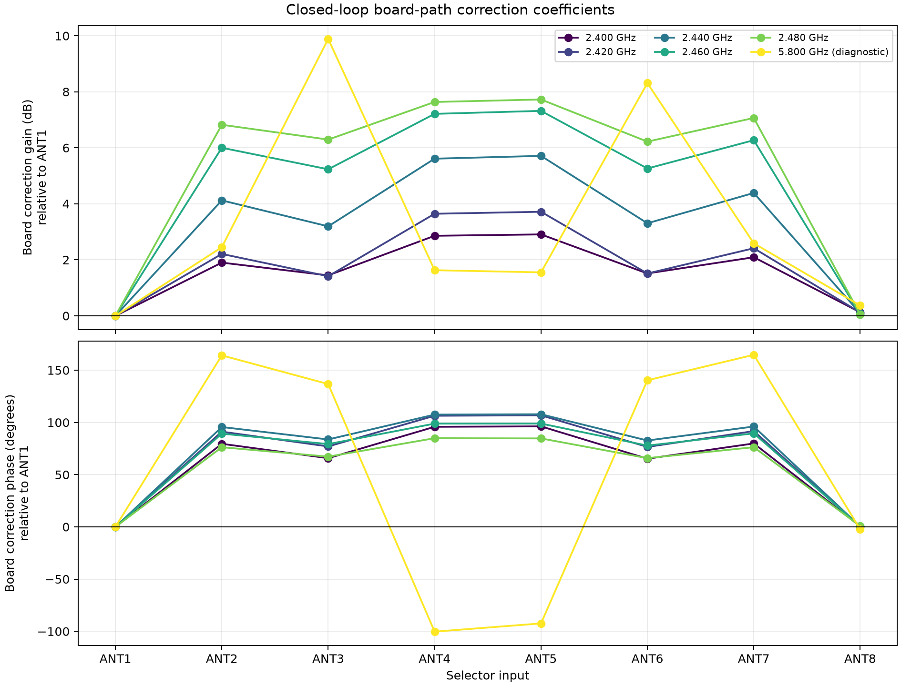

# Conducted closed-loop eight-path calibration

## Outcome

The calibration capture set is complete. The fixture is back in its normal mapping,
`F1 -> ANT1` through `F8 -> ANT8`, and no additional cyclic rotations are required.

Five centre frequencies from 2.400 through 2.480 GHz passed the conducted board-path
calibration gates. Their three-permutation model residuals are `0.033–0.064 dB RMS` and
`0.411–0.538 degrees RMS`; the return-to-normal closure changes the relative eight-path shape
by only `0.026–0.038 dB RMS` and `0.498–0.575 degrees RMS`.

The 5.800 GHz ALL_OFF-subtracted measurements also fit a separable model (`0.158 dB`,
`0.812 degrees RMS`), but they are **not an accepted board calibration**. The worst raw
selected-to-ALL_OFF contrast is `-8.76 dB`, so coherent leakage can exceed the selected path.
Those coefficients are preserved as diagnostic evidence only.



## Hardware and reference planes

The captured fixture was:

```text
Pluto TX1
   |
   +-- 2-way splitter -- attenuated branch --> Pluto RX1 reference
   |
   +-- 8-way splitter --> F1..F8
                            |
                 three physical mappings
                            |
                    board ANT1..ANT8
                            |
                     board RF common
                            |
                        Pluto RX2

Pluto TX2: terminated/muted
```

The eight-way splitter is user-reported as rated from 2–8 GHz. The exact two-way splitter and
RX1 attenuator bandwidths and the attenuator value were not available, so the result does not
claim their absolute transfer. The dual-RX ratio and physical permutations remove common
TX/reference response and separate each eight-way feed arm from each board path.

The exported `board_path_terms` therefore describe the stable complex path from each board
input through the selector and common RX connection, relative to ANT1. They do not calibrate
an antenna, antenna phase centre, unequal antenna cable, or an over-the-air environment. An OTA
refinement remains necessary after the field antenna array is installed.

## Firmware and capture contract

The target ran the qualified `fast20-v1` image:

- board ID: `stm32c011-4c0055000950313950363920`;
- firmware binary SHA-256:
  `aeaed9d2f892d2a59add1aba2a7477e349b750c99f81610632286d04d91326ac`;
- profile contract SHA-256:
  `25b2bd0769687cc255d5e6926312e7e827672dc4567d64aecd85e8078acb4258`;
- Pluto serial: `104000b29905000e17000800065934759d`;
- sample rate: `1 MS/s`, duration: `10 s`, kernel buffers: `8`;
- TX1: `-20 dB` hardware gain, `0.25` DDS scale, approximately `+100 kHz` offset;
- RX gain: `40 dB` at 2.4 GHz and `50 dB` at 5.8 GHz; and
- every admitted artifact passed metadata-continuity, ADC-headroom, schedule-alignment,
  coherent-reference, per-state transfer-SNR and cycle-repeatability gates.

The exact program/verify/reset and full-flash readback evidence remains at:

```text
~/.local/state/smateway/boards/
  stm32c011-4c0055000950313950363920/
  closed-loop-calibration-20260827/
```

## Permutation design

The accepted fit uses 24 complex observations per frequency:

| Rotation | Physical mapping | Role |
|---:|---|---|
| 0 closure | `F1->ANT1, ..., F8->ANT8` | Current normal wiring and final fit input |
| 1 | `F1->ANT2, ..., F7->ANT8, F8->ANT1` | Separates feed from board term |
| 2 | `F1->ANT3, ..., F6->ANT8, F7->ANT1, F8->ANT2` | Overdetermines and tests separability |

For each observation, the fitted model is:

```text
measured complex transfer = reconnect-common * splitter-feed-arm * board-path
```

There are 17 scalar parameters after fixing the first-round and F1 gauges. Twenty-four
observations leave seven residual degrees of freedom for both log amplitude and phase. The
initial rotation-0 run is excluded from coefficient fitting and used only as a held-out
reconnect closure against the final rotation-0 run.

Rotations 3–7 are unnecessary: the three mappings already overdetermine the model, and the
small residuals show that unmodelled feed/board interactions are below the present RF-isolation
floor.

### Cyclic phase-branch caveat

Pure cyclic mappings retain an exact eight-way ambiguity: a `45-degree` phase ramp can be moved
between feed arms, board ports and reconnect-common terms without changing any measured
phasor. More cyclic rotations do **not** remove this ambiguity.

The released coefficients choose the branch with the smallest reconnect-common phase. That
choice is supported by the continuously connected RX1 reference and the rotation-0 closure:
the observed common reconnect phase is only `1.12–1.91 degrees`, and the fitted rotation-common
phases are similarly small. If a future use needs an independently identified absolute spatial
phase ramp, make one non-cyclic permutation (for example, swap only F1 and F2) and hold it out
as a validation. That is optional for this calibration, not another series of rotations.

## Qualification results

The raw-isolation phase bound is the worst-case coherent phase error from an additive ALL_OFF
term at the measured contrast. It is a conservative floor, not the observed repeat scatter.

| GHz | Model amp RMS dB | Model phase RMS deg | Min raw contrast dB | Leakage phase bound deg | Closure amp RMS dB | Closure phase RMS deg | Decision |
|---:|---:|---:|---:|---:|---:|---:|---|
| 2.400 | 0.056 | 0.538 | 32.12 | 1.42 | 0.035 | 0.575 | Qualified, isolation-limited |
| 2.420 | 0.064 | 0.525 | 32.23 | 1.40 | 0.036 | 0.529 | Qualified, isolation-limited |
| 2.440 | 0.056 | 0.495 | 31.85 | 1.46 | 0.038 | 0.498 | Qualified, isolation-limited |
| 2.460 | 0.045 | 0.438 | 31.66 | 1.50 | 0.034 | 0.549 | Qualified, isolation-limited |
| 2.480 | 0.033 | 0.411 | 29.32 | 1.96 | 0.026 | 0.559 | Qualified, isolation-limited |
| 5.800 | 0.158 | 0.812 | -8.76 | Unbounded | — | — | Experimental; do not deploy |


The 2.4 GHz results pass the operational `20 dB` raw-isolation gate, but not the conservative
`35.16 dB` gate needed to bound coherent leakage below one degree in the worst case. Hence the
word “qualified” means a measured, approximately `1.4–2.0 degree` isolation floor; it does not
mean one-degree absolute phase metrology.

## Released 2.400 GHz correction

These correction phasors are normalized to ANT1. Apply the complex value in
`correction_complex` to the corresponding selected-channel sample or narrowband phasor.

| Port | Gain correction dB | Phase correction deg |
|---|---:|---:|
| ANT1 | 0.000 | 0.000 |
| ANT2 | +1.900 | +79.524 |
| ANT3 | +1.444 | +65.738 |
| ANT4 | +2.858 | +95.818 |
| ANT5 | +2.907 | +96.221 |
| ANT6 | +1.513 | +65.245 |
| ANT7 | +2.092 | +79.863 |
| ANT8 | +0.125 | +0.606 |

The full machine-readable table contains gain, phase and complex correction values at all six
frequencies. Do not linearly interpolate wrapped phase angles. Interpolate complex response or
fit a delay/dispersion model, and preserve the qualification status at each endpoint.

## Findings

1. **The splitter-arm and board terms are separable at 2.4 GHz.** Sub-degree residuals across
   seven residual degrees of freedom are much smaller than the raw leakage bound.
2. **The reconnect is stable.** Removing the small common change leaves at most `0.038 dB RMS`
   and `0.575 degrees RMS` relative-shape change.
3. **The board response has strong paired structure.** At 2.400 GHz ANT2/ANT7, ANT3/ANT6 and
   ANT4/ANT5 agree within about `0.34`, `0.49` and `0.40 degrees`, respectively. ANT1/ANT8 are
   also within `0.61 degrees`. This is strong internal evidence that the permutation fit has
   separated fixture arms from the board topology.
4. **Amplitude response changes sharply near 2.480 GHz.** The middle six paths require roughly
   `6.2–7.7 dB` correction there while ANT1/ANT8 remain near the reference. Software can
   normalize amplitude, but it cannot restore the lost per-path SNR. Direction finding should
   retain per-port noise/SNR weights rather than treating amplitude equalization as recovered
   sensitivity.
5. **The 5.8 GHz failure is isolation, not model residual.** Baseline subtraction produces a
   repeatable separable result, but the raw baseline can dominate the selected path. Additional
   cable rotations cannot repair that; improve board/fixture isolation or validate a held-out
   non-cyclic mapping after the hardware change.

## Files and reproduction

- [Final machine-readable result](data/closed-loop-calibration-results.json)
- [Frozen run manifest](data/closed-loop-permutation-manifest.json)
- [Reusable solver](../../scripts/analyze_closed_loop_permutation.py)
- [Core phase/amplitude model](../../src/smateway/permutation_calibration.py)

From `~/smateway`, while the immutable artifacts remain in their recorded board state
directory:

```bash
.venv/bin/python scripts/analyze_closed_loop_permutation.py \
  --manifest ~/.local/state/smateway/boards/stm32c011-4c0055000950313950363920/closed-loop-calibration-20260827/closed-loop-permutation-manifest.json \
  --manifest-snapshot docs/closed_loop_permutation_calibration/data/closed-loop-permutation-manifest.json \
  --output docs/closed_loop_permutation_calibration/data/closed-loop-calibration-results.json \
  --figure-directory docs/closed_loop_permutation_calibration/png
```

The analyzer validates the admitted source documents, capture identity, TX channel, frequency,
state order, per-state quality, and source hashes before fitting. The result records every
source analysis SHA-256 and raw artifact SHA-256. The analyzer implementation is source-bound
to commit `ab704e5` in the generated result.

## Next operational step

Load the qualified per-frequency board correction before fitting a direction-of-arrival model,
then perform an OTA calibration with the actual antenna array at surveyed bearings. Keep a
separate held-out angle for verification, use the ALL_OFF samples as a live leakage/noise
monitor, and reject a dwell whenever its isolation or metadata-continuity gate falls below the
conducted qualification envelope.
