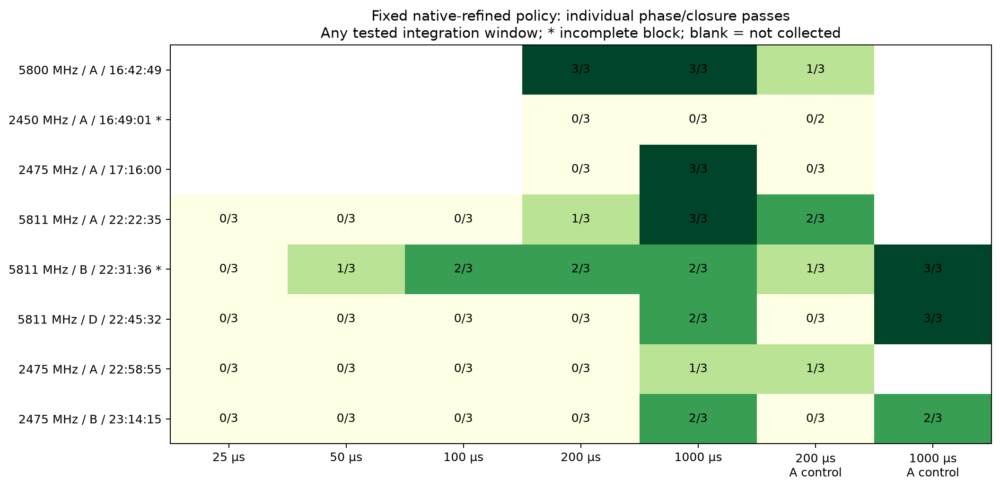
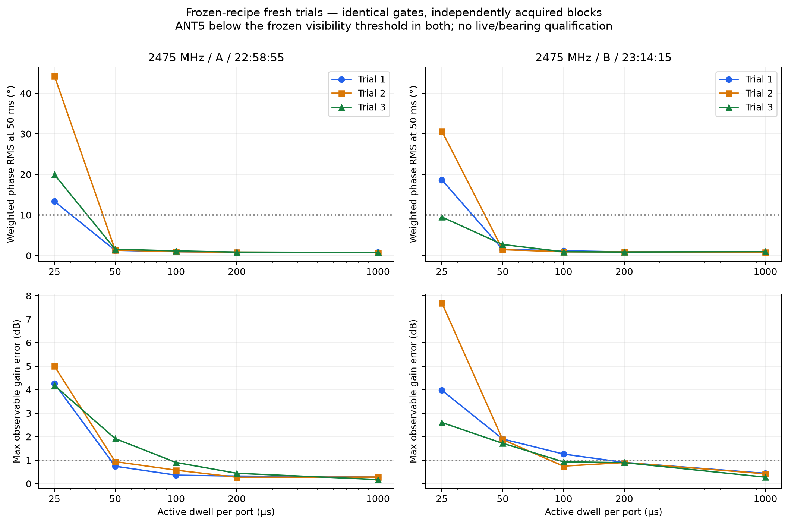
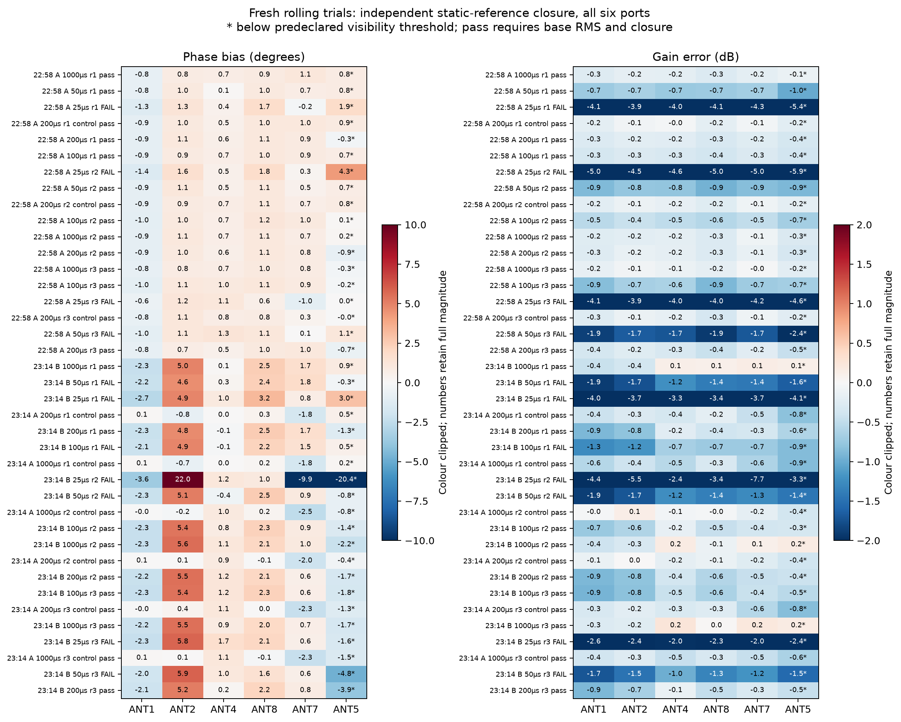
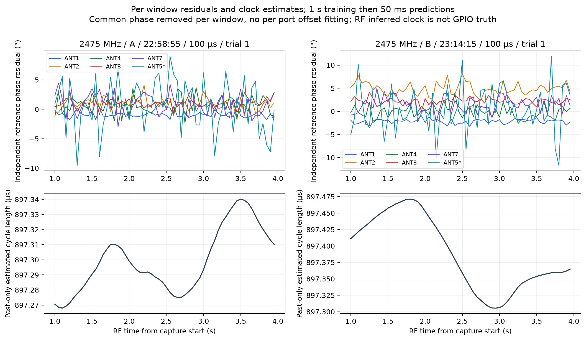
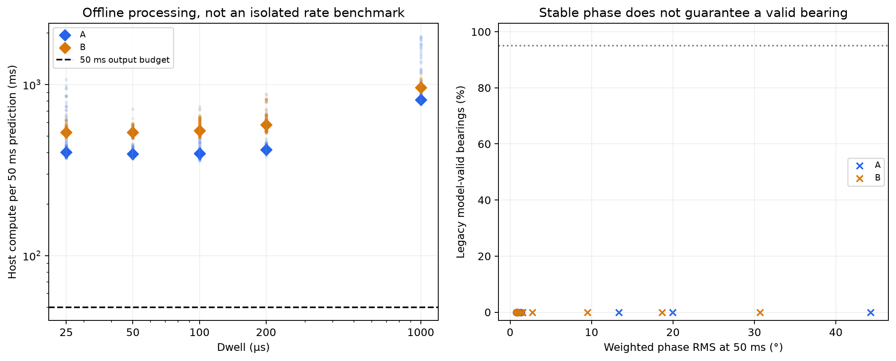
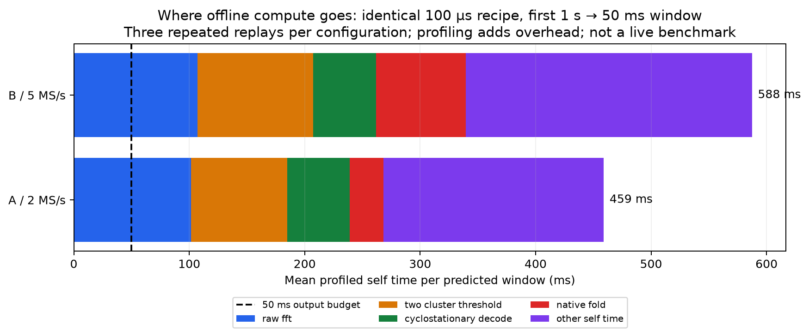
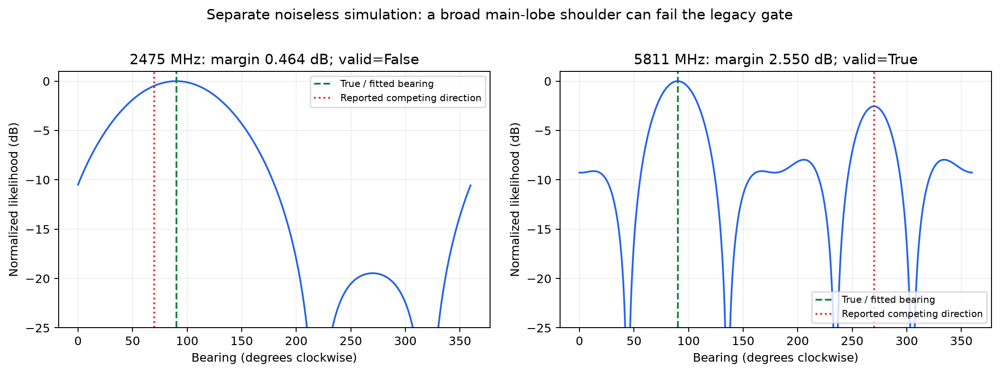
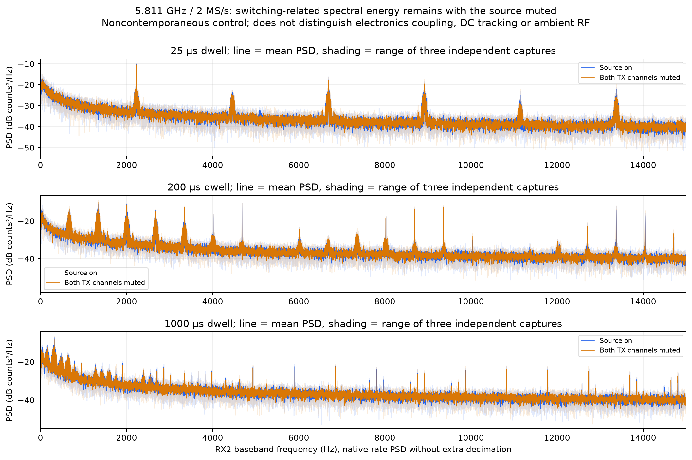
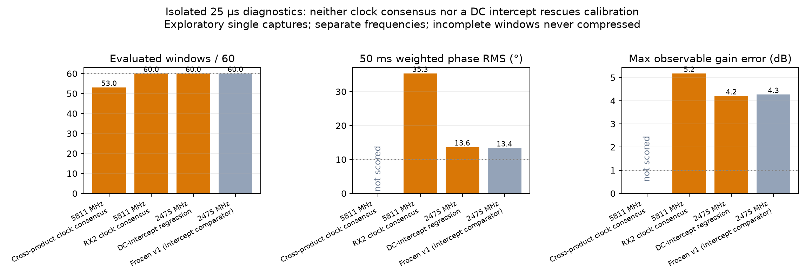

# Fast switching: completed analysis of the collected campaign

**September 9, 2026 · Offline analysis complete; the broader RF campaign remains incomplete.**

The useful result is not a new headline switching speed. It is a clearer separation of **timing synchronization, useful signal integration, calibration closure, and bearing validity**. These have different failure modes and need different fixes.

## Executive decision

At **2.475 GHz**, the frozen laboratory timing recipe supports **100 µs active dwell at 2 MS/s**, with **0.95–1.16° weighted phase RMS in 50 ms observations**, across three independently restarted captures. Its interleaved controls and before/after references pass. At **5 MS/s**, the fastest dwell passing the same checks in all three trials is **200 µs**. The additional samples have not established a reliable shorter dwell.

These are **five-observable-port, known-emitter, offline phase results**. ANT5 is below the independently frozen visibility threshold in both fresh blocks. The installed-array bearing gate still fails, the replay does not keep up with real time, and no production tracking profile is promoted.

The next development priority is therefore **reliable, efficient synchronization and installed-array calibration**, supported by a strong conducted timing test—not another large sweep interpreted through the same unresolved failure modes.

## 1. What this report completes

Only the September 8 campaign at `tracking-comprehensive-20260908-v1` supplies the measured results here. Older PCB calibration and September 3 timing campaigns are contextual references, not pooled observations.

| Evidence | Completed analysis | Boundary |
|---|---|---|
| Acquisition inventory | 298 attempts: 291 acquisition passes, 7 retained failures | Acquisition pass is not calibration success |
| Raw integrity | 570 registered IQ files, 38,912,000,000 bytes, all hashes and lengths verified | Audit of saved evidence, not a claim that failed partial acquisitions were recovered |
| Fixed timing policy | All 125 switched attempts accounted for across eight blocks | Existing hash-checked analyses retained, including decoding failures |
| Fresh frozen-recipe trials | 18 records at 2 MS/s and 21 at 5 MS/s; all 39 processed | 2.475 GHz only; 60 consecutive prediction windows per record |
| Pending 5 MS/s bearing analysis | Completed for the latest 21-record block | Nominal geometry, not surveyed angular accuracy |
| Source-muted switching control | Nine muted records compared with nine source-on records | Same rate/frequency/dwells, but not simultaneous or phase-aligned captures |
| Alternative estimators | Clock-consensus variants and DC-intercept comparator evaluated separately | Exploratory single-capture tests; no relabeling of frozen failures |
| Runtime investigation | Per-window timings plus three profiled replays per rate | Offline host measurements; profiling and other processes affect elapsed times |

Six of the eight acquisition blocks completed. The 2.450 GHz block stopped after clipping and lacks its after-reference bracket. The 5.811 GHz / 5 MS/s narrow-bandwidth block acquired all switched records but was interrupted before finishing the A-rate after-references. Both remain incomplete. All eight blocks record restoration of the original selector image; this analysis made no radio or selector writes.

The physical fixture is the user-confirmed **51 mm-diameter C6**, clockwise **ANT1, ANT2, ANT4, ANT8, ANT7, ANT5**, with ANT1 forward. TX1 supplies the conducted RX1 reference and an OTA transmitter; the selector common feeds RX2. Transmitter positions are approximate, not surveyed RF phase centres.

## 2. The original fixed-policy results remain visible

Configuration **A** is 2 MS/s with 1.6 MHz receive bandwidth; **B** is 5 MS/s with 1.6 MHz bandwidth; **D** is 5 MS/s with 4 MHz bandwidth. The original common comparison uses native-refined timing and discards 5 µs at each dwell edge.



Each cell counts individual captures passing both phase repeatability and independent phase/gain closure at **some tested integration budget**. It is not a common-50-ms comparison or full-block qualification. A successful main capture cannot repair a failed control or missing reference bracket. A blank is an uncollected condition, not zero performance.

At 5.811 GHz, the fixed decoder gives 3/3 main phase passes at 1 ms for A, but only 1/3 at 200 µs and none at 100/50/25 µs. B and D do not show a repeatably qualified shorter dwell. These observations do **not** establish the PCB's intrinsic switching-speed limit: timing labels, receiver filtering, propagation, and estimator behavior remain in the measurement.

The new reference-assisted method below was not freshly validated at 5.811 GHz. Do not transfer its 2.475 GHz result to that band.

## 3. Fresh validation of the frozen timing recipe

The [recipe](../comprehensive_fast_switching/REFERENCE-TIMING-VALIDATION-v1.md) was fixed before these two blocks were acquired. Its recorded implementation hashes match commit `6f0518d`; no decoder thresholds, per-port calibration offsets, or visibility masks were adjusted using the validation results.

For every output, it uses only the **preceding 1 s** to estimate selector timing and align the known six-port reference pattern. It predicts complete visits in the **following 50 ms**, discarding boundary-crossing cycles. There are 60 such output windows in each four-second record. No failed window is removed from the time grid.

The primary criteria are:

- Weighted phase RMS ≤10° in the **base 50 ms window**, not only after longer averaging.
- Independent mean-transfer closure: weighted phase bias ≤5°, maximum observable-port phase bias ≤10°, and maximum observable-port magnitude error ≤1 dB.
- All three distinct main captures pass, all planned interleaved controls pass, and complete before/after reference brackets pass.

The phase RMS is measured about each capture's per-port mean. Closure compares that mean against **separately acquired static references**. A stable but incorrectly scaled or rotated result can pass RMS and fail closure. Only one common phase rotation is removed for spatial closure; individual port offsets are not fitted away.

### Dwell versus phase repeatability

| Active dwell | A: 2 MS/s passes | A: 50 ms phase RMS | B: 5 MS/s passes | B: 50 ms phase RMS |
|---:|---:|---:|---:|---:|
| 25 µs | 0/3 | 13.35–44.29° | 0/3 | 9.51–30.68° |
| 50 µs | 2/3 | 1.29–1.55° | 0/3 | 1.46–2.73° |
| **100 µs** | **3/3** | **0.95–1.16°** | 2/3 | 0.93–1.18° |
| **200 µs** | **3/3** | **0.82–0.85°** | **3/3** | **0.88–0.92°** |
| 1,000 µs | 3/3 | 0.76–0.79° | 3/3 | 0.77–0.96° |

A's three interleaved 200 µs controls pass. B's six A-rate controls—three at 200 µs and three at 1 ms—also pass. Thus the main-dwell failures above cannot simply be dismissed as a universally failed control block.



**Why 50 µs is not qualified despite small RMS:** A's third trial has 1.917 dB maximum observable gain error. B's three 50 µs trials have 1.717–1.901 dB gain error. B's first 100 µs trial has 1.260 dB gain error, despite only 1.178° RMS. Even B's quietest 25 µs trial, at 9.51° RMS, has 2.602 dB gain error.

These results establish repeatability under each block's conditions, not a statistically isolated causal effect of sample rate. The A and B blocks were acquired at different times, their references and weights were independently frozen, and the present OTA fixture has weak paths and interference.

### Independent reference brackets

| Block start UTC, September 8 | Reference configuration | Maximum observable phase drift | Maximum observable gain drift | Result |
|---|---|---:|---:|---|
| 22:58:55 — A block | A | 0.870° | 0.146 dB | Pass |
| 23:14:15 — B block | A | 1.688° | 0.667 dB | Pass |
| 23:14:15 — B block | B | 7.864° | 0.692 dB | Pass |

The B references move more in phase than A's, while still passing the predeclared limits. The brackets bound observed change; they do not prove every instantaneous transfer was constant during the block. The current receiver interface does not expose per-block gain telemetry.



All six ports remain in the figure and machine-readable data. `*` marks a port below the before-reference visibility threshold, not a post-hoc exclusion. ANT5 still has its small frozen weight in aggregate RMS; it is excluded only from the maximum-observable-port gates. Neither fresh block is a six-observable-port qualification.

### What the residuals actually show



The figure deliberately fixes **100 µs, trial 1** in each block, instead of selecting the prettiest record. The top row compares every port with its independent reference after removing a per-window common phase. This displays both port-specific bias and fluctuations; it is distinct from the RMS-about-the-capture-mean statistic in the preceding table.

The bottom row shows that a single frozen clock estimate is not interchangeable with repeated past-only synchronization. The smoothness partly reflects overlapping one-second training windows. It is **not** a direct measurement of oscillator drift or GPIO edge jitter. The 60 disjoint output windows also share training history; they are not 60 independent RF restarts.

## 4. Fast dwell does not mean fast usable output

All profiles retain six 20 µs guards and a 180 µs marker. With 5 µs trimmed at each edge:

| Dwell | Nominal C6 cycle | Nominal revisits/s | Retained active time per visit | Per-port useful duty fraction |
|---:|---:|---:|---:|---:|
| 25 µs | 450 µs | 2,222 | 15 µs | 3.33% |
| 50 µs | 600 µs | 1,667 | 40 µs | 6.67% |
| 100 µs | 900 µs | 1,111 | 90 µs | 10.00% |
| 200 µs | 1,500 µs | 667 | 190 µs | 12.67% |
| 1,000 µs | 6,300 µs | 159 | 990 µs | 15.71% |

These are nominal schedule calculations, not measured delivered bearings per second. Shorter dwell increases revisits while reducing useful integration per port. The raw 50 ms observation budget also includes guards, markers, and discarded boundary visits. Increasing sample rate alone does not increase the duration of received signal integrated.



The 100 µs replays required approximately **403 ms average processing at 2 MS/s** and **551 ms at 5 MS/s**, per 50 ms output window. Both tested rates exceed the output budget. The first prediction additionally requires one second of training; buffering and network delivery latency are not measured by these replay timings. These runs were not isolated host benchmarks, so their ratio is not a controlled sample-rate scaling measurement.



The instrumented single-window replay locates the main cost in **retraining and folding the previous second**, including FFT-based decoding and clustering. Extracting the predicted visit sums takes only a few milliseconds. The stacked chart reports non-overlapping function **self time**, not overlapping cumulative call times. Profiling adds overhead, and these runs are not an isolated cross-rate benchmark.

An efficient runtime should maintain incremental timing state, update that state using new samples, and reserve a full search for initial acquisition or loss of lock. This is a design implication, not an implemented or verified speedup. It must preserve port identity, explicit lock confidence, and invalid output on loss of synchronization.

## 5. Why a good phase vector can still fail direction finding

All 39 fresh rolling records were also evaluated as 50 ms bearing vectors after the existing PCB LUT, using the same nominal 51 mm geometry and unchanged bearing gate. **None qualifies as a bearing operating condition.** The two-source or surveyed-angle accuracy of this method has not been established.



The separate simulation contains no hardware noise or calibration error. At 2.475 GHz the small aperture has a broad main lobe. The legacy ambiguity test can call a point on that main-lobe shoulder a competing direction because it searches outside a fixed 20° exclusion, rather than requiring a distinct local maximum. It can therefore reject a perfectly estimated direction.

This explains a **gate-design limitation**, not every OTA mismatch. Final cables, antenna phase centres, mutual coupling, mounting, and room multipath still require an installed-array calibration. A new bearing policy should report distinct competing lobes and angular uncertainty, and be frozen before new angular holdouts. Existing failures must not be retroactively converted into successes by lowering a threshold.

## 6. The source-muted test narrows the diagnosis



The 5.811 GHz records retain strong RX2 spectral features with both source TX channels muted. Across three captures per condition, the strongest positive-frequency feature above 100 Hz is near **2,229 Hz at 25 µs**, **1,337 Hz at 200 µs**, and **318 Hz at 1 ms**. These are peaks or harmonics, **not necessarily the fundamental cycle frequency**.

The spectra use native-rate complex IQ, one-second Hann windows and four disjoint averages per record. No additional decimation is used. Shading is the range of three captures, not a confidence interval. The plotted 0–15 kHz region is not the approximately +100 kHz test-tone band: similar low-frequency spectra do not imply that the useful OTA tone is absent.

**Supported:** the scheduled receiver response contains features that do not require the intended test transmitter. Their schedule dependence warrants investigating switching-related coupling and receiver response.

**Not established:** whether the physical source is PCB/control coupling, receiver DC-tracking behavior, or ambient RF modulated by the changing antenna connection. These are noncontemporaneous PSD comparisons, not synchronous complex measurements; subtracting them is not a demonstrated calibration correction.

## 7. Alternative short-dwell models did not rescue the result



| Exploratory method, 25 µs trial 1 | Frequency | Windows evaluated | 50 ms phase RMS | Maximum observable gain error | Decision |
|---|---:|---:|---:|---:|---|
| Cross-product harmonic consensus | 5.811 GHz | 53/60 | Not scored | Not scored | Incomplete; no window compression |
| Direct RX2 harmonic consensus | 5.811 GHz | 60/60 | 35.33° | 5.17 dB | Fails |
| Frozen v1 timing, original transfer estimator | 2.475 GHz | 60/60 | 13.35° | 4.26 dB | Fails |
| Same predicted intervals, added complex DC intercept | 2.475 GHz | 60/60 | 13.63° | 4.20 dB | Fails |

The first two methods investigate a decoder failure in which strong inconsistent peaks outweigh a weaker consistent harmonic family. Recovering a clock estimate is not sufficient to recover correct calibrated transfers.

The DC-intercept experiment fits a constant nuisance offset within each visit while keeping the same timing intervals. Its negative result argues against **a simple constant offset being a sufficient correction**. It does not rule out time-varying transients, leakage, reference uncertainty, or other receiver effects. These are deliberately separate exploratory comparisons, not new validated decoder versions.

The intercept analysis was recomputed against the finalized timing report. An earlier exploratory artifact referred to that report before it finished; the original artifact is retained, not rewritten or accepted under an incorrect parent hash.

## 8. Recommended next experiments and implementation order

| Priority | Next step | Question it resolves | Completion criterion |
|---:|---|---|---|
| 1 | Strong, attenuated conducted reference through the switched paths; independently aligned selector timing | Do short visits preserve the correct complex transfer when OTA nulls and label ambiguity are removed? | Independent references, all required ports observable, complete controls, held-out phase/gain closure |
| 2 | Incremental timing/lock tracking; full search only for acquisition or relock | Can the same estimator deliver correct vectors on time? | Past-only replay equivalence plus measured continuous output deadlines and loss-of-lock behavior |
| 3 | Surveyed angular sweep with final cables, antennas and mounting | What spatial response should the bearing estimator actually match? | Held-out angles/frequencies; uncertainty and competing-lobe reporting; no fitted-on-test angular offsets |
| 4 | Additional frequency and TX2 holdouts, then dense mapping | Does the chosen operating mode generalize? | Freeze the chosen policy first; retain every failed frequency and control |

Do not yet promote 25 or 50 µs, treat the known-emitter timing template as a blind-source solution, widen bandwidth as an assumed cure, or declare the PCB physically unable to switch faster. A practical laboratory baseline is A/100 µs at the validated 2.475 GHz point, with the limitations above. It is not a deployment recommendation across the band.

The 0.5–6 GHz [direct-injection PCB LUT](../pcb_direct_injection_calibration/README.md) remains the board-plane correction candidate. This work does not replace it with a new path-delay fit, nor does it calibrate the final OTA array. The new dual-band 1 MHz map, remaining frequency holdouts, 10 MS/s continuity qualification, and fresh TX2 campaign remain **unperformed** in this campaign.

## Evidence and reproduction

Compact tables: [blocks](data/blocks.csv), [fixed-policy trials](data/fixed.csv), [fresh rolling trials](data/rolling.csv), [condition decisions](data/conditions.csv), [reference drift](data/drift.csv), [alternative estimators](data/diagnostics.csv).

Detailed evidence: [raw audit](data/acquisition-audit.json), [analysis summary and source hashes](data/analysis-summary.json), [all-port residual traces](data/rolling-traces.json), [source-muted spectra](data/source-muted-spectrum.json), [runtime profile](data/runtime-profile.json), [figure hashes](data/figures-manifest.json). Raw IQ remains in `/srv/bulk/samteway/lab-data`; it is not copied into Git. [Full offline reproduction steps](REPRODUCE.md) document the pending analyses completed for this report.

The [earlier progress report](../comprehensive_fast_switching/README.md) is retained as its dated snapshot. Its historical/exploratory timing table is not mixed into the fresh comparison here.

To rebuild the figures and machine-readable conclusions after the recorded offline analyses:

```bash
env PYTHONPATH=src OPENBLAS_NUM_THREADS=1 OMP_NUM_THREADS=1 \
  .venv/bin/python scripts/render_completed_switching_analysis.py \
  --campaign-root /srv/bulk/samteway/lab-data/tracking-comprehensive-20260908-v1
```

The renderer rejects mismatched acquisition, reference, timing-policy, or analysis hashes and refuses an unfinished timing report. Regression tests cover failed-window retention, past-only window support, independent controls, missing brackets, base-window acceptance and common-phase removal. No RF capture is triggered by report generation.
