# Comprehensive fast-switching campaign — progress report

Snapshot: 2026-09-08T22:36:53.989617+00:00. **Full campaign incomplete.**

This report keeps historical replay, fresh muted acquisition, source-enabled static diagnostics, and fresh switching blocks separate. No surveyed-angle accuracy or live delivery latency is claimed.

## Fixture and scope

The user confirmed unchanged dual-band wiring, US location, a current 51 mm opposite-antenna-centre diameter and the recommended clockwise C6 order. Use radius 25.5 mm in both bands. This is user-confirmed nominal geometry, not a survey or STL-derived model. Transmitter angles are approximate.

[Protocol](PROTOCOL.md), [readiness](READINESS.md), [1 ms control verification](LONG-CONTROL-VERIFICATION.md). US candidate limits plus the 1 MHz provisional guard leave 231 of the 252 intent-grid rows eligible; the other 21 are explicit exclusions. The margin does not certify emissions compliance.

## Historical reproduction and causality

All four named historical bearing rows and all three September 8 independent-reference outcomes were reproduced from hash-checked IQ. That establishes reproducibility, not new validation. The past-only experiment trains on one second, freezes clock/frequency estimates, then evaluates the unseen final three seconds. Its failure does not establish that all causal tracking is impossible: relocking is not implemented and RF-inferred timing is not independent GPIO truth.

| MHz / TX | Dwell µs | Timing | RF window ms | Valid % | All-group RMS ° |
|---|---:|---|---:|---:|---:|
| 5811 / TX1 | 200 | Whole-record timing | 23.911 | 96.00 | 2.00 |
| 5811 / TX1 | 200 | 1 s past-only, then open-loop | 23.912 | 82.40 | 18.68 |
| 5750 / TX2 | 200 | Whole-record timing | 2.989 | 97.31 | 4.66 |
| 5750 / TX2 | 200 | 1 s past-only, then open-loop | 2.989 | 63.71 | 32.25 |
| 5775 / TX2 | 100 | Whole-record timing | 7.173 | 98.09 | 2.08 |
| 5775 / TX2 | 100 | 1 s past-only, then open-loop | 7.174 | 44.98 | 34.07 |
| 5800 / TX1 | 200 | Whole-record timing | 47.816 | 80.65 | 2.30 |
| 5800 / TX1 | 200 | 1 s past-only, then open-loop | 47.820 | 40.32 | 43.28 |

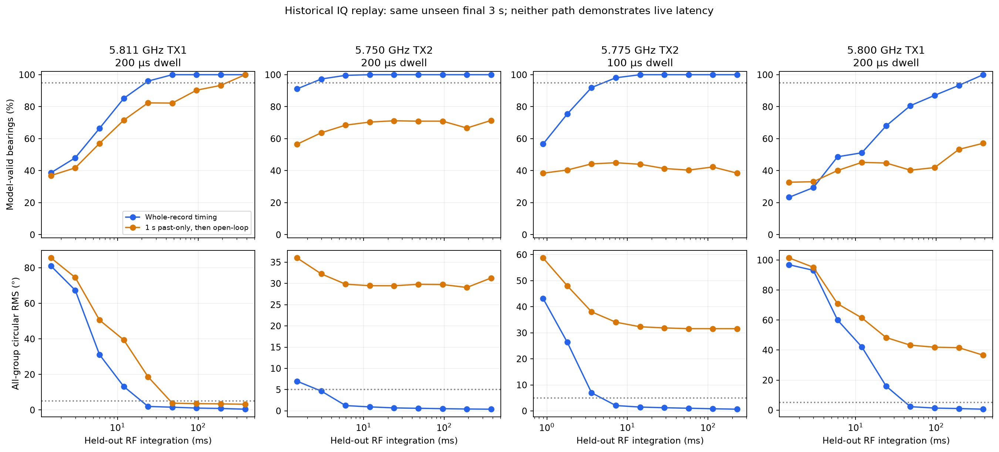

## Fresh acquisition and headroom

145 completed bounded attempts; 6 retained failures. Successful counters alone do not imply an unclipped or useful phase measurement. The 10 MS/s lower-band attempt lost samples; 5.8 GHz/5 MS/s also has a retained dropout. Do not attribute either solely to network saturation or switch settling.

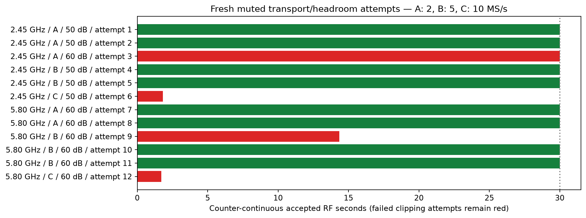

Source-enabled six-port headroom screening selected RX40 dB at 2.45 GHz and RX60 dB at 5.8 GHz after two independent rounds per band. Source gain remained −35 dB and DDS scale 0.25. Lower-band 50 dB clipped RX2 and remains failed. These headroom captures are not calibration holdouts.

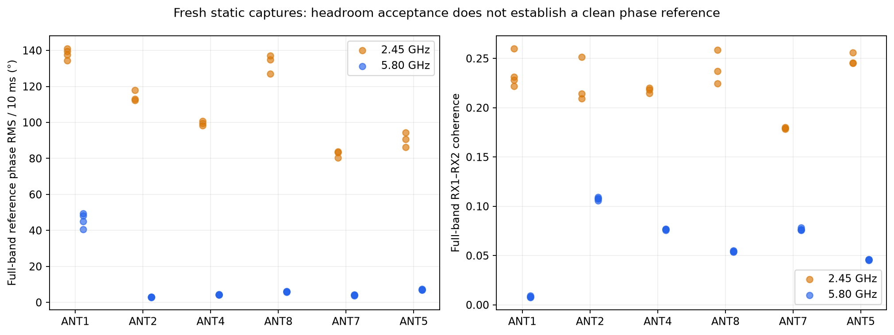

The 2.45 GHz static records show weak reference-correlated tone plus strong intermittent broadband RX2 energy and poor full-band phase RMS. The periodic block-power pattern warrants separating RF interference from acquisition artifacts; these data alone do not identify the cause. At 5.8 GHz ANT1 remains substantially less stable than the other ports. No port is silently removed.

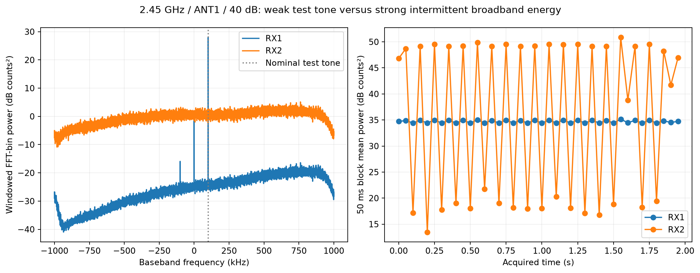

## Fresh switching and remaining work

Each baseline block brackets three independent four-second captures per dwell, plus separate 200 µs controls, with per-port static references. The 1 ms profile changes only the six dwell words in the existing executable; its bounded watchdog proof was checked before deployment.

| Frequency MHz | Rate configuration | Block status | Captures collected | Exact restores |
|---:|---|---|---:|---:|
| 5800 | A | diagnostic-complete | 9 | 1 |
| 2450 | A | failed | 8 | 1 |
| 2475 | A | diagnostic-complete | 9 | 1 |
| 5811 | A | diagnostic-complete | 18 | 1 |
| 5811 | B | running | 5 | 0 |

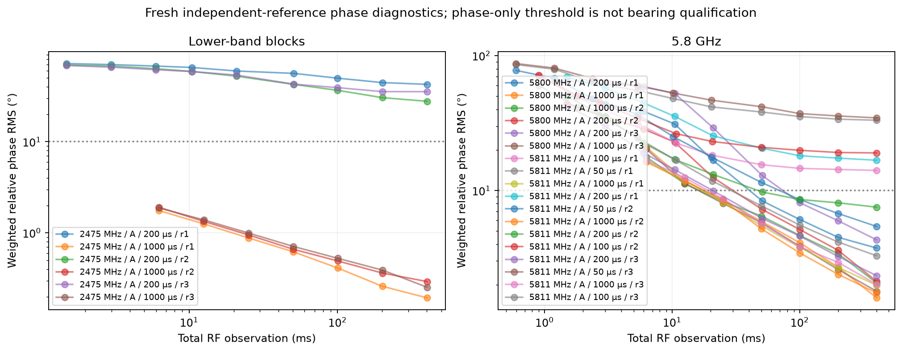

| MHz | Configuration | Dwell µs | Round | Control | Observable-port phase/closure pass | First phase window ms | Max observable phase bias ° | Max observable gain dB |
|---:|---|---:|---:|---|---|---:|---:|---:|
| 5800 | A | 200 | 1 | False | True | 50.83 | 3.26 | 0.64 |
| 5800 | A | 200 | 1 | True | False | — | — | — |
| 5800 | A | 1000 | 1 | False | True | 25.12 | 2.10 | 0.32 |
| 5800 | A | 1000 | 2 | False | True | 25.12 | 2.61 | 0.21 |
| 5800 | A | 200 | 2 | True | True | 50.82 | 2.04 | 0.28 |
| 5800 | A | 200 | 2 | False | True | 50.83 | 2.27 | 0.31 |
| 5800 | A | 200 | 3 | False | True | 100.16 | 1.93 | 0.42 |
| 5800 | A | 1000 | 3 | False | True | 25.11 | 1.70 | 0.39 |
| 5800 | A | 200 | 3 | True | False | — | 75.98 | 12.58 |
| 2475 | A | 200 | 1 | False | False | — | 169.90 | 45.52 |
| 2475 | A | 200 | 1 | True | False | — | 178.91 | 27.66 |
| 2475 | A | 1000 | 1 | False | True | 6.28 | 0.78 | 0.38 |
| 2475 | A | 200 | 2 | True | False | — | 178.39 | 27.20 |
| 2475 | A | 200 | 2 | False | False | — | 172.56 | 44.10 |
| 2475 | A | 1000 | 2 | False | True | 6.28 | 0.82 | 0.31 |
| 2475 | A | 200 | 3 | False | False | — | 178.33 | 36.92 |
| 2475 | A | 200 | 3 | True | False | — | 176.74 | 42.68 |
| 2475 | A | 1000 | 3 | False | True | 6.28 | 0.70 | 0.50 |
| 5811 | A | 200 | 1 | True | True | 20.94 | 4.00 | 0.68 |
| 5811 | A | 100 | 1 | False | False | — | 46.23 | 2.08 |
| 5811 | A | 50 | 1 | False | False | — | 57.72 | 5.23 |
| 5811 | A | 1000 | 1 | False | True | 25.12 | 2.09 | 0.47 |
| 5811 | A | 200 | 1 | False | False | — | 96.28 | 11.78 |
| 5811 | A | 25 | 1 | False | False | — | — | — |
| 5811 | A | 50 | 2 | False | False | 100.51 | 10.22 | 1.64 |
| 5811 | A | 1000 | 2 | False | True | 25.12 | 5.09 | 0.77 |
| 5811 | A | 25 | 2 | False | False | — | — | — |
| 5811 | A | 200 | 2 | True | True | 50.84 | 7.23 | 0.68 |
| 5811 | A | 200 | 2 | False | False | 50.84 | 32.80 | 1.42 |
| 5811 | A | 100 | 2 | False | False | — | 36.32 | 2.46 |
| 5811 | A | 200 | 3 | False | True | 20.94 | 2.50 | 0.76 |
| 5811 | A | 50 | 3 | False | False | — | 60.48 | 7.35 |
| 5811 | A | 1000 | 3 | False | True | 25.12 | 3.80 | 0.18 |
| 5811 | A | 200 | 3 | True | False | 50.84 | 10.60 | 1.32 |
| 5811 | A | 25 | 3 | False | False | — | — | — |
| 5811 | A | 100 | 3 | False | False | 50.25 | 8.39 | 1.16 |

Decoder failures remain failed rows, not discarded trials; see the machine-readable phase table for reasons.

At 5.8 GHz the independent before-reference places ANT1 below the frozen −20 dB visibility threshold. It still contributes its small frozen weight, but is excluded from the maximum-observable-port gates. Thus the 1 ms result is a five-observable-port diagnostic, not a six-port qualification. ANT1's excess gain error remains visible below; no post-hoc port removal was used.

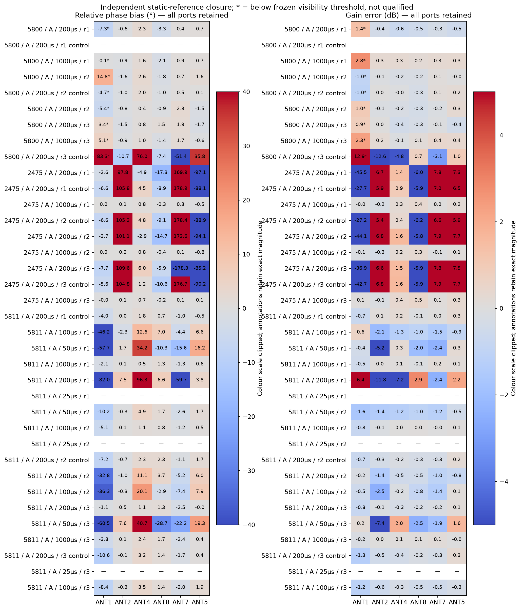

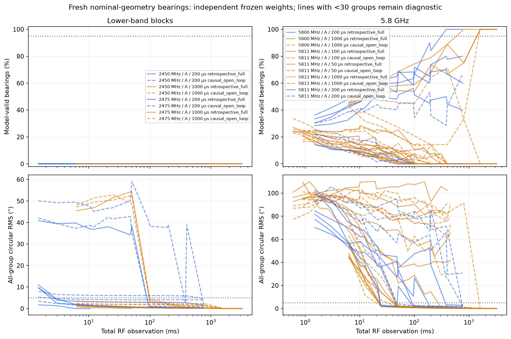

## A model-gate limitation, separate from hardware

A noiseless equal-weight 51 mm C6 model at 2.45 GHz estimates the correct 90° direction yet fails the existing ambiguity gate: its reported second direction is 110°, on the broad main lobe, with only 0.455 dB margin. The solver selects the largest likelihood at *any* direction at least 20° away, not necessarily a distinct local maximum. At 5.8 GHz the same ideal test gives 2.612 dB and passes. The fixed gate is therefore unsuitable as an unconditional lower-band calibration success test at this aperture.

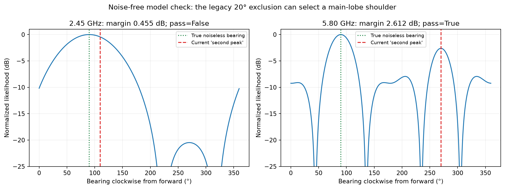

Frozen historical and fresh decisions are preserved. A revised method must separately report distinct competing lobes, angular uncertainty/main-lobe width, and repeatability, with newly frozen policy and new held-out captures. Do not retroactively convert these failures into passes or infer a PCB fault from the geometry-limited gate.

The 5.8 GHz baseline block completed. The 2.45 GHz block stopped on its eighth switched attempt after RX2 clipping and was restored; no after-reference bracket or replacement holdout was obtained. Available records are analyzed as incomplete-block diagnostics only. Pending: new lower-band validation after addressing signal/headroom limitations; full dwell/rate screening and frequency holdouts; dense permitted 1 MHz mapping; independently coherent TX2 settled references; causal relocking/live delivery checks. The proposed 20 ms TX2 reference profile is not implemented or admitted. No completed whole-band calibration is claimed.

Machine-readable evidence: [acquisitions](data/fresh-acquisitions.csv), [static diagnostics](data/fresh-static-diagnostics.csv), [coverage ledger](data/frequency-coverage.csv), [progress summary](data/progress-summary.json). Raw IQ remains on bulk storage; no failed attempt was deleted.

## Source-muted selected-port control

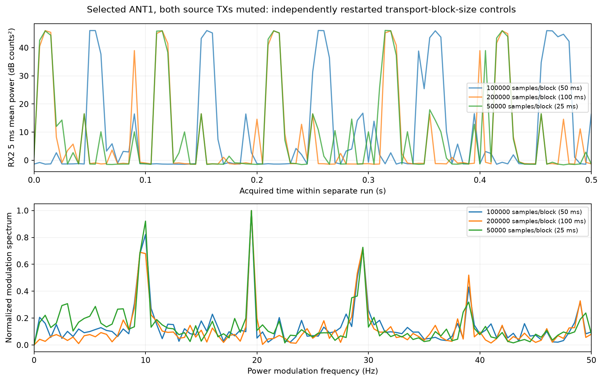

The intermittent broadband energy persists with both source TX channels muted and ANT1 selected. Changing the host transport block size does not establish the cause, but permits a check in acquired-time coordinates. The modulation-spectrum maximum is not necessarily the fundamental repetition rate. The current ABI-2 capture interface exposes no per-block tandem gain telemetry, so it is explicitly unavailable rather than claimed stable.

| Samples/block | Block duration ms | Strongest power-modulation bin Hz | RX2 peak counts | Source muted |
|---:|---:|---:|---:|---|
| 100000 | 50 | 19.5 | 372 | True |
| 200000 | 100 | 19.5 | 366 | True |
| 50000 | 25 | 19.5 | 368 | True |

## Same-fixture frequency control

A separate unchanged ANT1 static check at 2.475 GHz and RX40 dB gave 0.558° full-band 10 ms phase RMS (coherence 0.562), without clipping. This is a single diagnostic, not a repeatability-qualified frequency. It contrasts sharply with the approximately 140° RMS at 2.450 GHz using the same port/gain. It supports a frequency-dependent signal/interference limitation, not a universal ANT1 phase-measurement failure.

## Is ANT1 newly weaker than the matched previous run?

At matched 5.8 GHz TX1 settings, its mean before/after coherent transfer magnitude is **2.64 dB lower** than the earlier September 8 block. The before and after comparisons separately give −2.63 and −2.65 dB. ANT2, ANT4, ANT8, ANT7 and ANT5 change only +0.19, −0.28, +0.53, −0.03 and −0.04 dB respectively. ANT1 was already about 18–19 dB below ANT2; it is now about 21–22 dB below ANT2. This is an additional roughly 2.8 dB relative deficit, not a newly appearing 20 dB defect.

The user explains that ANT1 is farther away and blocked by other antennas. That makes longstanding geometric attenuation plausible; it does not establish the cause of the additional change. These matched observations demonstrate a repeatable numerical difference across the two bracketing captures, not a causal diagnosis or a formal population-level significance test. RF geometry was not independently surveyed between sessions, and there was no cable swap.

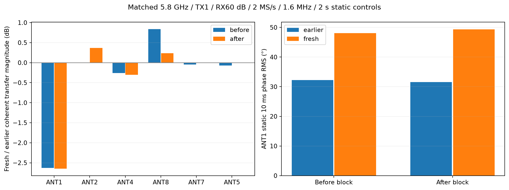

| Epoch | Reference | ANT1 transfer magnitude | ANT1 10 ms phase RMS ° | RX2 total power counts² |
|---|---|---:|---:|---:|
| earlier | before | 0.000503759 | 32.22 | 83.48 |
| earlier | after | 0.000549565 | 31.53 | 83.59 |
| fresh | before | 0.000372138 | 48.09 | 85.79 |
| fresh | after | 0.000405197 | 49.32 | 91.63 |

ANT1's total RX2 power did not drop; it is noise/interference dominated. Coherent RX1-referenced transfer is the relevant comparison. Settings and radio identities are checked by the renderer; [matched records](data/matched-static-controls.csv) remain explicitly separate from fresh calibration holdouts.

## Operator intervention boundary

Hardware captures paused at 2026-09-08T17:09:27.702623+00:00 for a proposed ANT1/ANT2 feed swap. Both serial-pinned radios were verified at −80 dB TX gain and zero DDS scales; the restored bench selector was lease-free ALL_OFF. The swap was not assumed performed. [Readback evidence](data/pre-swap-hardware-handoff.json). Any resumed intervention requires an explicit operator confirmation and a separate fixture binding; current report data precede the swap.

The user subsequently declined the swap because they are away. **No wiring changed.** The temporary hardware hold was released; the original v2 fixture/mapping remains current. [Operator update](data/operator-no-swap.json).

## Independent before/after reference drift

Phase below removes only one common rotation; all-port errors remain in the CSV. A missing bracket is not a pass.

| MHz | Configuration | Complete bracket | Phase/gain drift pass | Max observable phase ° | Max observable gain dB |
|---:|---|---|---|---:|---:|
| 2475 | A | True | True | 0.970 | 0.593 |
| 5811 | A | True | True | 4.053 | 0.622 |

## 2.475 GHz: timing labels versus physical switch settling

The complete 2.475 GHz block has all six ports observable and a passing independent before/after reference bracket. All three 1 ms captures pass phase/gain closure; nominal-model bearing repeatability is approximately 0.63–0.74° at 25 ms, but the unchanged legacy model-valid percentage is zero. This is not a qualified bearing setting.

The legacy 200 µs whole-record decoder places nearly zero in ANT1, the independently measured ANT1 level in ANT2, ANT2 in ANT4, and so on. A separately labeled reference-template fit moves the origin by approximately 219 µs—one 200 µs dwell plus guard—and restores phase/gain closure in all three main captures. Two interleaved controls still fail gain closure. This strongly supports a decoder-origin contribution; it does not prove that every short-dwell error is software or exclude physical settling.

The prototype below keeps whole-record diagnosis, one-second-prefix/frozen-clock evaluation, and rolling past-only evaluation separate. Rolling uses a one-second lookback and 50 ms output windows, includes boundary discards in the observation budget, and retains failed windows. No old failure is relabeled. These are exploratory replays of existing captures, not newly acquired validation or live delivery measurements.

Importantly, its template uses this test source's separately measured six-port complex response. That is a laboratory label/timing aid, not yet a general tracker for an unknown moving source. A deployable design needs reliable source-independent marker/selector timing or an independently validated causal synchronization scheme. Host replay compute time, where present, is separate from RF observation and radio/network delivery latency.

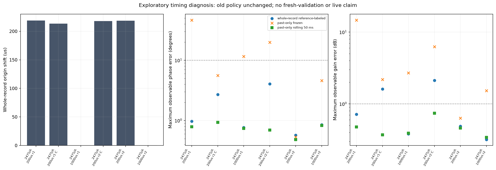

[Method comparison](data/reference-timing-comparison.csv), [full timing studies and provenance](data/reference-timing-studies.json). Partially processed studies remain explicitly marked running; absent rows are not successful measurements.
