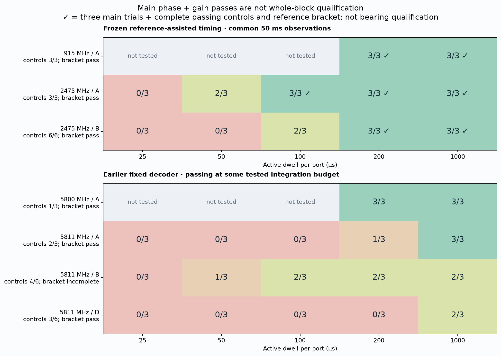
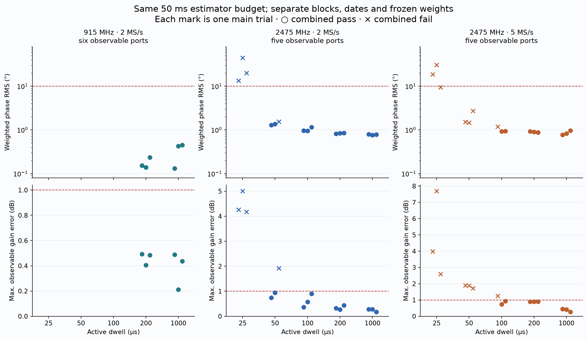
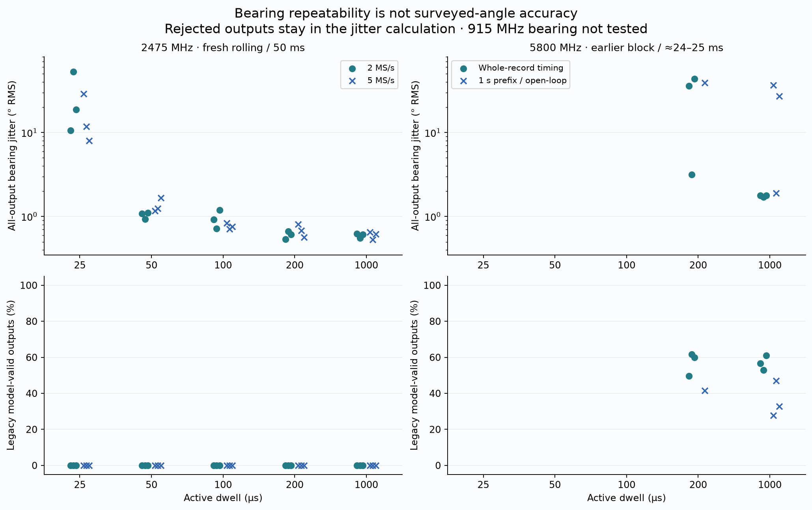
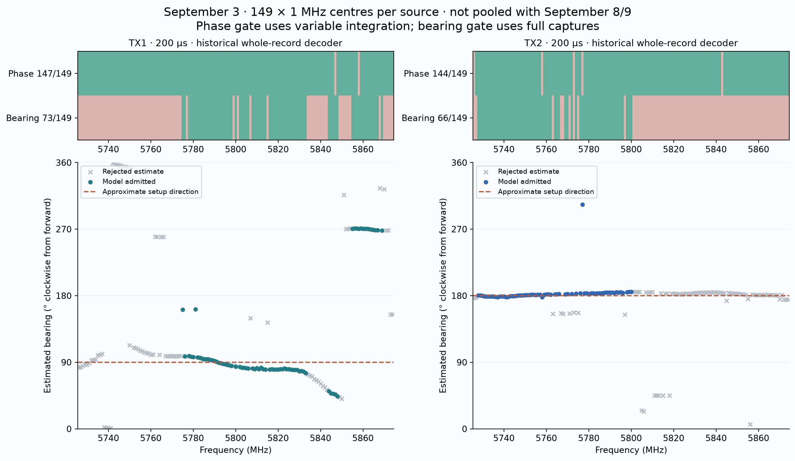
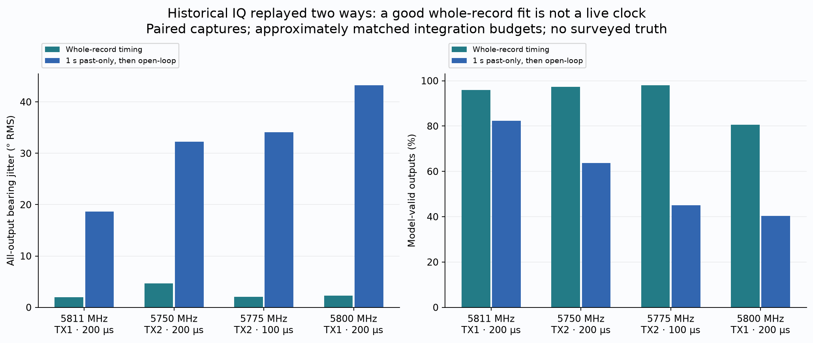
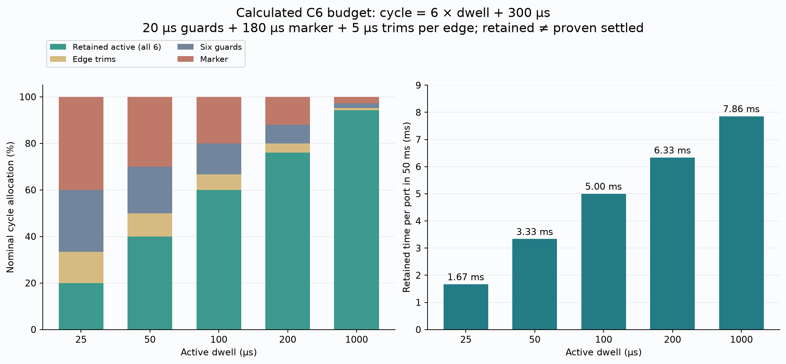
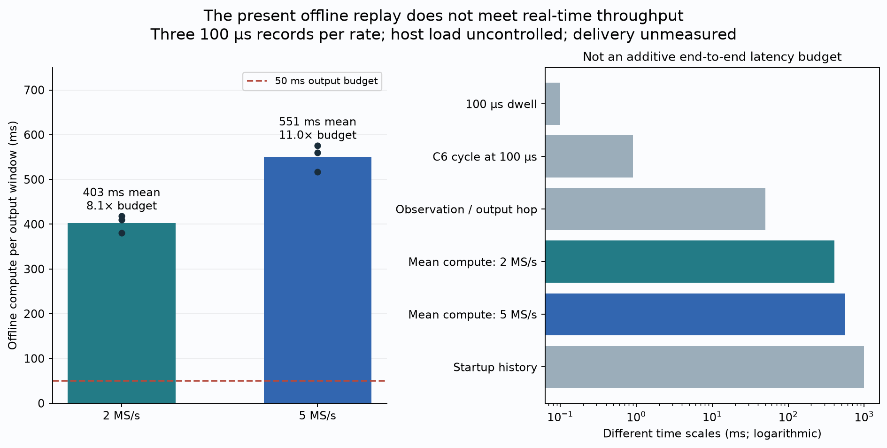
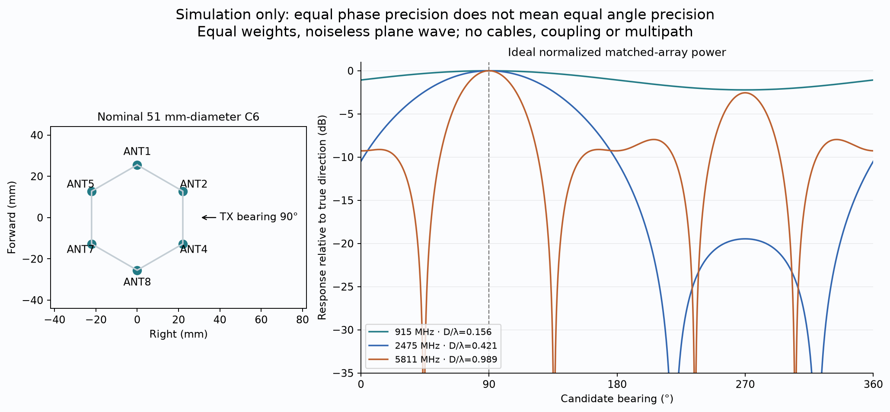

# From calibrated PCB to a reliable direction finder

**Consolidated engineering report · September 10, 2026**

915 MHz, 2.4 GHz and 5.8 GHz evidence; phase estimation, calibration, switching theory and next steps.

## Executive conclusion

The PCB can provide useful, repeatable complex phase measurements. What remains
unqualified is a **live, source-independent, accurately calibrated direction
finder**. We have not established a hard 100–200 µs physical switching floor.
The current limits combine sample-to-port synchronization, receiver transients,
useful integration time, calibration closure, host processing and the installed
array's spatial response.

The strongest recent operating points are:

| Tested centre | Evidence-supported operating point | Phase repeatability | What this does **not** establish |
|---|---|---|---|
| **915 MHz** | 2 MS/s, 200 µs dwell; 3/3 main trials, 3/3 controls and reference bracket pass | **0.138–0.236° RMS** per 50 ms vector; six observable ports | No bearing test; 200 µs is the fastest **tested**, not the minimum; antenna efficiency unmeasured |
| **2475 MHz** | 2 MS/s, 100 µs dwell; 3/3 main trials, controls and bracket pass | **0.95–1.16° RMS** per 50 ms vector; five observable ports | All bearing outputs fail the legacy gate; not a six-observable-port or live-tracking qualification |
| **2475 MHz** | 5 MS/s, 200 µs dwell; 3/3 main trials, controls and brackets pass | **0.88–0.92° RMS** per 50 ms vector; five observable ports | No demonstrated shorter reliable dwell than at 2 MS/s |
| **5800 / 5811 MHz** | Earlier fixed-policy results include 3/3 main passes at 1 ms / 2 MS/s | Not evaluated with the same fresh 50 ms recipe | Failed controls prevent clean block qualification; no demonstrated cross-band transfer of the new timing recipe |

These are individual centres, not qualification of entire ISM bands. The
immediate priority is **unambiguous timing plus an installed-array calibration**,
not another dense frequency sweep through an unresolved estimator. Start from
the working 2 MS/s laboratory settings, prove the shorter-dwell measurement in
a controlled conducted fixture, then validate surveyed OTA angles.

## 1. What is being consolidated

This is a new synthesis of existing measurements, not a new RF campaign or a
new raw-IQ replay. The campaigns below remain separate in every comparison.
An older whole-record fit is never substituted for a failed causal result.

| Evidence set | Date | Scope | Role in this report |
|---|---|---|---|
| [PCB direct injection](../pcb_direct_injection_calibration/README.md) | Sep 1–2 | Eight inputs, 0.5–6 GHz, 4,528 observations | Board-plane LUT, ripple attribution and calibration limits |
| [Two-source verification](../tracking_verification_campaign/README.md) | Sep 3 | TX1/TX2 at five 5.8 GHz centres | Evidence that source-dependent spatial information exists; approximate positions only |
| [Dense timing campaign](../fast_tracking_timing_campaign/README.md) | Sep 3 | 149 centres, 5726–5874 MHz at 1 MHz spacing, both sources | Historical frequency dependence; weaker phase-only and retrospective timing evidence |
| [Higher-rate findings](../higher_sample_rate_timing_campaign/FINDINGS.md) | Prior higher-rate campaign | 2/5/10 MS/s acquisition and filter readbacks | Transport qualification and receiver-configuration caveats |
| [Comprehensive timing diagnostics](../comprehensive_fast_switching/README.md) | Sep 8, later offline analysis | Fixed decoder, origin alignment, causal/retrospective comparisons | Diagnose why superficially good results can fail in a tracker |
| [Completed switching analysis](../completed_switching_analysis/README.md) | Sep 8 acquisition; Sep 9 analysis | 39 fresh 2475 MHz rolling records, 125 fixed-policy attempts across eight blocks | Strongest recent dwell/rate comparison; runtime and bearing limitations |
| [915 MHz diagnostic](../subghz_915_diagnostic/README.md) | Sep 9 | Nine switched records, independent references and gain screens | Sub-GHz phase/gain feasibility with existing antennas |

The new tables normalize **117 switched records into 29 conditions**: 39 fresh
2475 MHz rolling records, nine 915 MHz records and 69 earlier fixed-policy
5.8 GHz records. Historical frequency maps and bearing comparisons are separate
source tables, not added to those trial counts. The failed 2450 MHz block and
exploratory 2475 MHz block remain in their original reports, not silently
promoted into the fresh validation set.

### The fixture and reference matter

The recent fixture is the nominal **51 mm-diameter C6**, clockwise ANT1, ANT2,
ANT4, ANT8, ANT7, ANT5, with ANT1 forward. TX1 is split into a conducted,
attenuated RX1 reference and an OTA antenna near the array. The selected PCB
common feeds RX2. In the earlier two-source tests, TX2 feeds a separate antenna;
TX2 was muted for the latest single-source and 915 MHz diagnostics.

The nominal TX1 direction is about 90° at 0.30 m, TX2 about 180° at 0.20 m.
These are operator descriptions, not surveyed antenna phase centres. The
report does not claim range estimation, position triangulation, C8 verification,
or tracking of a moving unknown emitter.

## 2. Read the metrics before reading the speed

| Quantity | What it measures | A small value can still hide… |
|---|---|---|
| Phase RMS | Variation of output phase about the capture's per-port mean | Stable port mislabeling, fixed calibration bias or gain error |
| Independent phase closure | Mean phase disagreement with separately acquired static references | Time-varying errors between reference brackets |
| Gain closure | Mean transfer magnitude disagreement, in dB | An incorrect phase or angular model |
| Bearing jitter | Circular variation about the inferred mean direction | A very stable wrong direction |
| Bearing model validity | Whether an output passes the recorded score/residual/ambiguity policy | Gate-design errors or an inaccurate physical model |
| Surveyed angular error | Difference from independently measured true direction | **Not established by these campaigns** |
| Selector revisit rate | Frequency of visiting each port | Long integration, startup history, processing and delivery latency |

The recent frozen recipe requires weighted phase RMS ≤10° in the base 50 ms
window, weighted relative phase bias ≤5°, maximum observable-port phase bias
≤10°, and maximum observable-port gain error ≤1 dB. Three independent main
captures, all planned controls and complete passing reference brackets are
required for a clean condition. Spatial closure removes **one common phase
rotation**, not a separately fitted correction for every port.

Weights and visibility masks come from independent before-references. ANT5 is
below the −20 dB visibility threshold in the fresh 2475 MHz blocks: it retains
its small aggregate weight but is excluded from maximum-observable-port gates.
All six ports are observable at 915 MHz, although ANT5 carries 52.5% of the
weight and ANT2 only 1.5%. These are not equal-weight, equal-SNR comparisons.

## 3. Measured phase and dwell performance



**Figure 1.** Upper panel: the frozen, known-emitter, past-only timing recipe
with a common 50 ms output budget. Lower panel: the older fixed decoder passing
at *some* tested integration budget. Green main-trial cells alone are not whole
block qualification. A = 2 MS/s / 1.6 MHz RX bandwidth; B = 5 MS/s / 1.6 MHz;
D = 5 MS/s / 4 MHz. Controls in the B/D blocks are A-rate controls, not additional
B/D main trials. The 5811 MHz B block lacks its completed after-reference bracket.

| Dwell | 915 MHz / A: passes; phase RMS | 2475 MHz / A: passes; phase RMS | 2475 MHz / B: passes; phase RMS |
|---:|---|---|---|
| 25 µs | Not tested | 0/3; 13.35–44.29° | 0/3; 9.51–30.68° |
| 50 µs | Not tested | 2/3; 1.29–1.55° | 0/3; 1.46–2.73° |
| 100 µs | Not tested | **3/3; 0.95–1.16°** | 2/3; 0.93–1.18° |
| 200 µs | **3/3; 0.138–0.236°** | **3/3; 0.82–0.85°** | **3/3; 0.88–0.92°** |
| 1000 µs | **3/3; 0.132–0.452°** | **3/3; 0.76–0.79°** | **3/3; 0.77–0.96°** |

All RMS ranges above describe three main captures and 50 ms output vectors,
not single-dwell phase errors. Each four-second record yields 60 disjoint
prediction windows after a one-second training prefix. That gives 2340/2340
windows at 2475 MHz and 540/540 at 915 MHz. Adjacent outputs share training
history; they are not thousands of independent experimental restarts.



**Figure 2.** Circles pass the combined criteria; crosses fail. Dashed lines
show the 10° RMS and 1 dB gain limits. Phase-bias and completeness gates also
apply, so these two plotted metrics are not the entire qualification rule.

The 2475 MHz / 2 MS/s / 50 µs third trial fails at **1.917 dB** gain error
despite only 1.55° RMS. At 5 MS/s, all three 50 µs trials have 1.717–1.901 dB
gain error; the first 100 µs trial has 1.260 dB. More samples did not eliminate
the short-dwell transfer bias.

At 915 MHz, the worst individual-port RMS is 0.235–0.487° in the 200 µs main
trials. However, maximum port phase bias reaches 5.619° in those trials and
5.715° in the controls. Sub-degree repeatability is **not** sub-degree absolute
calibration accuracy. The independent bracket moves at most 1.185° and
0.131 dB. Increasing receiver gain from 30 to 50 dB made the diagnostic usable;
transmitter power was unchanged. This does not isolate antenna loss from
quantization, noise, coupling or propagation.

The isolated 915 MHz point looks quieter than the fresh 2475 MHz points under
their respective conditions. It is not a controlled frequency-only comparison:
dates, receiver gains, transfer strengths, masks and spatial responses differ.

## 4. How well have we actually located the emitter?



**Figure 3.** All-output jitter retains rejected estimates. The 2475 MHz
comparison uses fresh rolling 50 ms vectors; the 5800 MHz comparison uses
approximately 24–25 ms grouping and different timing methods. At 5800 MHz /
200 µs, only one of the three causal-prefix analyses produced a scored bearing
row; missing analyses are not plotted as zero error or treated as success.
No 915 MHz bearing analysis was performed.

| Evidence | Result | Interpretation |
|---|---|---|
| 2475 MHz, 2 MS/s, 100 µs | 0.72–1.19° bearing jitter; **0%** legacy-valid outputs | Stable inferred direction, unqualified angular model |
| 2475 MHz, 2 MS/s, 200 µs | 0.54–0.67° jitter; **0%** valid | Longer dwell reduces variation without fixing bearing validity |
| 2475 MHz, 5 MS/s, 200 µs | 0.56–0.81° jitter; **0%** valid | No bearing release from the higher rate |
| 5800 MHz, 2 MS/s, 1 ms, whole-record timing | 1.71–1.79° jitter; 52.8–61.0% valid | Promising repeatability, but many rejected outputs and noncausal timing |
| Same 5800 MHz / 1 ms records, one-second-prefix timing | 1.90–36.49° jitter; 27.7–47.1% valid | Not robust when timing must predict unseen samples |
| 915 MHz | Not tested for bearing | Phase feasibility only |

### Historical frequency dependence and TX2



**Figure 4.** The September 3 map spans 5726–5874 MHz at 1 MHz spacing. At
200 µs dwell, 147/149 TX1 frequencies and 144/149 TX2 frequencies pass the
historical weighted phase criterion after variable integration. Only **49.0%**
and **44.3%**, respectively, produce full-capture model-valid bearings. These
phase and bearing percentages use different budgets and gates; neither is a
measured angular-accuracy percentage.

The distinction is visible in the figure: some high-end TX1 frequencies admit
bearings near 270°, roughly opposite the nominal 90° source direction. A
model-valid flag is not independent evidence that the inferred direction is
correct. Both false admissions and unnecessary rejections need angular holdouts.

The earlier five-centre, slower two-source verification admitted TX1 at two of
five frequencies and TX2 at three of five. Fusing only admitted frequencies
gave **81.5° for TX1** and **183.25° for TX2**, compared with approximately 90°
and 180° physical placement. The differences, −8.5° and +3.25°, are not
surveyed error statistics. They establish useful spatial information in that
fixture, not robust all-frequency emitter localization.

TX2 does **not** need a known absolute transmit phase for a relative-phase
array measurement. But it does need a suitable reference or a validated model
of source phase evolution between switched visits. The laboratory
frequency-separated pilot arrangement benefits from TX1/TX2 sharing the source
radio's clock. It is not proof that an unrelated unknown transmitter can be
tracked against a conducted reference from our own TX1. In deployment, RX1
should receive the **same unknown signal** through a fixed reference antenna,
or the system needs another validated coherent-reference architecture.

## 5. The estimator: why an FFT is not a minimum-dwell requirement

For a narrowband signal whose relative transfer is effectively constant over
the retained samples, model the simultaneous channels as

$$
x_{2,i}[n]=h_i x_1[n]+v_i[n].
$$

The weighted least-squares estimate is

$$
\hat h_i=
\frac{\sum_n w[n]x_{2,i}[n]x_1[n]^*}
     {\sum_n w[n]|x_1[n]|^2+\epsilon},\qquad w[n]\geq0.
$$

The conjugate multiplication removes the common signal phase: if
`x1 = A exp(jφ)` and `x2 = h_i A exp(jφ)`, then
`x2 conj(x1) = h_i A²`. The denominator normalizes reference power, leaving
the **complex gain**, including both amplitude and phase.

With no noise, a settled constant transfer and nonzero reference energy,
substitution gives exactly `h_i` when ε = 0. A finite ε introduces the small
shrinkage factor `E/(E+ε)`, where `E = sum(w |x1|²)`. A single nonzero perfect
sample would suffice mathematically. That is an ideal identity, not a practical
hardware dwell specification.

Consequently, we do **not** need to fit one FFT into every port visit or wait
for some mandatory integer number of carrier cycles. The implementation can
accumulate cross-products and powers over qualified intervals. FFTs remain
useful for finding signals, separating channels and acquiring the selector
clock, but those are separate tasks. Frequency resolution `Δf ≈ 1/T` matters
when the task is resolving nearby tones, not for this scalar transfer identity.

For a modulated or wideband signal, RX1 and RX2 must contain the same signal
with compatible timing and channel response. Differential delay or
frequency-selective propagation may require channelization, time alignment or
a frequency-dependent transfer instead of one scalar across the entire band.
A noisy reference also violates the ideal regression assumption: noise in the
denominator can bias the estimate. Keep reference SNR and cross-channel timing
in the error budget.

## 6. What actually prevents shorter useful dwells?

There are several different clocks and delays. Treating them as one “switch
time” leads to the wrong fix.

| Layer | Relevant timescale | What we know | What remains to measure |
|---|---|---|---|
| PCB selector transition | Electrical switching and RF response | 25 µs schedules have run | Independently timestamped RF settling at the needed phase/gain tolerance |
| Sample-to-port alignment | Origin, cycle period, clock drift | An entire-slot origin error has been demonstrated | Source-independent labels that survive moving targets, nulls and lost samples |
| Receiver response | Fixed group delay plus transition smearing | Actual analog/digital filtering is in the path | Full configured step response and transition-pair dependence |
| Estimation | Retained signal energy over one or more cycles | Many short visits can be averaged | Minimum energy for a declared error probability, not just a mean RMS |
| Runtime | Computation, delivery and queueing | Current replay exceeds a 50 ms output budget | Measured continuous end-to-end latency, deadlines and loss-of-lock recovery |
| Direction model | Aperture, calibration and ambiguity | PCB LUT exists; installed manifold incomplete | Independent angular and frequency holdouts |

### 6.1 Timing labels can be wrong even when the schedule is fast

The exploratory 2475 MHz / 200 µs decoder placed an almost-zero level in ANT1
and each following port's predecessor into its slot. Aligning an independently
measured reference pattern shifted the origin by about **219 µs**, roughly one
dwell plus guard, and restored closure in all three main captures. Two controls
still failed gain closure. This is strong evidence for a timing-origin
contribution, **not proof that every failure is software**.



**Figure 5.** Retrospective timing uses the whole record, including samples
unavailable to a live tracker at the instant of prediction. A one-second
prefix followed by open-loop prediction can drift or retain an incorrect
origin. The newer rolling method refits from the preceding second every
50 ms, but it still uses a known-emitter six-port pattern. A moving unknown
source changes that pattern; it is not an independent timing marker.

### 6.2 Receiver memory is different from pure delay

The AD9361 receive path contains analog low-pass filters, an ADC and digital
decimation stages, including a programmable FIR. These filters affect both
latency and the time-domain response of a switched signal. The manufacturer
documents the receive filter chain and digital block delay in
[AD9361 UG-570, pages 33–34](https://www.analog.com/media/en/technical-documentation/user-guides/ad9361.pdf?isDownload=true).

A useful engineering model is

$$
y_2(t)=g_{\rm RX}(t)*\big[h_{p(t)}s(t)\big]+v(t),
$$

where `s(t)` is the source waveform, `p(t)` is the selected port index and
`*` is convolution. The filter acts on a signal whose complex transfer changes
when the selected port changes.

If `g_RX` were only a delayed impulse, shifting the sample labels would solve
the problem without requiring a long plateau. With a spread impulse response,
samples around an edge contain a mixture of old and new transfer states.
They must be discarded or modeled. **Group delay is not settling time.**

The earlier RF-visible roughly 20–30 µs settling observations include receiver
filtering and RF-inferred timing; only subsets of frequencies met those
settling criteria. They are neither a universal all-port bound nor the PCB
switch's intrinsic transition specification. Tap-count readback alone cannot
predict a tolerance-qualified settling time without coefficients and the
actual configured response.

In these autonomous captures the LO stays fixed during a record and receiver
gain is held manually. The STM32 advances the selector without a host command
for each visit. Per-port PLL retuning, AGC reacquisition and a network
round trip are therefore **not the measured per-visit mechanism**. Retuning
between frequency records is a separate cost.

### 6.3 Faster revisit trades away signal integration

For the tested C6 schedule, let `D` be the active dwell in microseconds. With
six 20 µs guards, a 180 µs marker and 5 µs discarded at each dwell edge:

$$
T_{\rm cycle}=6D+300\;\mu s,\qquad
T_{\rm retained}=\max(D-10,0)\;\mu s,
$$

$$
\eta_{\rm port}=\frac{\max(D-10,0)}{6D+300},\qquad
T_{\rm port,50ms}\simeq50\;{\rm ms}\,\eta_{\rm port}.
$$



**Figure 6.** Calculated, not measured. It neglects finite-window cycle-boundary
discards and does not prove retained samples are settled.

| Dwell | C6 cycle | Revisits/s | Retained/visit | Retained/port in nominal 50 ms | Samples/retained visit at 2 / 5 / 10 MS/s |
|---:|---:|---:|---:|---:|---:|
| 25 µs | 450 µs | 2222 | 15 µs | 1.67 ms | 30 / 75 / 150 |
| 50 µs | 600 µs | 1667 | 40 µs | 3.33 ms | 80 / 200 / 400 |
| 100 µs | 900 µs | 1111 | 90 µs | 5.00 ms | 180 / 450 / 900 |
| 200 µs | 1500 µs | 667 | 190 µs | 6.33 ms | 380 / 950 / 1900 |
| 1000 µs | 6300 µs | 159 | 990 µs | 7.86 ms | 1980 / 4950 / 9900 |

At 25 µs we revisit 3.33 times faster than at 200 µs but collect **3.8 times
less retained signal per port per elapsed second**. In an ideal noise-limited
model with unchanged signal and noise densities, phase uncertainty scales
approximately as `1/sqrt(retained signal energy)`. That alone would impose about
`sqrt(3.8) = 1.95×` worse phase standard deviation at the same elapsed budget.
This is an illustrative scaling, not a fit explaining the large measured bias
and outlier tails. Averaging removes random variation much more effectively
than stable port mixing or incorrect calibration.

Short dwell can still be useful for faster spatial revisits and changing
signals. The optimization target is **validated direction information per
elapsed time**, subject to scene coherence, not minimum dwell in isolation.
Multiple visits may be combined only while the reference and spatial transfer
remain sufficiently stable.

### 6.4 Why 5 or 10 MS/s is not an automatic cure

Higher sample rate offers finer edge sampling: 0.5 µs at 2 MS/s, 0.2 µs at
5 MS/s and 0.1 µs at 10 MS/s. It can help timing estimation and, with an
appropriately changed filter, shorten receiver memory. It does not by itself
create more received energy in a fixed physical interval. Oversampled noise
can be correlated; sample count is not the count of independent observations.

The saved rate readbacks show ADC clocks of 64/160/320 MHz and final-FIR input
rates of 8/20/40 MHz for 2/5/10 MS/s output, each with a reported 128-tap,
decimation-four FIR. Actual coefficients were not recovered. These are complete
receiver configurations, not pure oversampling of an invariant filter.
[Recorded receiver configuration and continuity tests](../higher_sample_rate_timing_campaign/FINDINGS.md).

| Configuration | Recorded acquisition result | Current inference |
|---|---|---|
| 2 MS/s, 1.6 MHz bandwidth | 30 s continuous stream qualified in the higher-rate test | Usable baseline; strongest fresh short-dwell result at 2475 MHz |
| 5 MS/s, 1.6 MHz bandwidth | 30 s continuous stream qualified | More samples did not establish a faster repeatable dwell |
| 5 MS/s, 4 MHz bandwidth | Tested captures admitted | Wider bandwidth did not qualify shorter dwell in the collected 5.8 GHz blocks |
| 10 MS/s | Setting accepted; sample gap after 1.750 accepted RF seconds | Not continuous-qualified on that tested path; cause not isolated to network alone |
| 10 MS/s RAM ring/burst | Not qualified by this timing campaign | Do not treat older transport experiments as a live timing release |

### 6.5 The current software is also slower than the output budget



**Figure 7.** At 100 µs dwell, average replay computation per 50 ms output is
about **403 ms at 2 MS/s** and **551 ms at 5 MS/s**. These are approximately
8.1× and 11.0× the available steady-state processing budget. Host load was not
isolated, so the ratio is not a clean rate-scaling benchmark.

The startup history is one second. The output hop is 50 ms. The 100 µs C6 cycle
is 0.9 ms. None is equivalent to end-to-end latency. Delivery buffering,
network delay and a continuously running output queue were not timed here.

Profiling points to repeated decoding, clustering and folding of the previous
second as the main cost, rather than the predicted-visit cross-product sums.
Maintain incremental timing state and rolling sums; perform a full search on
acquisition or loss of lock. This is an implementation recommendation, **not an
already verified optimization**. It must preserve exact port identity and
explicit invalid output on loss of synchronization.

## 7. What must be calibrated, and why a single delay is insufficient

For an ideal relative path delay,

$$
H_i(f)=A_i e^{j\phi_{0,i}}e^{-j2\pi f\tau_i},\qquad
\phi_i(f)=\phi_{0,i}-2\pi f\tau_i.
$$

The phase is a straight line after unwrapping. A constant offset plus one
delay can describe the average slope, but not a wavy residual. A simple
illustration with one delayed secondary path is

$$
H_i(f)=A_i e^{-j2\pi f\tau_i}
       \left(1+\rho_i e^{-j2\pi f\Delta\tau_i}\right).
$$

Its magnitude and phase both ripple, with an approximate frequency period
`1/Δτ_i` when the secondary-path coefficient is roughly constant. Multiple
reflections and frequency-dependent components need not produce a stationary
sinusoid. This is a physical explanation of possible structure, **not a unique
component identification or a new fitted model**.


**Figure 8.** Reproduced by reference from the separate direct-injection report;
not pooled with the switching campaign. Its delay-only full-band residuals are
16–21° RMS for ANT2–ANT7, versus about 1.07° for ANT8 relative to ANT1.

Those direct-injection measurements bypassed the eight-way splitter as the
driven forward path. Symmetric port-pair ripple remained. That points primarily
to PCB launches, selector paths and their interaction with attached loads,
rather than the eight-way splitter alone. Its terminated output cables were
still attached to non-driven inputs and could affect loading through finite
isolation. The common two-way splitter/reference terms largely cancel in port
ratios. This is strong attribution, not complete de-embedding of every component.

The board-plane candidate uses **log-magnitude and unwrapped-phase PCHIP
interpolation at measured 12.5 MHz knots**, bounded to **0.5–6.0 GHz**. On the
independent 640-cell interstitial 5–6 GHz holdout, spatial phase error is
**1.12° RMS**, absolute p95 **2.49°**, maximum **5.09°**; magnitude error is
**0.141 dB RMS**. That high-band holdout is not equally dense independent
qualification everywhere from 0.5 to 6 GHz.

At an unmeasured frequency **inside** the LUT domain, interpolate the complex
correction through its stored magnitude/continuous-phase representation;
do not interpolate wrapped degrees across ±180°. Outside the domain, reject
the frequency or obtain a new calibration. No speculative ripple extrapolation
is needed for the runtime candidate.

| Calibration layer | What to apply or measure | What invalidates the assumption |
|---|---|---|
| PCB input to common | Frequency-specific relative complex correction `C_PCB,i(f)` | Board/reconnect/temperature changes not covered by qualification |
| Deployment cables | Relative complex cable response, if not absorbed into the installed manifold | Cable replacement, connector torque, bends or temperature |
| Antennas and mounting | Empirical steering vectors versus direction/frequency, including phase centres and coupling | Mechanical or antenna changes, different surroundings |
| Switched acquisition | Correct labels, settled-sample mask, per-rate response and held-out closure | Different filter, gain regime, timing policy or transport discontinuity |
| Live reference | Simultaneous observation of the same signal, with known channel convention | Unrelated reference signal, fades, clipping or unmodeled differential delay |

`h_i` contains amplitude **and** phase; applying the recorded complex
correction is not just subtracting a phase. One convention is
`z_i = C_PCB,i(f) h_i`, followed by a cable correction and matching to a manifold
defined at that corrected plane. Alternatively, fit the installed-array
manifold directly in the measured domain and absorb stable electronics/cables.
**Do not apply the same correction twice.** Store the calibration plane,
reference port, phase sign, geometry, frequency, settings and validity domain
with every artifact.

Different deployment cables are therefore not automatically calibrated by the
present PCB LUT. A common phase offset across every channel usually cancels
from relative bearing; different per-port offsets do not. For weak paths,
amplitude equalization also amplifies noise. Preserve uncertainty weights rather
than treating corrected amplitudes as equally informative. The measured
5.8 GHz leakage matrix is well-conditioned in its fixture (condition number
about 1.18), but ANT3/ANT6 have only about 21 dB worst-state isolation margin.
If leakage matters in OTA holdouts, model it in the forward response before
assuming a broadband matrix inverse is safe.

## 8. Array aperture: why clean 915 MHz phase is not yet a good bearing



**Figure 9.** New analytical simulation, not measured antenna performance or
a rerun of the legacy bearing gate. It uses six identical equal-weight point
elements, a 51 mm diameter, an ideal plane wave from 90° and no noise, coupling
or multipath. Low frequency gives a broad spatial response; high frequency
gives greater angular sensitivity but also competing response structure.

For an ideal baseline vector `b` and arrival-direction unit vector `u(θ)`,
relative geometric phase is proportional to

$$
\Delta\phi(\theta)=\frac{2\pi f}{c}\,\mathbf b\cdot\mathbf u(\theta).
$$

The phase sign depends on the receive convention, which must be fixed and
verified. Locally, angle uncertainty scales roughly as phase uncertainty
divided by `|∂Δφ/∂θ|`, away from degenerate baseline directions and competing
solutions. A bigger electrical aperture gives a larger derivative; combining
baselines helps, but cannot undo an incorrect manifold.

| Centre | Wavelength | 51 mm diameter / wavelength | Consequence |
|---:|---:|---:|---|
| 915 MHz | 327.64 mm | 0.156 | Very broad response; weak direction discrimination despite precise phase |
| 2475 MHz | 121.13 mm | 0.421 | Better sensitivity; broad main-lobe shoulders still matter |
| 5811 MHz | 51.59 mm | 0.989 | Stronger geometric phase variation; calibration and competing lobes remain important |

The legacy ambiguity gate excludes only a fixed ±20° around the best direction
when searching for a competitor. At lower electrical aperture it can mistake
a main-lobe shoulder for a separate solution. In the saved noiseless 2450 MHz
diagnostic, truth and estimate are both 90°, yet the reported “second” direction
is 110° with only 0.455 dB margin and the gate fails. At 5800 MHz the corresponding
ideal test has 2.612 dB margin and passes. See the
[saved noiseless gate comparison](../comprehensive_fast_switching/data/noiseless-model-gate.csv).

That demonstrates a gate limitation, not an explanation for all OTA error.
Use distinct local maxima and an angular-uncertainty measure, validated on
independent angles. Do not lower a threshold after seeing test results and
relabel historical failures as successful localization.

For the present C6, retain clockwise ANT1/ANT2/ANT4/ANT8/ANT7/ANT5 and its physical
fiducial while validating timing and the installed manifold. ANT3/ANT6 are the
first candidates to omit because of their weaker conducted paths. A future C8
needs a new surveyed geometry and all-eight-port qualification; simply changing
the element count in a solver is not calibration. A single compact aperture
sized for the high band will not give equally sharp bearings at sub-GHz.

## 9. The smallest useful next campaign

No new hardware settings, transmitter activity or calibration acquisitions were
performed for this report. The sequence below is a **proposal**, requiring a
fresh physical-fixture confirmation and the existing identity, attenuation,
power, continuity and cleanup gates before RF work.

| Order | Experiment or implementation | Keep fixed | Decision it should produce |
|---:|---|---|---|
| 1 | Strong, attenuated conducted injection; static references plus switched captures with independently observed selector edges | Cable shape, gain, LO within a record, known input levels | Separate wrong labels, true receiver settling and weak OTA paths |
| 2 | At 915, 2475 and 5811 MHz, characterize edge response and test 1000/200/100/50/25 µs in randomized, bracketed repetitions | Frozen analysis, all required ports observable; change one receiver setting at a time | Shortest dwell with independent phase **and gain** closure; explicit bounds by frequency/rate/transition |
| 3 | Implement persistent timing/lock state and incremental cross-product/power sums; full acquisition search only on startup/relock | Exact estimator semantics and calibration convention | Past-only replay agreement, invalid-on-loss behavior and measured real-time deadlines |
| 4 | Move TX1 between two repeatable positions without disturbing receiver cables, including at 915 MHz | Range, power and installed geometry | Verify useful spatial response changes, not just a stationary leakage floor |
| 5 | Survey an angular grid with final cables, antennas and mounting; split training and held-out angles/frequencies before fitting | Mechanical fiducial and deployment calibration plane | Empirical manifold, calibrated uncertainty, angular-error and false-admission distributions |
| 6 | TX2 holdouts, then an independent source and a moving target; introduce interference deliberately | Frozen timing and bearing policy | Verify reference architecture, source separation, relock and tracking continuity |
| 7 | Only after those gates, dense 1 MHz or finer maps over declared operating ranges | Qualified profile and unchanged acceptance rules | Frequency-specific operating envelope, interpolation limits and failure map |

A conducted edge test should retain both phase and magnitude through each
transition. Record the selected port and, where relevant, the previous port;
filter memory can make the error depend on transition order. Sweep discard
time only on training captures, then freeze it before independent trials.
Correct labels first; do not compensate a one-slot error with a per-port LUT.

The minimal runtime should have a continuous RX1/RX2 stream with sample
counters, an explicit selector-clock/port-lock state, qualified interval sums,
one calibration convention and a bearing estimator that returns uncertainty
and rejection reasons. It should not need a per-port FFT or a full one-second
clock search for every 50 ms output. Preserve raw diagnostic capture as an
optional bounded recorder, not as a prerequisite for normal tracking.

An operating profile is ready only when it passes independent references,
complete controls, all required ports, held-out angular/frequency tests and
measured live throughput. Report median/p95/worst angular error, false
admissions, rejected-output fraction, relock time and delivered output latency
separately. **A smaller dwell number is not the release criterion.**

## 10. Reproduction and evidence boundaries

The new [renderer](../../scripts/render_cross_band_tracking_report.py) reads only
versioned compact artifacts. It verifies their SHA-256 hashes against
[the input lock](data/source-lock.json), checks fresh condition summaries against
trial records, and regenerates eight PNGs plus four CSVs. Figure 8 is an
explicitly linked, hash-bound existing PCB figure rather than a duplicated file.

From the repository root:

```bash
.venv/bin/python scripts/render_cross_band_tracking_report.py
PYTHONPATH=src .venv/bin/pytest -q tests/test_cross_band_tracking_report.py
.venv/bin/ruff check scripts/render_cross_band_tracking_report.py tests/test_cross_band_tracking_report.py
```

An intentional new source revision requires explicit `--snapshot-inputs` and
review of the changed lock, tables and conclusions; default rendering refuses
changed input hashes. The [figure manifest](data/figures-manifest.json) binds
the renderer, source lock and generated outputs.

| New artifact | Contents |
|---|---|
| [trials.csv](data/trials.csv) | All 117 selected trials, including controls; source/method/block/mask retained |
| [conditions.csv](data/conditions.csv) | 29 separate conditions with main/control counts, brackets and phase qualification |
| [schedule-budget.csv](data/schedule-budget.csv) | Calculated nominal timing, retained duty and sample counts |
| [runtime-summary.csv](data/runtime-summary.csv) | Recorded 100 µs replay compute means and output-budget ratios |

The underlying reports document their own raw audits: the completed September
8 analysis checked 570 IQ files / 38,912,000,000 bytes, and the September 9
915 MHz report checked 90 IQ files / 3,456,000,000 bytes. This consolidation
**does not claim to rehash those raw files**. They remain in
`/srv/bulk/samteway/lab-data`, not copied into Git.

The hardware filter description is sourced to the manufacturer manual; timing,
noise-scaling and aperture equations are explicit engineering models. Measured
results, simulations and recommendations are labeled separately throughout.
Historical reports remain intact. No new operating mode is promoted.
