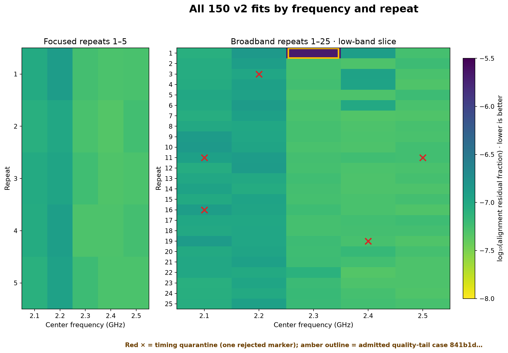
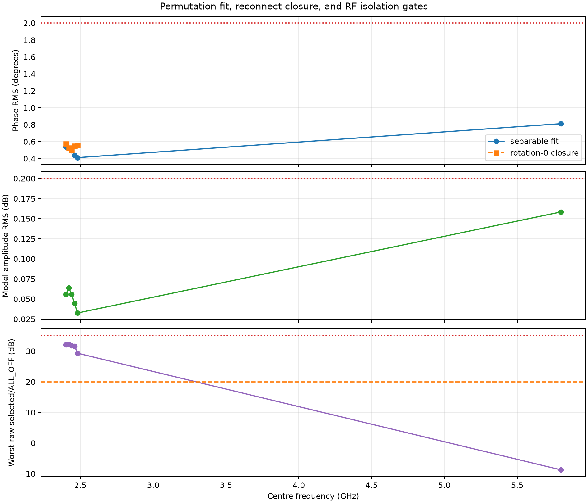
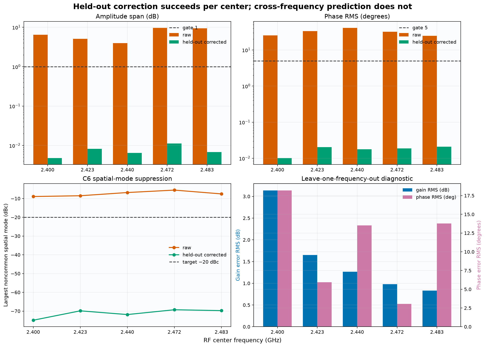
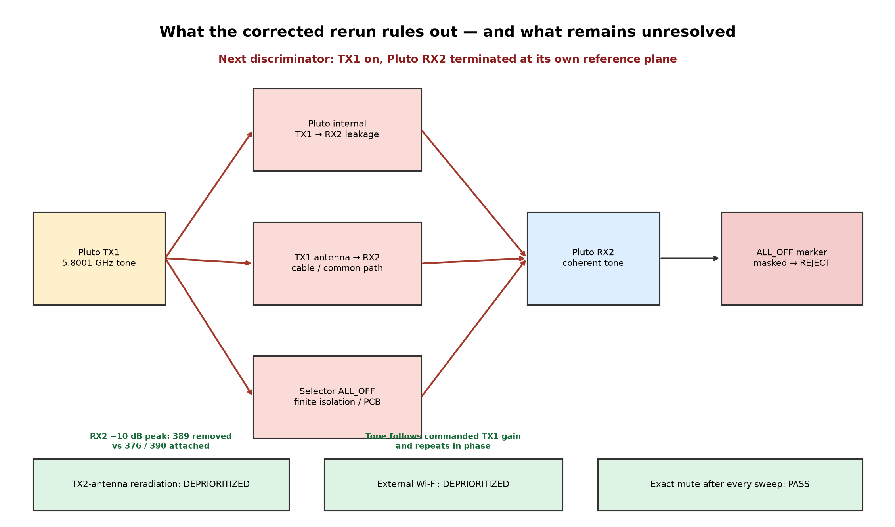

# Pluto RX2 eight-way selector: current calibration and direction-finding readiness

| Status date | Hardware | Overall conclusion |
|---|---|---|
| 2026-08-30 | Board `stm32c011-4c0055000950313950363920`, receiver Pluto `104000b29905000e17000800065934759d` | The acquisition and frequency-specific 2.4 GHz layers work; a corrected independent-source 5.8 GHz conducted campaign now supports engineering calibration, while production confidence-bound closure and general direction finding remain unqualified. |

## Executive status

The system can now make continuous, phase-sensitive, time-multiplexed
measurements through the eight-way RF selector and reject captures whose state
timing is not trustworthy. It also has two useful but distinct calibration
products:

1. a conducted board-path calibration at five centers from 2.400 to 2.480 GHz;
2. an end-to-end centered-source calibration for the six-element, 51 mm HexRay
   array at five exact 2.4 GHz centers.

Both products are frequency-specific and setup-specific. Neither is by itself
an angular direction-finding manifold. A new independent-source campaign now
resolves the earlier hidden-`ALL_OFF` problem and supplies engineering complex
corrections from 5.725 through 5.875 GHz. Those coefficients remain conducted-
fixture-specific, ANT3/ANT6 retain large loss penalties, and a single path-
length offset per antenna still does not explain the frequency response.

| Layer | Current state | Defensible use today |
|---|---|---|
| Selector firmware and capture continuity | Working and verified within the reviewed profiles | Bounded, fail-muted dual-RX acquisition with metadata-backed continuity; timing evidence remains profile-specific |
| Fast20 state alignment | Qualified for the reviewed conducted 2.1–2.5 GHz TX1 corpus | Strictly admit 145/150 captures; quarantine the other five |
| Eight-path board calibration | Qualified at 2.400, 2.420, 2.440, 2.460, and 2.480 GHz | Correct the conducted selector/PCB path at those exact centers |
| Six-element centered HexRay calibration | Qualified at 2.400, 2.423, 2.440, 2.472, and 2.483 GHz | Reproduce and normalize the centered TX1 manifold vector in the unchanged setup at those exact centers |
| Broadband stability | Strong descriptive evidence, with fixture-transfer drift | Use as a repeatability envelope; reanalyse the full corpus with current v2 timing before promotion |
| Conducted 5.725-5.875 GHz | Engineering-qualified on the corrected independent-source fixture | Frequency-indexed board/fixture correction for controlled experiments; production confidence bounds and installed-array calibration remain pending |
| Source bearing and position | Exploratory | No production angle or range result yet |

## Background and introduction

The RF board connects eight antenna inputs to one common receiver output. An
STM32 selects one input at a time while the Pluto records the common output on
RX2. This architecture turns one coherent receiver channel into a synthetic
array, but it introduces a requirement that a simultaneous array does not have:
every sample must be assigned to the correct physical antenna state.

Relative phase can contain source-direction information only after several
other effects are controlled:

- the IQ record must be continuous;
- the selector state and transition timing must be unambiguous;
- `ALL_OFF` leakage must be measured rather than hidden by subtraction;
- unequal switch, PCB, cable, connector, and antenna responses must be
  calibrated;
- frequency-dependent response and drift must be retained; and
- an angular model must be learned and tested at surveyed source positions.

The recent alignment work matters because a timing false lock can relabel an
active dwell as `ALL_OFF`. In the captured regression case that created the
appearance of an approximately 30 dB RF-isolation deterioration even though the
underlying RF transfer remained coherent. The current pipeline therefore treats
state timing as an independent admission gate, not as a detail inferred from a
good-looking phase result.

## Motivation and success criteria

The goal is an array that can eventually estimate the bearing of an emitter
without controlling that emitter. Reaching that goal requires the following
layers in order:

1. **Safe deterministic control:** boot and switch break-before-make, and leave
   the Pluto exactly muted after every bounded condition.
2. **Continuous acquisition:** retain enough kernel buffers and use FPGA sample
   sequence metadata to prove that no samples were dropped or spliced.
3. **Observable state identity:** decode a unique timing frame independently of
   the complex phase fit and fail closed on ambiguous or rejected markers.
4. **Complex RF calibration:** estimate gain and phase response at the relevant
   reference plane and frequency while retaining raw-isolation and SNR limits.
5. **Array manifold calibration:** measure the installed antennas, coupling,
   cables, and environment at known angles with blind holdouts.
6. **Bearing validation:** report angle error, ambiguity, SNR dependence, and
   calibration age on sources not used to fit the model.

The reviewed conducted Fast20 evidence supports the first four layers in its
bounded 2.4 GHz conditions. HexRay supports safe continuous capture,
RF-visible frame timing, and centered complex correction, but its RF-only
timing evidence does not independently identify GPIO codes, physical ports,
state order, or illegal-code absence. Layers five and six remain the main
direction-finding work.

## Current system

### Conducted Fast20 fixture

The arrangement used for the recent conducted corpus was:

```text
Pluto TX1
   |
   +-- 2-way splitter -- attenuated branch --> Pluto RX1 reference
   |
   +-- 8-way splitter --> board ANT1..ANT8
                              |
                        selector/common
                              |
                           Pluto RX2

Pluto TX2: muted and terminated
```

RX1 is a continuously illuminated conducted reference. The analysis forms the
coherent `RX2/RX1` transfer, so common transmitter and receiver phase is largely
removed. The result still contains the selected feed, switch, PCB, cable, and
any attached antenna/environment response appropriate to the experiment.

Some current reference-transfer sidecars inherit legacy prose that describes
RX1 as an OTA reference antenna. That wording is inaccurate for this conducted
splitter fixture. It does not change the recorded channel data, but the
reference role should become an explicit metadata field before the next
acquisition campaign.

The released `fast20-v1` profile has an 80 ms `ALL_OFF` marker body, 5 ms
break-before-make guards, and unique ANT1–ANT8 dwells of 20, 23, 26, 30, 34,
39, 44, and 50 ms. Its nominal cycle is 386 ms. Ten-second captures at 1 MS/s
contain about 25 complete frames and provide both timing and cycle-repeatability
evidence.

### High-rate six-element HexRay fixture

HexRay uses ANT1–ANT6 in clockwise order on a 51 mm diameter circle, with ANT1
forward. Its separate high-rate profile uses 200 µs active dwells and 20 µs
guards in an approximately 1.5 ms frame. The accepted v2.2 calibration placed
TX1 at the center and therefore measured one near-field manifold vector. It did
not measure the array response versus bearing.

The 20 µs guard is an explicit experimental, calibration-only waiver from the
released 5 ms break-before-make contract. It does not qualify a release
profile; verified Fast20 and `safe_hold` images remain the rollback targets.
No logic analyzer was connected. The paired RF-only timing captures qualify
RF-visible edges and durations, while code identity, active-port identity and
order, and illegal-code absence remain source- and flashed-hash-backed rather
than independently GPIO-observed.

Fast20 and HexRay have different timing contracts and evidence boundaries. A
result from one profile must not be used to infer state timing under the other.

## Methods currently in force

### Acquisition and safety

- Use the exact Pluto serial and the pinned `pluto-plus-utils` runtime.
- Start a fresh buffered stream with more than two kernel buffers.
- Prove continuity with metadata ABI 2 buffer and FPGA sample-sequence counters;
  host timestamps are not used to join records.
- Reject clipping, inadequate reference coverage, discontinuity, or an RF
  cleanup failure.
- Mute both transmitters and verify hardware gain and DDS-scale readback after
  every condition.

There is a deliberate runtime provenance boundary. Frozen HexRay v2.1–v2.4,
conducted permutation, and older localization artifacts attest
`pluto-plus-utils` revision `5551d29…`; strict low-band and broadband artifacts,
current code, and the clean runtime attest `dd48f2a…`. Reproduce every artifact
with its recorded code pair and use the current revision for new runs—never mix
the two.

Four of 764 attempts in the committed 20-pass broadband campaign ended with a
transient libiio `ENODATA` refill error. Each failed attempt was muted,
quarantined without an accepted artifact, and succeeded on retry. This is the
desired failure behavior: never splice or partially accept the interrupted IQ.

### Timing and state alignment

The current production reanalysis path:

1. detects the unique-dwell transitions;
2. independently estimates cycle and marker timing;
3. searches the decoder's bounded uncertainty neighborhood;
4. scores candidates using explained and residual energy, even/odd agreement,
   cycle coherence, and detection strength; and
5. requires decoder/fit agreement, zero rejected markers, sufficient complete
   cycles, and passing per-state tone quality.

`transition_seeded` is the production-script default. `exhaustive_fine` is the
offline correctness oracle, and `global_refined` is a diagnostic fallback that
does not override failed transition evidence. The lower-level convenience API
still defaults to `global_refined`; callers must not confuse that library
default with production admission policy.

On the captured false-lock regression, all corrected searches reach a combined
score of about `0.999999648`. Transition seeding evaluated 231 candidates in
1.91 s, compared with 79,130 candidates in 713.85 s for exhaustive search—about
373× faster on this artifact. This is a one-artifact benchmark, not a universal
runtime guarantee.

### Complex transfer and calibration

For each admitted dwell, the pipeline refines the pilot, estimates robust
complex RX1 and RX2 phasors, forms `RX2/RX1`, interpolates the nearby `ALL_OFF`
transfer, and subtracts that leakage phasor. Raw selected-to-`ALL_OFF` contrast
is retained as a separate quality quantity; subtraction does not prove good
physical isolation.

The conducted board calibration uses physical feed permutations to fit a
separable complex model:

```text
measured transfer = reconnect-common × splitter-feed-arm × board-path
```

Because every fitted mapping is cyclic, the complex phase solution has an
exact eight-way gauge ambiguity: a 45° per-port spatial ramp can move among the
feed, board, and reconnect terms without changing a measured phasor. The
released table selects the minimum reconnect-common-phase branch, supported by
RX1 and reconnect closure. It is not an independent identification of absolute
spatial phase; a held-out non-cyclic mapping is required before using that ramp
as direction-finding truth.

The centered HexRay calibration instead estimates the complete installed
six-element response, including cable, connector, board, antenna, coupling, and
local environment. It uses reordered rounds and held-out folds to distinguish
repeatability from fit quality.

These two correction tables have different reference planes. The centered
HexRay coefficients already contain the board path, so they must not be blindly
multiplied by the separate board-only correction.

## Committed evidence reviewed here

The committed evidence packages below overlap in places. Their capture counts
must not be added into one grand total.

| Evidence set | Data held | What it answers |
|---|---|---|
| Strict low-band v2 corpus | 150 unique conducted TX1 captures; 2.1–2.5 GHz in 100 MHz steps; 10 s at 1 MS/s; 11.176 GiB raw IQ | Whether current Fast20 timing and exact-tone quality are admissible |
| Rotation-0 broadband aggregate | 760 accepted captures from 20 × 38 points over 2.1–5.8 GHz, plus four quarantined/retried execution failures | Repeatability, fixture-transfer drift, and raw isolation; current-v2 timing audit is pending outside 2.1–2.5 GHz |
| Conducted permutation calibration | Three fitted mapping rounds—rotations 1, 2, and the final rotation-0 closure—plus an earlier held-out rotation-0 run at five 2.4 GHz centers; 5.8 GHz retained diagnostically | Separation of splitter-feed and board-path response |
| HexRay v2.2 | 30-condition stimulus screen, two timing streams with 300/300 cycles each, and 15/15 accepted calibration artifacts at five centers | High-rate timing and centered six-element complex correction |
| Exact-5.8 HexRay diagnostics | Four gain screens and 12 retained phase-only diagnostic trials | Localization of the leakage/observability failure |
| Earlier localization experiments | Multifrequency two-transmitter and RX1-reference captures, including a 42/42 finalized RX1 follow-up | Exploratory geometric identifiability and model rejection |

The strict low-band collector verifies raw-file presence and size plus agreement
among declared manifest, SigMF, and analysis hashes. It does not recompute the
content hash over all 11.176 GiB during every report check.

Additional raw runs exist on local Raspberry Pi storage, but they are not
enumerated here because no single frozen manifest currently defines that larger
corpus. This table describes committed evidence, not a total of every local
artifact.

## Results and current knowledge

### 1. Low-band state alignment now works

The current v2 analyzer strictly admits 145 of 150 reviewed low-band captures.
All 1,160 antenna-state estimates inside the admitted captures pass their
exact-tone gates. Admission by center is:

| Center | Admitted | Quarantined |
|---:|---:|---:|
| 2.1 GHz | 28/30 | 2 |
| 2.2 GHz | 29/30 | 1 |
| 2.3 GHz | 30/30 | 0 |
| 2.4 GHz | 29/30 | 1 |
| 2.5 GHz | 29/30 | 1 |

The five quarantines are timing rejections, not demonstrated RF failures. Each
has an excellent diagnostic global fit and all eight tone states pass, but the
independent decoder retained one rejected marker. They remain non-promotable.

Across admitted captures, the combined score is
`0.999923671–0.999999917`, the minimum explained fraction is `0.999997912`,
the maximum residual fraction is `2.0878×10⁻⁶`, minimum state SNR is
`49.20 dB`, minimum state coherence is `0.99987885`, and maximum state phase
spread is `0.9716°`.



### 2. The selector PCB is calibratable around 2.4 GHz

The conducted permutation experiment qualifies board-path corrections at
2.400, 2.420, 2.440, 2.460, and 2.480 GHz. Across the five centers:

- model residual is `0.033–0.064 dB RMS` and `0.411–0.538° RMS`;
- held-out reconnect closure is `0.026–0.038 dB RMS` and
  `0.498–0.575° RMS`; and
- minimum raw selected-to-`ALL_OFF` contrast is `29.32–32.23 dB`, giving a
  worst-case coherent leakage floor of roughly `1.4–2.0°`.

The calibration corrects the conducted board path relative to ANT1. It does not
calibrate an antenna phase center, unequal external antenna cable, or OTA
environment. Software gain correction also cannot recover SNR lost in a weak
physical path; downstream estimators should retain per-port noise weights.

The cyclic 45° phase-ramp ambiguity described in the method is harmless for the
reported fit and reconnect closure, but it matters if the board table is treated
as absolute spatial phase. One non-cyclic swap and blind holdout should resolve
that branch before direction-finding use.



### 3. The `ALL_OFF`-subtracted fixture transfer is repeatable, but it drifts

In the committed 20-pass broadband aggregate, every 3.6–5.8 GHz point has 20/20
captures in the earlier unambiguous alignment class. Across that band, relative
phase standard deviation has median `0.0816°`, p95 `0.2098°`, and maximum
`0.5302°`; amplitude standard deviation has median `0.01254 dB`, p95
`0.05541 dB`, and maximum `0.10805 dB`.

Over the approximately 12 h 52 min observation window, the worst first-to-last
changes reach `1.3783°` and `0.21774 dB`. ANT6 produces the worst long-window
phase and amplitude cases. This supports a calibration-age limit and a short
control measurement after cable movement or temperature change.

These high-band statistics remain useful repeatability evidence, but the full
2.6–5.8 GHz corpus has not yet been audited with the current strict v2 timing
pipeline. The old report's low-band alignment classifications are superseded by
the current v2 review; they should not be used as present admission decisions.

### 4. The centered six-element array is repeatably correctable at measured centers

Both HexRay v2.2 RF-only timing streams passed with 300/300 decoded cycles.
Separately, all 15 calibration artifacts passed with zero retries. This
qualifies exact-center corrections at 2.400, 2.423, 2.440, 2.472, and
2.483 GHz within the evidence limits above.

The uncorrected installed array is not electrically symmetric: raw gain span is
`3.951–9.679 dB`, and raw phase RMS is `24.66–41.01°`. After applying each
frequency's own correction, independent held-out gain span is
`0.0048–0.0112 dB`, held-out phase RMS is `0.0102–0.0210°`, and the largest
non-common spatial mode is `-74.87` to `-69.29 dBc`.

This demonstrates excellent short-term correction of the unchanged centered
setup. It does not demonstrate angular accuracy. The centered transmitter
excites only one near-field manifold vector.



### 5. Frequency response cannot be reduced to one path length

The centered coefficients change sharply across only 83 MHz. Leaving one
frequency out produces as much as `3.14 dB RMS` gain error and `18.19° RMS`
phase error. A fixed relative-delay fit leaves `12.29–18.91° RMS` phase residual
for ANT2–ANT6, including a shared curved excursion at 2.440 GHz.

The current calibration representation must therefore remain a per-frequency
complex table. Sparse wrapped-phase interpolation and one scalar cable/path
length per antenna are both rejected by the data.

### 6. Corrected independent-source 5.8 GHz campaign works

The earlier same-radio fixture was leakage-limited: its commanded tone appeared
strongly on RX2 even with RX2 terminated, and an initially terminated or
misconnected downstream path made selected states indistinguishable from
`ALL_OFF`. Those results remain valid evidence about that contaminated fixture,
not about the selector's intrinsic ability to operate at 5.8 GHz.

The corrected campaign used `.173` as an independent TX1 source and `.15` as the
simultaneous RX1/RX2 receiver. Across 381 captures, seven frequencies, five power
levels, and ascending/descending sweeps, every selected path was observable and
every run ended exactly muted in `ALL_OFF`. Worst selected repeatability was
0.073 dB and 0.416 degrees; reverse-sweep closure was 0.084 dB and 0.714 degrees.
Point-estimate selected/`ALL_OFF` contrast ranged from 23.63 to 40.01 dB.

ANT3 and ANT6 remain 6.4-10.5 dB weaker than the ANT8 reference depending on
frequency. The campaign therefore supports frequency-indexed engineering
correction, but not yet production deployment: the formal lower-confidence-
bound release gate was not computed, several weak-path cells miss the 35.1629 dB
one-degree leakage objective, and the installed antenna array is not calibrated.
See the complete report in
[`docs/5g8_external_fixture_campaign/`](../5g8_external_fixture_campaign/README.md).



### 7. Direction finding is not yet production-ready

Earlier multifrequency phase experiments support one conditional conclusion:
with TX1 fixed to an experimental anchor, TX2 fell in a lower-right sector of
roughly `18.8–35.4°`. Its radius was dominated by the prior, and the joint
direct-path model had about `53.9°` weighted RMS residual. This is not a metric
position calibration. It came from the older eight-whip PCB-layout experiment,
whose top-view convention was +x right and +y down; it is not HexRay bearing
evidence and must not be transferred to the six-element geometry.

The RX1-reference follow-up acquired 42/42 continuous artifacts, but every
frequency failed the predeclared cross-state free-space coherence gate. No RX1
coordinate or range was accepted. These results show that repeatable phase is
not enough: the geometric model and array manifold must also be valid.

## What works, what does not, and what remains unknown

| Category | Current knowledge |
|---|---|
| **Works** | Safe deterministic selector control; bounded fail-muted dual-RX acquisition; continuity proof; strict low-band conducted state alignment; exact-tone complex transfer; board-path correction at five 2.4 GHz centers; corrected-fixture engineering correction at seven 5.8 GHz-band centers; centered HexRay correction at its five exact 2.4 GHz centers |
| **Rejected or unsafe today** | Greedy single-basin timing alignment can succeed but is unsafe for admission; `ALL_OFF` subtraction is not proof of raw isolation; one static delay per antenna and sparse cross-frequency interpolation fail these data; the old same-radio 5.8 GHz coefficients remain rejected; the direct-CW free-space solver failed in the unsurveyed, unmodelled setup |
| **Unknown / not yet qualified** | Current-v2 yield over 2.6–5.8 GHz; TX2-specific behavior; another board or Pluto; response after cable/antenna/environment movement; realistic modulated or uncontrolled emitters; known-angle bearing error and ambiguity |

## Recommended operating envelope today

For defensible experiments now:

- work at an exact measured 2.4 GHz calibration center;
- keep board, Pluto, cables, splitters, antennas, polarization, and geometry
  unchanged and record their identities;
- choose the correction table matching the intended reference plane—board-only
  or end-to-end array—and do not double-correct;
- use current transition-seeded timing admission and quarantine any rejected
  marker or decoder disagreement;
- retain raw `ALL_OFF` contrast, SNR, coherence, and per-port weights in every
  result;
- perform a fresh control capture after movement or significant elapsed time;
  and
- describe any bearing output as experimental until it passes surveyed angular
  holdouts.

Do not represent the 5.8 GHz engineering coefficients as production or installed-
array calibration, interpolate the sparse HexRay table, infer physical cable
length from fitted phase, or report phase-likelihood radius as measured range.

## Prioritized next steps

1. **Reanalyse the full stored broadband corpus with current v2 timing.** Write
   separate v2 sidecars, preserve canonical analyses, and update the broadband
   aggregator to consume current decoder and quality evidence. Parameterize the
   RX1 reference role so new conducted sidecars no longer inherit OTA-reference
   wording.
2. **Localize the remaining ANT3/ANT6 loss.** With both radios muted, swap only
   the selector-end cables `ANT1 <-> ANT3` and `ANT8 <-> ANT6`, then repeat those
   four states. The loss following a cable implicates the splitter output/cable;
   the loss remaining on a selector state implicates that PCB launch/switch path.
3. **Resolve the conducted phase branch.** Add one non-cyclic feed-to-port
   mapping, such as a single F1/F2 swap, and keep it blind while choosing among
   the eight equivalent 45° spatial-ramp branches.
4. **Characterize 2.4 GHz frequency structure densely.** Acquire paired,
   immutable 2.400–2.483 GHz sweeps at about 1–2 MHz spacing: one through the
   conducted board fixture and one with the centered HexRay. Fit group delay
   plus a dispersive residual and validate by held-out frequency. Their
   comparison can diagnose where structure enters, but it is not de-embedding:
   assign a residual to antenna coupling or environment only after a dense
   permutation or characterized-through measurement establishes matched
   reference planes.
5. **Build a surveyed angular manifold.** Immobilize and survey antenna and
   emitter phase centers in x/y/z. Begin with at least four non-collinear
   positions as a geometry discriminator, then cover the intended 360° field at
   roughly 10–15° spacing, multiple frequencies, and repeated captures. Hold
   complete bearings—not repeated samples at fitted bearings—out of training.
6. **Validate the bearing estimator.** Report median and p95 angular error,
   multimodal ambiguity, SNR dependence, interference sensitivity, and
   calibration-age drift. Inspect the ANT6-associated conducted fixture
   chain—feed arm, cable, connector, and board path—first.
7. **Expand only after the baseline passes.** Test TX2, realistic or modulated
   emitters, controlled interference, and a second board/Pluto without relaxing
   admission gates.

For emitters that cannot be controlled, the eventual online estimator will
need signal features that remain coherent across switched dwells or a reference
channel that observes the emitter continuously. The existing conducted tone
pipeline proves the instrumentation and calibration mechanics; it does not yet
solve that signal-identification problem.

## Evidence and detailed reports

- [Current strict alignment validation](../schedule_alignment_red_green/README.md)
- [Per-capture low-band evidence](../schedule_alignment_red_green/data/capture-evidence.json)
- [Conducted eight-path calibration](../closed_loop_permutation_calibration/README.md)
- [Broadband rotation-0 repeatability](../closed_loop_frequency_sweep_repeatability/README.md)
- [HexRay centered calibration and 5.8 GHz experiments](../hexray_tx_in_middle_calibration/README.md)
- [Inverse path-length analysis](../hexray_tx_in_middle_calibration/path_length_inverse_report.md)
- [Localization experiment report](../localization/phase-localization-experiment-report-20260825.md)

At this snapshot the repository passes 463 tests, full Ruff checks, and strict
mypy over the package and report tooling. The strict low-band evidence and its
four source figures also regenerate successfully from the committed compact
data.
