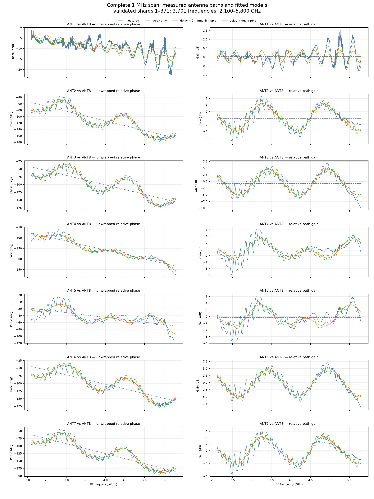
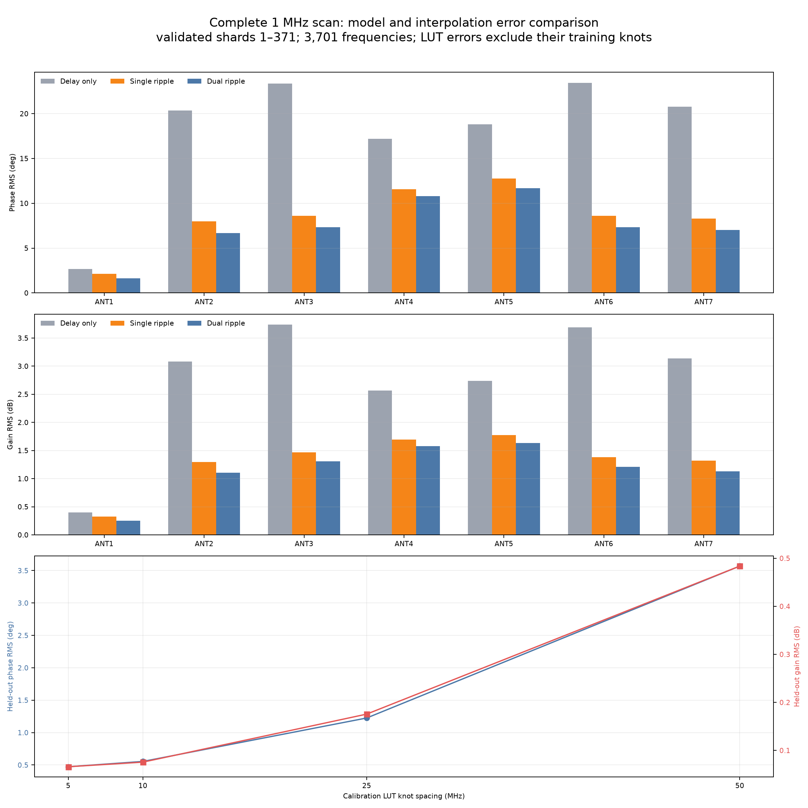
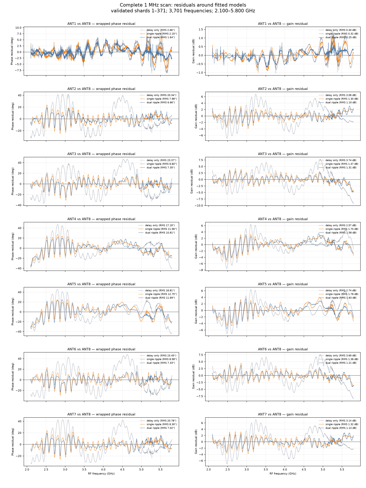
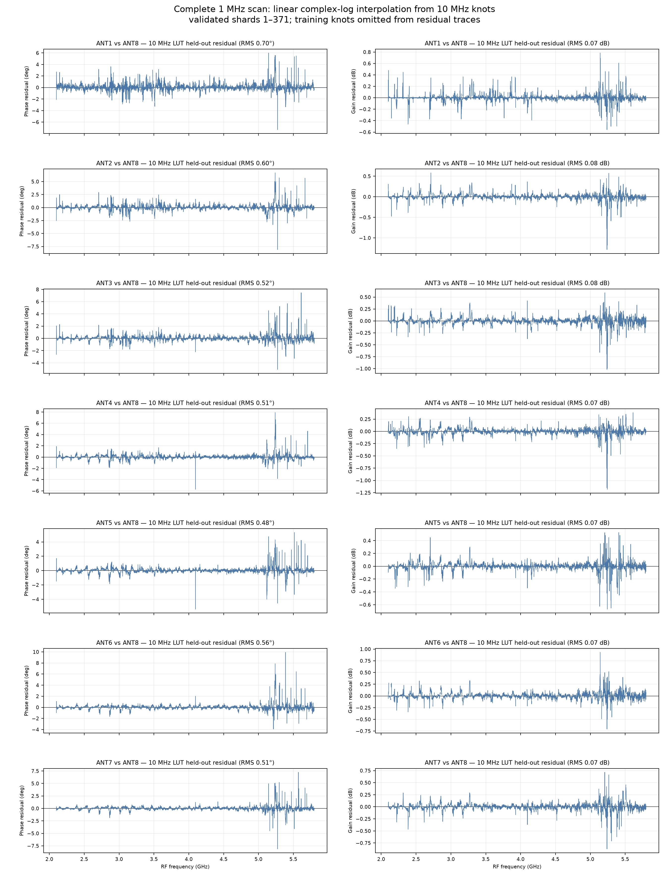

# Dense 1 MHz conducted calibration campaign

Date: 2026-09-01

## Outcome

The independent-source fixture completed one exact 1 MHz sweep from 2.100 through 5.800 GHz.
All 371 acquisition shards and all 33,309 requested captures passed the per-shard lattice,
analysis, and final-safety validator. The completed campaign contains 3,701 frequencies and the
nine states `ALL_OFF, ANT1, ..., ANT8` at every frequency.

The main calibration result is unambiguous:

- one gain, phase, and path delay per port is not an adequate broadband model;
- adding one or two empirical ripple timescales improves the descriptive fit but still leaves
  7.50 degrees and 1.17 dB mean path RMS for the best compact model tested;
- linear interpolation of measured complex-log coefficients at 10 MHz knots predicts the omitted
  1 MHz points with 0.555 degrees and 0.0756 dB mean path RMS; and
- 5 MHz knots improve this only modestly, to 0.473 degrees and 0.0660 dB, while 25 and 50 MHz
  spacing are progressively worse.

The practical provisional representation is therefore a frequency-indexed complex table with no
more than 10 MHz knot spacing. It must not yet be called an intrinsic PCB or installed-array
calibration: this is one ascending sweep through the simultaneous eight-way splitter fixture. It
contains splitter arms, cables, launches, mismatch interactions, selector paths, and the receiver
reference planes. No same-frequency repeatability, reconnect, temperature, or OTA angular
holdout was acquired in this campaign.

## Exact campaign and validation

```text
source .173 TX1
        |
        +-- two-way splitter -- 10 dB attenuator --> receiver .15 RX1
        |
        +-- eight-way splitter --> board ANT1..ANT8
                                      selector common --> receiver .15 RX2

source .173 TX2: terminated and exactly muted
receiver .15 TX1/TX2: exactly muted
```

| Quantity | Result |
|---|---:|
| Frequency lattice | 2.100–5.800 GHz inclusive, exact 1 MHz step |
| Frequencies | 3,701 |
| Selector states per frequency | 9 |
| Validated captures | 33,309 |
| Raw-IQ files present and count-checked | 33,309 |
| Raw-IQ bytes | 139,724,659,818 |
| Shards | 371/371 |
| Analysis errors | 0 |
| Maximum ADC component | 1,697 counts |
| Run-manifest SHA-256 | `d67b12d1965ed5ac0ea1efcc79d57369af7e28ec3ca3d38dff85a2c9804f4536` |
| Campaign-plan SHA-256 | `fe5ca98010e7dc68c26a4e745c67ce18fe5d00047102b28dc05a217ad912ccf9` |

Receiver `.15` was serial `104000b29905000e17000800065934759d`; source `.173` was serial
`104473b80a16000de6ff2000f8a6beca79`. The source used TX gain −40 dB, 2 MS/s, 1.6 MHz RF
bandwidth, 262,144 complex samples per channel, and a nominal +100 kHz pilot.

One first attempt at shard 18 was excluded after an empty IIO refill at capture 78. Its exact
cleanup passed and none of its observations entered the manifest. The bounded refill retry was
then extended to cover both transient `EBUSY` and empty refills; shards 18–371 completed with the
new source hash recorded in the immutable campaign plan.

Every accepted observation records exact receiver/source mute after capture. Every shard records
both radios at −80 dB with all eight DDS scales zero and a lease-free selector `ALL_OFF`. A fresh
read-only check after the campaign independently confirmed those same radio states and selector
code 8 with zero remaining lease and no active guard or invalid-command flag.

## Measured response

For each selected input, the analysis removes the measured simultaneous-fixture background and
normalizes to ANT8:

```text
R_i(f) = (H_i(f) - H_ALL_OFF(f)) / (H_ANT8(f) - H_ALL_OFF(f))
```

This subtraction is an estimator definition, not proof of physical isolation. A large coherent
background can still impose a systematic phase floor after subtraction.



The response has two visually distinct structures. ANT2–ANT7 contain a broad multi-GHz envelope
plus faster comb-like ripple; the fast ripple grows especially visible around 2.4–3.4 GHz and
again above 5 GHz. ANT1 is much smoother. A pure delay can create only a straight unwrapped-phase
slope and constant gain, so it cannot describe either structure.

## Compact models versus a measured table

All compact-model numbers below are residuals on the same frequencies used for fitting; they are
descriptive fit quality, not future-sweep validation. The table-interpolation numbers are stricter:
the listed knot frequencies are removed before scoring the remaining measured 1 MHz points.

| Representation | Mean path phase RMS | Mean path gain RMS | Evidence role |
|---|---:|---:|---|
| Gain/phase + delay | 18.085° | 2.7648 dB | Same-data compact fit |
| Delay + one two-harmonic ripple | 8.560° | 1.3225 dB | Same-data compact fit |
| Delay + two two-harmonic ripples | 7.501° | 1.1731 dB | Same-data compact fit |
| 50 MHz complex-log LUT | 3.569° | 0.4837 dB | Held-out 1 MHz frequencies |
| 25 MHz complex-log LUT | 1.225° | 0.1756 dB | Held-out 1 MHz frequencies |
| **10 MHz complex-log LUT** | **0.555°** | **0.0756 dB** | Held-out 1 MHz frequencies |
| 5 MHz complex-log LUT | 0.473° | 0.0660 dB | Held-out 1 MHz frequencies |



The 10 MHz LUT has a global absolute phase-error p95 of 0.923° and p99 of 2.268°. Its largest
single held-out phase error is 9.919° at ANT6 and 5.387 GHz; its largest gain error is 1.284 dB at
ANT2 and 5.238 GHz. Five MHz spacing leaves essentially the same largest phase outlier, so that
cell is more consistent with a locally unstable capture or a very narrow feature than ordinary
undersampling. A repeat sweep is needed to distinguish those cases.

High-band quality is lower than the aggregate result. For 10 MHz interpolation, the mean path
phase/gain RMS is 0.375°/0.0585 dB below 5.0 GHz and 0.944°/0.118 dB from 5.0 through 5.8 GHz.
The narrower 5.4–5.8 GHz interval is better at 0.665°/0.0793 dB, but it still contains isolated
outliers.





## Interpretation

The dual-ripple model is useful for diagnosis, not calibration. Its fitted timescales vary across
ports and have harmonic/subharmonic ambiguity. They show that more than one electrical round trip
is present, but they do not uniquely locate either reflection. The common fast scale near 3.7 ns
seen on several paths is compatible with fixture/cable-scale interaction; slower scales around
0.3–0.65 ns are compatible with shorter PCB/launch structures. This is inference from response
shape, not physical attribution.

The all-eight-input fixture is intrinsically unable to separate those contributors. Every splitter
output remains connected while the selector changes state, so off-port return loss and coherent
multiport reflections can alter the selected transfer. A smooth software table can calibrate this
exact assembly, but it cannot prove that the same coefficients survive cable rearrangement or an
installed antenna array.

The 10 MHz table is the useful engineering product from this campaign. Five MHz spacing gives only
a small aggregate improvement and doubles storage and calibration time. A production table should
store a complex coefficient, uncertainty, physical-contrast limit, and health flag per port and
frequency. Interpolate unwrapped log magnitude/phase locally; do not use the compact ripple model
as the correction authority.

## Recommended next experiments

### 1. Establish temporal stability before changing hardware

Run three 10 MHz-grid sweeps without touching the fixture, then one after a full radio/selector
power cycle and one after a controlled reconnect. This is about 1/10 the cost of the dense scan
while sampling the proposed production knots directly. Report per-cell circular phase and gain
span, not only an aggregate RMS. The current table is promotable only if a later-sweep blind
holdout closes near 2°/0.2 dB p95 and the worst cells are explicitly rejected or downweighted.

Also repeat 5.20–5.60 GHz at 1 MHz around the observed outliers. If the 5.387 GHz ANT6 feature
moves between repeats, it is instability; if it repeats at the same frequency, it is real narrow
structure requiring denser knots or a physical fix.

### 2. Separate fixture arms from PCB paths

Replace the simultaneous eight-way drive with a one-hot conducted matrix:

- drive exactly one board input at a time and terminate the other seven with characterized 50-ohm
  loads;
- keep the board common connected to RX2 and the split reference connected to RX1;
- acquire all eight driven-input × nine selector-state cells;
- repeat with at least two feed-to-board permutations, including one non-cyclic swap; and
- retain a through/reference measurement for every reconnect.

Fit a separable complex model `measurement = reconnect × feed arm × PCB path`. The non-cyclic
mapping is important because cyclic rotations alone retain an exact 45° spatial-ramp ambiguity.
Then restore the eight-way splitter and test whether the vector sum of one-hot paths predicts the
simultaneous fixture. Closure localizes the response to stable linear paths; failure implicates
splitter/load interaction, common pickup, or state-dependent mismatch.

### 3. Perturb the suspected reflection deliberately

Perform a small factorial experiment at 2.4–3.4 and 5.2–5.8 GHz:

1. baseline;
2. add a characterized 3 dB pad at the PCB common port;
3. change exactly one feed cable by a known electrical length;
4. substitute the eight-way splitter; and
5. repeat the one-hot measurement with all unused inputs terminated.

A pad that suppresses ripple supports a mismatch loop. A feature that shifts with cable electrical
length is external. A feature that remains fixed in the board-only, calibrated-plane measurement
is PCB/switch/launch-local. Do not infer distance from an unconstrained harmonic fit when this
direct perturbation is available.

### 4. Measure the PCB with a true vector network analyzer

Calibrate at the SMA mating planes and measure complex S-parameters on a 1 MHz grid. Record the
eight selected S21 paths, eight input S11 values, common-port S22, eight `ALL_OFF` leakages, and
the useful wrong-state/input-to-input cells with every unused port terminated. Use time-domain
gating if the instrument supports it.

The [tinySA Ultra](https://www.tinysa.org/wiki/) is valuable here as an independent spectrum
analyzer for leakage, source spurs, power linearity, and near-field probing. A tinySA Ultra alone
is not a full complex two-port VNA;
the board-delay and reflection-localization experiment requires an instrument that exports
calibrated complex S11/S21 through 5.8 GHz. If the available unit is a separate VNA packaged with
the tinySA, first verify its calibrated upper frequency and Touchstone export.

### 5. Use an external array carrier, not the PCB connector positions, as geometry

The selector board should be calibrated at its SMA planes. Equal-length, identified coax jumpers
should then connect it to a surveyed antenna carrier. That keeps PCB electrical correction separate
from antenna positions, cable flex, antenna phase centers, and mutual coupling.

For a new carrier, use roughly 24 mm adjacent spacing to retain margin below half a free-space
wavelength at 5.8 GHz:

| Geometry | Suggested dimensions | Strength | Principal limitation |
|---|---|---|---|
| Existing six-element circle | Current 25.5 mm radius | Fastest path using HexRay hardware/software | Only six switched elements; almost exactly half-wave spacing at 5.8 GHz |
| New six-element circle | 24 mm radius | Simple 360° symmetric manifold | Small aperture below 3 GHz |
| New eight-element circle | 31.4 mm radius, 24 mm adjacent chord | Best use of all eight ports for 360° azimuth | More coupling and a larger manifold to calibrate |
| Eight-element line | 24 mm pitch, 168 mm end-to-end | Easiest diagnostic phase ramp and best one-axis aperture | Front/back ambiguity and poor endfire conditioning |

Build the linear carrier first as a calibration/debug standard: its plane-wave phase progression is
simple and port reversals are easy to diagnose. Use the eight-element circle as the likely final
360° tracker once the electrical layer passes. The existing six-element HexRay remains the fastest
way to prove an OTA pipeline before fabricating a new carrier.

### 6. Calibrate the installed array manifold

Connect a separate, continuously illuminated reference antenna directly to RX1. The eight-way
board continues to switch the array elements into RX2. For a narrowband emitter, dividing every
selected RX2 phasor by simultaneous RX1 cancels transmitter phase drift across the switched frame.
Without that live reference, an unknown emitter must remain phase coherent across the entire scan,
which is not a robust tracking assumption.

On a surveyed turntable or outdoor range, acquire forward and reverse angular sweeps at 5° or 10°
increments, at several frequencies and powers, with at least three independent repeats. Reserve
angles, frequencies, a later time, and a power cycle as blind holdouts. Fit the measured complex
array manifold rather than forcing an ideal isotropic plane-wave model; the installed pattern,
mutual coupling, cables, and mounting structure are part of the operational response.

The acceptance report should include bearing RMS/p95/max, front/back or grating-lobe ambiguity,
phase/gain repeatability, selected-to-`ALL_OFF` physical contrast, SNR dependence, temperature,
reconnect, and calibration age. Require at least 35.2 dB desired-path physical contrast when the
goal is to bound worst-case coherent leakage below approximately one degree.

## PCB changes to consider only after localization

If the one-hot/VNA work leaves the dominant structure on the PCB, a v6 should prioritize:

- equal electrical length, identical bend/via/launch count, and tighter launch symmetry on all
  selected RF paths;
- dense ground-via fencing and a verified low-inductance exposed-pad/ground implementation around
  the switch and common launch;
- an absorptive or otherwise better-isolated switch architecture, or staged switching when the
  extra insertion loss is acceptable;
- provision for a bonded RF shield and for probing the common and switch supply/ground regions;
- explicit 50-ohm termination of inactive paths where the switch architecture permits it; and
- a calibration coupon or reference path that uses the same stackup and launch geometry.

At 5.8 GHz and the released effective permittivity, one millimetre of PCB path is approximately
12 degrees. Length matching reduces correction size, but it does not replace measurement: switch,
launch, connector, assembly, antenna, and mutual-coupling phase remain.

## Reproduction

The report data contain all 371 admitted `run.json` paths and SHA-256 values. Raw IQ remains in the
local campaign store and is not committed to Git.

```bash
CAMPAIGN=/home/mouse9911/.local/state/smateway/lab-runs/network-192.168.1.15/dense-1mhz/20260831T054513.429239269Z

uv run python scripts/render_dense_1mhz_snapshot.py \
  "$CAMPAIGN" \
  docs/dense_1mhz_campaign/png \
  --evidence-json docs/dense_1mhz_campaign/data/campaign-results.json \
  --max-shard 371
```

The renderer admits only one exact contiguous manifest prefix, re-hashes every `run.json`, checks
the exact observation lattice and transfer fields, and rejects any stored shard without final
safety or with an analysis error.
