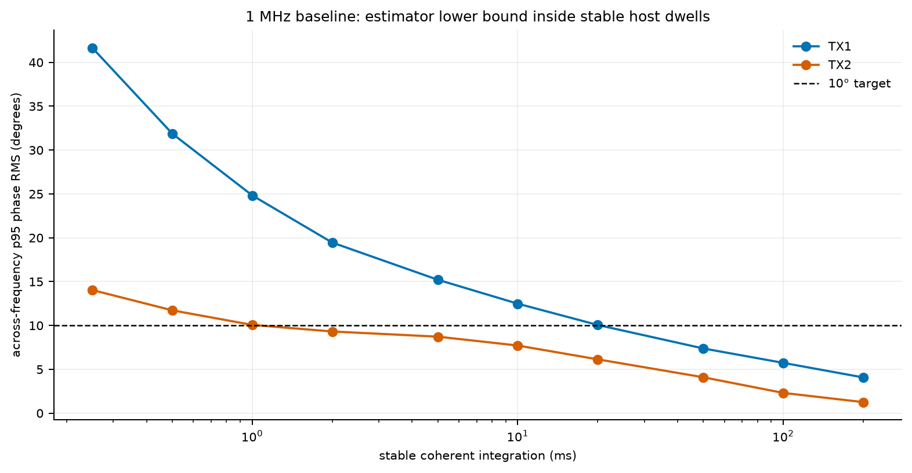
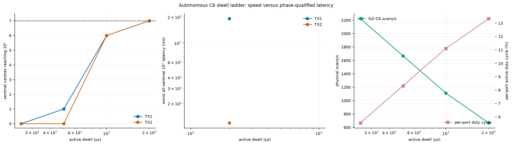
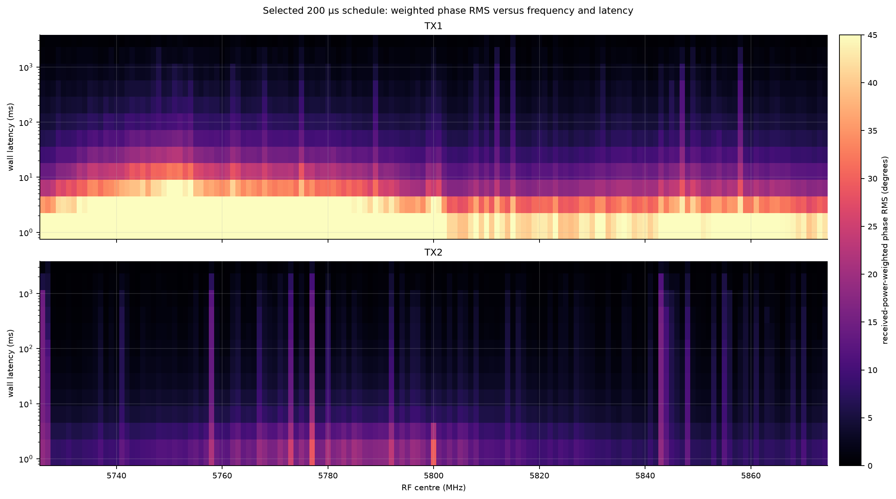
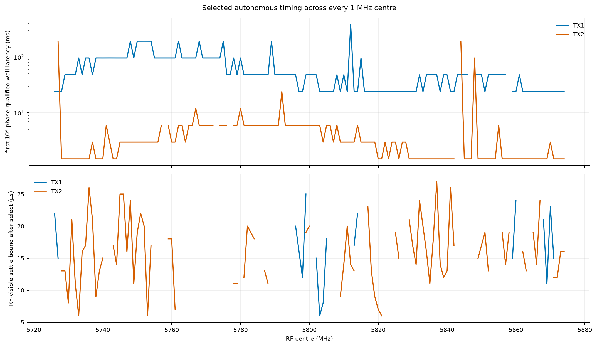
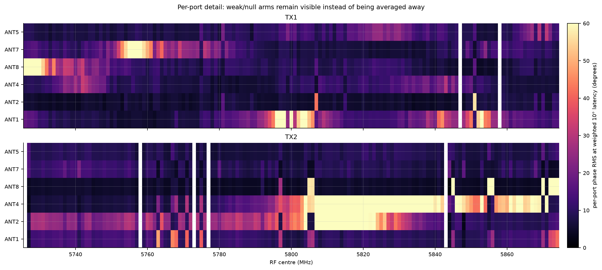
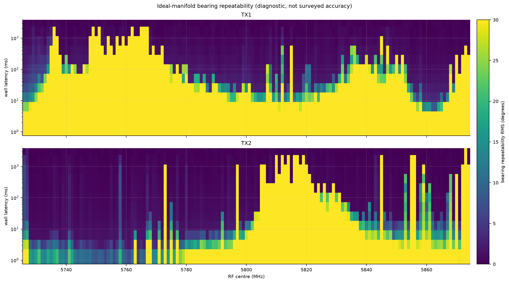
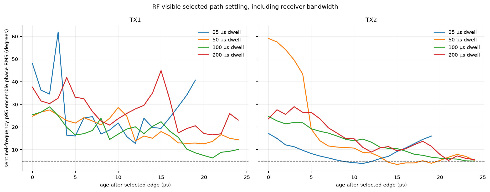
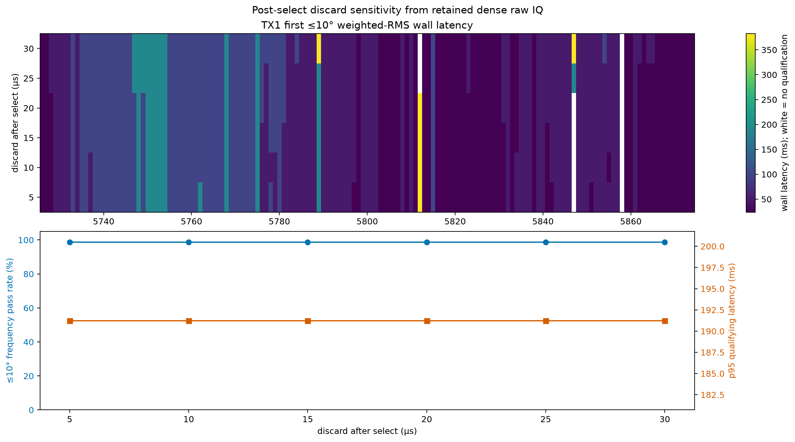
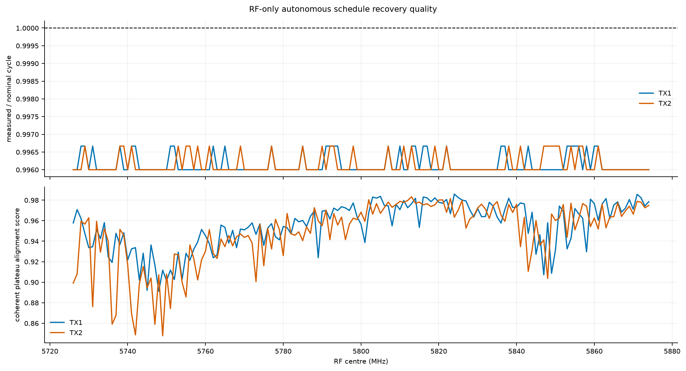
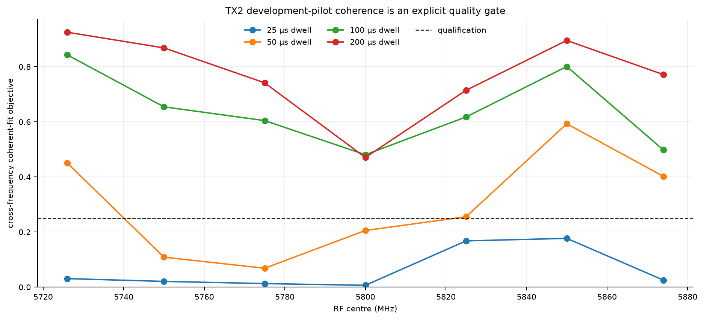

# Dense 1 MHz autonomous C6 switching campaign

Date: 2026-09-03

## Outcome

The campaign first measured the estimator floor at every 1 MHz centre from 5.726 through
5.874 GHz with long, host-controlled dwells. It then tested autonomous C6 schedules at
25, 50, 100, and 200 µs on seven sentinel frequencies, selected **200 µs** by a
predeclared worst-frequency phase-RMS rule, and repeated that schedule at all 149 centres
for both TX1 and TX2.

The result separates four quantities that must not be conflated: the 20 µs passive
break-before-make interval, RF-visible response settling after a path is selected, the active
dwell, and the multi-cycle coherent integration needed to reach a phase-RMS target. A fast
selector can revisit all ports rapidly even when a weak signal needs many revisits before a
bearing is emitted.

## Exact autonomous schedules

Every schedule uses the physical clockwise array order `ANT1, ANT2, ANT4, ANT8, ANT7, ANT5`,
a 180 µs frame marker, and a 20 µs `ALL_OFF` guard before each active state.

| Active dwell (µs) | Guard (µs) | Full cycle (µs) | Ideal C6 scans/s | Per-port duty |
| ---: | ---: | ---: | ---: | ---: |
| 25 | 20 | 450 | 2222.2 | 5.56% |
| 50 | 20 | 600 | 1666.7 | 8.33% |
| 100 | 20 | 900 | 1111.1 | 11.11% |
| 200 | 20 | 1500 | 666.7 | 13.33% |

The 20 µs guard is an experimental campaign waiver. It does not replace the released 5 ms
transition guard until independent GPIO/logic-analyzer and environmental qualification closes.

| Dwell µs | Src | Fit | ≤10° | Worst ms | Max p95° | Wt p95° | Settle n | Settle p95µs |
| ---: | :--- | ---: | ---: | ---: | ---: | ---: | ---: | ---: |
| 25 | TX1 | 7/7 | 0/7 | — | 103.85 | 99.62 | 3/7 | 9.9 |
| 25 | TX2 | 0/7 | 0/7 | — | 103.34 | 98.84 | 7/7 | 13.7 |
| 50 | TX1 | 7/7 | 1/7 | 76.5 | 102.38 | 93.08 | 4/7 | 17.6 |
| 50 | TX2 | 4/7 | 0/7 | — | 98.74 | 88.93 | 7/7 | 18.1 |
| 100 | TX1 | 7/7 | 6/7 | 230 | 103.02 | 79.93 | 4/7 | 16.5 |
| 100 | TX2 | 7/7 | 6/7 | 459 | 93.47 | 42.51 | 6/7 | 23 |
| 200 | TX1 | 7/7 | 7/7 | 191 | 101.25 | 71.14 | 1/7 | 18 |
| 200 | TX2 | 7/7 | 7/7 | 12 | 89.32 | 28.64 | 5/7 | 15.8 |

Selection minimized worst-sentinel wall latency with at least eight independent groups per
frequency; a tie would favor the shorter dwell. Qualification uses received-power-weighted phase
RMS, because an antenna in a physical signal null has undefined phase and must not determine the
selector clock. Maximum-port and maximum-observable-port RMS remain in the CSV and per-port figure.
Ideal-manifold bearing validity is also reported separately: it tests the present OTA calibration
and room, not switch timing. This optimizes time-to-reliable-vector, not the largest headline scan
rate.

The runner allowed at most three attempts per condition. It retained **3** failed
capture attempt(s) as negative evidence; only independently passed retries enter the timing and RMS
statistics. A condition that failed all three attempts would have stopped the campaign.

## Full 1 MHz result at the selected schedule

| Src | ≤10° | Fit | Median ms | p95 ms | Max ms | Settle p95µs | Settle n | Bearing valid |
| :--- | ---: | ---: | ---: | ---: | ---: | ---: | ---: | ---: |
| TX1 | 147/149 | 149/149 | 47.8 | 191 | 382 | 26 | 27/149 | 49.0% |
| TX2 | 144/149 | 149/149 | 2.99 | 5.98 | 191 | 24.2 | 96/149 | 44.3% |

The stable-dwell replay is an estimator lower bound. The autonomous result includes periodic
marker/guard overhead, real switching, RF filtering, and phase aggregation across revisits.
RMS is calculated independently per port against that port's full-capture complex reference;
the qualification aggregate weights those errors by coherent received power. This is the correct
array-processing limit: a null arm contributes almost no useful likelihood information, while its
raw RMS still remains visible for diagnosis.

The per-port heat map is the companion to the weighted qualification map. It makes deep/null arms,
frequency-local fades, and any persistently weak PCB path visible rather than silently averaging
them away. Exact values, observability flags, single-visit coherent SNR, and complex-reference
magnitudes are in `data/dense_port_metrics.csv`.

## Direction-finding diagnostic

These are ideal far-field manifold diagnostics after applying the PCB complex LUT. The antenna
positions were approximate (TX1 near 90°, TX2 near 180°), not surveyed calibration points, so
bearing repeatability and likelihood validity are meaningful while absolute angle error is not
yet a production accuracy claim. Installed antennas, final cables, mutual coupling, mounting,
and room multipath remain in the measured vector.

The 5.763–5.765 GHz region is an especially useful counterexample: TX1 switching phase reaches the
10° timing gate, yet the ideal-manifold solution remains invalid and ambiguous. A stable switched
vector can disagree with a wrong spatial model. Faster firmware or more averaging cannot repair
that; the next direction-finding step is a surveyed empirical installed-array manifold.

## What “switch settling” means here

The RF settling trace advances in one-microsecond steps and uses a five-microsecond coherent window
after every selected edge, then compares each port with its full-capture per-port complex reference.
It includes the RF switch, PCB path,
AD9361 analog/digital filtering, and timing-decoder uncertainty. It therefore bounds the usable
sample age for this receiver configuration; it is not a sub-microsecond GPIO-only measurement.
The frequency summary calls phase settled after three consecutive windows meet 5° ensemble RMS
and 10° worst observable-port error. The machine-readable result also retains the stricter bound
that requires the remainder of the dwell to meet both phase and gain-error limits; missing strict
bounds remain explicit rather than being imputed.

## Post-select sample discard

The retained TX1 raw IQ was replayed with the leading discard varied from 5 through 30 µs while
the trailing trim remained fixed at 5 µs. The 5 µs replay reproduces every online pass/fail result
and latency exactly.

| Discard µs | Samples/dwell | ≤10° | Median ms | p95 ms | Max ms |
| ---: | ---: | ---: | ---: | ---: | ---: |
| 5 | 378 | 147/149 | 47.8 | 191 | 382 |
| 10 | 368 | 147/149 | 47.8 | 191 | 382 |
| 15 | 358 | 147/149 | 47.8 | 191 | 382 |
| 20 | 348 | 147/149 | 47.8 | 191 | 382 |
| 25 | 338 | 147/149 | 47.8 | 191 | 191 |
| 30 | 328 | 147/149 | 47.8 | 191 | 382 |

The 30 µs discard retains roughly 328 coherent samples per selected dwell and changes neither the
147/149 pass count nor the 191.2 ms p95 latency. Use **30 µs as the provisional runtime discard**:
it covers the largest observed 27 µs phase-only bound without a measured p95 penalty. This is a
conservative software setting, not proof of universal 30 µs physical settling; 5.847 and 5.858 GHz
still fail the 10° criterion and must remain invalid rather than interpolated.

## Synchronization and measured selector clock

The campaign does not depend on a visibly dark `ALL_OFF` marker. RX2×RX1* provides a coherent pilot;
the decoder estimates the schedule period from six harmonics, folds thousands of cycles, and jointly
aligns the marker plus six plateaus. This survived the band-edge case that defeated amplitude-only
thresholding. Clock scale and alignment score are stored for every frequency, so decoder drift
cannot masquerade as phase RMS.

TX1 is the deployment-like measurement: RX1 and RX2 observe the same emitter at the same RF
frequency, so emitter phase cancels directly. TX2 is a useful laboratory stress test built from a
frequency-separated pilot on the same source Pluto, but it does not model an arbitrary field
emitter. Its coherent-fit objective must exceed 0.25 before TX2 phase may qualify a dwell. A lower
score remains visible as a result, rather than aborting acquisition or being promoted by relaxing
the threshold.

## Recommended runtime

1. Run the selector continuously at the selected schedule and keep one uninterrupted dual-RX
   stream. Decode the periodic marker, reject any broken frame, discard the first 30 µs after each
   selected edge, and keep the final 5 µs excluded from each dwell.
2. Form `RX2 × conj(RX1)` for TX1 or apply the measured cross-frequency rotation for TX2. Apply
   the PCB complex LUT per frequency and accumulate each port across successive frames.
3. Emit a new bearing when the power-weighted phase/SNR gate and likelihood-quality gate pass.
   Flag persistently weak arms rather than waiting for an undefined phase in a spatial null. Use a
   rolling accumulator so physical scan cadence stays high while output latency adapts to signal
   strength.
4. Treat the ideal manifold as a bring-up diagnostic. For deployed direction finding, collect a
   surveyed azimuth manifold with the final antennas and cables, split train/holdout angles, and
   validate motion separately.

## Evidence and limitations

- Frequency lattice: 149 centres, 5.726–5.874 GHz inclusive, exact 1 MHz spacing.
- Sources: TX1 same-emitter conducted reference and TX2 with a frequency-separated coherent
  TX1 pilot; both use the same physical source Pluto.
- Receiver: serial `104000b29905000e17000800065934759d` at `192.168.1.15` only.
- Each autonomous run: continuous dual-RX ABI-2 capture at 2 MS/s, exact counter-continuity
  checks, source readback, raw SHA-256, and final exact source mute.
- Retry policy: at most three attempts per condition; 3 rejected attempt(s) retained
  in the campaign manifest and `data/capture_failures.csv` when nonzero.
- Firmware: each image is profile-generated and schedule/symbol/memory checked, then programmed
  and byte-for-byte read back with the STM32C0-capable upstream OpenOCD revision pinned in flash
  evidence. The original 16 KiB bench image is restored, read back, and commanded `ALL_OFF` at
  campaign end.
- This campaign tests 5.8 GHz timing in the current room. It does not qualify other ISM bands,
  temperature extremes, supply variation, antenna reconnects, or multiple simultaneous emitters.

Machine-readable compact results are in [`data/results.json`](data/results.json). Per-condition
tables are in [`data/ladder_conditions.csv`](data/ladder_conditions.csv) and
[`data/dense_frequency_conditions.csv`](data/dense_frequency_conditions.csv). The six-port matrix is
[`data/dense_port_metrics.csv`](data/dense_port_metrics.csv); immutable raw IQ
and run records remain under `/srv/bulk/samteway/lab-data/`. Post-select replay details are in
[`data/trim_sensitivity.json`](data/trim_sensitivity.json) and
[`data/trim_sensitivity_summary.csv`](data/trim_sensitivity_summary.csv).
