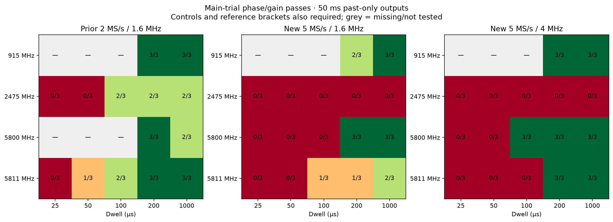
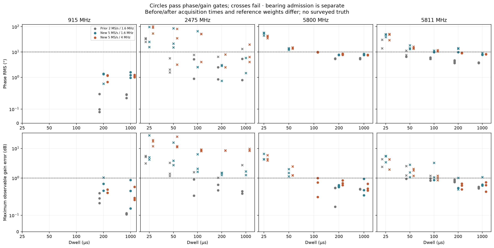
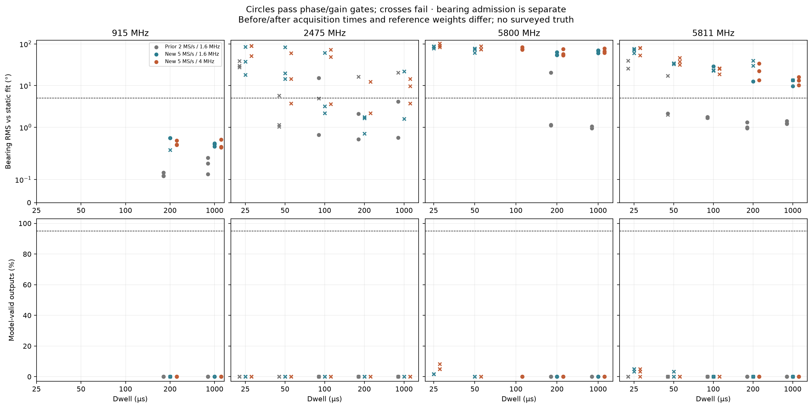
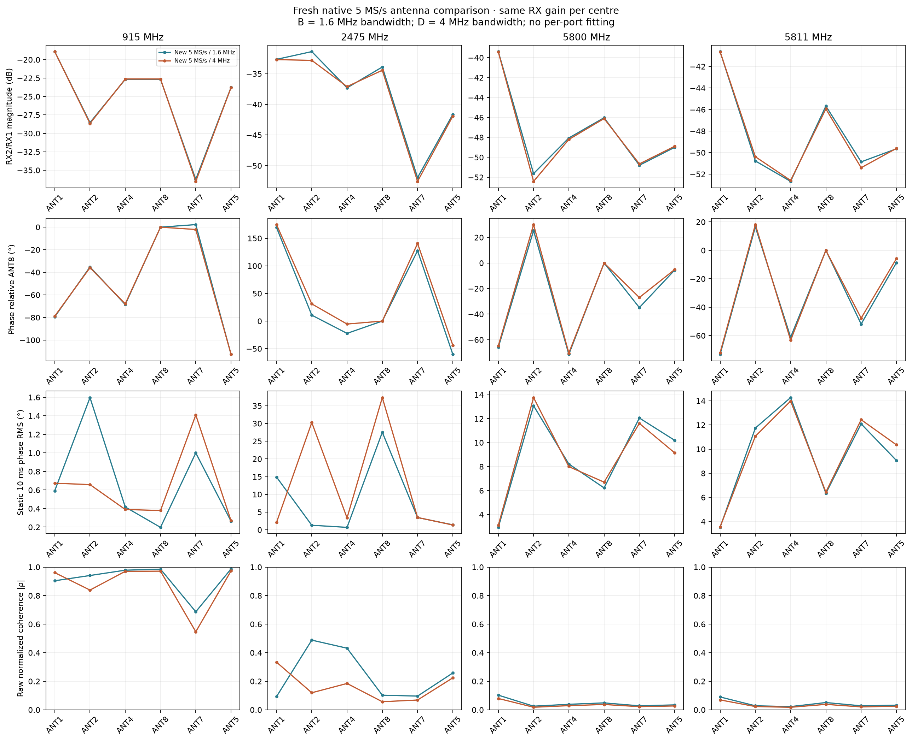
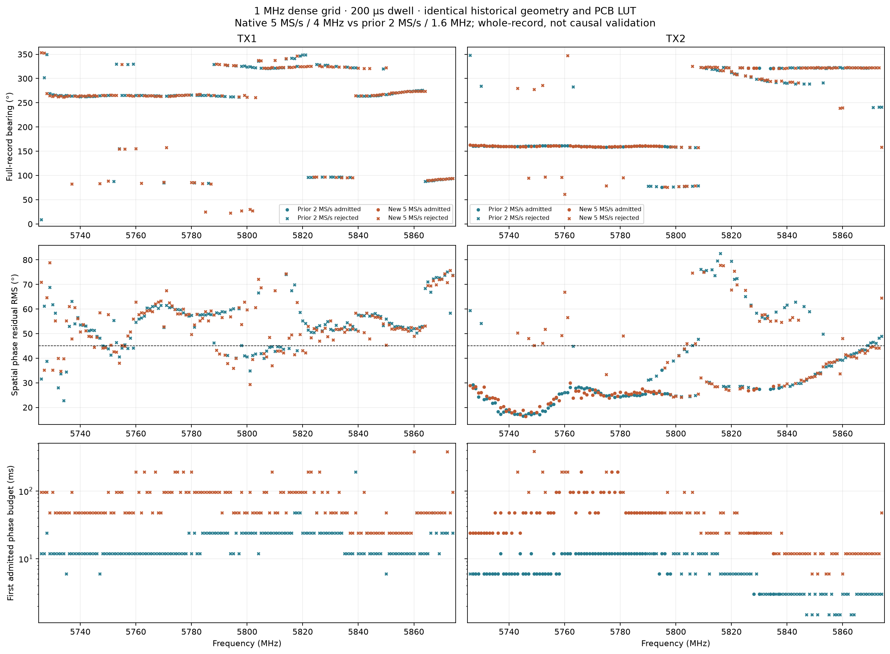
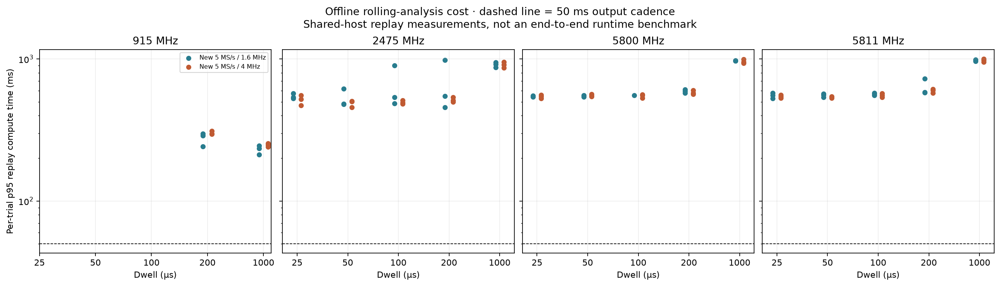
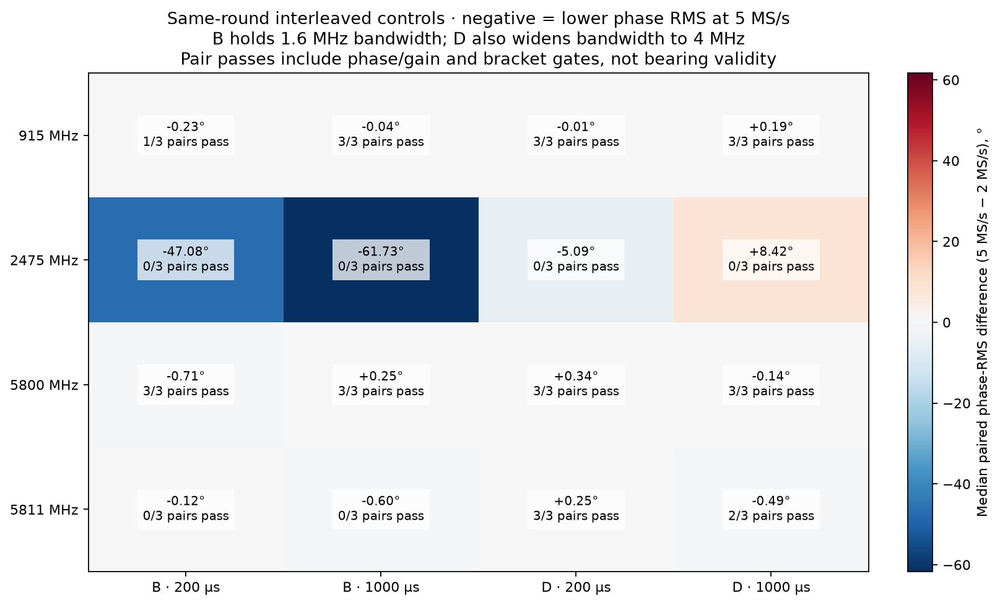

# Full native 5 MS/s tracking campaign

**Status: complete · September 11, 2026**

8/8 completed blocks analyzed; 150/150 switched records; 298/298 dense records.

Among 34 analyzed main-trial conditions, 7 meet the full phase/gain qualification gates (including controls and reference brackets), and 0 also meet the main-trial bearing gates. Neither count establishes surveyed angular accuracy.

## What changed

New raw captures use 5 MS/s at every requested centre and on the full dense grid; no 2 MS/s recording is upsampled. D = 5 MS/s / 4 MHz RX bandwidth; B = 5 MS/s / 1.6 MHz RX bandwidth. Separate B/D blocks run at 915, 2475, 5800 and 5811 MHz. Centre/dwell blocks use TX1. The 5726–5874 MHz, 1 MHz-step TX1/TX2 grid uses D at 200 µs dwell.

The frozen timing recipe still uses independent A (2 MS/s) weight references and interleaved A controls. They are labeled controls, not 5 MS/s main trials. Each B/D block has fresh before/after A and rate-specific references. TX settings remain −35 dB hardware gain and DDS 0.25; source rate/bandwidth stay 2 MS/s / 1.6 MHz.

## Fixture and what this test represents

The confirmed fixture uses C6 ports ANT1, ANT2, ANT4, ANT8, ANT7, ANT5 on a nominal 51 mm-diameter circle. Wiring remains:

```text
TX1 -> two-way splitter -> attenuator -> RX1 (conducted reference)
                        -> OTA emitter -> C6 antennas -> PCB common -> RX2
TX2 -> separate OTA emitter -----------> same C6 antennas
```

TX2 is enabled only in explicitly selected coherent-pilot tests. The conducted RX1 reference makes this a controlled timing/phase experiment, not a qualification of an autonomous receiver locating arbitrary emitters. An eventual OTA reference and deployed antenna/cable responses need their own validation. Emitter positions were only approximately retained after the setup was jittered; no surveyed bearing truth is available. The existing board calibration LUT is used without fitting new per-port OTA corrections to these test records.

## Dwell results

| Centre / profile | Fastest clean tested dwell | Controls passing | Bracket |
|---|---:|---:|---|
| 915 MHz / B | None qualified | 5/6 | Pass |
| 915 MHz / D | 200 µs | 6/6 | Pass |
| 2475 MHz / B | None qualified | 0/6 | Fail |
| 2475 MHz / D | None qualified | 0/6 | Fail |
| 5800 MHz / B | 200 µs | 6/6 | Pass |
| 5800 MHz / D | 100 µs | 6/6 | Pass |
| 5811 MHz / B | None qualified | 2/6 | Fail |
| 5811 MHz / D | None qualified | 5/6 | Pass |

All main trials, all controls, full window coverage and reference brackets must pass for a clean condition. Phase RMS uses 50 ms prediction windows after a one-second training history. Whole-record dense phase results use a different variable-integration criterion and must not be pooled with rolling qualification.

## Timing-decoder coverage and rejected outputs

Across 150 switched records, the recipe plans 9000 rolling outputs. 8750 windows were analyzed, 70 failed timing analysis, and 180 were not attempted after record-level rejection. There are 3 record-level analysis failures. Analyzed windows are not necessarily phase/gain or bearing passes.

| MHz / profile | Dwell µs | Round | Role | Failed windows | Unattempted windows |
|---|---:|---:|---|---:|---:|
| 2475 / A | 1000 | 2 | Control | 0 | 60 |
| 2475 / D | 200 | 2 | Main | 11 | 0 |
| 2475 / B | 1000 | 1 | Main | 30 | 0 |
| 5800 / B | 100 | 1 | Main | 0 | 60 |
| 5800 / B | 100 | 2 | Main | 29 | 0 |
| 5800 / B | 100 | 3 | Main | 0 | 60 |

Failure reasons and run identities are retained in [analysis failures](data/analysis-failures.csv). The observed harmonic-consensus rejection means the decoder could not find three switching-cycle frequency estimates agreeing within its 0.5% tolerance. It is a timing-recovery failure, not proof of physical switch malfunction. The frozen recipe and rejection thresholds were not relaxed, and failed windows were not compressed into a falsely continuous series.

## Primary replay versus whole-record diagnostic

| MHz / profile | Rolling 50 ms main-trial passes | Whole-record diagnostic passes |
|---|---:|---:|
| 915 / B | 5/6 | 6/6 |
| 915 / D | 6/6 | 6/6 |
| 2475 / B | 0/15 | 0/15 |
| 2475 / D | 0/15 | 0/15 |
| 5800 / B | 6/15 | 5/15 |
| 5800 / D | 9/15 | 4/15 |
| 5811 / B | 4/15 | 3/15 |
| 5811 / D | 6/15 | 5/15 |

These are trial counts across all tested dwells, not complete-condition or bearing qualifications. The whole-record diagnostic uses timing estimated from the entire capture and allows its tested integration budgets; both phase repeatability and independent phase/gain closure must pass. It cannot replace a failed past-only rolling trial or establish causal latency. Detailed diagnostic results remain in [fixed replay](data/fixed.csv); the primary results are in [rolling replay](data/rolling.csv).

## Phase repeatability is not bearing validity

The fastest-clean-dwell table above qualifies phase/gain stability only. A direction-finding result additionally needs an admitted spatial fit and repeatable bearing. Low bearing RMS against a static fit can coexist with a consistently rejected spatial model; that is not successful localization. No emitter direction was surveyed.

The following table retains all main trials. Phase RMS is the median of the per-trial rolling metrics, not a pooled RMS. Bearing-valid percentage is likewise a median across trials. Missing metrics remain absent, never zero; reported-trial counts and maxima are in [the detailed CSV](data/condition-details.csv).

| MHz / profile | Dwell µs | Phase/gain passes | Phase RMS ° | Bearing passes | Valid bearing outputs % | Joint qualification |
|---|---:|---:|---:|---:|---:|---|
| 915 / B | 200 | 2/3 | 1.35 | 0/3 | 0.0 | Not qualified |
| 915 / B | 1000 | 3/3 | 1.24 | 0/3 | 0.0 | Not qualified |
| 915 / D | 200 | 3/3 | 1.16 | 0/3 | 0.0 | Not qualified |
| 915 / D | 1000 | 3/3 | 1.09 | 0/3 | 0.0 | Not qualified |
| 2475 / B | 25 | 0/3 | 25.04 | 0/3 | 0.0 | Not qualified |
| 2475 / B | 50 | 0/3 | 21.36 | 0/3 | 0.0 | Not qualified |
| 2475 / B | 100 | 0/3 | 2.56 | 0/3 | 0.0 | Not qualified |
| 2475 / B | 200 | 0/3 | 2.81 | 0/3 | 0.0 | Not qualified |
| 2475 / B | 1000 | 0/3 | 3.68 | 0/3 | 0.0 | Not qualified |
| 2475 / D | 25 | 0/3 | 90.39 | 0/3 | 0.0 | Not qualified |
| 2475 / D | 50 | 0/3 | 35.21 | 0/3 | 0.0 | Not qualified |
| 2475 / D | 100 | 0/3 | 51.12 | 0/3 | 0.0 | Not qualified |
| 2475 / D | 200 | 0/3 | 5.22 | 0/3 | 0.0 | Not qualified |
| 2475 / D | 1000 | 0/3 | 6.33 | 0/3 | 0.0 | Not qualified |
| 5800 / B | 25 | 0/3 | 53.82 | 0/3 | 1.7 | Not qualified |
| 5800 / B | 50 | 0/3 | 13.29 | 0/3 | 0.0 | Not qualified |
| 5800 / B | 100 | 0/3 | — | 0/3 | — | Not qualified |
| 5800 / B | 200 | 3/3 | 7.68 | 0/3 | 0.0 | Not qualified |
| 5800 / B | 1000 | 3/3 | 7.66 | 0/3 | 0.0 | Not qualified |
| 5800 / D | 25 | 0/3 | 40.39 | 0/3 | 5.0 | Not qualified |
| 5800 / D | 50 | 0/3 | 14.64 | 0/3 | 0.0 | Not qualified |
| 5800 / D | 100 | 3/3 | 9.90 | 0/3 | 0.0 | Not qualified |
| 5800 / D | 200 | 3/3 | 8.21 | 0/3 | 0.0 | Not qualified |
| 5800 / D | 1000 | 3/3 | 7.72 | 0/3 | 0.0 | Not qualified |
| 5811 / B | 25 | 0/3 | 47.86 | 0/3 | 5.0 | Not qualified |
| 5811 / B | 50 | 0/3 | 14.29 | 0/3 | 0.0 | Not qualified |
| 5811 / B | 100 | 1/3 | 11.18 | 0/3 | 0.0 | Not qualified |
| 5811 / B | 200 | 1/3 | 13.57 | 0/3 | 0.0 | Not qualified |
| 5811 / B | 1000 | 2/3 | 8.27 | 0/3 | 0.0 | Not qualified |
| 5811 / D | 25 | 0/3 | 48.33 | 0/3 | 3.3 | Not qualified |
| 5811 / D | 50 | 0/3 | 14.35 | 0/3 | 0.0 | Not qualified |
| 5811 / D | 100 | 0/3 | 10.71 | 0/3 | 0.0 | Not qualified |
| 5811 / D | 200 | 3/3 | 9.09 | 0/3 | 0.0 | Not qualified |
| 5811 / D | 1000 | 3/3 | 8.17 | 0/3 | 0.0 | Not qualified |

Joint qualification requires all three main trials to pass phase/gain and bearing, plus the existing phase/gain control and reference-bracket gates. It still measures consistency with the assumed array model, not angular accuracy against ground truth.

## Timing and sample-rate interpretation

At 5 MS/s, 25/50/100/200/1000 µs dwells contain 125/250/500/1000/5000 raw samples respectively. More samples do not make the RF switch settle sooner, remove multipath, or improve an incorrect array model. Samples within the receiver bandwidth are correlated, so 2.5× the sample rate is not automatically 2.5× more independent information. Comparing B and D tests bandwidth at the same sample rate.

The rolling estimator predicts 50 ms outputs using a one-second training history. Dwell, full-array cycle, integration time, output cadence and computation latency are distinct quantities. Figure 6 reports each trial's measured p95 replay cost. A value above 50 ms exceeds the output-cadence budget for a serial implementation of this replay path; a value below it alone does not prove real-time feasibility. These timings include shared-host contention and exclude a complete live I/O pipeline.

The [frozen timing recipe](../comprehensive_fast_switching/REFERENCE-TIMING-VALIDATION-v1.md) aligns a separately measured, known-emitter six-port template. Passing these static-scene trials does not validate source-independent port labeling or timing acquisition for a moving unknown emitter. That requires its own detector and held-out motion tests; these measurements must not be presented as a completed general-purpose tracker.

Figure 7 uses the same-round, same-dwell interleaved A controls, not the older baseline. B versus A holds RX bandwidth at 1.6 MHz and uses the same gain within each block; D versus A changes bandwidth as well as sample rate. Comparisons are available only at 200 and 1000 µs. There are no matched A controls at 25/50/100 µs in these blocks. Three interleaved pairs and passing reference brackets reduce some confounding but do not establish that small differences are statistically meaningful. [Individual matched pairs](data/paired-controls.csv).

| Source | Analyzed | Phase admission (variable budget) | Spatial-model admission |
|---|---:|---:|---:|
| TX1 | 149/149 | 149/149 | 0/149 |
| TX2 | 149/149 | 147/149 | 64/149 |

All captured records remain in the denominator, including analysis failures. Missing metrics are not plotted as zeros. Individual failure reasons and raw-record identities are retained in [dense results](data/dense.csv).

## Figures















## Retained interruption and headroom-controlled continuation

The original 5800 MHz / D block stopped at a 45 s capture-process timeout. The child retained all 80 frames, but transfer of four seconds of IQ took 23.92 seconds. This is an acquisition/supervision event, not a failed phase measurement. The incomplete original block and its unindexed completed capture remain in the parent dataset and are not promoted into a full block.

The first four completed 915/2475 MHz blocks and their original failed controls are retained unchanged. Remaining 5800/5811 MHz blocks are newly bracketed attempts at RX gain 50 dB instead of 60 dB because a previous peak of 1878 counts exceeded the conservative 1600-count headroom threshold. Dense scans also use gain 50 dB. TX power is unchanged. The supervisor permits 90 s per capture process, records stdout/timing, and still treats timeouts as failures.

Both bandwidths use the same RX gain within each new centre comparison. However the prior dense 2 MS/s comparison now differs in RX gain as well as rate, bandwidth and acquisition time. Do not attribute differences to sample rate alone. Static figures use the fresh gain-50 high-band screen once complete; the earlier low-band screen remains its original gain and epoch.

A second interrupted attempt returned `ENODATA` from the metadata refill after 15 of 80 frames. Cleanup passed. Later muted and disk-backed transport diagnostics both passed, so the underlying cause is not established.

The latest continuation stages each IQ record in bounded host RAM (320 MB for a four-second dual-channel 5 MS/s capture; maximum 512 MiB), mutes TX, and then persists it to bulk storage. This is host-side buffering, not a radio DDR-ring or firmware change. Partial received IQ is retained on failure, and no missing frames are accepted. Storage time is recorded separately from receive-loop time. Both interrupted blocks remain outside the qualified trial grid; their hashes and ancestry remain in the plan.

A later static reference also returned metadata `ENODATA` with RAM staging after 39/40 frames, so storage stalls are not a sufficient explanation. That third interrupted block and its partial IQ remain retained.

The latest continuation declares a bounded transport-recovery policy before new acquisition: at most three whole-record attempts per scheduled capture, and only metadata-refill `OSError` errno 61 may trigger another attempt after verified cleanup. Every attempt has a hash-linked ledger. Frames from separate attempts are never joined; a selected record must satisfy all original sample continuity and clipping checks. Timeouts, cleanup errors and phase/gain/bearing failures are not retried. Phase results are therefore conditional on successful transport; transport failures must be counted separately, not hidden as RF passes.

| Latest-continuation transport accounting | Count |
|---|---:|
| Completed capture requests | 448 |
| Recorded attempts | 458 |
| Failed attempts retained | 10 |
| Recovered requests | 10 |
| Failed requests | 0 |
| Requests still running | 0 |

These counts include recovery/headroom screens and static references as well as switched/dense captures in the latest continuation. They exclude earlier retained blocks and are not a phase pass rate. [Full attempt ledger](data/transport-attempts.csv).

Bounded recapture supports this offline campaign; it does not fix the underlying metadata-provider failure or qualify uninterrupted live tracking. That failure still needs investigation before deployment.

## Interpretation and limits

A stable phase estimate or admitted bearing is not surveyed localization accuracy. The PCB LUT is unchanged; no per-port OTA corrections are fitted. Geometry is the nominal 51 mm C6 for rolling results. Dense before/after comparisons use the same historical 49.9654 mm model, with a separate nominal-51-mm analysis retained per run.

The prior dense comparison changes both sample rate and RX bandwidth and occurs at a different time. It cannot isolate sampling rate alone. The new B/D centre comparisons hold sample rate fixed but still require passing brackets to rule out observed drift. Controls and incomplete analyses remain failures, not omitted trials.

Static acquisition/headroom admission checks complete samples and clipping, not direction-finding performance. Figure 4 also shows normalized raw cross-correlation magnitude |ρ|. Low |ρ| indicates little shared coherent power over the captured bandwidth; noise, interference and time-varying relative phase can all reduce it. This metric alone does not identify the cause or invalidate a longer integrated phase estimate. The independent rolling tests, brackets and spatial gates remain the qualification criteria.

The receiver and source are serial-pinned at 192.168.1.15 and 192.168.1.179. Raw IQ and linked inherited records are indexed under `/srv/bulk/samteway/lab-data/tracking-5ms-full-20260911-resume-v3`. Data/run hashes, source hashes, window completeness and restore evidence are audited. No live runtime or angular-accuracy qualification is claimed.

Final recorded cleanup verified both radios muted, selector ALL_OFF and exact original firmware restored.

## Reproduce the offline audit and figures

From the repository root, using the retained captures and completed analysis:

```bash
env PYTHONPATH=src:scripts LD_LIBRARY_PATH=.venv/lib \
  .venv/bin/python scripts/audit_full_5ms_campaign.py \
  --campaign-root /srv/bulk/samteway/lab-data/tracking-5ms-full-20260911-resume-v3

env PYTHONPATH=src:scripts LD_LIBRARY_PATH=.venv/lib \
  .venv/bin/python scripts/report_full_5ms_campaign.py \
  --campaign-root /srv/bulk/samteway/lab-data/tracking-5ms-full-20260911-resume-v3
```

These commands do not control the radios. The acquisition audit refuses a completion certificate while the planned grid is incomplete; use `--allow-partial` only for an explicitly partial audit. Analysis success, retained failure reasons, final hardware restoration and the rendered report must also be checked before claiming full completion.

[Previous moved-fixture report](../jittered_fixture_comparison/README.md).
