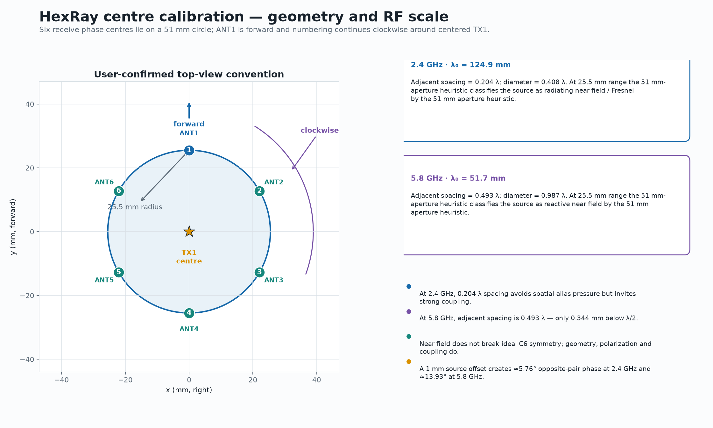
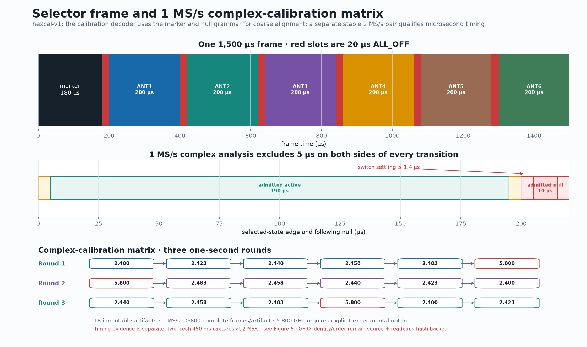
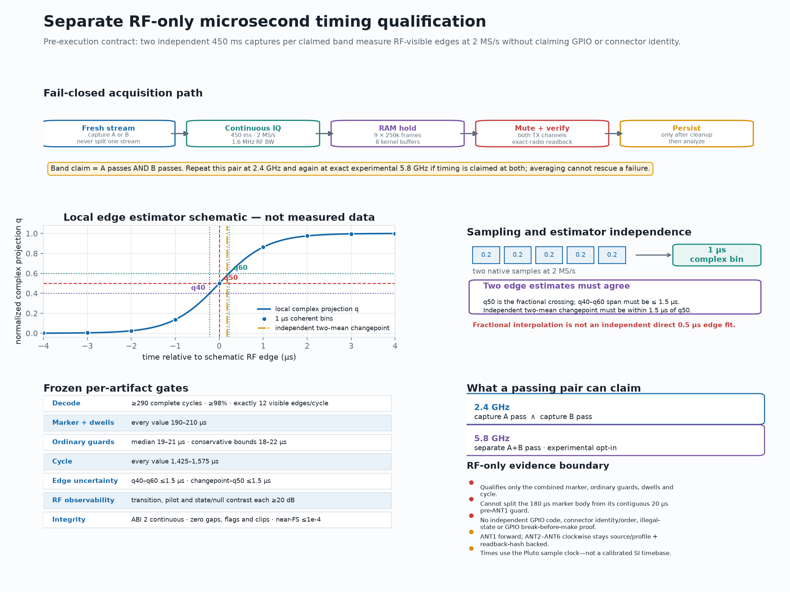
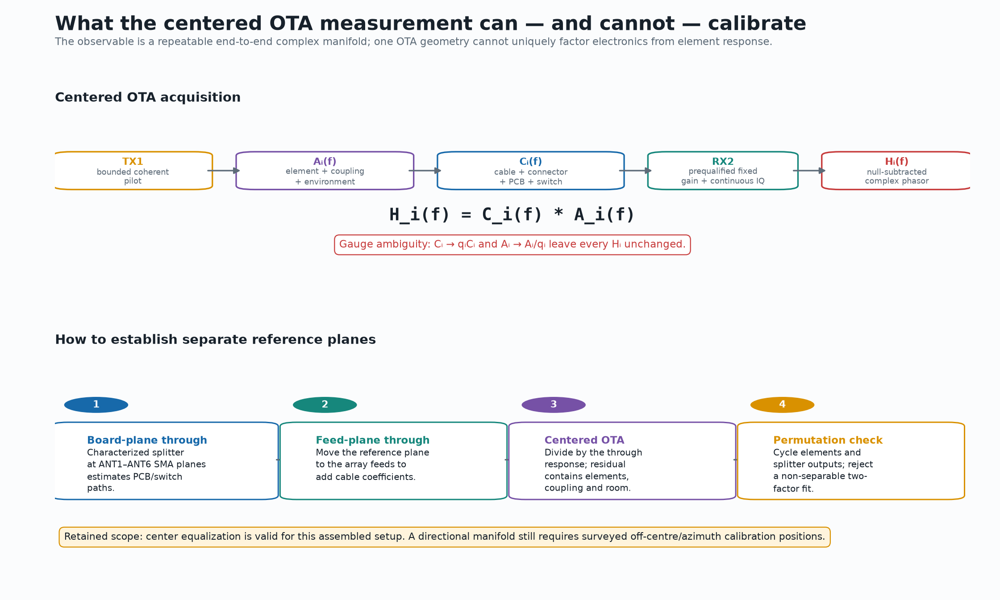
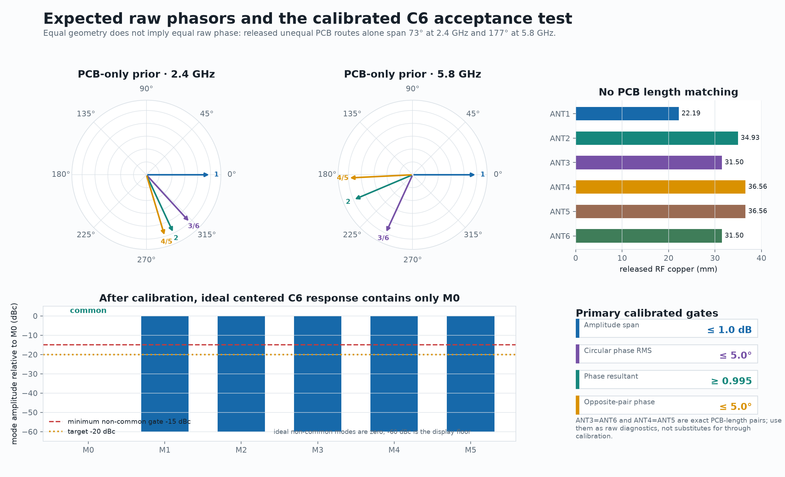

# HexRay TX-in-middle complex calibration design

## Status and evidence boundary

This document defines the experiment for a six-element circular receive array connected to
`ANT1` through `ANT6`, with Pluto `TX1` at its centre. The numbers labelled “expected” are
geometry or released-PCB calculations, not measured calibration results. Sections 5 and 8–10
remain the authoritative execution, acceptance, and safety plan; the checklist below records
which gates have actually been reached.

No logic analyzer was physically connected when this revision was prepared. Section 8 therefore
defines a preferred independent GPIO-observation path and the selected restricted low-power RF
timing fallback. That fallback is a **separate paired 5 MS/s qualification**, not timing inferred
from the 1 MS/s complex-calibration matrix. It does not independently observe GPIO code or
active-port identity.

The user-confirmed top-view convention is:

- the receive phase centres lie on a `51 mm` diameter circle;
- `ANT1` points forward;
- `ANT2` through `ANT6` proceed clockwise;
- TX1 is at the circle centre; and
- ANT7 and ANT8 are not selected by this experiment.

Before RF acquisition, physically confirm that `51 mm` describes the RF phase-centre circle,
not only a mechanical outline. Record all antenna and TX phase-centre heights, polarization,
cable identities and the exact calibration reference plane.

### Plan and live execution checklist

| State | Gate |
|---|---|
| DONE | Design and figures committed (`88f4432`). |
| DONE | v1 firmware and host pipeline committed (`6f237c6`). |
| DONE | Absolute-deadline fix committed, deployed, and fully read back (`4d3b640`). |
| REJECTED | v1 common-gain qualification; preserve its immutable failure ledger. |
| REJECTED | Initial 2.4 GHz timing qualification: cycle timing improved to about `1494.7 us`, but RF observability/SNR gates failed. |
| EXPLORATORY | RX `30 dB` / TX `-25 dB` timing run; useful diagnosis, not admissible calibration evidence. |
| DONE | Harden and mechanically verify the GPIO edge path and watchdog half-range bound. |
| DONE | Clean build and host/static verification of the reviewed 1,152-byte image (`381` tests). |
| PENDING | Exact deployment and full-flash readback of the reviewed image. |
| PENDING | Freeze and commit the versioned replacement RF qualification protocol. |
| PENDING | Qualify and freeze the operating point and paired 5 MS/s timing evidence. |
| PENDING | Capture the predeclared calibration matrix. |
| PENDING | Aggregate, held-out validation, independent audit, findings/figures, commit/push, and a verified muted end state. |

The reviewed build has ELF SHA-256
`8e0cc535f98d30be02f7b9662938516d3d5d2a8bbc5d72440e1494617c7dc9c9`, raw BIN SHA-256
`6d0a06f9160d91e6c04f9ba29e8d90c3aaf65e1386a6d7311fbd6689a103e6b3`, and 16 KiB padded
full-flash SHA-256 `1ac75057a6dbb3235b6dfb07899a2ae5ef025d9b1d5c0dee37df4cdc72b2453e`.
No capture made with those bytes is accepted as calibration evidence until the source is
committed, the exact image is deployed, and its complete flash readback is hash-verified.



## 1. Objective

The experiment has four distinct objectives:

1. Qualify a high-rate, break-before-make selector frame with a short, measurable `ALL_OFF`
   interval between every receive state.
2. Measure one complex, null-subtracted response for every receive element while the centred
   transmitter and complete assembly remain fixed.
3. Estimate repeatability, symmetry, spatial modes and frequency dependence without treating
   repeated samples or antennas as independent geometry.
4. Produce a versioned end-to-end calibration with an explicit reference plane, uncertainty,
   held-out validation and fail-closed safety record.

The centered run is not a complete direction-of-arrival calibration. It excites one near-field
manifold vector. Directional operation still requires surveyed off-centre or angular calibration
positions.

## 2. Geometry and expected RF regime

Use an array-centred coordinate system in millimetres: `+x` points right and `+y` points
forward when viewed from above. Array bearing is `0°` at forward/ANT1 and increases clockwise;
the separate Cartesian angle is the conventional counter-clockwise angle from `+x`. With
radius `r = 25.5 mm`, the nominal receive coordinates are:

| Port | Clockwise bearing from forward | Cartesian angle | Nominal `(x, y)` mm | Opposite element |
|---|---:|---:|---:|---|
| ANT1 | 0° | +90° | `(0.000, +25.500)` | ANT4 |
| ANT2 | 60° | +30° | `(+22.084, +12.750)` | ANT5 |
| ANT3 | 120° | -30° | `(+22.084, -12.750)` | ANT6 |
| ANT4 | 180° | -90° | `(0.000, -25.500)` | ANT1 |
| ANT5 | 240° | -150° | `(-22.084, -12.750)` | ANT2 |
| ANT6 | 300° | +150° | `(-22.084, +12.750)` | ANT3 |

These are design coordinates. The execution record must contain surveyed coordinates and
uncertainty before using geometric residuals as a pass/fail metric.

| Quantity | 2.400 GHz | Exact experimental 5.800 GHz |
|---|---:|---:|
| Free-space wavelength | 124.914 mm | 51.688 mm |
| Radius / adjacent chord | 0.204 λ | 0.493 λ |
| Circle diameter | 0.408 λ | 0.987 λ |
| Free-space phase per millimetre | 2.882° | 6.965° |
| 51 mm-aperture reactive boundary | 20.2 mm | 31.4 mm |
| 51 mm-aperture Fraunhofer boundary | 41.6 mm | 100.6 mm |
| Centre-to-element interpretation | Fresnel heuristic | Reactive-near-field heuristic |

The standard aperture boundaries are only scale indicators for this compact antenna system.
If the receive elements are the earlier `95 mm` whips, their own maximum dimension places the
25.5 mm separation deeper in the near field at both bands.

Near-field operation does not itself destroy C6 symmetry. With a perfectly centred,
rotationally symmetric source, equal phase-centre heights, identical polarization and a C6
environment, all six OTA complex responses should be equal. Near-field coupling, pattern
distortion and small placement errors make those conditions demanding.

At 5.8 GHz, the adjacent chord is only `0.344 mm` below half a wavelength. A `1 mm` source
displacement along an opposite-element axis produces approximately `5.76°` opposite-pair phase
at 2.4 GHz and `13.93°` at 5.8 GHz. Exact 5.800 GHz is therefore geometry-relevant but has very
little phase-centre-error margin. It remains an explicitly experimental operating point outside
the official AD9363 range; qualify the implementation at 2.4 GHz first.

## 3. Expected raw electrical response

The selector PCB was deliberately not length matched. Released v0.2.1 copper lengths give the
following diagnostic prior, using the released CPWG effective permittivity
`epsilon_eff = 3.13660852672`:

| Port | RF copper mm | Relative delay vs ANT1 | PCB-only lag at 2.4 GHz | At 5.8 GHz |
|---|---:|---:|---:|---:|
| ANT1 | 22.194973 | 0.00 ps | 0.00° | 0.00° |
| ANT2 | 34.930782 | 75.24 ps | 65.01° | 157.10° |
| ANT3 | 31.500992 | 54.98 ps | 47.50° | 114.79° |
| ANT4 | 36.557345 | 84.85 ps | 73.31° | 177.16° |
| ANT5 | 36.557345 | 84.85 ps | 73.31° | 177.16° |
| ANT6 | 31.500992 | 54.98 ps | 47.50° | 114.79° |

The common J2 route is `14.503822 mm` and cancels from relative comparisons. These numbers do
not include switch, launch or cable delay and must never be subtracted as though they were a
measured calibration.

Two exact-copper pairs are useful diagnostics: ANT3/ANT6 and ANT4/ANT5. The physical opposite
pairs are instead ANT1/ANT4, ANT2/ANT5 and ANT3/ANT6. These two pair families answer different
questions and must not be conflated.

## 4. High-rate frame

The implemented `hexcal-v1` frame is:

```text
180 us  ALL_OFF marker body
 20 us  ALL_OFF guard before ANT1  } observable marker = 200 us
200 us  ANT1
 20 us  ALL_OFF guard
200 us  ANT2
 20 us  ALL_OFF guard
200 us  ANT3
 20 us  ALL_OFF guard
200 us  ANT4
 20 us  ALL_OFF guard
200 us  ANT5
 20 us  ALL_OFF guard
200 us  ANT6
---------------------------------
1500 us total
```

This produces `666.7` complete array scans/s, `4,000` active dwells/s and `8,000` RF edges/s.
Aggregate active duty is `80%`, or `13.33%` per antenna. Each 20 µs guard is `14.3` times the
PE42482 maximum `1.4 µs` settling time.

This timing is an explicit **experimental protocol waiver**, not a release-conformant Fast20
selector profile. The released board control contract in
`projects/pluto-rx2-8way-v5/03_src/rules/rf.yaml` requires `ALL_OFF` followed by a `5 ms` guard
before each selected path, and the released firmware acceptance procedure repeats that minimum.
The requested `20 µs` guard violates that procedural requirement even though it retains a
`14.3×` margin over the switch data-sheet settling maximum. Consequently `hexcal-v1` is a
separate calibration-only image: its GPIO/RF timing and recovery evidence must be recorded
separately, it must not supersede or be described as qualified under the released v0.2.1
contract, and the verified Fast20 and `safe_hold` images remain the rollback targets.

The 1 MS/s complex-calibration analysis discards `5 µs` at both edges of every interval. It
therefore retains `190 µs` from each active dwell and `10 µs` from each ordinary null. At the
existing 100 kHz pilot these are approximately 19 and one pilot periods, respectively. Its
decoder establishes coarse frame consistency and state alignment only; it is not the evidence
used to claim microsecond guard or dwell timing.



The short `ALL_OFF` interval is a temporal null slot, not a spatial beamforming null and not an
assumption of zero received power. It measures leakage and supplies a visible boundary. The
decoder must reject the frame if null contrast, the long marker, any guard or any state edge is
missing. Center symmetry can make adjacent active states indistinguishable, so state identity
must come from the long marker, fixed order and intervening null slots—not from a guessed active
amplitude.

The predecessor Fast20 image polls a 1 ms SysTick and stores millisecond durations. This profile
requires a genuine integer-microsecond timer implementation, atomic GPIO writes, and separate
qualification. Merely scaling the old duration constants is not acceptable.

## 5. Complex-calibration capture matrix

Use a bounded 100 kHz-offset TX1 pilot, manually fixed receive gain, metadata ABI 2 and a
1 MS/s continuous capture. One artifact lasts exactly one second. The six center frequencies
are:

```text
2.400, 2.423, 2.440, 2.458, 2.483, 5.800 GHz
```

The emitted carrier is the centre plus the refined DDS offset. The exact 5.800 GHz centre
requires the repository's explicit experimental opt-in.

Do not predeclare `20 dB` or another convenient RX gain. Before the calibration matrix, run a
bounded low-power gain qualification starting at the lowest conservative gain supported by the
hardware. Increase manual gain only as needed for every port to pass pilot SNR and
selected-to-null contrast while retaining all clipping and headroom gates. Persist the selected
gain before admitting calibration artifacts. Never change it within an artifact; reuse the same
predeclared value for all three repeats of a frequency/condition. Prefer one common gain for the
entire matrix when it passes every condition. AGC is forbidden.

The qualification plan is frozen before RF is enabled. Search manual RX gain in integer `1 dB`
steps from `0` through `62 dB`, stopping at the first gain that passes **all six planned
frequencies and all six active states**. One gain/frequency condition is a fresh `0.3 s`,
`1 MS/s`, `800 kHz`-bandwidth, dual-RX ABI-2 stream containing `3 × 100,000` samples with eight
kernel buffers. Every condition must independently pass:

| Gain-qualification gate | Acceptance |
|---|---:|
| Complete / decoded selector cycles | at least 150 / at least 98% |
| Marker contrast, state pilot SNR and selected-to-null isolation | each at least 20 dB |
| Per-state cycle coherence | at least 0.995 |
| Per-state circular phase standard deviation | at most 6° |
| Per-cycle six-element circular phase-gauge resultant | at least 0.25 |
| Ordinary ADC headroom admission / clipped samples | pass / zero |
| Peak absolute I or Q component, RX1 and RX2 independently | at most 1,300 counts |
| RF cleanup | exact-radio mute before the run, after every condition and finally |

The accepted experiment requires one common gain across both the 2.4 GHz conditions and exact
experimental 5.8 GHz. If no gain in `0..62 dB` passes the complete plan, abort this experiment.
Do not choose band-specific gains or change the matrix after seeing the failure; any staged
2.4-only and 5.8-only replacement must be a new, versioned, predeclared experiment.

Use three independent rounds:

| Round | Centre-frequency order GHz | Purpose |
|---:|---|---|
| 1 | 2.400, 2.423, 2.440, 2.458, 2.483, 5.800 | forward baseline |
| 2 | 5.800, 2.483, 2.458, 2.440, 2.423, 2.400 | reverse time ordering |
| 3 | 2.440, 2.458, 2.483, 5.800, 2.400, 2.423 | rotated held-out order |

The plan contains 18 immutable artifacts. A one-second capture contains about 666 frames; after
arbitrary start/end phase, require at least 600 complete frames. At 1 MS/s this gives about
126,700 edge-trimmed active samples per antenna per artifact.

Do not selectively recapture a merely unfavourable antenna or frequency. A transport or safety
failure may retry the unchanged plan item, but the failed attempt and reason remain in the
manifest.

### Separate RF-only microsecond timing qualification

Timing claims use a different acquisition product. At each band being claimed, acquire **two
independent 450 ms captures** at `5 MS/s` and `4 MHz` RF bandwidth. Each capture is exactly nine
`250,000`-sample frames (`2,250,000` samples total), uses eight kernel buffers and carries
metadata ABI 2 continuity evidence. Start a fresh continuous stream for the second capture; do
not split one long stream and call the halves independent.

Keep the complete IQ and continuity record in memory until both TX channels have been muted and
the exact-radio mute readback passes. Only then persist the artifact. A cleanup failure rejects
the attempt; later mute success cannot retroactively admit it. The pair rule is per band: both
captures must independently pass every frozen gate, and averaging cannot rescue a failed member.
A timing claim at both `2.4 GHz` and exact experimental `5.8 GHz` therefore requires a passing
pair at 2.4 GHz and a separate passing pair at 5.8 GHz. The 5.8 GHz pair retains the explicit
experimental opt-in.

The RF detector coherently projects each five native `0.2 µs` complex samples into one `1 µs`
bin. For local complex plateaus `a` and `b`, form

```text
q(t) = Re((z(t) - a) * conj(b - a)) / |b - a|².
```

Use the fractional `q = 0.5` crossing as the reported RF edge and sweep `q = 0.4, 0.5, 0.6`
to bound threshold sensitivity. An independent local two-mean complex changepoint must agree.
The fractional crossing interpolates between `1 µs` complex bins; it is not a separate direct
`0.2 µs` edge fit. Nominal slot positions may recognize the source-backed frame grammar but
must never snap a measured edge to the expected schedule.



Each 450 ms artifact contains 300 nominal cycles; require at least 290 complete, unambiguous
cycles and at least 98% of conservatively possible cycles decoded. Missing or extra patterns
are rejected. Continuity, clipping, headroom and RF-observability gates apply independently to
each artifact.

## 6. Observable and gauge ambiguity

For antenna `i`, frequency `f`, frame `k`, let the matched-filter phasors be `S_i` in the
selected interval and `N_before`, `N_after` in the adjacent `ALL_OFF` intervals. Interpolate the
local complex null to the active-dwell centre and form:

```text
Z_i(f,k) = S_i(f,k) - interp(N_before, N_after).
```

If RX1 is deliberately configured as a stable coherent reference, form `RX2/RX1` before null
subtraction. The execution report must state whether RX1 is terminated, receives OTA, or uses a
conductive reference; those modes are not interchangeable.

The centered response factorizes conceptually as:

```text
H_i(f) = C_i(f) * A_i(f)
```

where:

- `C_i` is cable, connector, PCB route and switch response; and
- `A_i` is the element, mutual coupling and electromagnetic environment.

A single centered OTA capture identifies only `H_i`. For any nonzero complex `q_i`, replacing
`C_i` with `q_i C_i` and `A_i` with `A_i/q_i` leaves every measurement unchanged. This is a
gauge ambiguity, not something more repeats can solve.



The defensible center-run artifact is therefore an end-to-end, in-situ complex manifold. To
establish separate reference planes:

1. Inject a characterized splitter/through standard at the six selector-board SMA planes.
2. Repeat at the six array feed ends to include external cables.
3. Divide the centered OTA response by the appropriate through response.
4. Rotate characterized splitter outputs or cyclically permute physical elements among ports.
5. Fit a complex port/element two-factor model and reject separability if its held-out residual
   exceeds the declared gate.

Mutual coupling is generally direction-dependent. Even a successful factorization at the
centre does not replace an angular OTA manifold.

## 7. Complex normalization and symmetry metrics

For each artifact, robustly aggregate admitted frame phasors per antenna. Remove a single common
amplitude and phase gauge using the geometric-mean amplitude and circular phase centre. Store
the original ANT1-relative diagnostics, normalized values, uncertainty and gauge choice. The
phase centre is admitted only when its six-element circular resultant is at least `0.25` in
every decoded cycle; a smaller value makes the common phase gauge too poorly conditioned. The
released-PCB route-only prior predicts about `0.908` at 2.4 GHz and `0.599` at 5.8 GHz, so this
gate is not expected to reject the nominal electrical geometry.

For normalized antenna phasors `h_n`, use the six-point circular spatial transform:

```text
M_m = (1/6) * sum(n=0..5) h_n * exp(-j * 2*pi*m*n/6).
```

An ideal centered C6 response has only common mode `M_0`. Non-common modes measure asymmetry;
they do not by themselves identify whether its origin is centering, polarization, cable phase,
switch response, mutual coupling or the room.

Also retain:

- amplitude peak-to-peak spread;
- circular phase resultant and RMS;
- physical opposite-pair residuals `(ANT1,ANT4)`, `(ANT2,ANT5)`, `(ANT3,ANT6)`;
- exact-PCB-length pair residuals `(ANT3,ANT6)` and `(ANT4,ANT5)`;
- even/odd frame agreement and per-port cycle coherence;
- forward/reverse/rotated round differences; and
- phase and amplitude versus exact emitted carrier frequency.



Calibration can force its own training data to look perfectly symmetric. All symmetry gates
must therefore be evaluated on held-out data. Use leave-one-round-out validation at every
frequency. Within the 2.4 GHz band, also perform leave-one-frequency-out interpolation. Treat
5.8 GHz as a separate band; do not interpolate across the 3.3 GHz gap.

## 8. Predeclared acceptance gates

### Firmware and schedule contract

| Gate | Acceptance |
|---|---:|
| Active order | exactly ANT1 through ANT6 |
| ANT7/ANT8 selections | zero |
| Illegal GPIO codes | zero |
| Every selected-to-selected transition | passes through ALL_OFF |
| Marker, guard and dwell duration error | within ±5% |
| Minimum observed ordinary guard | 18 µs |
| Analysis edge trim | at least 5 µs each side |
| Boot/reset invalid RCC configuration | remain passive `ALL_OFF` |
| Runtime RCC source/divider/prescaler drift | apply `ALL_OFF`, stop refresh and reset by independent LSI watchdog |
| Stalled/stopped core clock | reset to passive `ALL_OFF` by independent LSI watchdog; not immediate |

At boot, the image enables and reads back the GPIOA clock, preloads and reads back the `ALL_OFF`
ODR latch while the selector pins are still inputs, validates the reset clock, and then enables
TIM3 with explicit reset-assert and reset-deassert readbacks. Only after those gates pass does it
start the independent watchdog and enable the GPIO outputs; a second ODR check then guards entry
to the schedule. The ELF verifier binds this ordering and each failure path.

The hard `5 us` edge bound has a deliberately narrower fault model than the fail-closed reset
policy. It assumes the reset HSI48 clock configuration, TIM3 configuration, GPIO configuration,
and fixed-latency uncontended Cortex-M0+/APB execution remain valid during an admitted edge. The
firmware performs a full CR/CFGR check before entering the final `8 us` staging window, then
rechecks `HSION`, `HSIRDY`, and `HSIDIV` inline after the due sample. An asynchronous CFGR change
inside that remaining window can therefore perturb one in-flight edge before the next full check
fails closed. ICSCR trim corruption, TIM3/GPIO register corruption, DMA or bus contention,
exceptions, and memory/code corruption are also outside the hard edge-time proof. This is not a
claim of arbitrary single-event-upset tolerance; direct Path A observation or an independent
hardware timing monitor is required for that stronger claim.

Under the documented normal-execution model, the far-poll and staging-entry paths take at most
`54` and `22` conservative core cycles respectively. Their conservative sum is below seven
`12`-cycle timer ticks: from the minimum far distance of nine ticks, the first tight sample is
therefore still at least two ticks before the deadline. The tight loop then samples TIM3 at
most every `11` core cycles, strictly faster than one timer tick, so it cannot skip the due count.
The verified tight-loop due-sample-to-final-sample path is at most `23` cycles, strictly less
than two timer ticks, and the compiled final-sample-to-BSRR path is `16` cycles within its
`16`-cycle cap. At the conservative `97%` HSI48-rate bound, the two admitted timer ticks, one
quantization tick, and write path total at most `4.467 us`. The independent `/4`, reload-`127`
IWDG interval is conservatively `15.058–17.356 ms`: longer than nine worst-case `1.547 ms`
refresh opportunities and shorter than the fastest wall-time TIM3 half-range (`31.813 ms`).
Debugger-controlled IWDG freezing is outside the runtime guarantee.

The compiled worst turnover from one accepted BSRR store through frame commit, next-frame
planning, the mandatory full RCC gate, and the next outer TIM3 sample is at most `165` core
cycles. The stronger end-to-end liveness proof also includes the prior edge's `52`-cycle
physical lateness envelope and the `22`-cycle staging handoff, subtracting the two shared
three-cycle endpoint loads/stores. The result is `233` cycles against the shortest
`20 us × 12 = 240`-cycle phase. This deliberately combines incompatible worst-case state paths,
but leaves only a seven-cycle proof margin; the ELF verifier therefore binds the complete chain,
not just its individual segments.

The verifier additionally binds all `956` executable `.text` bytes to SHA-256
`579562f7d0f6a766c9faefd5ecff054372eadbb0db220efcc4cf0a316ae0af50`, all 48 vector-table
words, the complete reset/data/BSS tail, every pre-output callee and every permitted GPIO write
site. Its focused suite contains `133` mutation tests; an independent exhaustive replay rejected
all `182` single-instruction startup/pre-output mutations and all `956` single-byte `.text`
mutations. These are static identity and control-flow gates, not a substitute for the deployment
readback or Path A hardware observation.

The GPIO identity/order rows above are direct hardware claims only under Path A. Under Path B,
they remain source/profile plus flashed/readback-hash backed. The 1 MS/s calibration artifacts
must still satisfy their coarse schedule-admission checks, but they cannot substitute for the
separate timing pair below.

### RF-only timing qualification

Every artifact in a claimed band pair must independently meet all of these gates:

| Gate | Acceptance |
|---|---:|
| Capture contract | 450 ms, 5 MS/s, 4 MHz BW, `9 × 250,000` samples, 8 kernel buffers |
| ABI 2 continuity, gaps and failure/overflow flags | verified; zero |
| Complete / decoded cycles | at least 290 / at least 98% |
| RF-visible edges per accepted cycle | exactly 12 |
| Combined marker / pre-ANT1 ALL_OFF plateau | every accepted cycle within 190–210 µs |
| Every active dwell | every accepted cycle within 190–210 µs |
| Each ordinary guard aggregate median | 19–21 µs |
| Conservative ordinary-guard uncertainty envelope | lower bound at least 18 µs; upper bound at most 22 µs |
| Cycle | every accepted cycle within 1,425–1,575 µs |
| `q40`–`q60` edge-time span | at most 1.5 µs |
| Independent changepoint vs `q50` | at most 1.5 µs |
| Absolute refined-pilot residual from DDS readback | at most 2 kHz |
| Adjacent-pilot phase-step coherence | at least 0.95 |
| Transition SNR, pilot SNR and state-to-null contrast | each at least 20 dB |
| Clipped samples / near-full-scale fraction | zero / at most `1e-4` |
| Pair marker, dwell and ordinary-guard median agreement | each within 1 µs |
| Pair cycle-median agreement | within 2 µs |
| Pair admission | both fresh-stream captures pass; no averaging of a failure |

These are RF-edge gates relative to the Pluto sample clock. They do not calibrate that clock to
SI time. “Ordinary guards” are the five short ANT1→ANT2 through ANT5→ANT6 null slots; the
ANT6→ANT1 null is the combined marker/pre-ANT1 plateau and is gated separately.

### Timing and GPIO evidence paths

Complete and record one of these paths before admitting calibration data. The strict code,
order, illegal-state and timing gates above do not change between paths; only the strength and
label of the evidence changes.

**Path A — preferred independent GPIO qualification.** With RF muted, connect a logic analyzer
to the selector GPIO and a suitable timing reference. Independently observe boot and reset
`ALL_OFF`, the exact `ALL_OFF`/ANT1-through-ANT6 codes, active order, zero illegal codes,
break-before-make transitions, 180 µs marker body, 20 µs guards, 200 µs dwells and 1.500 ms
cycle. Firmware self-report alone is not independent timing or GPIO evidence.

**Path B — selected fallback when no logic analyzer is connected.** Before any timing capture,
pass the host state-machine, generated-profile and ELF checks; bind the exact `hexcal-v1` profile
and firmware hashes; flash only the intended target; and prove that the flashed/readback image
hash matches. Then use the smallest bounded TX stimulus and execute the separate paired `5 MS/s`
capture contract in Section 5. If both captures for a band pass continuity, observability,
timing and edge-uncertainty gates, those RF edges may independently qualify only the combined
marker, ordinary guards, dwells and cycle timing for that band.

Under Path B, GPIO code identity, active-port identity/order and absence of illegal GPIO codes
remain **source-derived plus flashed/readback-hash-backed; not independently GPIO-observed**.
A centered equal-amplitude source cannot prove which antenna code produced an active dwell.
Reports must retain that evidence label and must not describe RF-only timing as full hardware
GPIO qualification. RF also sees the contiguous 180 µs marker body and 20 µs pre-ANT1 guard as
one approximately 200 µs `ALL_OFF` plateau, so it cannot prove that internal split. The measured
durations are relative to the Pluto sample clock, not an independent timebase.

### Artifact integrity and RF admission

| Gate | Acceptance |
|---|---:|
| Complete frames per artifact | at least 600 |
| Buffer-sequence gaps | zero |
| FPGA first-sample-sequence gaps | zero |
| Overflow/failure flags | zero |
| Persisted artifact identity and SHA-256 | exact match |
| Clipped samples | zero |
| Near-full-scale sample fraction | at most `1e-4` |
| Pilot SNR, every port | at least 20 dB |
| Weakest selected-to-null contrast | at least 20 dB |
| Per-cycle six-element circular phase-gauge resultant | at least 0.25 |
| Post-condition and independent final TX mute/readback | pass |

### Repeatability and held-out calibration

| Gate | Acceptance |
|---|---:|
| Within-artifact cycle coherence | at least 0.995 |
| Within-artifact circular phase standard deviation | at most 6° |
| Between-round relative-phase spread | at most 5° |
| Between-round amplitude spread | at most 0.5 dB |
| Held-out corrected amplitude span | at most 1.0 dB |
| Held-out corrected circular phase RMS | at most 5° |
| Held-out corrected phase resultant | at least 0.995 |
| Held-out opposite-pair phase mismatch | at most 5° |
| Largest non-common mode | target ≤ -20 dBc; minimum ≤ -15 dBc |
| Held-out coefficient residual | at most 5° and 0.5 dB |

A physical cable/element permutation is an optional extension and is not part of this baseline
capture matrix or its admission decision. Unless a separate characterized permutation plan is
executed, report the two-factor port/element residual as **not evaluated** rather than treating
it as a passing gate.

The board release separately calls for calibrated VNA insertion loss, return loss and isolation.
This OTA experiment cannot turn a relative complex response into those missing absolute
S-parameter results.

## 9. Safety, failure handling and data admission

- Bind every live command to the exact Pluto serial and board identity.
- Keep both transmitters muted until the board input ceiling, fixed TX attenuation, DDS scale,
  centre frequency and load bound pass.
- Start with the smallest bounded TX stimulus. Increase it only while every receiver retains
  ADC headroom. The selector board operating ceiling remains `0 dBm` at its RF mating plane.
- Begin gain qualification at the lowest conservative manual hardware gain. Increase it only
  enough to pass the declared SNR/contrast gates with headroom, record it, and then lock it as
  specified in Section 5. AGC would create an uncontrolled time-varying coefficient.
- Mute and read back the exact radio after every condition and once independently at the end.
- Cooperative cleanup is not an external RF interlock. Unattended operation still requires an
  independent cutoff if USB loss, host loss or `SIGKILL` must be covered.

### `ENODATA` quarantine and retry

If `buffer.refill()` raises Linux `ENODATA`:

1. Stop the condition and accept no artifact identity.
2. Do not splice partial IQ into any prior or subsequent artifact.
3. Mute both TX channels and verify the exact-radio readback.
4. Preserve the failed attempt, error, plan index and cleanup evidence.
5. Retry the unchanged plan item under a new attempt/artifact identity.
6. Admit the retry only if all ordinary continuity, headroom, timing, analysis and mute gates
   pass.

`ENODATA` means the host did not receive the next streaming buffer. It is not evidence that no
RF was present.

## 10. Implementation, deployment and rollback gates

The implementation should remain split into independently reviewable components:

1. A generated microsecond profile containing the authoritative GPIO codes and schedule.
2. A host-testable pure state machine with exact transition and duration tests.
3. An STM32 timer/GPIO image that boots fail-closed and uses atomic writes.
4. A hardware-free matched-filter analyzer using integer sample indices and the profile hash.
5. A bounded runner that persists its complete three-round plan before RF is enabled.
6. A report snapshot that contains artifact hashes, firmware/profile identities, measurements,
   rejection reasons and calibrated coefficients.

All live-capture and offline Hexcal entry points execute with
`/home/pi/pluto-plus-utils/.venv/bin/python` and `/home/pi/smateway/src` on `PYTHONPATH` before
importing RF or analysis code. If invoked with another interpreter, the entry point re-executes
itself under that exact runtime. Every plan and accepted evidence chain records the interpreter
and prefix, the clean `pluto-plus-utils` commit
`5551d29bc6c326f26285670efd20fc149caef474`, every package Python source file, `pyproject.toml`,
`uv.lock`, and the resolved origin of each critical import. A missing/dirty checkout, wrong
commit, changed byte, escaped import or different runtime rejects the operation before live RF
or offline analysis can be accepted.

The live RF record binds exactly eight kernel buffers, both TX hardware-gain readbacks, and all
eight DDS scale/enable/frequency readbacks. TX1 DDS indices 0 and 2 must have the planned
non-zero scale and quantized tone; TX2 must read back at `-80 dB`; the selected TX1 gain may not
exceed the planned value. PyADI can report a global enable on zero-scale sources and can retain
stale inactive frequency registers, so those raw values are retained as hash-bound diagnostics.
Exact zero scale on every inactive DDS source is the RF-inactivity contract; an inactive raw
enable or stale frequency is not by itself evidence of emitted RF.

Before flashing, pass host tests, static checks, ELF policy checks and a timing-model test. Then:

1. Record the current qualified Fast20 image and safe-hold rollback identities.
2. Record the target DBGMCU device/revision ID. Verify that the reset handler contains the
   [ES0569 section 2.2.5](https://www.st.com/resource/en/errata_sheet/es0569-stm32c011x4x6-device-errata-stmicroelectronics.pdf)
   dummy SRAM read before any application SRAM use, then flash only the explicitly selected
   board through the existing SWD recovery workflow.
3. Read back and verify the programmed image.
4. Prefer Path A: with TX muted, use a logic analyzer to verify boot `ALL_OFF`, all six codes,
   every 20 µs guard, the 180 µs marker body, 200 µs active dwells and 1.500 ms cycle.
5. If no logic analyzer is connected, use Path B: retain source/test code evidence and verified
   flashed/readback hashes, then run two independent 450 ms, 5 MS/s timing captures at 2.4 GHz.
   Run a separate pair at exact experimental 5.8 GHz if timing will be claimed there. Admit a
   band only when both members of its pair pass every frozen RF-only gate. Mark code
   identity/order/illegal-state claims as not independently GPIO-observed.
6. Exercise reset, watchdog and clock-fault recovery under the strongest available observation
   and prove each returns to `ALL_OFF`; record whether that evidence is direct GPIO, RF-level or
   source/test plus image-readback evidence. The image detects boot-time and runtime RCC
   source/divider/prescaler changes; it cannot measure an HSI frequency error whose status and
   configuration bits remain nominal. A stopped core relies on the independent LSI watchdog and
   therefore returns to passive `ALL_OFF` only on reset, not instantaneously.
7. Select and persist the manual RX gain under the bounded policy in Section 5 before executing
   the matrix.

Any firmware identity, GPIO, duration, recovery, serial, continuity, headroom or mute failure
blocks the next gate. Rollback means returning to `safe_hold` for fault isolation or the prior
qualified Fast20 image for the established experiment; it does not mean ignoring a failed
high-rate qualification.

## 11. Expected findings and interpretation policy

Expected, but not guaranteed:

- Raw phases should not be equal because the PCB route prior alone spans about `73°` at
  2.4 GHz and `177°` at 5.8 GHz.
- ANT3/ANT6 and ANT4/ANT5 may expose external/switch asymmetry because their PCB lengths match.
- A well-centred, corrected response should concentrate energy in spatial mode `M0`.
- 5.8 GHz should be much more sensitive to sub-millimetre centering and antenna phase-centre
  error than 2.4 GHz.
- Averaging thousands of repeated edges may reveal an empirical settling transient; if so, use
  it to increase edge trim in a new versioned profile rather than relaxing admission after the
  fact.

Interpret failures by layer:

- **Marker/null contrast failure:** state identity is not observable; reject the artifact.
- **Low cycle coherence:** noise, drift, timing or transient contamination; do not calibrate.
- **High repeat coherence but poor C6 symmetry:** deterministic geometry, polarization,
  coupling or environmental asymmetry; retain as a fingerprint, not a symmetry pass.
- **Forward/reverse difference:** state-history or time-after-marker bias.
- **Through pass, OTA fail:** element/coupling/environment dominates.
- **Permutation-factorization fail:** port and element effects are not separable under the
  proposed product model.

No gate may be lowered after seeing the data without retaining the original failed result and
labelling the new analysis exploratory.

## 12. Reproduction and provenance

The compact, source-hashed design snapshot is
[`data/design-snapshot.json`](data/design-snapshot.json). It records the confirmed geometry,
calculated RF scales, released route priors, schedule, plan, equations, gates, safety policy and
SHA-256 identities of the local source documents used for this design.

Generate the five PNGs:

```bash
uv run --extra report python scripts/render_hexray_center_calibration_design.py
```

Verify byte-for-byte reproduction and the figure manifest:

```bash
uv run --extra report python scripts/render_hexray_center_calibration_design.py --check
```

Run the focused renderer tests:

```bash
uv run --extra report pytest -q tests/test_render_hexray_center_calibration_design.py
```

[`data/figures-manifest.json`](data/figures-manifest.json) records the renderer and snapshot
hashes, Matplotlib version, PNG byte sizes, dimensions and hashes. Generated PNGs are never
manually edited.
