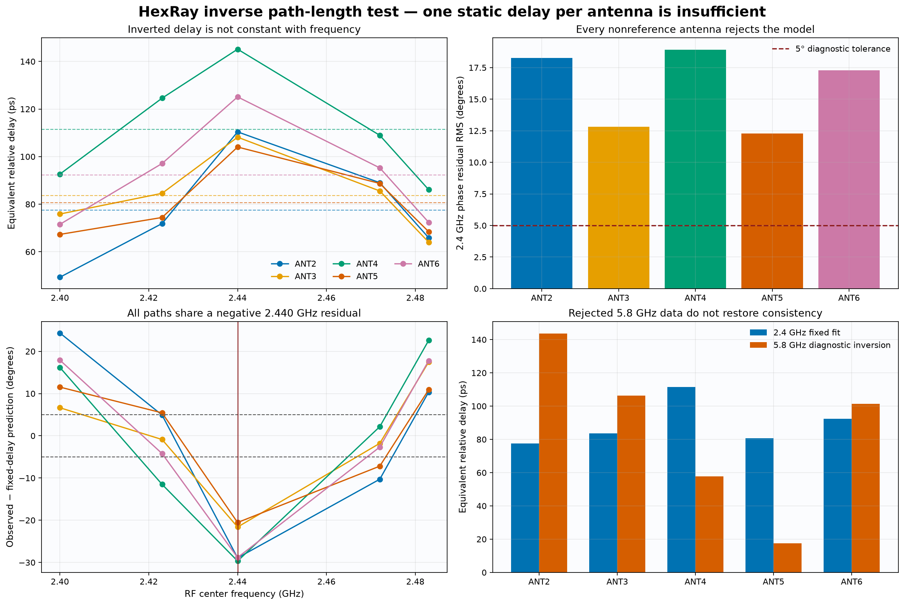

# HexRay inverse path-length report

## Executive result

One static relative path delay per antenna does **not** explain the verified 2.4 GHz phase
measurements. After resolving whole-cycle ambiguity against the released PCB-route delay prior,
the best fixed-delay models leave `12.29–18.91° RMS` phase error for ANT2 through ANT6. The
diagnostic yardstick is `5°`, borrowed from the existing calibration residual gate; every
nonreference antenna rejects the model.

The strongest evidence is shared frequency structure: every nonreference channel has its most
negative fixed-delay residual at `2.440 GHz`, with residuals from `-20.54°` to `-29.66°` and a
median of `-28.84°`. A static length creates a phase linear in frequency and cannot produce this
common curved excursion. The result therefore requires frequency-dependent end-to-end terms in
addition to propagation delay.



## Evidence boundary

The five 2.4 GHz observations come from the accepted v2.2 centered-TX1 calibration: 15 unique
streams, zero retries, all held-out gates passed, and independent raw-artifact audit passed. The
phase values are the raw end-to-end response of each selected state relative to ANT1, recovered
from the inverse calibration coefficients.

The exact 5.8 GHz values are kept separate. They come from two rejected stimulus screens after
exploratory ALL_OFF complex subtraction. Because direct/common leakage masked the amplitude
marker, those values are diagnostic fingerprints—not admitted connector phases or calibration
coefficients. They cannot promote or rescue the path-length model.

Source inputs:

- [`hexcal-v2.2-results.json`](data/hexcal-v2.2-results.json): accepted 2.4 GHz calibration.
- [`design-snapshot.json`](data/design-snapshot.json): released PCB route/delay priors.
- [`hexcal-v2.4-5g8-phase-leakage-results.json`](data/hexcal-v2.4-5g8-phase-leakage-results.json): rejected-artifact 5.8 GHz diagnostic.

## Model and inverse

For antenna (i), referenced to ANT1, a single delay predicts:

\[
\phi_i(f)=\operatorname{wrap}(-360 f\tau_i)
\]

and each phase measurement can be inverted as:

\[
\tau_i=\frac{-\phi_i+360k}{360f}.
\]

The integer (k) is the unavoidable whole-cycle ambiguity. At each frequency the analysis
chooses the solution nearest the released PCB relative-delay prior, then fits one fixed delay to
the five resolved 2.4 GHz observations. This is the most favorable physically informed branch
for a board-scale explanation; it does not arbitrarily change phase cycles to improve the fit.

Negative observed phase means ANTn lags ANT1. The reported `cτ` is a free-space-equivalent
electrical length. An actual physical length is (v_p\tau), so it depends on propagation medium
and velocity factor; `cτ` must not be treated as a literal PCB or cable measurement.

## Verified 2.4 GHz phase input

Each cell is `PCB-route-only expectation / observed end-to-end response`, in degrees relative to
ANT1 and wrapped to `[-180°, +180°)`.

| Antenna | 2.400 GHz | 2.423 GHz | 2.440 GHz | 2.472 GHz | 2.483 GHz |
|---|---:|---:|---:|---:|---:|
| ANT1 | `0.00 / 0.00` | `0.00 / 0.00` | `0.00 / 0.00` | `0.00 / 0.00` | `0.00 / 0.00` |
| ANT2 | `-65.01 / -42.60` | `-65.63 / -62.68` | `-66.09 / -96.98` | `-66.96 / -79.24` | `-67.25 / -58.91` |
| ANT3 | `-47.50 / -65.55` | `-47.95 / -73.77` | `-48.29 / -95.01` | `-48.92 / -76.15` | `-49.14 / -57.24` |
| ANT4 | `-73.31 / -80.05` | `-74.01 / -108.67` | `-74.53 / -127.50` | `-75.51 / -96.97` | `-75.84 / -76.98` |
| ANT5 | `-73.31 / -58.15` | `-74.01 / -64.92` | `-74.53 / -91.39` | `-75.51 / -78.96` | `-75.84 / -61.20` |
| ANT6 | `-47.50 / -61.81` | `-47.95 / -84.70` | `-48.29 / -109.89` | `-48.92 / -84.78` | `-49.14 / -64.70` |

## Delay inversion and fixed-delay fit

All inferred delays are picoseconds relative to ANT1. A fixed path requires each row to remain
constant across frequency.

| Antenna | PCB prior | 2.400 | 2.423 | 2.440 | 2.472 | 2.483 | Delay range |
|---|---:|---:|---:|---:|---:|---:|---:|
| ANT1 | 0.00 | 0.00 | 0.00 | 0.00 | 0.00 | 0.00 | 0.00 |
| ANT2 | 75.24 | 49.30 | 71.86 | 110.41 | 89.04 | 65.91 | 61.10 |
| ANT3 | 54.98 | 75.87 | 84.58 | 108.17 | 85.57 | 64.04 | 44.13 |
| ANT4 | 84.85 | 92.65 | 124.58 | 145.15 | 108.96 | 86.12 | 59.03 |
| ANT5 | 84.85 | 67.30 | 74.42 | 104.04 | 88.73 | 68.46 | 36.73 |
| ANT6 | 54.98 | 71.54 | 97.10 | 125.11 | 95.27 | 72.38 | 53.57 |

| Antenna | Best fixed delay | Free-space-equivalent `cτ` | Phase residual RMS | 5° diagnostic result |
|---|---:|---:|---:|---|
| ANT1 | 0.00 ps | 0.00 mm | 0.00° | reference |
| ANT2 | 77.48 ps | 23.23 mm | 18.25° | reject |
| ANT3 | 83.56 ps | 25.05 mm | 12.80° | reject |
| ANT4 | 111.39 ps | 33.39 mm | 18.91° | reject |
| ANT5 | 80.65 ps | 24.18 mm | 12.29° | reject |
| ANT6 | 92.28 ps | 27.66 mm | 17.28° | reject |

ANT3 and ANT5 are the closest fits, but both still exceed the diagnostic tolerance by more than
`2.4×`. The v2.2 run's maximum measured round-order phase delta was only `0.0579°`; the
fixed-delay residuals are therefore hundreds of times larger than the observed short-term
repeatability and cannot be explained as capture noise.

## Experimental 5.8 GHz comparison

The observed column is circular mean ± circular standard deviation across 12 rejected trials.
The 2.4 GHz fit is extrapolated to 5.8 GHz only to test consistency; it is not interpolation or a
released coefficient.

| Antenna | 5.8 observed phase | Inverted delay | Phase predicted by 2.4 fit | Circular residual |
|---|---:|---:|---:|---:|
| ANT1 | `0.00 ± 0.00°` | 0.00 ps | 0.00° | 0.00° |
| ANT2 | `+60.05 ± 1.28°` | 143.65 ps | -161.78° | -138.17° |
| ANT3 | `+137.95 ± 11.71°` | 106.34 ps | -174.48° | -47.57° |
| ANT4 | `-120.75 ± 1.28°` | 57.83 ps | +127.43° | +111.82° |
| ANT5 | `-36.49 ± 10.53°` | 17.48 ps | -168.40° | +131.91° |
| ANT6 | `+148.41 ± 3.19°` | 101.34 ps | +167.33° | -18.92° |

ANT6 happens to be the closest cross-band comparison, but one contaminated/rejected 5.8 GHz
point cannot validate a model. ANT2, ANT4 and ANT5 disagree by more than `110°`, consistent with
the already documented 5.8 GHz common-leakage problem.

## Interpretation

The fixed-delay model fails because the measured response has curvature rather than one linear
phase slope. Likely contributors include:

- antenna and ANT1-reference-path resonance;
- mutual coupling within the compact array;
- local multipath and near-field scattering;
- frequency-dependent switch, connector, cable or launch response; and
- a shared reference-path phase excursion near 2.440 GHz.

The synchronized 2.440 GHz feature across ANT2–ANT6 is especially suggestive of a common term,
such as ANT1/reference-path response or an assembly/environment resonance, rather than five
independent cable-length errors of the same shape.

## Recommended next experiment

1. First isolate the 5.8 GHz ALL_OFF leakage with TX1 active and Pluto RX2 terminated directly
   at its reference plane.
2. At 2.4 GHz, acquire a dense immutable sweep—approximately `1–2 MHz` spacing from `2.400` to
   `2.483 GHz`—without moving cables or antennas.
3. Fit an unwrapped affine phase model per antenna to estimate group delay, then retain the
   residual versus frequency as the dispersive/coupling fingerprint.
4. Repeat after a controlled cable permutation or conducted through-path fixture to separate
   cable/PCB/switch delay from OTA antenna and environment terms.
5. Do not replace the existing per-frequency coefficients with a path-length correction unless
   the denser held-out data pass the original residual gates.

## Reproduction and provenance

The machine-readable
[`inverse-delay analysis`](data/hexcal-path-length-inverse-analysis.json) records every input
hash, phase, branch-resolved delay, prediction, residual and conclusion. Its
[`manifest`](data/hexcal-path-length-inverse-analysis-manifest.json) binds the analysis script,
JSON and PNG hashes.

Generate and byte-check the report data and figure:

```bash
uv run --extra report python scripts/analyze_hexcal_path_length_model.py
uv run --extra report python scripts/analyze_hexcal_path_length_model.py --check
uv run --extra report pytest -q tests/test_hexcal_path_length_model.py
```

Generated JSON and PNG artifacts are never manually edited.
