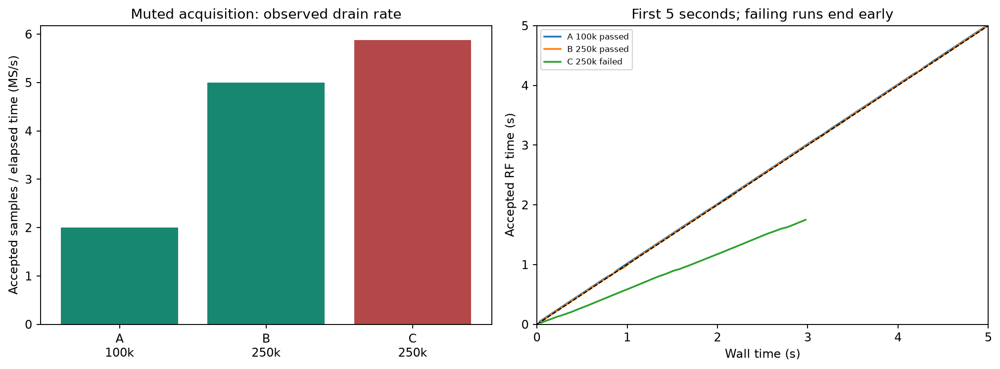
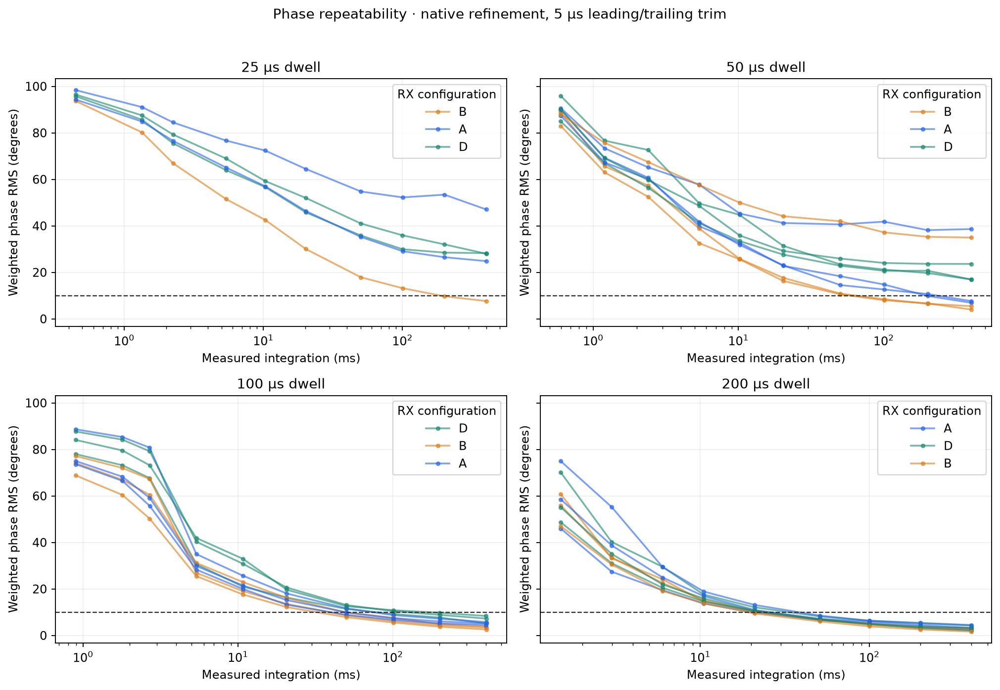
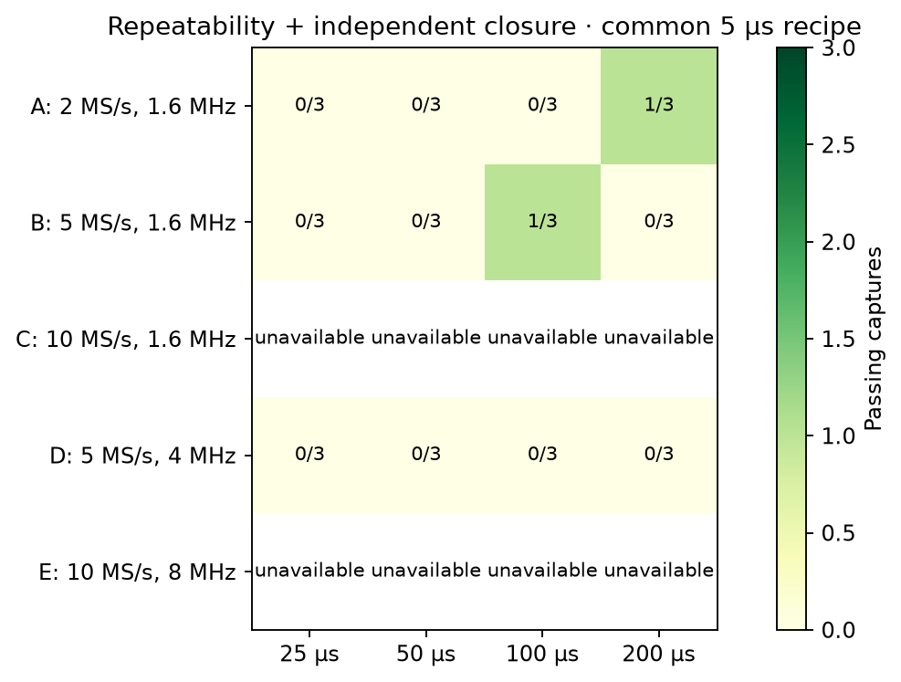
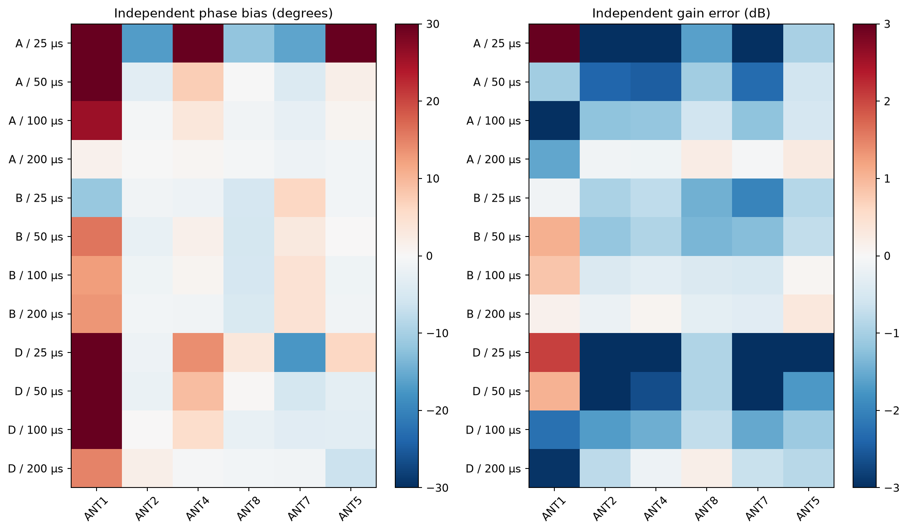
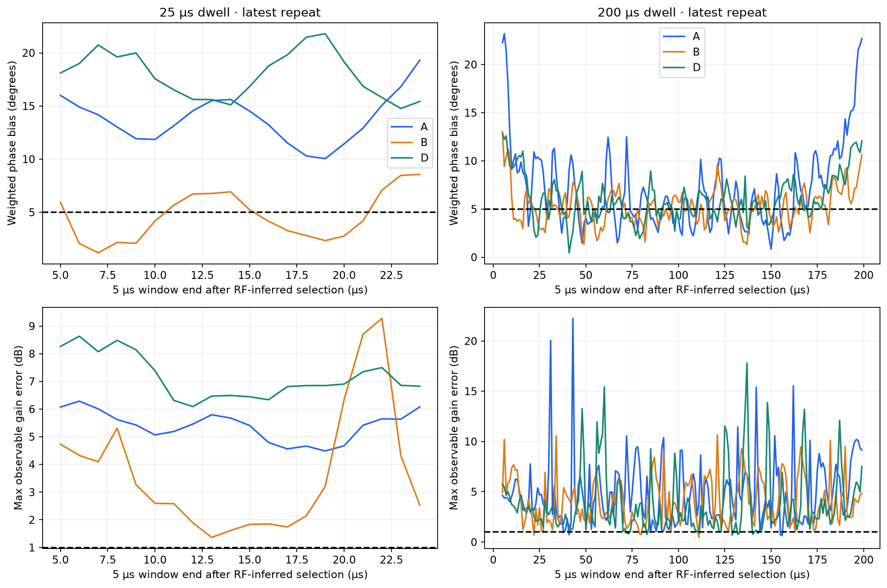
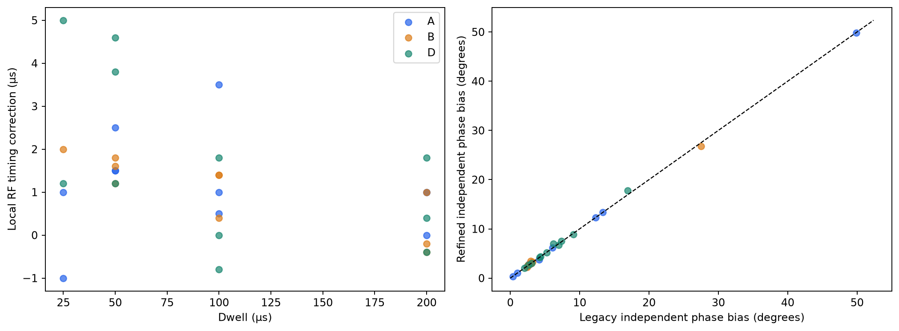
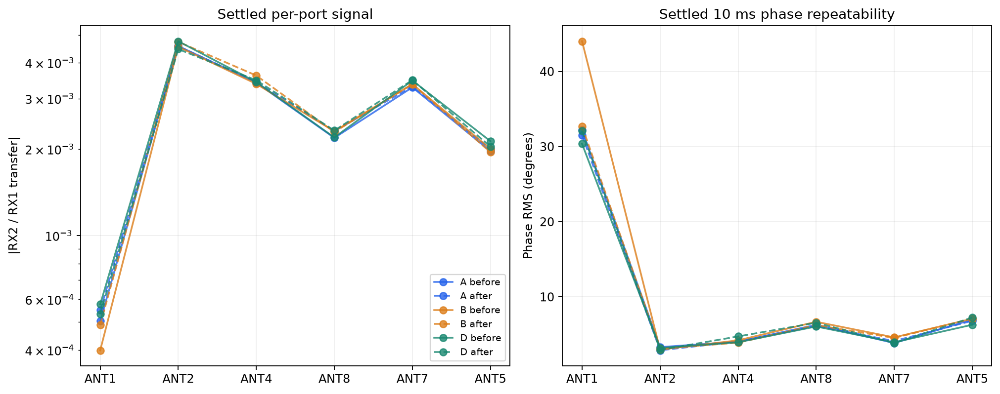
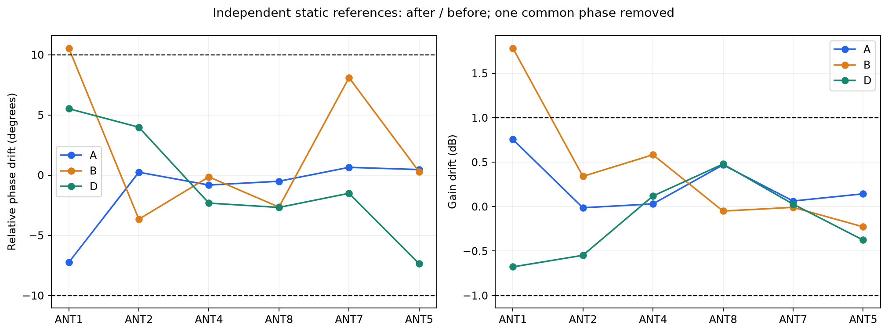
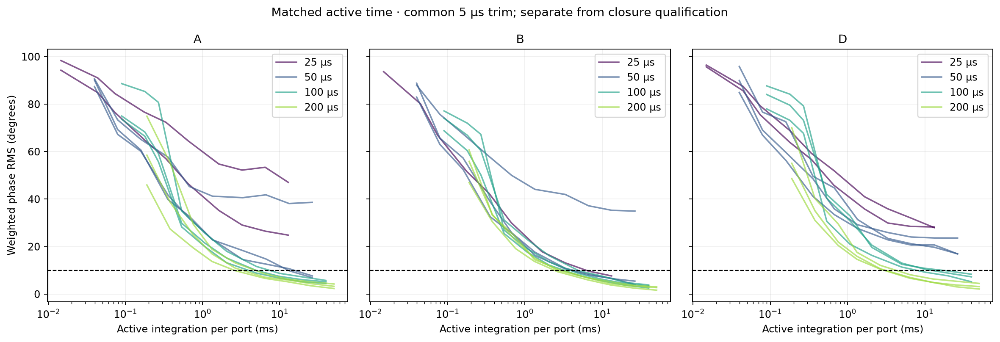

# Higher sample rate and shorter dwell campaign

Campaign: `tracking-rate-timing-20260908-v2`. Status: **completed-screen**.

Recorded 36 switching runs, 6 controls and 36 independent static references.

[Engineering findings, operating decision and next experiment](FINDINGS.md).

Only this campaign supplies the phase results below. Earlier campaigns and the retired v1 pilot are not pooled into its training, references or validation.

## Receiver configurations and acquisition

| ID | Requested rate MS/s | Requested RX bandwidth MHz | Availability |
| :--- | ---: | ---: | :--- |
| A | 2 | 1.6 | admitted |
| B | 5 | 1.6 | admitted |
| C | 10 | 1.6 | unqualified |
| D | 5 | 4 | admitted |
| E | 10 | 8 | unqualified |

C and E share the 10 MS/s transport gate; a C failure excludes E without pretending that E received a separate RF test. Blocks are capped at 250k samples per channel: 50 ms at 5 MS/s, 25 ms at 10 MS/s. Rate acceptance is not continuity qualification.

| Configuration | Result | RF seconds accepted | Wall seconds | Drain MS/s |
| :--- | :--- | ---: | ---: | ---: |
| A | passed | 30.000 | 29.983 | 2.001 |
| B | passed | 30.000 | 29.995 | 5.001 |
| C | failed | 1.750 | 2.975 | 5.882 |

## Switching comparison

| Configuration | Dwell µs | Round | Method | Discard µs | Phase latency ms | Phase bias ° | Gain error dB | Pass |
| :--- | ---: | ---: | :--- | ---: | ---: | ---: | ---: | :--- |
| A | 200 | 1 | refined | 5 | 20.92 | 1.03 | 0.95 | True |
| D | 200 | 1 | refined | 5 | 50.81 | 3.06 | 2.46 | False |
| B | 200 | 1 | refined | 5 | 50.81 | 2.57 | 1.31 | False |
| D | 100 | 1 | refined | 5 | 100.44 | 4.22 | 3.44 | False |
| B | 100 | 1 | refined | 5 | 50.22 | 3.06 | 0.73 | True |
| A | 100 | 1 | refined | 5 | 100.45 | 2.93 | 3.90 | False |
| B | 50 | 1 | refined | 5 | 100.42 | 2.25 | 2.76 | False |
| A | 50 | 1 | refined | 5 | 200.27 | 6.16 | 2.46 | False |
| D | 50 | 1 | refined | 5 | — | 7.51 | 3.28 | False |
| B | 25 | 1 | refined | 5 | 200.44 | 3.47 | 1.99 | False |
| A | 25 | 1 | refined | 5 | — | 49.83 | 14.25 | False |
| D | 25 | 2 | refined | 5 | — | 8.92 | 4.59 | False |
| A | 25 | 2 | refined | 5 | — | 12.34 | 5.03 | False |
| B | 50 | 2 | refined | 5 | 100.45 | 2.95 | 1.29 | False |
| D | 50 | 2 | refined | 5 | — | 6.74 | 2.70 | False |
| A | 50 | 2 | refined | 5 | 400.58 | 2.98 | 2.77 | False |
| B | 100 | 2 | refined | 5 | 50.23 | 3.29 | 1.15 | False |
| A | 100 | 2 | refined | 5 | 50.23 | 2.33 | 2.98 | False |
| D | 100 | 2 | refined | 5 | 200.89 | 5.22 | 2.26 | False |
| B | 200 | 2 | refined | 5 | 50.82 | 2.82 | 0.60 | False |
| D | 200 | 2 | refined | 5 | 50.82 | 2.05 | 2.94 | False |
| A | 200 | 2 | refined | 5 | 50.82 | 0.35 | 2.24 | False |
| D | 100 | 3 | refined | 5 | 200.01 | 4.34 | 2.23 | False |
| B | 100 | 3 | refined | 5 | 50.22 | 2.69 | 0.84 | False |
| A | 100 | 3 | refined | 5 | 50.22 | 3.71 | 1.79 | False |
| D | 25 | 3 | refined | 5 | — | 17.77 | 6.54 | False |
| A | 200 | 3 | refined | 5 | 50.83 | 2.68 | 1.56 | False |
| D | 200 | 3 | refined | 5 | 50.82 | 2.64 | 2.99 | False |
| B | 200 | 3 | refined | 5 | 20.93 | 2.57 | 1.90 | False |
| A | 50 | 3 | refined | 5 | — | 13.38 | 3.85 | False |
| D | 50 | 3 | refined | 5 | — | 7.01 | 3.19 | False |
| B | 50 | 3 | refined | 5 | — | 26.79 | 7.91 | False |

This table fixes the same 5 µs leading/trailing trim for comparison. The frozen training-selected recipe and independent validation are recorded below. All discard/method variants remain in `data/screen_variants.csv`.

4 captures passed acquisition integrity but failed schedule decoding. They are absent from the numeric table above, counted as failures in the quality matrix, and retained in [analysis_failures.csv](data/analysis_failures.csv).

| Configuration | Dwell µs | Round | Decoder error |
| :--- | ---: | ---: | :--- |
| D | 25 | 1 | selector marker chain is not locally continuous |
| B | 25 | 2 | selector marker chain is not locally continuous |
| A | 25 | 3 | selector marker chain is not locally continuous |
| B | 25 | 3 | selector marker chain is not locally continuous |

## Frozen selection and validation

Training selection: `{"configuration": "A", "dwell_us": 200, "leading_discard_us": 0, "method": "native_refined", "training_latency_ms": 20.92334781619069}`.

Independent screen validation: `False`. Full metrics and reference-drift decisions are retained in [summary.json](data/summary.json).

| Holdout round | Phase latency ms | Weighted bias ° | Max port bias ° | Max gain dB | Pass |
| ---: | ---: | ---: | ---: | ---: | :--- |
| 2 | 50.819239871162786 | 0.38414898127123737 | 1.0687668296073458 | 2.1397722790848244 | False |
| 3 | 50.82795068504108 | 2.8754450315759823 | 35.48468193894221 | 1.5842262823152984 | False |

## Fresh static references and drift

| Port | Frozen weight | Observable | A before 10 ms phase RMS ° |
| :--- | ---: | :--- | ---: |
| ANT1 | 0.00486 | True | 32.22 |
| ANT2 | 0.40017 | True | 3.31 |
| ANT4 | 0.22251 | True | 4.05 |
| ANT8 | 0.09177 | True | 6.28 |
| ANT7 | 0.20649 | True | 3.85 |
| ANT5 | 0.07420 | True | 6.97 |

| Configuration | Weighted phase drift ° | Max port drift ° | Max gain drift dB | Pass |
| :--- | ---: | ---: | ---: | :--- |
| A | 0.75 | 7.25 | 0.76 | True |
| B | 4.49 | 10.55 | 1.78 | False |
| D | 3.58 | 7.36 | 0.68 | True |

## Bracketing controls

Same A/200 µs configuration, common refined 5 µs recipe. Rounds 11–13 denote the end of screening rounds 1–3; rounds 1–3 are their starts.

| Control label | Phase latency ms | Weighted bias ° | Max port bias ° | Max gain dB | Pass |
| ---: | ---: | ---: | ---: | ---: | :--- |
| 1 | 50.817258832200544 | 0.99 | 5.18 | 0.99 | True |
| 11 | 50.81552547488442 | 1.15 | 9.12 | 1.90 | False |
| 2 | 50.81783994589898 | 2.48 | 15.93 | 5.70 | False |
| 12 | 50.816140954559124 | 1.77 | 17.96 | 1.87 | False |
| 3 | 50.81571810323596 | 3.47 | 33.61 | 1.71 | False |
| 13 | 50.819917290453155 | 2.93 | 23.95 | 0.97 | False |

## Repeatability versus integration

## Quality matrix

## Independent per-port closure

## RF-visible settling

## Same-IQ decoder comparison

## Static per-port signal and repeatability

## Before/after fixture stability

## Repeatability versus active per-port integration

## Interpretation and limits

Phase repeatability uses frozen power weights from the independent A reference. Closure compares with a separate settled vector for the same receiver configuration; one common phase rotation is removed for spatial closure, with no per-port refitting. The target is ≤10° repeatability, ≤5° weighted bias, ≤10° observable-port bias, and ≤1 dB observable-port gain error.

Analysis is retrospective and RF-inferred. The time-to-quality values exclude initial synchronization, transfer and processing latency; they are not measured live-tracker delivery times. No synchronized GPIO marker was acquired. This dataset does not establish surveyed OTA bearing accuracy.

Dense frequency validation is gated on an independently validated improvement. Absent measurements must not be inferred from a failed gate.

Native refinement is a local ±5 µs plateau-consistency search, not a GPIO timestamp. A result at its search boundary is a diagnostic warning. The 5 µs settling windows overlap and are not independent trials. 'Phase latency' is the first tested integration budget meeting RMS, not a precisely estimated minimum.

Raw IQ and run hashes remain under `/srv/bulk/samteway/lab-data/tracking-rate-timing-20260908-v2`. The experimental procedure is in [the plan](../higher_sample_rate_timing_plan/README.md).
