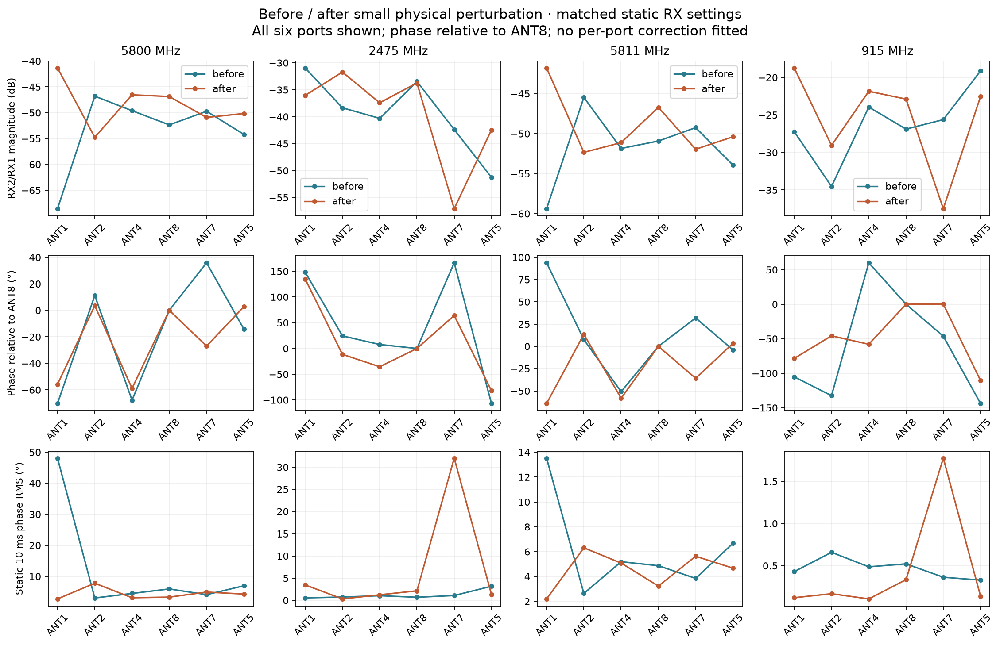
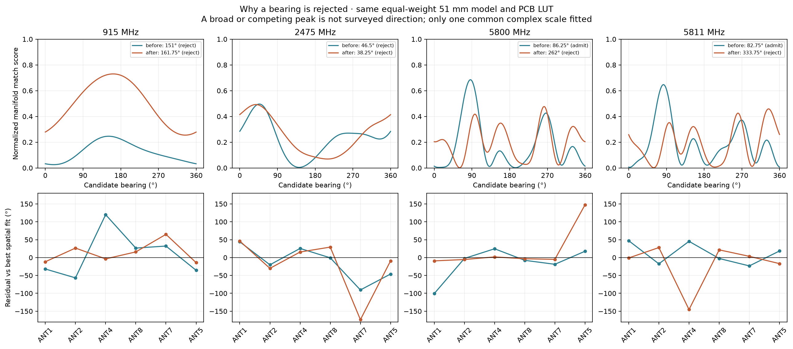
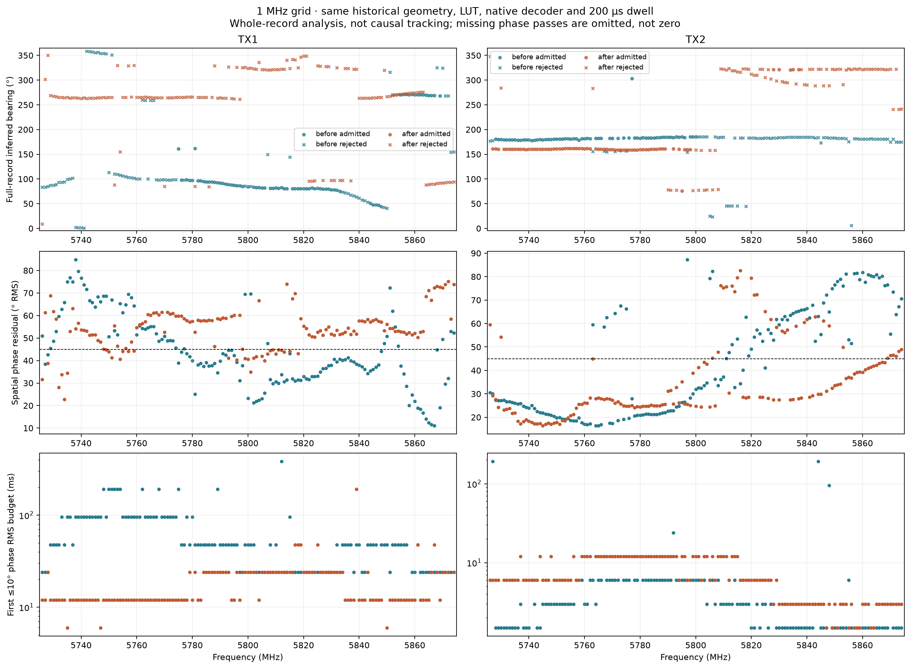
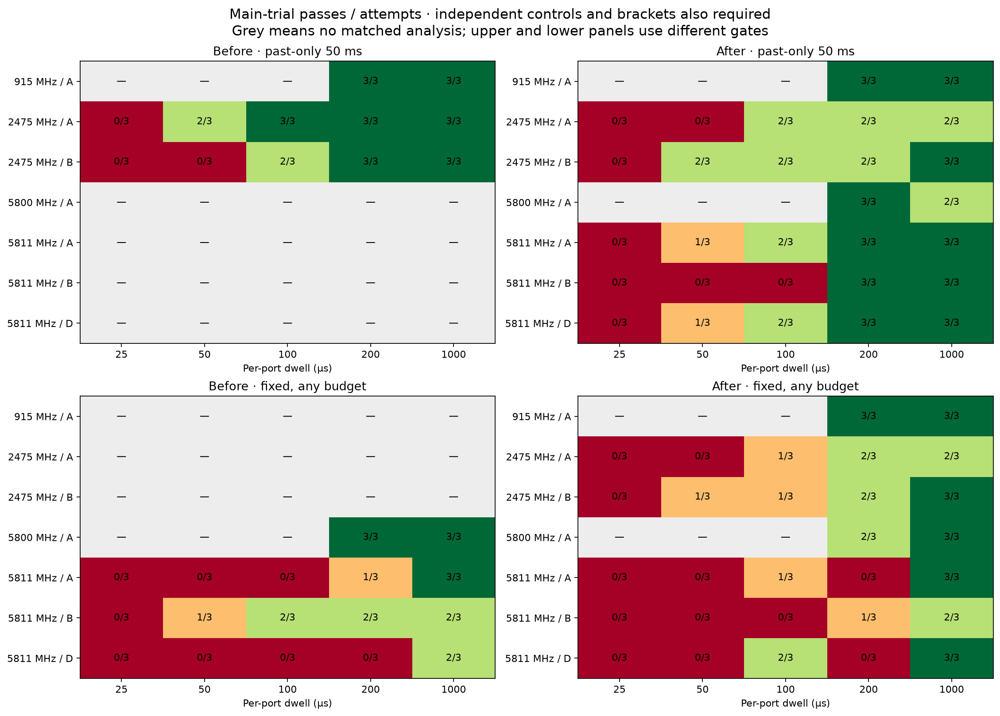
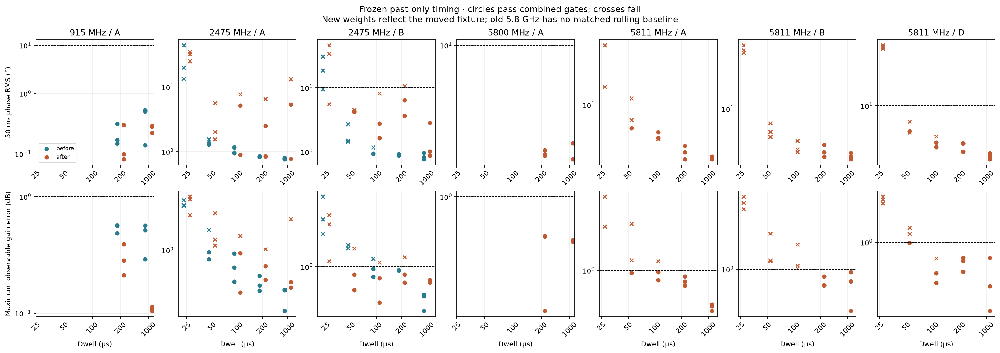
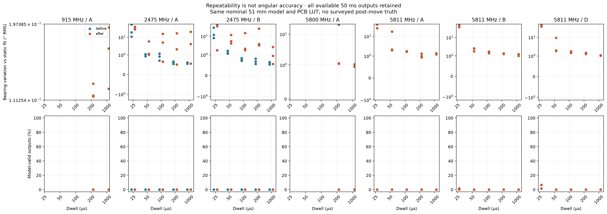

# What changed when we moved the array?

**September 10–11, 2026 · completed repeat campaign; interrupted attempt retained**

This is a new measurement campaign following the operator's confirmation:
“done, everything is still approximately the same setup, just jittered.”
It compares the moved fixture with the earlier measurements without changing
the PCB calibration LUT or fitting new per-port OTA offsets.

The first static measurements show that the move substantially changed the
six-port complex response. At 5800 MHz, ANT1's RX2/RX1 transfer magnitude rose
by approximately 27 dB. At 2475 MHz, ANT7 became weaker and its static 10 ms
phase variation rose from approximately 1.1° to 32°. These are **fixture-dependent
changes**, not a demonstration that external interference, a splitter, or the
PCB alone caused the earlier frequency-dependent bearings.

### Acquisition interruption and explicit continuation

On September 10 at 05:01:54 UTC, the 5811 MHz / A / 200 µs first-round
capture returned `OSError: [Errno 61] No data available`. It had received 71
continuous 100,000-sample frames (3.55 seconds of a planned four seconds).
Those retained frames reported no missing samples, overflow or ADC clipping.
The error interrupted SDR data acquisition; it is not a measured PCB phase
failure. The original logs do not distinguish network, device or driver causes.

The runner conservatively stopped the incomplete block, muted both radios and
restored the original selector image, verified at 05:02:13 UTC. The later dense
sweep was therefore never started. The offline follower processed the four
completed blocks, then stopped on the failed block; its original generic
“integrity/status differs” message was a status rejection, not demonstrated
file corruption.

On September 11 the user explicitly requested continuation. The four complete
blocks and their existing analyses are retained without reselection. The
incomplete 5811 MHz / A block is repeated as a **new bracketed attempt**, followed
by the remaining B/D blocks and dense sweep. Its original five capture attempts
(four acquired, one interrupted) and six before-references remain in the parent
dataset and are not pooled into the 117 planned completed-block records. A fresh
5811 MHz source-muted/source-on screen precedes the continuation. No automatic
retry loop or relaxed data/phase acceptance threshold was introduced.

The continuation root is
`/srv/bulk/samteway/lab-data/tracking-jitter-20260911-resume-v1`. It links to the
original September 10 records; inherited static-screen figures still describe
September 10, whereas new 5811 MHz and dense captures are on September 11.
Elapsed-time drift is an additional confounder. Acquisition exception tracebacks
are now retained to locate a recurrence; measurement processing is unchanged.

## 1. Experiment and comparison rules

| Item | Held fixed or recorded |
|---|---|
| Array | Nominal 51 mm-diameter C6, clockwise ANT1, ANT2, ANT4, ANT8, ANT7, ANT5 |
| Wiring | TX1 split to attenuated RX1 reference and OTA emitter; RX2 receives PCB common; TX2 separate OTA emitter |
| Receiver | Serial `104000b29905000e17000800065934759d`, discovered at `192.168.1.15` |
| Source | Serial `104473b80a16000de6ff2000f8a6beca79`, discovered at `192.168.1.179` |
| Selector | UID `stm32c011-4c0055000950313950363920` |
| Transmitter | −35 dB hardware gain, DDS scale 0.25; no power increase |
| Receiver profiles | A: 2 MS/s, 1.6 MHz bandwidth; B: 5 MS/s, 1.6 MHz; D: 5 MS/s, 4 MHz |
| Dwell grid | 25, 50, 100, 200, 1000 µs where previously tested; only 200/1000 µs at 915 and 5800 MHz |
| Main trials | Three independent captures at each planned frequency/profile/dwell, with interleaved controls |
| References | Six static before/after references at each tested receiver profile; weights frozen from A-before |
| Dense repeat | 5726–5874 MHz at 1 MHz spacing, both sources, 200 µs dwell, four seconds per record |
| Calibration | Existing conducted PCB LUT, unchanged; no fitted per-port OTA correction |
| Truth | No surveyed post-move angles or measured displacement vectors |

The four screening centres are 915, 2475, 5800 and 5811 MHz. Seven bracketed
blocks repeat the 117 switched records represented in the previous consolidated
report. The dense repeat is a separate, historical-method comparison—not 298
additional independent validations of the rolling tracking algorithm.

Both dates use the same 51 mm model for the static comparisons. The September 3
dense map actually used a 49.9654 mm diameter. Its before/after comparison retains
that same historical geometry; the new 51 mm result is stored separately. Mixing
those models would conflate a processing change with the physical perturbation.

### What the move does and does not isolate

This was not a measured rigid-body translation. Relative positions, orientations
and cable shapes may all have changed, and the baseline was acquired days earlier.
The comparison can reveal sensitivity to the installed fixture, but cannot uniquely
attribute it to room reflections versus antenna/cable response, geometry,
coherent leakage, or elapsed-time drift. Nominal TX1 90°/0.30 m and TX2 180°/0.20 m
remain context only; they are not acceptance targets for this new placement.

## 2. Static six-port response



**Figure 1.** Before/after RX2/RX1 magnitude, phase relative to ANT8, and static
10 ms phase RMS. All six ports are shown, including weak ones. Each column uses
matched frequency and RX gain. The phase is wrapped to ±180°; the line merely
connects port labels, not a spatial interpolation or a fitted model.

The following diagnostic fits apply the same 51 mm geometry, equal weights and
PCB LUT to both dates. They are deliberately distinct from independently
power-weighted rolling results elsewhere in this report.

| Centre | Before inferred bearing | After inferred bearing | Before model gate | After model gate |
|---|---:|---:|---|---|
| 915 MHz | 151.00° | 161.75° | Reject | Reject |
| 2475 MHz | 46.50° | 38.25° | Reject | Reject |
| 5800 MHz | 86.25° | 262.00° | Admit | Reject |
| 5811 MHz | 82.75° | 333.75° | Admit | Reject |

**These numbers are candidate model peaks, not measured source directions.**
All four after-move fits fail at least one score, residual or ambiguity gate.
The large high-band changes make it particularly unsafe to interpret a smooth,
repeatable inferred angle as proof of correct localization.



**Figure 6.** Full angular match curves and residual phase at each best-fitting
direction. The moved high-band responses have competing peaks and large spatial
residuals. At 915 MHz the new peak has a higher score but is broad; it still fails
the unchanged ambiguity rule. This is a model diagnostic, not a measured antenna
beam pattern. No individual port phase is adjusted to improve these curves.

All 48 initial source-on/muted screens passed acquisition and headroom checks.
At 915 MHz five of six ports meet the earlier ≥0.9 coherence / ≤5° static-RMS
screen, exceeding its four-port progression minimum. ANT7 has lower coherence
but is retained in subsequent measurements and independently determined weights.

## 3. Dwell and bearing comparisons

<!-- RESULTS:START -->
## Measured results snapshot

**Full planned acquisition and offline analysis complete.**

Completed bracketed blocks analyzed: **7/7**. Switched records analyzed: **117/117**. Dense records analyzed: **298/298**.

| Centre / profile | Fastest clean tested dwell | Main-trial 50 ms phase RMS | Passing controls | Reference bracket | Observable ports |
|---|---:|---:|---:|---|---|
| 915 MHz / A | 200 µs | 0.080–0.221° | 3/3 | Pass | ANT1 ANT2 ANT4 ANT8 ANT7 ANT5 |
| 2475 MHz / A | None qualified | — | 3/3 | Pass | ANT1 ANT2 ANT4 ANT8 ANT5 |
| 2475 MHz / B | None qualified | — | 3/6 | Fail | ANT1 ANT2 ANT4 ANT8 ANT5 |
| 5800 MHz / A | 200 µs | 5.355–5.529° | 3/3 | Pass | ANT1 ANT2 ANT4 ANT8 ANT7 ANT5 |
| 5811 MHz / A | 200 µs | 3.659–4.686° | 3/3 | Pass | ANT1 ANT2 ANT4 ANT8 ANT7 ANT5 |
| 5811 MHz / B | None qualified | — | 3/6 | Fail | ANT1 ANT2 ANT4 ANT8 ANT7 ANT5 |
| 5811 MHz / D | 200 µs | 4.125–4.831° | 6/6 | Pass | ANT1 ANT2 ANT4 ANT8 ANT7 ANT5 |

A clean condition requires three main trials, every planned control, complete 50 ms prediction-window coverage and passing before/after references. This is phase/gain repeatability of a known laboratory source—not surveyed angular accuracy, unknown-source tracking or measured live throughput.

| Source | Before phase admission | After phase admission | Before spatial-model admission | After spatial-model admission |
|---|---:|---:|---:|---:|
| TX1 | 147/149 | 147/149 | 73/149 | 0/149 |
| TX2 | 144/149 | 147/149 | 66/149 | 72/149 |

Historical phase admission allows variable integration and requires the recorded TX2 frequency-fit quality. Spatial admission here is the full-record legacy model gate, not a surveyed success rate. The two columns use different observation budgets and criteria.



**Figure 5.** Matched historical geometry and native 200 µs decoder on both dates. Rejected bearing candidates remain visible; failed phase admissions are not plotted as zero latency.

<!-- RESULTS:END -->

The figures retain all completed results and recorded failures.
The machine-readable [report audit](data/report-audit.json) states how many
completed blocks and dense records have actually been analyzed.

The first completed block, 5800 MHz / A, passes at 200 µs: all three main trials,
all three controls and the independent reference bracket pass. Main-trial phase
RMS is 5.35–5.53° per 50 ms vector. At 1000 µs only two of three main trials
pass; incomplete rolling analysis prevents qualification of the third. This
is a new moved-fixture result, not retroactive promotion of the earlier records.



**Figure 2.** Passes/attempts among main trials only. Grey means untested or not
yet analyzed. A green cell alone is not a clean condition: all three main trials,
all planned controls, complete passing reference brackets and full prediction
window coverage must also pass. The upper panels use a common 50 ms past-only
recipe; the lower panels use the older fixed decoder at any tested integration
budget. Those rows are not interchangeable.



**Figure 3.** Frozen rolling method: phase RMS and maximum observable-port gain
error versus dwell. Circles pass the combined criteria, crosses fail; phase bias
and completeness are additional gates. The earlier 5.8 GHz measurements do not
have a matched fresh rolling baseline and are not invented here.



**Figure 4.** All available rolling bearing outputs, including rejected estimates.
The RMS is measured relative to the corresponding independent static-model
estimate, not surveyed truth. Fresh weights account for the new port strengths
and must not be mistaken for invariant before/after SNR conditions.

## 4. Reproducibility and safety

Raw IQ and all per-capture records remain under
`/srv/bulk/samteway/lab-data/tracking-jitter-20260910-v1`; only compact report
tables and PNGs belong in Git. The old campaigns and their reports are untouched.
Run records, raw bytes and lengths are checked before admission. Dense-analysis
caches bind the run, raw data, LUT, geometries, profile and implementation hashes.
Acquisition failures and analysis failures remain distinguishable.

The new dense wrapper mutes RF before offline analysis; the old wrapper did its
analysis before final mute. Signal settings and four-second data windows are
matched, but the wrapper is therefore not byte-identical. Source power is not
increased. No unrelated radio is opened for control. Selector firmware changes
use the existing bounded flash/backup/restore path.

An initial muted preflight collided with an overlapping ST-Link readback and
failed selector cleanup. The source mute readback passed. The retained retry
passed after serializing access; subsequent hardware calls are serialized.
The initial full selector flash matched the previously restored image exactly.
Final recorded post-campaign checks confirm both pinned radios muted, selector ALL_OFF with no active lease, and a byte-exact restore of the initial 16 KiB image.

The host also runs unrelated processing jobs. Replay timing is recorded, but
differences in CPU load and BLAS thread settings preclude attributing runtime
changes to this physical move or claiming live real-time operation.

Offline rendering, after the acquisition/analysis stages have completed:

```bash
PYTHONPATH=src:scripts OPENBLAS_NUM_THREADS=1 OMP_NUM_THREADS=1 \
  .venv/bin/python scripts/analyze_jitter_comparison.py --stage static
PYTHONPATH=src:scripts OPENBLAS_NUM_THREADS=1 OMP_NUM_THREADS=1 \
  .venv/bin/python scripts/analyze_jitter_comparison.py --stage dense
PYTHONPATH=src:scripts OPENBLAS_NUM_THREADS=1 OMP_NUM_THREADS=1 \
  .venv/bin/python scripts/render_jitter_report.py
```

For the pre-move synthesis, see [the consolidated report](../cross_band_tracking_analysis/README.md).
