# Pluto RX2 eight-way phase-localization experiment report

- **Experiment date:** 2026-08-25
- **Selector board:** `stm32c011-4c0055000950313950363920`
- **Transmitter run:** `multifrequency-phase-20260825-b`
- **RX1 follow-up run:** `rx1-reference-multifrequency-20260825-a`

## Executive summary

The experiment produced one useful conditional transmitter result and one useful negative
receiver-localization result.

The original switched-array run acquired phase data through all eight selector paths without
sample loss. With TX1 fixed at the previously accepted experimental anchor
`(-26.503, +315.671) mm`, the retained six-frequency phase-slope analysis placed TX2 in the
board's lower-right sector. Its highest-density point was `(+276.268, +131.100) mm`, or
`25.386 degrees` from `+x`. Leave-one-frequency-out modes covered `18.8–35.4 degrees`. The
reported `305.8 mm` radius mostly reproduces the `304.8 +/- 50 mm` prior and is not an
independent centimetre-level range measurement.

The follow-up coherently recorded the new Pluto RX1 antenna at the same time as the switched
RX2 array. All 42 finalized artifacts passed identity, hash, metadata-continuity, clipping,
and selector-cycle checks. Repeats were highly coherent, but the eight geometry-corrected
selector states failed the predeclared direct-path coherence gate at every frequency. The
measurement therefore succeeded while the proposed free-space model was rejected. No RX1
range difference or coordinate was accepted.

The ungated RX1 value `+102.3 mm` is **not a result**. It is one member of several nearly
equal, wavelength-spaced aliases in a deliberately ungated diagnostic. Furthermore, even a
perfect signed range difference to only two transmitter anchors defines a hyperbola, not a
unique planar point.

| Item | Status | Defensible interpretation |
|---|---|---|
| Dual-RX capture continuity | Accepted | The retained sample streams are continuous under metadata ABI 2 |
| TX1 coordinate | Conditional input | Experimental anchor, not a persisted physical survey |
| TX2 angular sector | Accepted conditionally | Lower-right sector, about `19–35 degrees` from `+x` |
| TX2 absolute radius | Prior dominated | Do not interpret as centimetre-level ranging |
| Joint direct-path TX fit | Rejected diagnostic | `53.9 degrees` weighted RMS does not calibrate the setup |
| RX1 coherent transfer measurement | Accepted | Repeatable dual-channel phase fingerprint |
| RX1 strict free-space locus | Rejected | Every frequency failed the state-coherence gate |
| RX1 `+102.3 mm` ungated mode | Invalid diagnostic | One of several nearly equivalent aliases |
| Unique RX1 planar coordinate | Not identified | Two anchors provide only one geometric constraint |

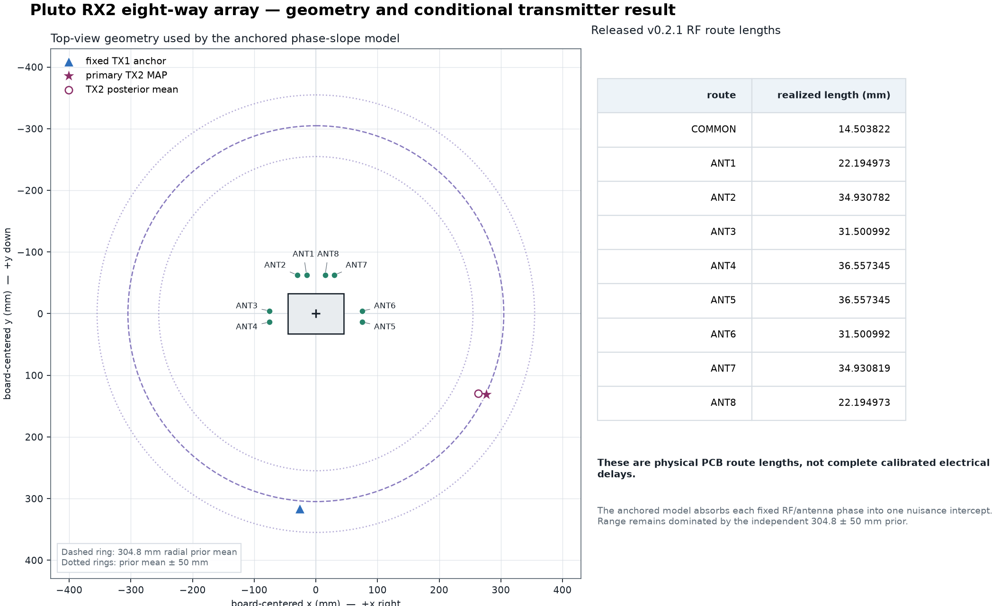

## 1. Questions and evidence boundary

The work addressed two questions:

1. Can phase measured through an autonomously switched eight-way receive array constrain the
   relative placement of TX1 and TX2?
2. After replacing the 50-ohm RX1 termination with an antenna, can coherent RX2/RX1 transfer
   phase locate that antenna?

The evidence boundary is intentionally strict. A capture is not a position estimate, high
repeatability is not model validity, and a highest-likelihood point is not reported when its
quality gate or geometric rank is insufficient. “Accepted” in this report means that the
result passed the documented acquisition and analysis policy; it does not turn an unsurveyed,
uncalibrated bench setup into a metrology system.

The committed evidence consists of source-hashed compact snapshots, deterministic figures,
and the methods in this directory. Raw CI16 captures and full Monte Carlo particle documents
remain outside Git in the per-board state tree. Their identities are retained in the snapshots
and run manifests.

## 2. Hardware geometry and coordinate convention

Coordinates are millimetres in the board plane. The origin is the centre of the `90 x 65 mm`
PCB outline, `+x` points right/east in top view, and `+y` points down/south. Polar direction is
defined by `x = r cos(theta)` and `y = r sin(theta)`.

The receive coordinates represent the vertical whip axes. They include the nominal `30 mm`
SMA-mating-face-to-whip-axis offset taken from the supplied antenna drawing. The RF lengths are
released realized-copper lengths; they are not calibrated electrical delays.

| State | Connector | Whip axis `(x, y)` mm | Released PCB RF length mm |
|---|---|---:|---:|
| ANT1 | J3 | `(-15.0, -62.5)` | 22.194973 |
| ANT2 | J4 | `(-30.0, -62.5)` | 34.930782 |
| ANT3 | J5 | `(-75.0, -4.5)` | 31.500992 |
| ANT4 | J6 | `(-75.0, +13.5)` | 36.557345 |
| ANT5 | J7 | `(+75.0, +13.5)` | 36.557345 |
| ANT6 | J8 | `(+75.0, -4.5)` | 31.500992 |
| ANT7 | J9 | `(+30.0, -62.5)` | 34.930819 |
| ANT8 | J10 | `(+15.0, -62.5)` | 22.194973 |

The common J2 route is `14.503822 mm`. Fixed selector and PCB phase can be absorbed by the
anchored frequency-slope model's per-antenna nuisance intercepts, but switch phase, connector
launch phase, dielectric uncertainty, antenna phase centre, mutual coupling, and room
multipath remain uncalibrated.

During the transmitter run, the selector-board common port fed Pluto RX2 and Pluto RX1 was
terminated in 50 ohms. In the RX1 follow-up, the selector common still fed RX2, while the new
whip on RX1 received continuously. Only TX1 or TX2 was enabled in any one bounded capture.

## 3. Selector firmware and observable timing

The STM32 ran the autonomous `fast20-v1` image. The generated control contract is
[`profiles/fast20-v1/control_profile.json`](../../profiles/fast20-v1/control_profile.json),
whose embedded contract SHA-256 is
`25b2bd0769687cc255d5e6926312e7e827672dc4567d64aecd85e8078acb4258`.
[`profiles/fast20-v1/provenance.json`](../../profiles/fast20-v1/provenance.json) ties that
contract to circuits source commit `b12d8a81972a03bfee431d1b1914eb28dd44a4d4` and records the
generated JSON SHA-256
`c8f3de200573d90d1b87b623770cd9253649c634a22cea1a9ca980042ae40f11`.
The firmware source is
[`firmware/stm32c011/apps/fast20/main.c`](../../firmware/stm32c011/apps/fast20/main.c),
with the state machine in
[`firmware/stm32c011/core/autonomous_core.c`](../../firmware/stm32c011/core/autonomous_core.c).

A nominal frame is self-identifying from RF timing:

| Segment | State | Nominal duration ms |
|---|---|---:|
| Marker body | ALL_OFF | 80 |
| Pre-ANT1/inter-state guard | ALL_OFF | 5 each |
| ANT1 | `0000` | 20 |
| ANT2 | `0100` | 23 |
| ANT3 | `0010` | 26 |
| ANT4 | `0110` | 30 |
| ANT5 | `0001` | 34 |
| ANT6 | `0101` | 39 |
| ANT7 | `0011` | 44 |
| ANT8 | `0111` | 50 |

The marker body is contiguous with the pre-ANT1 guard, so the nominal observable marker is
`85 ms`. Eight `5 ms` break-before-make guards and the eight unequal active dwells produce a
`386 ms` cycle. Disjoint `+/-5%` duration windows identify the states. Decoding rejects a
missing or extra transition, ambiguous duration, invalid order, absent marker, or insufficient
signal instead of guessing a label.

At boot the firmware preloads `ALL_OFF` before enabling GPIO outputs. It uses a 1 ms SysTick,
refreshes the independent watchdog, and remains `ALL_OFF` if the expected reset clock is not
present. These controls make the selector sequence deterministic; transmitter fail-muting is
implemented separately in the host runner and Pluto capture stack.

## 4. RF stimulus and continuous capture

Both experiments used three rounds at seven centre frequencies:

```text
2.400, 2.409, 2.423, 2.440, 2.458, 2.472, 2.483 GHz
```

The Pluto emitted a coherent pilot nominally `100 kHz` above each centre. TX1 and TX2 were
captured as adjacent pairs. Round 1 used supplied frequency order with TX1 then TX2; round 2
reversed frequency and transmitter order; round 3 rotated frequency order and alternated the
transmitter order. This makes slow drift visible instead of confounding it with one fixed
schedule.

The runner was bound to Pluto serial `104000b29905000e17000800065934759d` at the persisted
run URI `usb:1.3.5`. The repository pins `pluto-plus-utils` commit
`5551d29bc6c326f26285670efd20fc149caef474` for the bounded DDS stimulus and tandem-V7
metadata capture implementation.

Every retained condition used:

| Capture property | Value |
|---|---:|
| Sample rate | 1,000,000 samples/s |
| Receiver gain | 20 dB common tandem-HOLD gain |
| Metadata buffers | 100 |
| Samples per buffer per receiver | 100,000 |
| Samples per artifact per receiver | 10,000,000 |
| Duration per artifact | 10 s |
| Dual-RX channels | 2 |
| Metadata ABI | 2 |

The tandem-V7 metadata runtime records both receiver channels on one FPGA sample timeline.
The runner starts a fresh buffer generation and retains more than two kernel buffers. A valid
artifact requires contiguous host buffer indices and FPGA first-sample sequence numbers,
constant stream identity and ABI, zero overflow/failure flags, a matching persisted SHA-256,
enough complete selector cycles, and an exact-radio mute/readback after the condition.

Host real-time and monotonic timestamps are not used to splice IQ or establish phase
continuity. The FPGA sample counter and buffer sequence are authoritative.

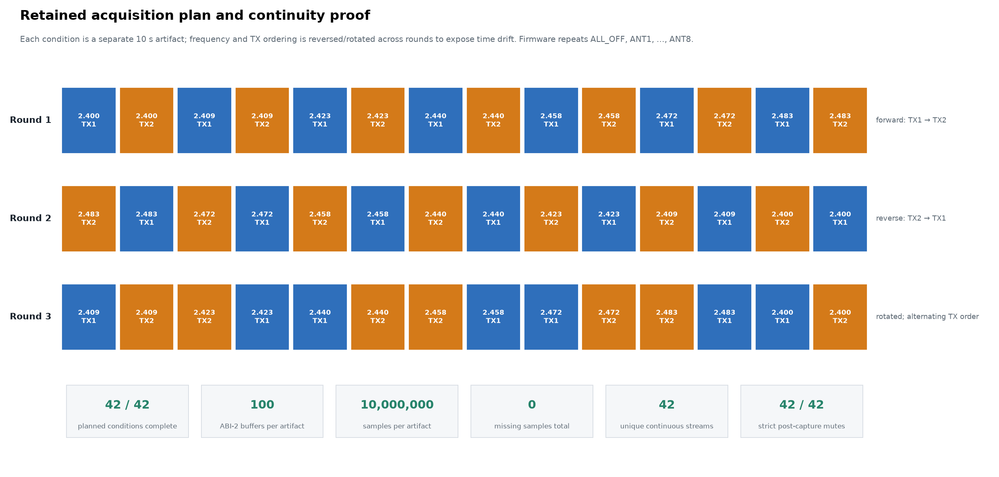

## 5. Phase estimators

### 5.1 Switched-array transmitter observable

The analysis refines the pilot frequency, reduces each complete dwell to a robust complex
phasor, interpolates the nearby `ALL_OFF` leakage reference, and subtracts it from the selected
state. Let `phi[t,f,i]` be the resulting phase for transmitter `t`, frequency `f`, and antenna
state `i`. The adjacent-transmitter difference is

```text
d[f,i] = wrap(phi[TX2,f,i] - phi[TX1,f,i])
```

and the profile used for localization references ANT1:

```text
D[f,i] = wrap(d[f,i] - d[f,ANT1]).
```

This double difference removes receive phase common to the adjacent TX pair and one unknown
common pair phase per frequency. Three capture pairs are circularly aggregated into one row
per unique frequency; the repeats estimate scatter and are not counted as three independent
geometry observations.

The direct model predicts all frequency/state phases from two free-space transmitter
positions. The anchored model instead fixes TX1 and fits TX2 from phase change with frequency,
while marginalizing one frequency-independent circular intercept for ANT2 through ANT8. This
makes the anchored likelihood insensitive to a fixed phase offset on each selector path, but
not to frequency-selective antenna response or multipath.

Changing only DDS starting phase would rotate the common observation and supply no new
location information after this differencing. It is useful as an invariance diagnostic, not as
an additional spatial baseline.

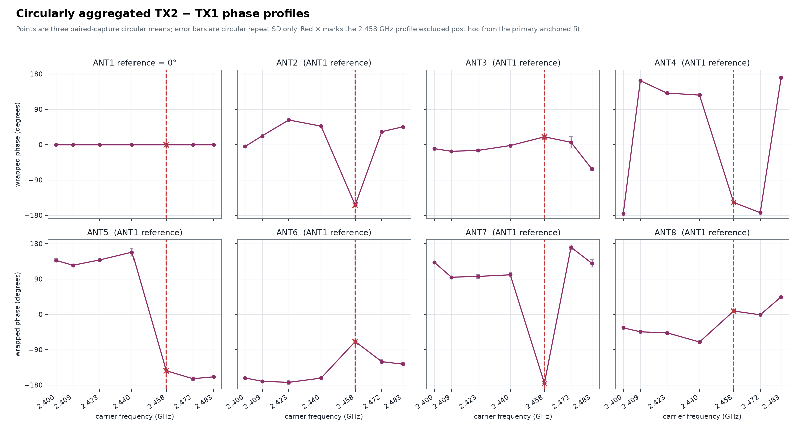

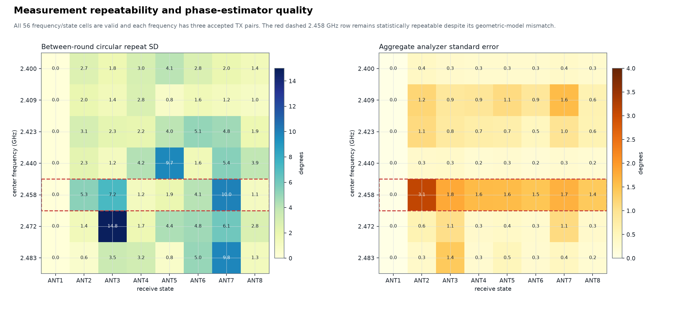

### 5.2 Coherent RX1-reference observable

With an antenna on RX1, both channels observe the same transmitted tone. For state `i`:

```text
T[t,f,i] = RX2 / RX1
Q[f,i]   = T[TX2,f,i] / T[TX1,f,i]
```

The same-state transmitter ratio cancels a fixed selector/PCB path. After applying the known
array geometry, an ideal direct-path model predicts one common state-independent phase:

```text
phase(Q_corrected[f,i]) = k[f] * (d(RX1,TX2) - d(RX1,TX1)).
```

The eight states are repeated estimates of this single scalar; they do not create eight
independent RX1 baselines. State coherence therefore tests whether this model is plausible
before a signed range-difference likelihood is allowed to report a mode.

## 6. Transmitter localization result

### 6.1 Acquisition and direct-model diagnostic

The transmitter run finalized all `42/42` planned conditions: three rounds, seven frequencies,
and two transmitters. Every artifact held 100 buffers and 10 million samples per receiver;
the aggregate had zero missing samples. All post-capture mutes and the independent final
mute/readback passed.

The unconstrained two-transmitter direct-path fit failed as a calibrated position model. Its
overall weighted RMS was `53.872 degrees`, with per-frequency RMS from `33.75` to
`79.77 degrees` and a maximum absolute residual of `179.81 degrees`. Those coordinates are
retained only as model-mismatch evidence.

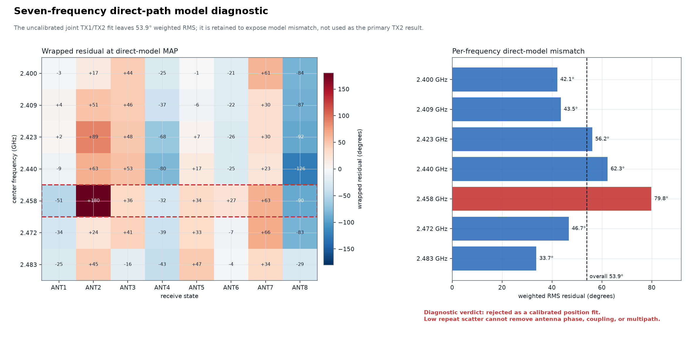

### 6.2 Anchored frequency-slope result

TX1 was fixed at `(-26.503035, +315.670945) mm`. The all-frequency anchored fit exposed a
`77.0-degree` RMS profile at 2.458 GHz, more than twice every other frequency profile. Its
within-frequency repeats were stable, so this was classified post hoc as a
frequency-selective model outlier rather than capture noise. Both the all-frequency result and
the exclusion remain in the audit trail.

The declared primary fit excluded 2.458 GHz and retained the other six frequencies:

| Quantity | Retained value |
|---|---:|
| TX2 MAP position | `(+276.268, +131.100) mm` |
| TX2 MAP direction | `25.386 degrees` |
| TX2 MAP radius | `305.796 mm` |
| TX2 posterior mean | `(+263.151, +129.359) mm` |
| Direction resultant length | 0.9578 |
| Radius 50% interval | `272.607–339.750 mm` |
| Radius 90% interval | `224.383–388.010 mm` |
| Weighted RMS residual | `25.811 degrees` |
| Maximum absolute residual | `69.965 degrees` |
| Effective sample size | `328,410 / 2,000,000` |

The radial posterior is dominated by the `304.8 +/- 50 mm` radial prior. The defensible output
is directional: every leave-one-frequency-out mode, already excluding 2.458 GHz, remained in
the lower-right quadrant between `18.8` and `35.4 degrees`.

> **Accepted conditional result:** given the TX1 anchor, planar geometry, radial prior, and
> six retained 2.4 GHz profiles, TX2 most likely lies in the lower-right sector. The run does
> not support a centimetre-level absolute TX2 coordinate.

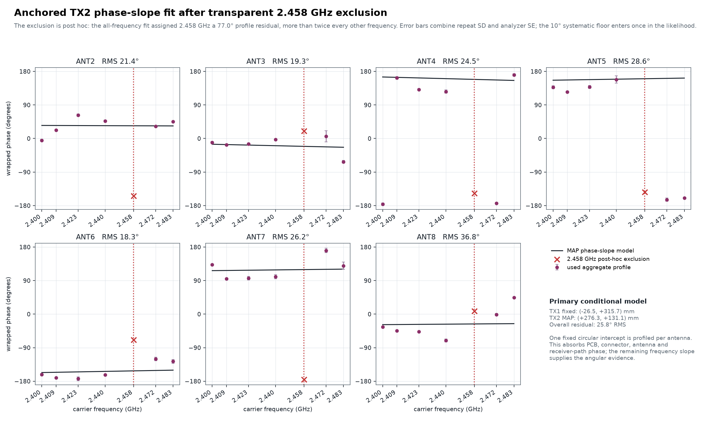

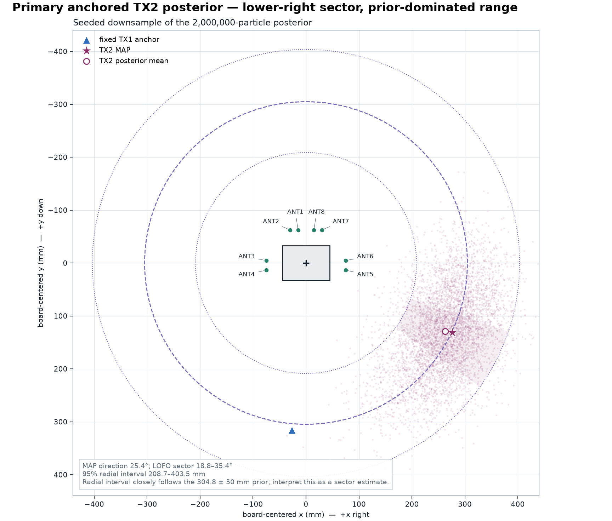

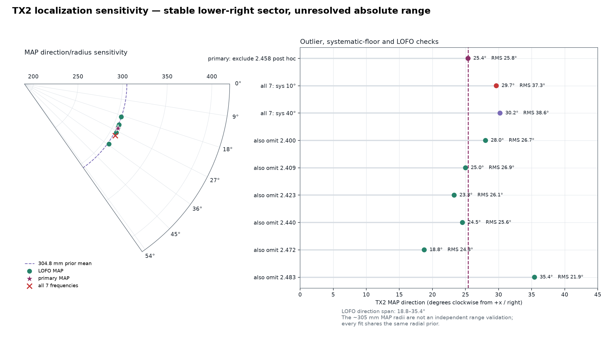

## 7. RX1 follow-up result

### 7.1 Integrity and quality audit

The RX1 run had 42 finalized conditions from 43 execution attempts. An independent audit
hashed `3,360,000,000` data bytes and verified every finalized artifact identity and digest.

| Audit quantity | Result |
|---|---:|
| Artifact identity / SHA-256 matches | `42 / 42` |
| Metadata buffers | 4,200 |
| Samples per receiver | 420,000,000 |
| Buffer / FPGA sample-sequence gaps | `0 / 0` |
| Missing samples / failure-flag blocks | `0 / 0` |
| Clipped / near-full-scale samples | `0 / 0` |
| Complete selector cycles per artifact | 25 |
| Final exact-radio mute/readback | passed |

Of 336 state judgments, 334 passed. Both exceptions were ANT7/TX1 in round 2:

- at 2.483 GHz, phase scatter was `32.2878 degrees` against a `30-degree` maximum;
- at 2.458 GHz, SNR was `14.1491 dB` against a `15 dB` minimum.

There were no global capture-gate rejections, and both affected frequencies retained two fully
admitted TX pairs. The two state-local exceptions were preserved rather than selectively
recaptured.

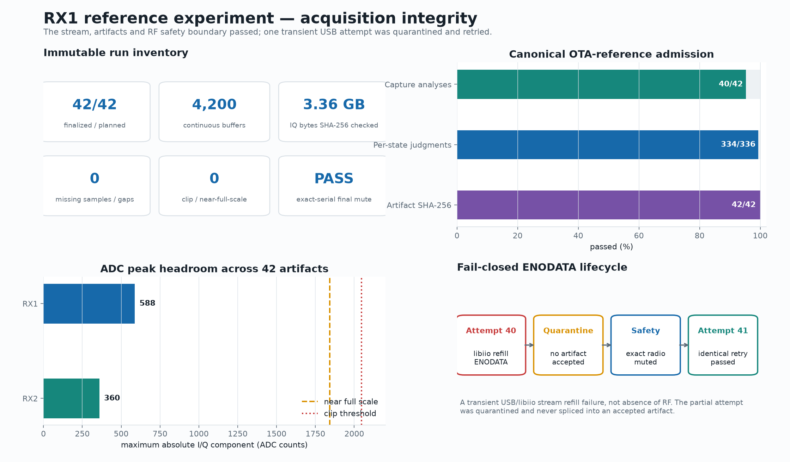

### 7.2 The transient `ENODATA` refill failure

Attempt 40, plan index 39, was round-3 TX1 at 2.483 GHz. The failure occurred in libiio while
executing `buffer.refill()`:

```text
OSError: [Errno 61] No data available
```

This means that the host did not receive the next streaming buffer. It does **not** mean that
the receiver observed no RF. The trace localizes the symptom to the USB/libiio refill path,
but the retained evidence does not distinguish among USB transport, hub/cable, kernel IIO,
device firmware, or host scheduling as the underlying cause.

The runner failed closed:

1. Capture returned code 1 and no artifact identity was accepted.
2. No partial IQ was spliced into another recording.
3. The exact Pluto serial was muted and read back successfully.
4. The unchanged plan resumed and retried the same condition as attempt 41.
5. Retry artifact `500b5a6bb77d49fa9dfe382e6e1df3d6`, SHA-256
   `e7b4572f0c318c0c90e016a81eb47f11619fdeef7e57f3e5476f6dd7e7520173`, passed
   continuity, reference-transfer quality, and subsequent mute checks.

The incident is therefore a recoverable transport/refill failure with a clean quarantine and
successful identical retry, not evidence of a discontinuity in any accepted artifact.

### 7.3 Repeatability passed; direct-path state agreement failed

Paired-repeat coherence across 56 frequency/state cells was excellent: minimum `0.940517`,
median `0.998572`, and maximum `0.9999977`. Repeat-aligned residuals were `2.3–7.9 degrees`,
and RX1 cycle coherence was approximately `0.9997–1.0`. Reversing TX order and the delay caused
by the retry did not destroy repeatability.

The strict model failed only after geometry correction required the eight selector states to
agree:

| Carrier GHz | State coherence | State phase RMS degrees |
|---:|---:|---:|
| 2.400100 | 0.438590 | 68.492 |
| 2.409100 | 0.358602 | 84.860 |
| 2.423100 | 0.311666 | 76.635 |
| 2.440100 | 0.268262 | 87.494 |
| 2.458100 | 0.184740 | 92.860 |
| 2.472100 | 0.295240 | 81.302 |
| 2.483100 | 0.455055 | 66.047 |

Every row was below the predeclared minimum state coherence of `0.50`; the strict analyzer
reported `no frequency has enough coherent, quality-passed selector states`. Reversing the
geometry sign, using SMA faces instead of assumed whip axes, omitting `ALL_OFF` subtraction,
and borrowing the prior terminated-RX1 capture as an empirical correction did not repair the
disagreement. The evidence supports deterministic model mismatch rather than a pairing bug,
sample discontinuity, or random RX phase reset.

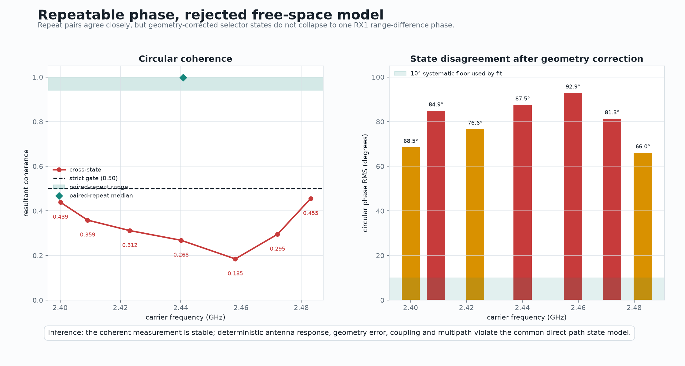

### 7.4 Why the diagnostic mode is not a location

Disabling the state gate yields a nominal `+102.2982 mm` signed range difference, but nearly
equal aliases occur at `+225.0961`, `-20.4996`, `+347.8940`, `-143.2975`, and
`-266.0954 mm`; all lose less than `0.1276` relative log-likelihood. The nominal 90% interval
spans `-271.0953` through `+346.8940 mm`. Leave-one-frequency-out modes range from `-19.1` to
`+225.8 mm`, while leave-one-state-out modes range from `-144.7` to `+352.19 mm`.

A separate frequency-slope diagnostic with a nuisance intercept for each selector state also
failed. Its joint mode hit the physical `-354.5938 mm` boundary with `35.4 degrees` wrapped
RMS, while individual state modes ranged from that boundary to `+169.7 mm`.

These values prove non-identification; they are not candidate ranges.

Even if one signed range difference had passed, two fixed transmitters provide only

```text
d(RX1,TX2) - d(RX1,TX1) = constant,
```

which is a hyperbola in the board plane. The measurement has geometric rank one. There was no
surveyed Pluto pose, RX1 phase-centre coordinate, cable geometry, or calibrated RX1/RX2 delay
to select a point on that curve.

> **Accepted RX1 conclusion:** coherent measurement and continuity succeeded, but the strict
> free-space model failed. No signed range difference and no RX1 coordinate are reported.

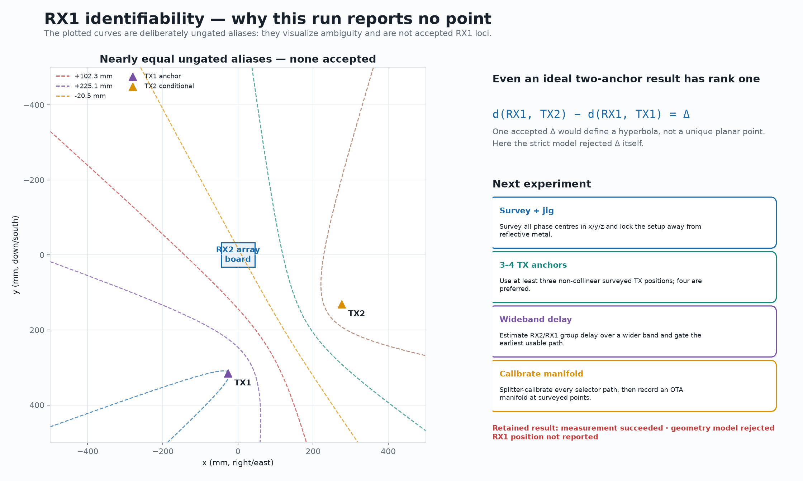

## 8. Limitations

The principal limitations are systematic rather than sampling-related:

- TX1 is an experimental anchor, not a persisted tape, laser, or photogrammetric survey.
- TX2's reported radius is strongly determined by the one-foot prior.
- The position model is planar and assumes a common unspecified phase-centre height.
- The nominal whip-axis offset is a mechanical dimension, not an RF phase-centre calibration.
- Realized PCB copper lengths do not include switch, launch, connector, or dielectric delay.
- Eight closely spaced whips have direction-dependent response and mutual coupling.
- Indoor reflections create stable, frequency-selective multipath; more identical repeats
  estimate that fingerprint more precisely without making the free-space model correct.
- The 2.458 GHz exclusion was selected post hoc, so the all-frequency result and
  leave-one-frequency sensitivity remain necessary parts of the claim.
- Two TX anchors cannot uniquely locate an unknown receiver in two dimensions, even with a
  valid signed range difference.

These limitations explain why excellent repeat coherence coexists with poor geometry-model
coherence. They also define the next useful experiment.

## 9. Recommended next experiment

1. **Survey and immobilize the geometry.** Record TX and RX phase centres in `x/y/z`, cable
   routing, whip hinge angles, and board pose. Use a rigid nonconductive jig away from bench
   metal and do not move it between calibration and validation.
2. **Increase geometric rank.** Use at least three non-collinear surveyed TX positions; four
   are preferred so one anchor can be held out as a blind validation case.
3. **Calibrate the receive transfer.** First perform a splitter/cable through-calibration of
   RX1 against each RX2 selector path. Then measure an OTA array manifold at surveyed source
   positions to capture switch, launch, antenna, coupling, and room response.
4. **Use wider bandwidth.** Measure a broad RX2/RX1 cross-spectrum, estimate differential
   group delay, and gate the earliest usable arrival. Isolated CW phase alone is periodic in
   range and cannot resolve the observed aliases.
5. **Predeclare acceptance gates.** Set limits for metadata continuity, clipping, per-state
   SNR, repeat coherence, state-model coherence, calibration residual, and held-out position
   error before examining the answer.
6. **Validate before blind use.** Recover surveyed hold-out positions first. For later
   uncontrolled narrowband emitters, infer against the calibrated manifold or fingerprint
   library and report ambiguity when the posterior is multimodal.

## 10. Provenance and reproduction

### 10.1 Committed report inputs

The transmitter snapshot is
[`data/multifrequency-phase-20260825-b-report-snapshot.json`](data/multifrequency-phase-20260825-b-report-snapshot.json),
SHA-256 `f620e7a22d9988931553f8c6d10e1d4dd89dce4a15a8b7209e32af65da36f55c`.
Its principal retained sources are:

| Source | SHA-256 |
|---|---|
| TX run manifest | `b7f990c0a04edeac919d6f1030ecff902ff52f521c7a206f98f81b8dfa7a7e74` |
| Direct-model analysis | `ca0f0093d2a9ec9c8aafa2c4248458faf236103f0e7429613e13906c1711e828` |
| Primary anchored analysis | `19b2b60e8a339625b350ccb37eb9db19615eefebc37e6cb75dc928017fbafeb0` |
| All-frequency anchored analysis | `3f3629158d4c0b60861756c2b5bd2e3bdd57eff147aaec7843d4979271a13383` |
| Array geometry | `eb64eb06a008a953baa9c9e47b8876df917b3c2ade7a503938734772bcc1aab8` |
| Released PCB RF report | `d1e4d45bc780cd765bf80cb13e02d459a09ad23ae6c677d1c2e09bf5b738a053` |

The RX1 snapshot is
[`data/rx1-reference-20260825-a-report-snapshot.json`](data/rx1-reference-20260825-a-report-snapshot.json),
SHA-256 `41ff07e56ac5d3295339ed47c9c1f4e30f0584c662e64e5d5cb326b24f220af8`.
Its retained sources are:

| Source | SHA-256 |
|---|---|
| RX1 run manifest | `3ffdbe4e01eaca06b8042bb12b830c865600d0b495d98f5f45ad9887c9afb639` |
| Strict locus failure | `3b8d7036c31c030ebbafe18a5d94be75b683756c3c1b18107e7399f628390d6c` |
| Ungated diagnostic, invalid for localization | `7b4ab9bb7770402c465a5c5cc80e5654bc417db4135e27c85e3a4711794855ee` |
| Array geometry | `eb64eb06a008a953baa9c9e47b8876df917b3c2ade7a503938734772bcc1aab8` |

Per-figure dimensions and digests are recorded in
[`data/figures-manifest.json`](data/figures-manifest.json) and
[`data/rx1-reference-20260825-a-figures-manifest.json`](data/rx1-reference-20260825-a-figures-manifest.json).
The PNGs are renderer outputs and were not manually edited.

### 10.2 Deterministic report verification

From the repository root:

```bash
uv run --extra report python scripts/render_localization_report.py --check
uv run --extra report python scripts/render_rx1_reference_report.py --check
```

These commands regenerate in temporary locations and compare the PNGs and manifests
byte-for-byte with the committed files. To regenerate in place from the compact snapshots,
omit `--check`.

Raw artifact reanalysis is offline and does not transmit:

```bash
PYTHONPATH=src /home/pi/pluto-plus-utils/.venv/bin/python \
  scripts/reanalyze_fast20_phase_artifact.py ARTIFACT_ID

PYTHONPATH=src /home/pi/pluto-plus-utils/.venv/bin/python \
  scripts/reanalyze_fast20_reference_transfer_artifact.py ARTIFACT_ID
```

The complete acquisition and inference commands are maintained in
[`reproduction.md`](reproduction.md). Acquisition commands enable RF and must only be run with
the reviewed hardware, exact radio identity, and mute/readback safety boundary.

### 10.3 Repository history

The principal implementation and evidence commits inspected for this report are:

- `996ae9e031fcffa649d6b56bc23d6db793a7a9fc` — reproducible phase-localization workflow;
- `87f1c03f1260cdabdac09456ff2b59496980e172` — coherent RX1 reference tooling; and
- `1b1a8be373d3d86c9a48117589256d00963a0f09` — RX1 negative-result documentation.

For the narrower source documents, see [`method.md`](method.md),
[`run-20260825-b.md`](run-20260825-b.md), and
[`rx1-reference-20260825-a.md`](rx1-reference-20260825-a.md).
