# PCB direct-injection calibration for direction finding

- **Campaign:** 2026-09-01 through 2026-09-02
- **Receiver:** Pluto at `192.168.1.15`
- **Independent source:** Pluto at `192.168.1.173`
- **Board:** `stm32c011-4c0055000950313950363920`
- **Result:** engineering-candidate complex LUT; reconnect, thermal,
  installed-array, and OTA qualification remain open

## Executive decision

Use a frequency-indexed complex correction for every PCB input. Store log
magnitude and continuous unwrapped phase at the measured 12.5 MHz knots, use
shape-preserving cubic Hermite interpolation (PCHIP) between knots, and reject
frequencies outside 0.5–6.0 GHz. Do **not** replace this with one delay per port:
the delay-only residual reaches 16–21 degrees RMS for ANT2–ANT7 over the full
band because the board response contains repeatable, frequency-selective
ripple.

The released candidate is [`data/calibration-lut.json`](data/calibration-lut.json),
with an equivalent flat table in
[`data/calibration-lut.csv`](data/calibration-lut.csv). At 5.8 GHz its complex
coefficients remove roughly 9 dB and 165 degrees of port-to-port spread. On 640
independent, interstitial 5–6 GHz holdout measurements, the chosen interpolator
has:

| Metric | Result | Interpretation |
| --- | ---: | --- |
| Raw per-port phase error, aggregate RMS | 1.31° | Includes run-to-run common phase movement |
| Spatial phase error, common mode removed | 1.12° RMS | Relevant to array bearing |
| Spatial phase error, absolute p95 | 2.49° | 608 of 640 cells are below this |
| Spatial phase error, absolute maximum | 5.09° | Dominated by ANT3 behavior |
| Magnitude error, aggregate RMS | 0.141 dB | PCHIP in log magnitude |
| 5.8 GHz switch matrix condition number | 1.180 | Well-conditioned in this fixture |
| Worst driven-port / wrong-state isolation | 20.93 dB | ANT3 injected, ANT1 selected |

This is the best current **board-plane candidate**, not yet a deployable
installed-array calibration. It contains the PCB input launch, selector path,
common output launch, and the unchanged receive reference. It deliberately does
not claim to calibrate deployment cables, antennas, mutual coupling, mounting,
temperature, or multipath. Those terms must be measured after the final array is
assembled.

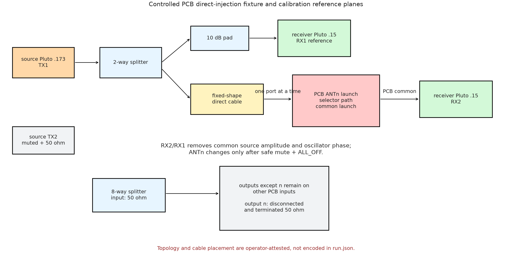

## Evidence boundary

This report uses only the controlled eight-port direct-injection campaign. None
of the older splitter sweeps, dense 1 MHz data, or OTA experiments are mixed
into the numerical results below.

For each port, the eight-way splitter input was terminated, the corresponding
splitter output was terminated, and the direct-injection cable was moved to the
PCB input while its shape and the RX1/common cabling were kept fixed. These
physical placements are operator-attested. The software independently records
and verifies the radio identities, board/ST-Link identities, RF settings,
selector state, per-capture TX cleanup, terminal `ALL_OFF` state, manifests,
and raw IQ.

| Evidence set | Runs | Observations | Frequency/state coverage | Raw IQ bytes |
| --- | ---: | ---: | --- | ---: |
| Calibration knots | 9 | 3,528 | 441 points/port, 0.5–6.0 GHz, 12.5 MHz spacing | 14,799,261,456 |
| Independent holdout | 8 | 640 | 80 points/port, 5.00625–5.99375 GHz, interstitial 6.25 MHz offsets | 2,684,673,280 |
| 5.8 GHz qualification | 8 | 360 | 9 switch states × 5 repeats per injected port | 1,510,128,720 |
| **Total used here** | **25** | **4,528** | 8 directly injected PCB ports | **18,994,063,456** |

ANT2's full response is the union of one 25 MHz run and the complementary 12.5
MHz run, giving the same exact 441-knot lattice as every other port. The 25
manifests span `2026-09-01T18:39:09Z` through
`2026-09-02T16:22:34Z`. The acquisition settings common to all captures were
2 MS/s, 1.6 MHz RF bandwidth, 262,144 samples, 60 dB RX gain, and a 100 kHz
pilot offset. Full sweeps used -55 dB TX gain. Qualifiers and holdouts used -40
dB except ANT2's -55 dB holdout; the complex RX2/RX1 ratio makes source level a
common term.

Every referenced raw artifact was SHA-256 hashed and independently replayed
through the pinned analyzer. All 4,528 replayed observations reproduced the
stored values exactly within the analyzer's numerical tolerance; the maximum
recorded replay delta is zero. The acquisition code was commit
`4833e41b15adaa07efa5bad5737b4a6427da3ac5`. Exact run paths, manifest hashes,
artifact hashes, byte counts, source hashes, and the machine/operator evidence
split are frozen in
[`data/campaign-manifest.json`](data/campaign-manifest.json).

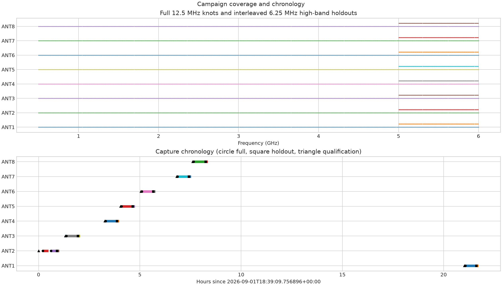

## Acquisition quality and selector isolation

No capture clipped. The largest absolute ADC component was 1,282 counts against
a 2,048-count component limit, and every port's worst phase-step coherence was
at least 0.99737. The five-repeat 5.8 GHz selected-state stability was
0.005–0.014 dB and 0.059–0.137 degrees, so short-term measurement noise is much
smaller than the interpolation and reconnect uncertainty.

| Port | Selected mean (dB) | vs `ALL_OFF` (dB) | vs strongest wrong (dB) | Strongest wrong | Mag SD (dB) | Phase SD (°) | Min coherence | Peak counts |
| --- | ---: | ---: | ---: | --- | ---: | ---: | ---: | ---: |
| ANT1 | -9.48 | 57.91 | 34.36 | ANT8 | 0.0056 | 0.105 | 0.999113 | 813 |
| ANT2 | -11.34 | 44.52 | 29.50 | ANT1 | 0.0097 | 0.062 | 0.999565 | 921 |
| ANT3 | -18.37 | 35.18 | 20.93 | ANT1 | 0.0139 | 0.059 | 0.998967 | 993 |
| ANT4 | -10.72 | 45.16 | 35.44 | ANT3 | 0.0120 | 0.101 | 0.999614 | 727 |
| ANT5 | -11.14 | 45.85 | 34.40 | ANT6 | 0.0052 | 0.081 | 0.998844 | 1,282 |
| ANT6 | -17.88 | 37.71 | 21.71 | ANT8 | 0.0127 | 0.118 | 0.999555 | 609 |
| ANT7 | -11.57 | 47.36 | 30.36 | ANT8 | 0.0100 | 0.137 | 0.999613 | 563 |
| ANT8 | -9.35 | 55.65 | 34.53 | ANT7 | 0.0065 | 0.090 | 0.997369 | 843 |

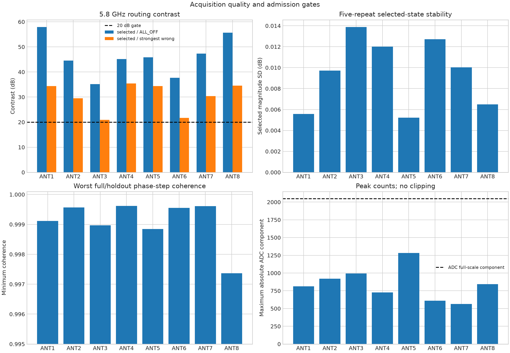

The following matrix is the measured response for each injected port and switch
state, in dB relative to that injected port's correct selected state. Rows are
the physically injected PCB inputs; columns are commanded selector states. A
zero on the driven diagonal is expected. More-negative off-diagonal values are
better.

| Injected / selected | `ALL_OFF` | ANT1 | ANT2 | ANT3 | ANT4 | ANT5 | ANT6 | ANT7 | ANT8 |
| --- | ---: | ---: | ---: | ---: | ---: | ---: | ---: | ---: | ---: |
| ANT1 | -58.0 | **0.0** | -34.8 | -39.6 | -35.3 | -36.2 | -55.0 | -38.5 | -34.4 |
| ANT2 | -44.5 | -29.5 | **0.0** | -35.3 | -37.9 | -49.0 | -44.3 | -40.6 | -39.0 |
| ANT3 | -35.2 | -20.9 | -23.7 | **0.0** | -27.4 | -36.4 | -35.1 | -33.2 | -32.6 |
| ANT4 | -45.2 | -39.9 | -41.1 | -35.4 | **0.0** | -46.3 | -45.6 | -45.0 | -45.3 |
| ANT5 | -45.9 | -44.2 | -45.5 | -45.3 | -43.1 | **0.0** | -34.4 | -42.9 | -43.0 |
| ANT6 | -37.7 | -34.4 | -36.7 | -38.2 | -40.3 | -29.6 | **0.0** | -24.3 | -21.7 |
| ANT7 | -47.3 | -43.1 | -46.0 | -48.6 | -52.9 | -39.8 | -36.3 | **0.0** | -30.4 |
| ANT8 | -55.5 | -38.3 | -44.2 | -52.1 | -38.0 | -35.8 | -40.3 | -34.5 | **0.0** |

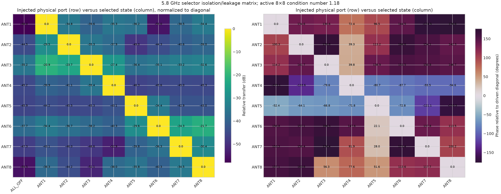

For array processing, the complex matrix in
[`data/campaign-results.json`](data/campaign-results.json) is oriented as
**rows = selected states, columns = injected ports**, with every injected-port
column normalized by its driven diagonal. Its singular values range from
0.8997 to 1.0614 and its condition number is 1.1797. This is well-conditioned
and suggests that per-port diagonal correction is a reasonable first runtime
implementation. It is not proof that leakage can be ignored in an installed
array: ANT3 and ANT6 have only about 21 dB margin, and the matrix is measured at
one frequency in one fixture state.

## What the board response looks like

The absolute RX2/RX1 magnitude contains the common reference fixture. The
relative response cancels that common term and exposes the difference between
PCB paths. The port pairs ANT1/ANT8, ANT2/ANT7, ANT3/ANT6, and ANT4/ANT5 track
one another closely, consistent with physical symmetry. At 5.8 GHz ANT3/ANT6
are about 7–9 dB below the other paths; ANT1/ANT8 and ANT2/ANT7 are nearly
identical within each pair.

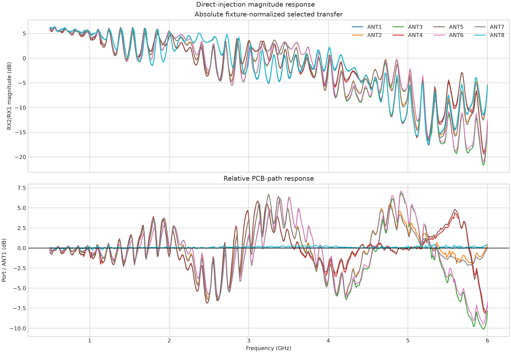

The phase has the same symmetry, but it is not a straight line with frequency.
The rapid oscillation is a real measured transfer-function feature at the
chosen calibration plane. It can arise from impedance discontinuities and
multiple reflections in launches, traces, switches, and the fixed fixture. A
single time delay models only the average slope; it cannot reproduce the
resonant phase curvature paired with the magnitude ripple.

The eight-way splitter is bypassed as the driven forward path in this campaign,
so it cannot by itself explain the port-dependent ripple. Its terminated outputs
remain attached to the seven non-driven PCB inputs and can still affect loading
through finite switch isolation. The two-way splitter, direct cable, and RX1
reference are common terms and largely cancel in port ratios. The surviving
symmetric port-pair structure therefore points primarily to the PCB launches,
selector network, and their interaction with the attached terminations. This is
strong attribution, not a component-level de-embedding proof; measuring the
direct cable and PCB S-parameters with the VNA is the next way to assign each
reflection to a physical discontinuity.

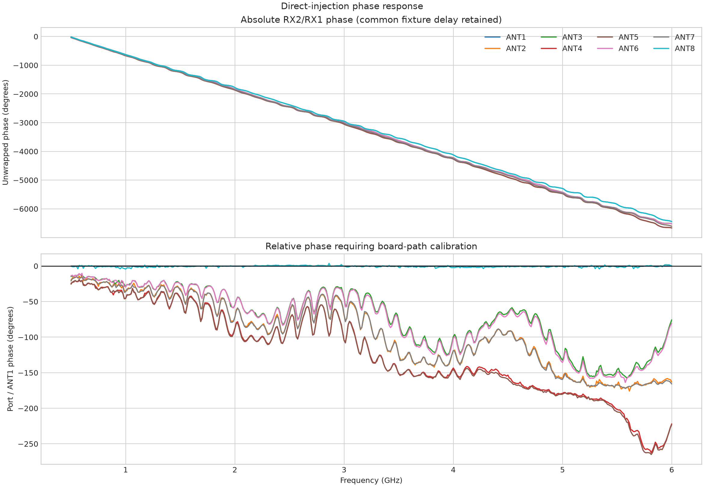

### Why one delay per port fails

| Port | Full-band delay vs ANT1 (ns) | Delay-only residual RMS (°) | Residual p95 (°) | Residual max (°) |
| --- | ---: | ---: | ---: | ---: |
| ANT1 | 0.000 | 0.00 | 0.00 | 0.00 |
| ANT2 | 0.080 | 17.54 | 34.46 | 41.78 |
| ANT3 | 0.064 | 20.73 | 36.42 | 60.74 |
| ANT4 | 0.106 | 16.42 | 35.44 | 48.51 |
| ANT5 | 0.108 | 16.62 | 36.46 | 49.59 |
| ANT6 | 0.067 | 20.66 | 36.56 | 60.15 |
| ANT7 | 0.081 | 17.67 | 35.24 | 43.48 |
| ANT8 | 0.000 | 1.07 | 2.03 | 4.31 |

The delay values are useful diagnostics and can initialize an unwrap. They are
not adequate calibration coefficients. Even over 5–6 GHz, pairwise delay-only
residuals reach roughly 19 degrees RMS for dissimilar port groups.

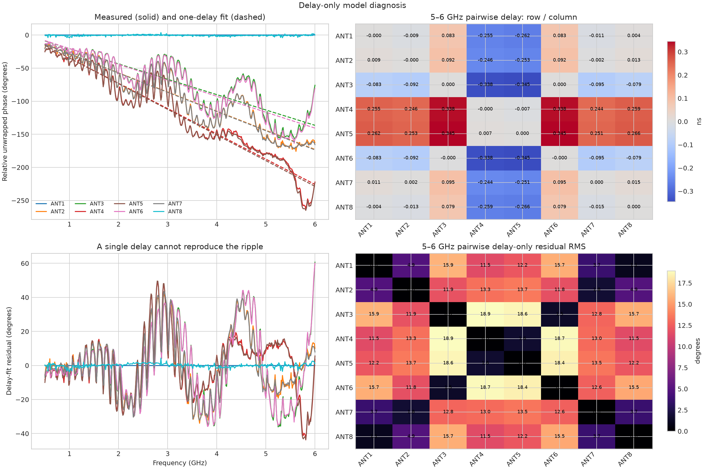

## Calibration model

Let the directly injected response of PCB path `i`, normalized by the unchanged
RX1 reference, be

\[
H_i(f)=\frac{Y_i(f)}{R(f)}=K(f)B_i(f),
\]

where `K(f)` is common to every sequential port measurement and `B_i(f)` is the
port-dependent PCB path. The absolute common factor is not identifiable or
needed for bearing. At every measured frequency, define the geometric-mean
reference

\[
G(f)=\exp\left(\frac{1}{8}\sum_{i=1}^{8}\log H_i(f)\right)
\]

using continuous unwrapped phase, and store

\[
C_i(f)=\frac{G(f)}{H_i(f)}.
\]

Runtime correction is simply

\[
z_i(f,t)=C_i(f)x_i(f,t).
\]

The geometric-mean gauge is preferable to making one physical port the
reference: it treats all eight channels symmetrically and makes the summed
correction gain and phase zero at every knot. Any common complex multiplier
leaves interferometric bearing unchanged.

The two heatmaps below are the complete stored correction. They also show why a
single 5.8 GHz coefficient cannot be reused across a wideband application.

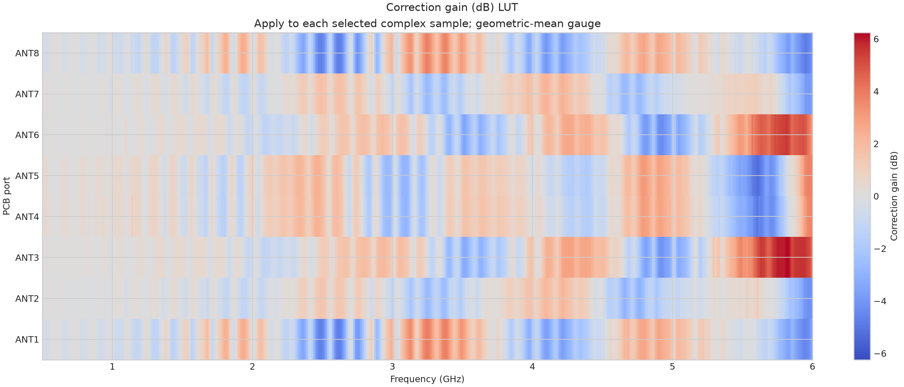

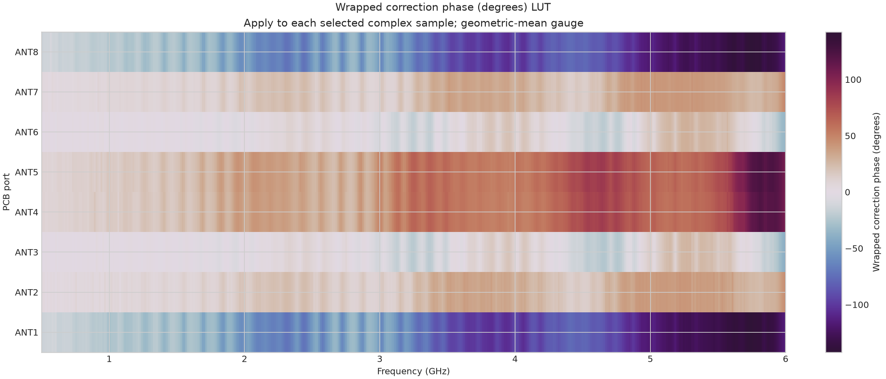

### 5.8 GHz coefficients

These values multiply each selected complex sample. Phase is shown wrapped for
readability; runtime interpolation uses the stored continuous phase.

| Port | Correction gain (dB) | Correction phase (°) | Real | Imaginary |
| --- | ---: | ---: | ---: | ---: |
| ANT1 | -3.004 | -139.910 | -0.54138 | -0.45572 |
| ANT2 | -1.105 | 24.520 | 0.80114 | 0.36544 |
| ANT3 | 5.907 | -7.667 | 1.95641 | -0.26336 |
| ANT4 | -1.824 | 118.989 | -0.39285 | 0.70904 |
| ANT5 | -1.386 | 122.997 | -0.46425 | 0.71497 |
| ANT6 | 5.382 | -3.384 | 1.85508 | -0.10970 |
| ANT7 | -0.869 | 24.881 | 0.82081 | 0.38068 |
| ANT8 | -3.102 | -140.426 | -0.53932 | -0.44575 |

### 5.8 GHz pairwise board response

The next two matrices show measured `H_row / H_column`, not the correction.
Subtract a phase cell or negate its dB value to form the corresponding
row-versus-column equalization. Rows and columns are both ordered ANT1 through
ANT8.

| Gain dB, row / column | ANT1 | ANT2 | ANT3 | ANT4 | ANT5 | ANT6 | ANT7 | ANT8 |
| --- | ---: | ---: | ---: | ---: | ---: | ---: | ---: | ---: |
| ANT1 | 0.00 | 1.90 | 8.91 | 1.18 | 1.62 | 8.39 | 2.13 | -0.10 |
| ANT2 | -1.90 | 0.00 | 7.01 | -0.72 | -0.28 | 6.49 | 0.24 | -2.00 |
| ANT3 | -8.91 | -7.01 | 0.00 | -7.73 | -7.29 | -0.52 | -6.78 | -9.01 |
| ANT4 | -1.18 | 0.72 | 7.73 | 0.00 | 0.44 | 7.21 | 0.95 | -1.28 |
| ANT5 | -1.62 | 0.28 | 7.29 | -0.44 | 0.00 | 6.77 | 0.52 | -1.72 |
| ANT6 | -8.39 | -6.49 | 0.52 | -7.21 | -6.77 | 0.00 | -6.25 | -8.48 |
| ANT7 | -2.13 | -0.24 | 6.78 | -0.95 | -0.52 | 6.25 | 0.00 | -2.23 |
| ANT8 | 0.10 | 2.00 | 9.01 | 1.28 | 1.72 | 8.48 | 2.23 | 0.00 |

| Phase degrees, row / column | ANT1 | ANT2 | ANT3 | ANT4 | ANT5 | ANT6 | ANT7 | ANT8 |
| --- | ---: | ---: | ---: | ---: | ---: | ---: | ---: | ---: |
| ANT1 | 0.0 | 164.4 | 132.2 | -101.1 | -97.1 | 136.5 | 164.8 | -0.5 |
| ANT2 | -164.4 | 0.0 | -32.2 | 94.5 | 98.5 | -27.9 | 0.4 | -164.9 |
| ANT3 | -132.2 | 32.2 | 0.0 | 126.7 | 130.7 | 4.3 | 32.5 | -132.8 |
| ANT4 | 101.1 | -94.5 | -126.7 | 0.0 | 4.0 | -122.4 | -94.1 | 100.6 |
| ANT5 | 97.1 | -98.5 | -130.7 | -4.0 | 0.0 | -126.4 | -98.1 | 96.6 |
| ANT6 | -136.5 | 27.9 | -4.3 | 122.4 | 126.4 | 0.0 | 28.3 | -137.0 |
| ANT7 | -164.8 | -0.4 | -32.5 | 94.1 | 98.1 | -28.3 | 0.0 | -165.3 |
| ANT8 | 0.5 | 164.9 | 132.8 | -100.6 | -96.6 | 137.0 | 165.3 | 0.0 |

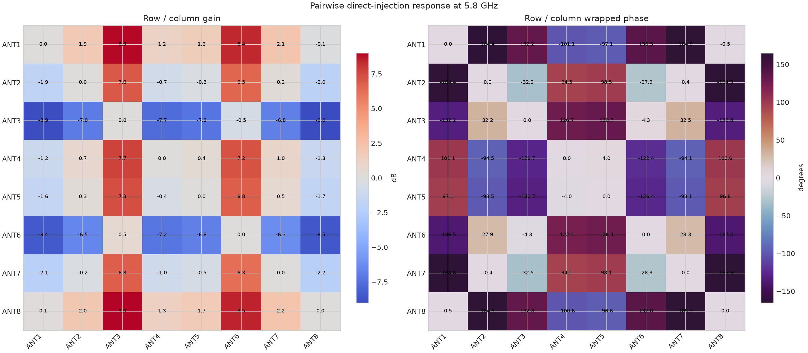

## Independent interpolation validation

The calibration knots are 12.5 MHz apart. The validation points are exactly
halfway between adjacent knots from 5.00625 through 5.99375 GHz and were
captured in different runs. They therefore test interpolation rather than
merely evaluating the training samples.

Three minimal models were compared:

| Model | Aggregate phase RMS (°) | Aggregate magnitude RMS (dB) | Decision |
| --- | ---: | ---: | --- |
| Linear interpolation of complex real/imaginary | 2.148 | 0.294 | Reject |
| Linear interpolation of log magnitude/unwrapped phase | 1.516 | 0.168 | Usable fallback |
| **PCHIP of log magnitude/unwrapped phase** | **1.309** | **0.141** | **Selected** |

PCHIP is not being used as a speculative high-order ripple model. It is a local,
shape-preserving interpolator with no fitted periodicity and no extrapolation.
That restraint matters because the ripple is not a stationary sinusoid across
the full band.

| Port | Phase RMS (°) | Phase p95 (°) | Phase max (°) | Detrended RMS (°) | Magnitude RMS (dB) |
| --- | ---: | ---: | ---: | ---: | ---: |
| ANT1 | 1.169 | 1.894 | 3.946 | 0.751 | 0.136 |
| ANT2 | 1.177 | 2.811 | 4.316 | 1.063 | 0.185 |
| ANT3 | **2.632** | **4.493** | **5.105** | 1.279 | 0.157 |
| ANT4 | 0.827 | 1.917 | 3.083 | 0.819 | 0.119 |
| ANT5 | 0.861 | 1.649 | 3.016 | 0.759 | 0.135 |
| ANT6 | 0.863 | 1.566 | 3.832 | 0.824 | 0.127 |
| ANT7 | 1.007 | 2.035 | 2.350 | 0.644 | 0.121 |
| ANT8 | 0.923 | 2.148 | 2.597 | 0.886 | 0.138 |

ANT3 is the only port that misses a proposed 3-degree p95 engineering gate.
Its error is mostly a run-level offset/slope—the detrended RMS is 1.28 degrees—
but detrending an offline report is not a valid deployment correction unless a
live phase reference measures that drift. ANT3 should be repeated before this
LUT is promoted.

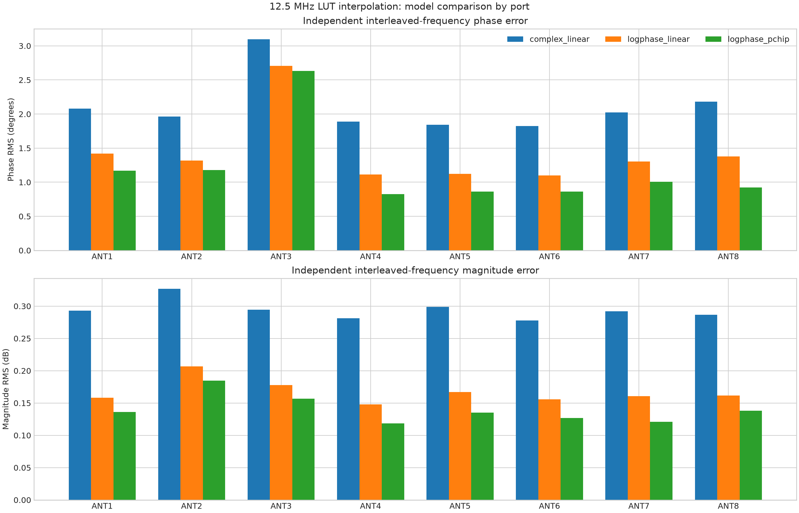

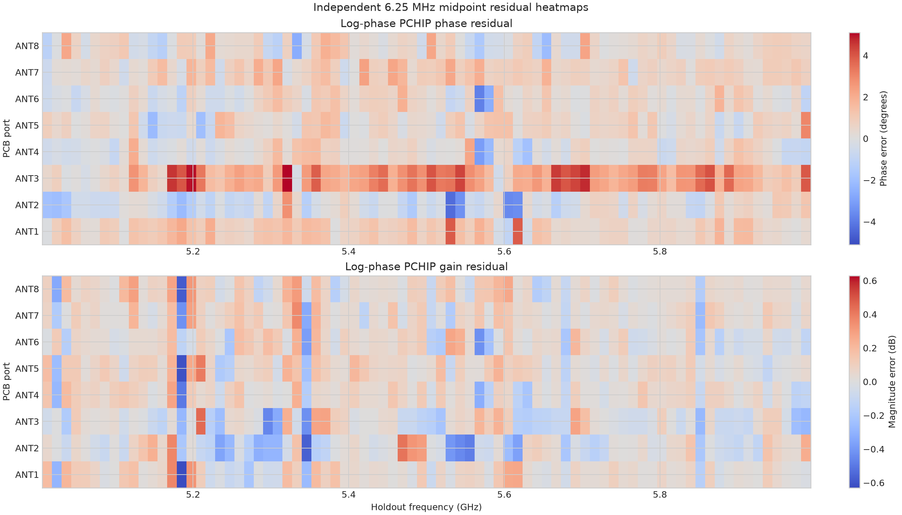

The shared component of the holdout error does not affect direction finding.
After removing the instantaneous eight-port common phase, the residual is
1.12 degrees RMS, 2.49 degrees at p95, and 5.09 degrees maximum.

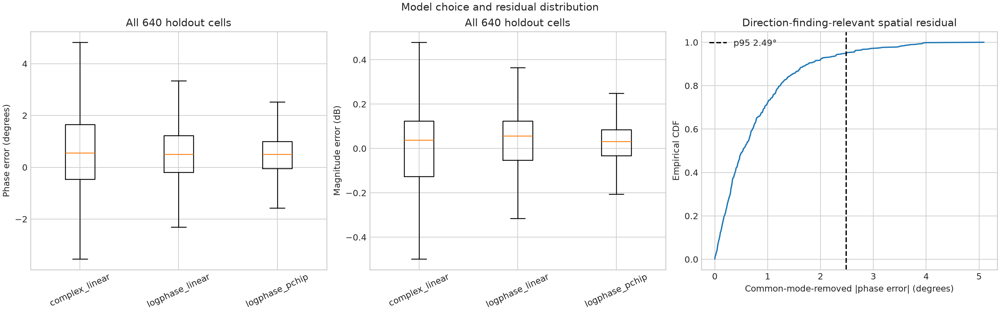

The holdout validates interpolation only from 5–6 GHz. The stored 0.5–6 GHz
knots are measured, but interpolation between lower-band knots has not received
the same independent test. A runtime should mark 5–6 GHz as validated and the
remainder as measured-but-unqualified until the lower-band midpoint experiment
is complete.

## Runtime implementation

At an exact knot, use the stored real/imaginary coefficient. Between knots:

1. Check that the requested frequency is within 0.5–6.0 GHz.
2. PCHIP-interpolate `correction_gain_db` and
   `correction_phase_unwrapped_deg` separately.
3. Construct `C = 10^(gain_db/20) · exp(j · phase_deg · π/180)`.
4. Multiply the selected channel phasor by `C` before beamforming or solving a
   direction.
5. Reject extrapolation. If a coefficient or selector state is missing, fail
   the entire array observation rather than silently using unity.

For a switched array, correcting the static board path is necessary but not
sufficient. Channel `i` is measured at a different time `t_i`. Use RX1 as a
continuous reference antenna/channel and form `x_i(t_i) / r(t_i)` before the PCB
coefficient is applied. Otherwise source phase, independent receiver LO phase,
and motion during one selector cycle are indistinguishable from array phase.

The calibration artifact exposes both rectangular and log-phase forms so a
minimal runtime does not need to repeat the campaign analysis. The JSON status
is intentionally `engineering_candidate_reconnect_and_ota_unqualified`.

## Leakage-aware processing

The 5.8 GHz qualifier measures a selector forward matrix `M`, not just scalar
isolation. With all antennas illuminated, the selected-state vector is better
described by

\[
y(f)=M(f)\,\operatorname{diag}(H(f))\,a(f,\theta)s(f)+n.
\]

For the first implementation, apply the diagonal `C_i(f)` LUT and use the ideal
array manifold. The measured 5.8 GHz matrix is close enough to identity that an
ideal UCA8 search changes by at most 0.25 degrees in the report's noiseless
screen. If blind OTA tests show a repeatable leakage bias, prefer including
`M(f)` in the **forward steering model**. Explicit matrix inversion should be a
last resort because it amplifies noise and model error; if required, use a
regularized solve and verify its condition number at every frequency.

The present leakage result is diagnostic, not broadband qualification. Measure
the complete complex matrix at several frequencies and after reconnects before
shipping a matrix model.

## Implications for array geometry

At 5.8 GHz, wavelength is 51.69 mm and half-wavelength spacing is 25.84 mm. For
wideband operation, physical spacing must be no larger than half a wavelength
at the **highest** operating frequency; otherwise grating lobes appear.

| Geometry | Candidate dimensions at 5.8 GHz | Coverage | Strength | Main limitation |
| --- | --- | --- | --- | --- |
| UCA8 | 33.77 mm radius; 25.84 mm adjacent chord | 360° azimuth | Best default; all ports and rotational aperture | More coupling/calibration work; phase-center and cable routing matter |
| C6 hexagon | 25.5 mm radius; 51 mm diameter | 360° azimuth | Simpler mechanics and compute | Lower aperture/channel count; choose and validate six physical ports |
| ULA8 | 25.84 mm spacing; 180.91 mm end-to-end | One principal axis | Highest broadside angular sensitivity | Front/back ambiguity and poor endfire conditioning |

For general radio tracking, build UCA8 first. It uses all available data and
avoids the ULA's fundamental front/back ambiguity. Use ULA8 only when the field
of view is constrained to one side and the long aperture is mechanically
acceptable. C6 is a reasonable compact fallback; based on this qualifier,
ANT3 and ANT6 are the first ports to consider excluding because they have the
lowest selected gain and isolation margin. That choice must be re-tested with
the actual six-element geometry rather than inferred from conducted data.

The propagation plot below is deliberately narrow: it converts only the
measured interpolation residual through ideal, uncoupled array manifolds. It
predicts about 0.11–0.13 degrees RMS for UCA8, 0.16–0.23 degrees for the modeled
C6, and 0.04 degrees broadside rising to 0.17 degrees near ±75 degrees for ULA8.
The C6 curve uses ANT1–ANT6 only and is not a claim that those are the optimal
six physical ports. These are sensitivity comparisons, not end-to-end bearing
claims. They exclude noise, antenna patterns, coupling, position error,
multipath, switching-time source evolution, and solver bias.

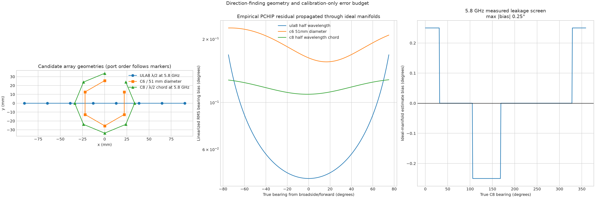

## Concrete first-article C6 and C8 configurations

The recommendations in this section are for the first 5.8 GHz direction-finding
article. The mechanics are sized against 6.0 GHz, the upper edge of the PCB LUT,
so adjacent elements remain at or below half a wavelength if experiments move
above 5.8 GHz. Use `+y` as forward, `+x` as right in a top view, and measure
bearing clockwise from forward. Put the array center at `(0, 0)` and make the
ANT1 radial line the physical 0-degree fiducial.

| Design limit | Wavelength | Maximum adjacent chord | C6 radius/diameter | C8 radius/diameter |
| --- | ---: | ---: | ---: | ---: |
| 5.8 GHz only | 51.688 mm | 25.844 mm | 25.844 / 51.688 mm | 33.767 / 67.534 mm |
| **Through 6.0 GHz** | **49.965 mm** | **24.983 mm** | **24.983 / 49.965 mm** | **32.641 / 65.283 mm** |

The existing 25.5 mm-radius HexRay is appropriate for a 5.8 GHz-only experiment,
but its 25.5 mm adjacent chord is slightly greater than half a wavelength at 6
GHz. Use the 6 GHz dimensions for a new fixture. These dimensions prevent
high-band grating lobes; they do not guarantee useful low-band resolution. At
0.5 GHz the C6 and C8 diameters are only about 0.083 and 0.109 wavelengths, so a
single compact array cannot provide equally sharp 0.5–6 GHz bearings. Choose
antennas and aperture for a declared operating band, even though the PCB itself
has a wider calibration table.

### Port decision

The PCB's measured matched-path pairs are ANT1/ANT8, ANT2/ANT7, ANT3/ANT6, and
ANT4/ANT5. Put each retained pair on opposite sides of the circle. This reduces
the electronics mismatch on the longest baselines before correction is even
applied.

| Port | 5.8 GHz correction gain | Wrong-state margin | C6 | C8 | Recommendation |
| --- | ---: | ---: | --- | --- | --- |
| ANT1 | -3.00 dB | 34.36 dB | Use | Use | Pair opposite ANT8 |
| ANT2 | -1.10 dB | 29.50 dB | Use | Use | Pair opposite ANT7 |
| ANT3 | +5.91 dB | 20.93 dB | **Omit** | Conditional | Weakest path, least isolation, marginal holdout |
| ANT4 | -1.82 dB | 35.44 dB | Use | Use | Pair opposite ANT5 |
| ANT5 | -1.39 dB | 34.40 dB | Use | Use | Pair opposite ANT4 |
| ANT6 | +5.38 dB | 21.71 dB | **Omit** | Conditional | Weak path and second-lowest isolation |
| ANT7 | -0.87 dB | 30.36 dB | Use | Use | Pair opposite ANT2 |
| ANT8 | -3.10 dB | 34.53 dB | Use | Use | Pair opposite ANT1 |

`+5.91 dB` correction does not recover the SNR lost in ANT3; it amplifies that
channel's noise with its signal. C8 should initially retain ANT3/ANT6 because
their spatial samples add aperture and the measured full matrix remains
well-conditioned, but the solver must use measured noise weights. Compare C8
against a six-port solve on the same captures, and remove a weak port if it
worsens blind-angle error. This ranking is based on the 5.8 GHz matrix and must
be reconsidered for another band after a broadband matrix measurement.

### Recommended C6 wiring

Use ANT1, ANT2, ANT4, ANT5, ANT7, and ANT8. Omit the complete weak matched pair
ANT3/ANT6. The clockwise order is intentionally not numerical: it places each
matched PCB pair across a diameter.

| Clockwise bearing | PCB port | Ideal `(x right, y forward)` at 6 GHz | Opposite port |
| ---: | --- | --- | --- |
| 0° | ANT1 | `(0.000, +24.983)` mm | ANT8 |
| 60° | ANT2 | `(+21.636, +12.491)` mm | ANT7 |
| 120° | ANT4 | `(+21.636, -12.491)` mm | ANT5 |
| 180° | ANT8 | `(0.000, -24.983)` mm | ANT1 |
| 240° | ANT7 | `(-21.636, -12.491)` mm | ANT2 |
| 300° | ANT5 | `(-21.636, +12.491)` mm | ANT4 |

This mapping requires a new `c6-v2` geometry/profile identity. The existing
`hexcal-v1` metadata says ANT1 through ANT6 are clockwise and must not be reused
after rewiring.

For acquisition, sample diametric pairs close together:

```text
ANT1, ANT8, ANT2, ANT7, ANT4, ANT5
```

Run the next complete scan in reverse order, with the qualified `ALL_OFF` guard
between states. Pairing shortens the time separation of the most informative
baselines; reversing exposes and helps cancel first-order source motion or
array rotation. Preserve the actual timestamp of every dwell.

### Recommended C8 wiring

Use all eight ports. Again put the measured matched PCB pairs on diameters:

| Clockwise bearing | PCB port | Ideal `(x right, y forward)` at 6 GHz | Opposite port |
| ---: | --- | --- | --- |
| 0° | ANT1 | `(0.000, +32.641)` mm | ANT8 |
| 45° | ANT2 | `(+23.081, +23.081)` mm | ANT7 |
| 90° | ANT3 | `(+32.641, 0.000)` mm | ANT6 |
| 135° | ANT4 | `(+23.081, -23.081)` mm | ANT5 |
| 180° | ANT8 | `(0.000, -32.641)` mm | ANT1 |
| 225° | ANT7 | `(-23.081, -23.081)` mm | ANT2 |
| 270° | ANT6 | `(-32.641, 0.000)` mm | ANT3 |
| 315° | ANT5 | `(-23.081, +23.081)` mm | ANT4 |

The recommended pair-first temporal order is:

```text
ANT1, ANT8, ANT2, ANT7, ANT3, ANT6, ANT4, ANT5
```

Alternate it with the exact reverse. Create a new `c8-v1` geometry/profile that
separately records physical clockwise order and temporal scan order; they are
not the same concept.

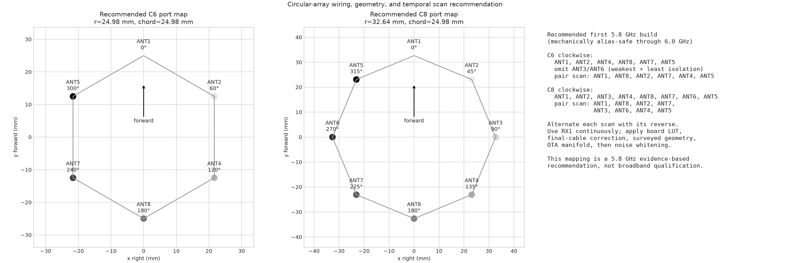

### Mechanical offsets and orientation

- Use identical antenna models and polarization. For vertical whips, keep every
  whip vertical and its phase center at the same surveyed height.
- Survey actual phase-center coordinates. A 1 mm position error corresponds to
  about 7.20 degrees at 6 GHz; target 0.25 mm mechanical repeatability, then let
  OTA calibration estimate remaining electrical phase-center error.
- Record array yaw independently from electrical phase. If the ANT1 fiducial is
  at world heading `ψ`, report `world_bearing = wrap(array_bearing + ψ)`.
- Route equal-part-number cables with the same nominal length, bend radius,
  connector torque, strain relief, and distance from conductive structures.
  Symmetry improves stability even though cable S21 is later calibrated.
- Do not represent coordinate error as a single arbitrary phase offset. Put the
  surveyed `(x, y, z)` into the steering model so its phase scales correctly
  with frequency and arrival direction.

### Electrical calibration stack

Apply corrections in distinct, versioned layers:

1. **Temporal reference:** for every selector dwell form the coherent phasor
   ratio `RX2_i(t_i) / RX1(t_i)`. RX1 must observe the same emitter continuously.
2. **PCB correction:** interpolate and apply `C_board_i(f)` from the released
   LUT. For C6 the existing eight-port gauge is already valid because a common
   complex multiplier cannot change bearing.
3. **Optional C6 re-gauge:** for numerically centered coefficients, compute the
   geometric mean `q(f)` of the six selected `C_board_i` values in log
   magnitude/unwrapped phase and use `C_board_i / q`. Do not use a principal
   complex product that can introduce a phase branch jump.
4. **Final cables:** measure each installed cable's complex S21 with the VNA and
   apply `geometric_mean(L) / L_i`, or preferably repeat direct injection at the
   six/eight final cable tips to measure PCB and cable together.
5. **Mechanical manifold:** calculate the ideal phase from surveyed coordinates,
   operating frequency, and candidate bearing.
6. **Installed-array OTA manifold:** replace or augment the ideal manifold with
   measured known-angle complex vectors. This absorbs stable antenna patterns,
   phase centers, coupling, enclosure, and residual cable behavior.
7. **Noise whitening:** measure per-state `ALL_OFF`/terminated noise covariance
   and use it in the solver. This is essential when C8 retains ANT3/ANT6.

Do not add the board, cable, and antenna phases as separately wrapped degree
tables. Retain continuous phase or complex coefficients at every layer and
compose them by complex multiplication.

### OTA offset/manifold calibration

A center transmitter is useful for symmetry and wiring checks, but one centered
near-field vector cannot calibrate direction. For the first installed-array
campaign:

1. Place the source and array in a surveyed, low-reflection geometry with
   matched height and polarization. Satisfy the far-field limit for both the
   complete aperture and the individual antenna; use more distance than the
   theoretical minimum when practical.
2. Mark ANT1 as 0 degrees. Acquire training bearings every 10 degrees through
   360 degrees and reserve the interleaved 5-degree bearings as blind holdouts.
3. Start at 5.70, 5.75, 5.80, 5.85, and 5.90 GHz. Densify only where held-out
   frequency interpolation or antenna behavior requires it.
4. At every frequency/bearing, collect at least three forward/reverse scan pairs
   plus `ALL_OFF` noise, using continuous RX1 normalization.
5. After PCB/cable correction, remove only the snapshot-common complex scalar
   and store the normalized eight- or six-element vector as the empirical
   steering manifold. Keep magnitude as well as phase.
6. Fit circular interpolation in bearing and log-magnitude/unwrapped-phase
   interpolation in frequency. Reject extrapolation in both dimensions.
7. Move both the source and array within the range and repeat selected blind
   angles. A model that only works at the training room's fixed multipath
   coordinates is not a direction finder.

Begin with a noise-whitened matched-manifold score rather than a highly tuned
estimator:

\[
P(\theta)=\frac{|a(\theta)^H R_n^{-1}z|^2}
{a(\theta)^H R_n^{-1}a(\theta)}.
\]

Report the peak bearing, peak-to-sidelobe ratio, residual complex error, peak
width, second-best ambiguity, per-port SNR, and calibration identities. Move to
MUSIC or a leakage-aware forward model only after the simple solver closes on
blind angles; switched samples and correlated leakage make an unqualified
covariance eigensolver easy to over-trust.

## Deployment cables and antennas

Changing the cables after this campaign adds a new per-port transfer function.
If deployment path `i` contains cable `L_i(f)`, antenna response `A_i(f,θ)`, and
mutual coupling `Q(f)`, board-only correction leaves those terms untouched:

\[
z_i \propto C_i B_i L_i A_i Qs.
\]

Therefore:

- Label every cable and preserve its port assignment, connector torque, routing,
  bend radius, and strain relief.
- Either measure each cable's complex S21 with the VNA and cascade its inverse
  with the board LUT, or repeat direct injection at the final cable tips.
- Use the tinySA Ultra in VNA mode for cable and passive-network S-parameter
  checks, but use the dual-channel coherent Pluto fixture for the end-to-end
  switched phase measurement.
- After cables are fixed, perform known-angle OTA calibration of the assembled
  array. That empirical steering table should absorb antenna phase centers,
  mounting, cable residual, mutual coupling, and stable enclosure effects.
- Recalibrate after a cable, antenna, connector, board, or mechanical layout is
  changed. Do not transfer this LUT to another physical board without a closure
  test.

## Ordered experiments to reach a deployable array

The following sequence separates board repeatability from installed-array and
environmental effects. The gates are proposed engineering targets and can be
tightened after the first blind OTA results.

| Priority | Experiment | Minimum design | Proposed pass gate | Decision enabled |
| ---: | --- | --- | --- | --- |
| 1 | ANT3 confirmation | Repeat its 5–6 GHz interstitial holdout without disturbing other cables | raw phase p95 ≤ 3°, max ≤ 5°, magnitude RMS ≤ 0.20 dB | Accept or replace ANT3 LUT |
| 2 | Reconnect repeatability | Five break/remake cycles per PCB port; fixed torque; sparse full band plus dense 5.7–5.9 GHz | spatial phase p95 ≤ 3° and no port-specific step > 5° | Board-plane portability |
| 3 | Reboot and thermal drift | Cold start, warmed 30 min, and at least three board/radio reboots at 5.8 GHz | p95 drift ≤ 3° after live-reference removal | Warm-up policy and recalibration interval |
| 4 | Full-band midpoint validation | Three complete interstitial sweeps over the intended deployment bands | aggregate spatial p95 ≤ 3°, magnitude RMS ≤ 0.20 dB | Qualify off-knot runtime use below 5 GHz |
| 5 | Broadband switch matrix | Complex 8×8 injection matrix at deployment-band endpoints and representative centers | condition number < 1.5 and driven/wrong margin > 25 dB, or validated forward model | Decide diagonal versus matrix calibration |
| 6 | Final cable-tip calibration | Final labeled cables routed exactly as deployed; VNA S21 or direct cable-tip injection | reconnect closure meets the board gate | Installed RF-feed LUT |
| 7 | Known-angle OTA calibration | UCA8 first; controlled azimuth grid, multiple ranges/powers, several frequencies | stable empirical steering vectors across repeats | Array manifold and coupling model |
| 8 | Blind OTA validation | Withhold angles, frequencies, power levels, and at least one room/range condition | predeclared median/p95 bearing target; no training-angle leakage | Deployment readiness |

For OTA work, ensure far-field distance is at least `2D²/λ` for the assembled
array aperture `D`, then add practical clearance from reflectors. Record actual
element coordinates and orientations rather than relying on nominal geometry.
Train on one angular grid and report accuracy only on withheld angles. Repeat
the test after moving the array and source so the solver cannot memorize room
multipath.

## Recommended minimal software architecture

Keep the runtime small and make calibration immutable:

1. `capture`: continuously acquire RX1 reference and the currently selected RX2
   samples with continuity counters and exact selector timing.
2. `calibrate`: load one versioned LUT, check board/cable/array identity, perform
   log-phase PCHIP, divide by the simultaneous RX1 phasor, and apply `C_i`.
3. `manifold`: return either ideal geometry steering vectors or the measured OTA
   steering table; optionally include the qualified forward leakage matrix.
4. `solve`: estimate bearing and emit residual, ambiguity, SNR, calibration
   version, and validity flags. Never return a bare angle without quality.
5. `qualify`: replay immutable raw captures and compare against predeclared
   gates. Runtime code should not contain campaign plotting or fitting logic.

The calibration identity should include board UID, cable-set UID, antenna-set
UID, geometry revision, frequency support, temperature range, creation time,
source manifest hash, and coefficient hash. A mismatch must reject the
measurement or explicitly mark it uncalibrated.

## Reproduction and artifacts

Rebuild the data products and all fifteen PNGs from the pinned external raw
data with:

```bash
.venv/bin/python scripts/analyze_pcb_direct_injection_campaign.py
```

The command validates the exact frequency lattices, identities, configurations,
state ordering, per-capture mute records, terminal `ALL_OFF`, raw SHA-256 values,
and raw-IQ replay before writing results. Development-only skip flags exist in
the analyzer but must not be used for a released report.

| Artifact | Purpose |
| --- | --- |
| [`data/campaign-manifest.json`](data/campaign-manifest.json) | Pinned runs, identities, hashes, byte counts, evidence boundary |
| [`data/campaign-results.json`](data/campaign-results.json) | Quality metrics, matrices, model scores, DF sensitivity results |
| [`data/calibration-lut.json`](data/calibration-lut.json) | Runtime complex correction with per-knot quality and holdout metrics |
| [`data/calibration-lut.csv`](data/calibration-lut.csv) | Flat 3,528-row coefficient export |
| [`data/array-layout-recommendations.json`](data/array-layout-recommendations.json) | Machine-readable C6/C8 maps, coordinates, scan orders, and calibration stack |
| [`data/figures-manifest.json`](data/figures-manifest.json) | Figure dimensions and SHA-256 hashes |
| [`../../scripts/analyze_pcb_direct_injection_campaign.py`](../../scripts/analyze_pcb_direct_injection_campaign.py) | Fail-closed analysis and report generator |
| [`../../tests/test_analyze_pcb_direct_injection_campaign.py`](../../tests/test_analyze_pcb_direct_injection_campaign.py) | Lattice, PCHIP, delay, and leakage-model tests |

## Bottom line

The board can be calibrated well enough to proceed to real array experiments.
The controlled data decisively favors a 12.5 MHz complex LUT over one delay per
port, and its independent 5–6 GHz interpolation error is small relative to the
phase progression of a half-wavelength array. The immediate blocker is no
longer the existence of PCB ripple; it is proving that the correction survives
ANT3 repetition, connector re-mating, temperature/reboot, final cables, and an
installed UCA8 OTA manifold. Run those experiments in that order and keep the
RX1 temporal reference in the deployed architecture.
