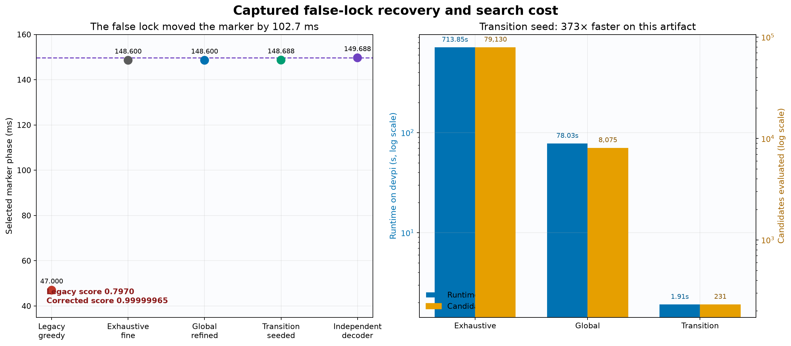
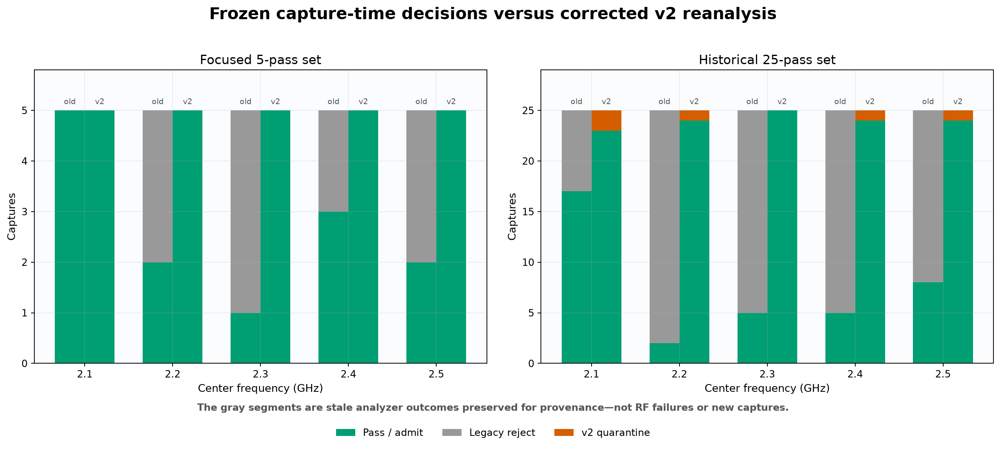
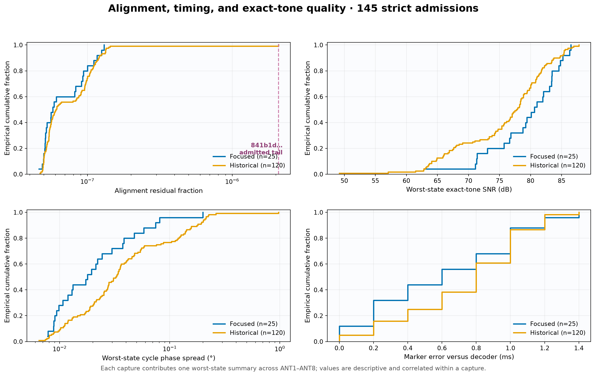

# Schedule-alignment validation report

| Report date | Board | Result |
|---|---|---|
| 2026-08-29 | `stm32c011-4c0055000950313950363920` | 145/150 captures strictly admitted; five conservatively quarantined |

## Executive conclusion

The recent low-band data confirms that the earlier apparent loss of roughly
30 dB of isolation was an analysis false lock, not a physical change in the RF
board. The former greedy search could select the wrong joint cycle/marker basin.
The corrected v2 analyzer recovers the captured regression artifact at a
combined score of `0.999999648` instead of `0.797035408` and agrees with an
independent transition decoder.

Across all 150 reviewed captures:

- 145 pass the strict transition-seeded timing and RF-quality gates;
- all 1,160 antenna-state estimates within those captures pass their exact-tone
  gates;
- five captures remain quarantined because each transition decoder retained one
  rejected marker candidate;
- the five quarantines nevertheless have 25 complete frames, all eight tone
  states passing, decoder agreement within the reported tolerance, and
  near-unity global-refined fits; and
- no quarantined result is promoted to calibration evidence.

The operational recommendation is to keep `transition_seeded` as the production
default, fail closed on any rejected timing marker, and use `global_refined`
only as a diagnostic. This result validates the analyzer for the bounded setup
described below; it is not yet a direction-finding accuracy validation.



## Reviewed data and provenance

The review covers two distinct rotation-0, TX1, fully conducted cohorts. The
captured false-lock artifact `be64aa4b22f9436c8ff25547a3589b98` is one member
of the focused cohort, not an additional capture.

| Cohort | Repeats | Frequencies | Captures | Raw IQ |
|---|---:|---|---:|---:|
| Focused low-band | 5 | 2.1–2.5 GHz, 100 MHz step | 25 | 1.863 GiB |
| Broadband historical, low-band slice | 25 | 2.1–2.5 GHz, 100 MHz step | 125 | 9.313 GiB |
| **Total** | — | — | **150** | **11.176 GiB** |

Each capture is 10 seconds at 1 MS/s and uses the Fast20 unique-dwell profile:
20, 23, 26, 30, 34, 39, 44, and 50 ms antenna intervals, 5 ms `ALL_OFF`
guards, and an 80 ms frame marker. Receiver gain is 40 dB with TX1
(`tx_channel=0`), rotation 0, and the conducted fixture identity
`tx1-2way-rx1-and-8way-board-rx2-v1`. Every raw SigMF file is 80,000,000 bytes.
All 150 raw/meta pairs exist, all artifact IDs are unique, and the declared
artifact SHA-256 agrees across each acquisition manifest, SigMF metadata, and
selected v2 analysis sidecar.

The full per-capture ledger, including manifest and analysis hashes, search
mode, fit components, decoder timing, decision, and worst-state tone metrics,
is in [`data/capture-evidence.json`](data/capture-evidence.json). Aggregate
statistics are retained in
[`data/captured-validation.json`](data/captured-validation.json).

### Dataset-composition warning

An earlier repeatability report used the phrase “combined 125” for a different
composition: 20 broadband repeats plus five focused repeats. This report uses
all 25 broadband repeats as the 125-capture historical cohort and reports the
25 focused captures separately, for 150 distinct captures total. Counts from
the two reports must not be compared as though their 125-capture populations
were identical.

## Frozen manifest outcomes versus current decisions

The acquisition manifests are immutable provenance. Their `outcome` values were
written by the old analyzer and therefore remain stale. The current decision is
the v2 sidecar result; the report does not rewrite the manifests or overwrite
canonical analysis files.

| Dataset | Captures | Legacy manifest pass / reject | v2 admit / quarantine |
|---|---:|---:|---:|
| Focused repeats 1–5 | 25 | 13 / 12 | 25 / 0 |
| Historical repeats 1–25 | 125 | 37 / 88 | 120 / 5 |
| **Total** | **150** | **50 / 100** | **145 / 5** |

The cross-tab is equally important: 97 legacy rejects are now strictly
admitted, 48 legacy passes remain admitted, three legacy rejects are
quarantined, and two legacy passes are now quarantined. This is analyzer
reclassification of the same captures, not a 95-capture improvement in RF
hardware.



## False-lock root cause

The former search retained a single best coarse `(cycle, marker)` pair and then
refined only a ±2 ms marker neighborhood around it. A small coarse-cycle error
accumulated across 25 frames. The correct joint basin was therefore absent from
the fine search even though the RF tone itself was strong and coherent.

| Result | Cycle | Marker | Combined score | Explained fraction |
|---|---:|---:|---:|---:|
| Legacy false lock | 384.6 ms | 47.000 ms | 0.797035408 | 0.798437416 |
| Exhaustive correctness oracle | 384.6 ms | 148.600 ms | 0.999999648 | 0.999999949 |
| Independent transition decoder | 384.6 ms | 149.688 ms | — | — |

The approximately 1 ms difference between the fitted plateau and transition
decoder is within the coherent-bin quantization and the explicitly reported
tolerance. It is not exact sample-level equality.

The 80 MB captured artifact is represented in the unit tests by a 142 KB hashed
reduction containing the coherent transfer bins and validity mask. Its source
hashes and reduction provenance remain frozen.

## Corrected search policies

- `exhaustive_fine` evaluates the complete fine cycle/marker Cartesian grid and
  serves as the offline correctness oracle.
- `global_refined` evaluates every fine cycle on a global marker grid and then
  refines several distinct basins.
- `transition_seeded` searches the measured uncertainty neighborhood of the
  independently decoded unique-dwell schedule. Strict transition decoding is
  required.

All three modes use the same candidate evaluator and converge to the same
captured-data score plateau.

| Mode | Candidates | Runtime on devpi | Cycle | Marker | Score |
|---|---:|---:|---:|---:|---:|
| Exhaustive fine | 79,130 | 713.85 s | 384.6 ms | 148.600 ms | 0.999999648 |
| Global refined | 8,075 | 78.03 s | 384.6 ms | 148.600 ms | 0.999999648 |
| Transition seeded | 231 | 1.91 s | 384.6 ms | 148.688 ms | 0.999999648 |

On this one artifact and host, transition seeding was approximately 373× faster
than exhaustive fine search. These are benchmark observations, not a throughput
confidence interval. Machine-readable values are in
[`data/false-lock-verification.json`](data/false-lock-verification.json).

## Captured v2 results


### Strict admission by frequency

| Frequency | Reviewed | v2 admitted | Quarantined |
|---:|---:|---:|---:|
| 2.1 GHz | 30 | 28 | 2 |
| 2.2 GHz | 30 | 29 | 1 |
| 2.3 GHz | 30 | 30 | 0 |
| 2.4 GHz | 30 | 29 | 1 |
| 2.5 GHz | 30 | 29 | 1 |
| **Total** | **150** | **145** | **5** |

The 145/150 value is a strict admission yield, not a direct estimate of timing
accuracy. The conservative timing policy intentionally leaves good-looking RF
fits quarantined if independent marker evidence is imperfect.

### Focused five-pass cohort

All 25 focused captures pass. Their 200 admitted state estimates also pass.

| Metric | Minimum | Median | Maximum |
|---|---:|---:|---:|
| Combined alignment score | 0.999990427 | 0.999999793 | 0.999999917 |
| Explained fraction | 0.999999869 | 0.999999942 | 0.999999954 |
| Residual fraction | 4.63×10⁻⁸ | 5.78×10⁻⁸ | 1.31×10⁻⁷ |
| Decoder marker error | 0.0 ms | 0.6 ms | 1.4 ms |
| State detection SNR | 63.00 dB | 82.57 dB | 90.87 dB |
| State cycle coherence | 0.99999485 | 0.99999997 | 0.999999997 |
| State cycle phase spread | 0.0047° | 0.0146° | 0.2000° |

### Historical 25-pass cohort

Of 125 historical captures, 120 pass strict admission. Their 960 admitted state
estimates all pass.

| Metric | Minimum | Median | Maximum |
|---|---:|---:|---:|
| Combined alignment score | 0.999923671 | 0.999999617 | 0.999999914 |
| Explained fraction | 0.999997912 | 0.999999939 | 0.999999953 |
| Residual fraction | 4.70×10⁻⁸ | 6.09×10⁻⁸ | 2.09×10⁻⁶ |
| Decoder cycle error | 0.0 ms | 0.0 ms | 0.0 ms |
| Decoder marker error | 0.0 ms | 0.8 ms | 1.4 ms |
| State detection SNR | 49.20 dB | 79.20 dB | 91.42 dB |
| State cycle coherence | 0.99987885 | 0.99999990 | 0.999999998 |
| State cycle phase spread | 0.0033° | 0.0271° | 0.9716° |

Nine admitted captures have no distinct runner-up and therefore no numerical
score margin. They sit on an accepted quantized-fit plateau and independently
agree with decoded timing; absence of a distinct runner-up is recorded rather
than silently converted into a failure.



## Quarantined captures

The five quarantines are not classified as RF failures. Transition-seeded
analysis failed closed before writing a normal v2 admission sidecar. A separate
`fast20-reference-transfer-v2-global.json` diagnostic was generated for each;
canonical analyses remained untouched.

| Repeat | Frequency | Artifact | Global score | Explained | Marker error / tolerance |
|---:|---:|---|---:|---:|---:|
| 3 | 2.2 GHz | `1fa1f1c1…` | 0.999998980 | 0.999999895 | 0.912 / 1.400 ms |
| 11 | 2.1 GHz | `236b4d3d…` | 0.999985029 | 0.999999879 | 1.472 / 1.716 ms |
| 11 | 2.5 GHz | `d70decd2…` | 0.999999878 | 0.999999943 | 1.732 / 2.046 ms |
| 16 | 2.1 GHz | `573d17b5…` | 0.999991638 | 0.999999873 | 1.228 / 1.400 ms |
| 19 | 2.4 GHz | `94cb97f0…` | 0.999999266 | 0.999999947 | 0.932 / 1.400 ms |

Every row has 25 complete frames/cycles, 26 observed markers, one rejected
marker, stable threshold counts `[25, 25, 25]`, verified continuity and ADC
headroom, a valid reference, all eight state gates passing, and tolerance-based
decoder agreement. Their sole global rejection reason is
`schedule_transition_decoder_rejected_markers`. A strong global fit does not
override that fail-closed timing evidence.

## Admitted quality-tail case

Artifact `841b1dd8df2e4370a29a562680f4af03`, historical repeat 1 at
2.3 GHz, is visibly separated from the rest of the admitted residual
distribution:

- combined score `0.999923671`;
- explained fraction `0.999997912`;
- residual fraction `2.0878×10⁻⁶`, 14.6× the next-largest admitted residual;
- minimum state SNR `49.20 dB`;
- minimum state coherence `0.99987885`; and
- maximum state phase spread `0.9716°` on ANT7.

It still has 25 strict frames, zero rejected markers, independent decoder
agreement, all eight state gates passing, and substantial margin to the
declared RF-quality thresholds. It is therefore an admitted lower-quality tail
case, not proof of another false lock and not a formally established statistical
outlier.

## Quality reporting and fail-closed behavior

Each v2 result preserves:

- explained and residual fractions, energy components, selected-bin count, and
  detection strength;
- even/odd agreement and cycle coherence;
- evaluated and valid candidate counts plus search resolution;
- a runner-up from a distinct evaluated basin when one exists;
- independently decoded transition timing, uncertainty, rejected-marker count,
  and selected-fit agreement; and
- per-state exact-tone SNR, coherence, phase spread, and gate reasons.

Reference-transfer reanalysis writes `fast20-reference-transfer-v2.json` by
default. `--promote-canonical` can publish to the legacy filename only when all
quality gates pass. Global diagnostic fallbacks remain separately named and are
not promotable evidence.

## Verification

The implementation test strategy covers:

- the captured false-lock regression;
- exact noiseless-tone component checks near numerical unity;
- exhaustive-grid coverage and optimized/oracle equivalence;
- deterministic noise degradation and no-signal rejection;
- transition timing, jitter, phase wrap, rejected markers, and compatibility;
- JSON schema, weak-fit, and decoder-disagreement fail-closed paths; and
- end-to-end reference-transfer phasor recovery.

The complete repository verification on devpi produces `463 passed`. The
current Hexcal runtime attestation, `pyproject.toml`, `uv.lock`, and the clean
local `pluto-plus-utils` checkout all agree on commit `dd48f2a…`; frozen
historical calibration documents continue to retain the dependency revision
used to create them. Ruff and strict mypy pass. The report additionally
validates all 150 local artifact identities and declared cross-file hashes, then
regenerates all four committed figures byte-for-byte. It checks raw IQ presence
and byte size but does not recompute the content hash of all 11.176 GiB.

Recheck the frozen evidence and figures with:

```bash
.venv/bin/python scripts/collect_schedule_alignment_report_data.py --check
.venv/bin/python scripts/render_schedule_alignment_report.py --check
```

Regenerating `capture-evidence.json` requires the 11.176 GiB source dataset in
`~/.local/state/smateway/boards/stm32c011-4c0055000950313950363920`. Rendering
figures requires only the committed compact ledger and benchmark JSON.
Figure hashes and renderer provenance are in
[`data/figures-manifest.json`](data/figures-manifest.json).

## Limits and next validation

The evidence is intentionally bounded to one board, one Pluto, one conducted
fixture, TX1, rotation 0, exact tones, 2.1–2.5 GHz, 1 MS/s, 10-second captures,
and the Fast20 20–50 ms unique-dwell schedule. It does not establish results for TX2, OTA or modulated
emitters, external interference, other boards or rotations, the remainder of
the 2.1–5.8 GHz band, or source-direction accuracy.

Before treating this as a general calibration/DF pipeline, repeat the same
strict evidence process for TX2, the full frequency range, controlled timing
corruptions, realistic OTA/modulated sources, and known-angle ground truth.
Those runs should preserve v2 sidecars, report fit quality rather than only
phase, and keep diagnostic global fallbacks quarantined.
