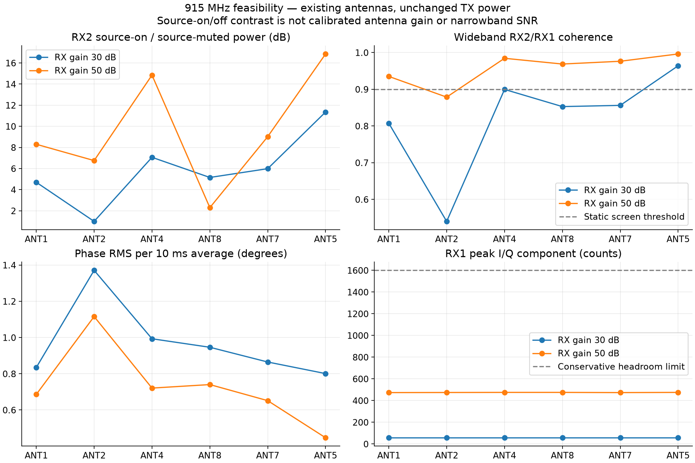
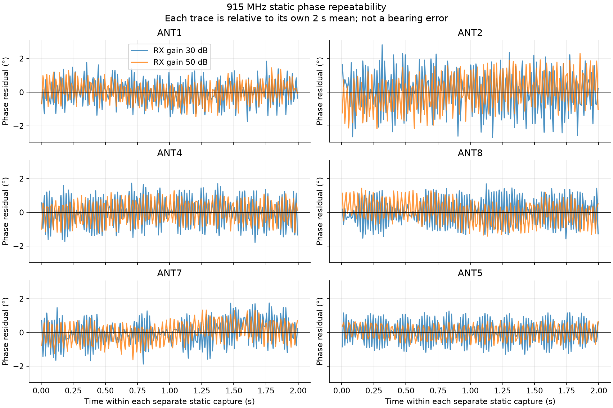
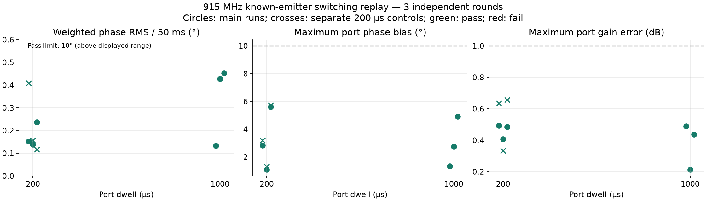
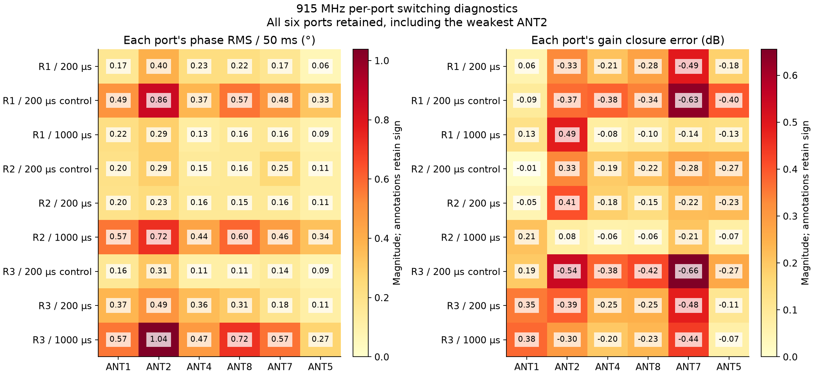

# 915 MHz feasibility with the existing antennas

September 9, 2026. This is a new, single-frequency experiment; no older sweep data
are included in its figures or measurement tables.

## Result

The existing setup receives a phase-stable, TX1-correlated signal on all six
selected ports at 915 MHz, without increasing transmitter power. At 50 dB manual
receiver gain, static phase RMS is **0.45–1.12° per 10 ms average**, with no
clipping or sample-counter discontinuities in either static screen. This is
useful sub-GHz feasibility evidence, not a measurement of antenna efficiency,
OTA range, or direction-finding accuracy.

The subsequent switching block also passes: **200 µs and 1 ms dwells each pass
all three main repetitions**, all three interleaved 200 µs controls pass, and the
independent before/after references pass. All six ports remain observable. At
200 µs dwell the main runs have **0.138–0.236° weighted phase RMS per 50 ms output
window**. This validates a nearby, stationary, known-emitter laboratory phase
test at 915 MHz; it does not establish live tracking or bearing accuracy.

## Setup and scope

| Item | Setting |
|---|---|
| Receiver | `192.168.1.15`, serial `104000b29905000e17000800065934759d` |
| Source | `192.168.1.179`, serial `104473b80a16000de6ff2000f8a6beca79` |
| TX1 | Existing splitter → conducted RX1 reference and existing OTA antenna |
| TX2 | Existing separate antenna; DDS zero, hardware gain −80 dB throughout |
| RX2 | Selector common; C6 ports ANT1, ANT2, ANT4, ANT8, ANT7, ANT5 |
| Frequency | RX/TX LO readback 915,000,000 Hz; DDS requested +100 kHz, readback +100,007 Hz |
| TX1 power settings | Unchanged −35 dB hardware gain, DDS scale 0.25; not a calibrated dBm value |
| Receiver | 2 MS/s, 1.6 MHz RF bandwidth, both RX channels, manual gain |
| Static screens | 30 dB then 50 dB receiver gain; six source-muted and six source-on captures per gain |
| Capture length | 2 seconds per static/background record; 200 nonoverlapping 10 ms phase groups |
| Antennas | Existing 2.4/5.8 GHz antennas; sub-GHz match and efficiency unknown |
| Geometry | Previously confirmed nominal 51 mm opposite-element spacing; unchanged assumed |

The user requested trying approximately 900 MHz on the current antennas. We
used the previously proposed **915 MHz centre**, not literal 900 MHz. A separate
[protocol](data/protocol-v1.json) admits only this centre and keeps the previous
2.4/5.8 GHz campaign limits unchanged. Its [fixture record](data/fixture-v1.json)
explicitly records the current request, unchanged-wiring assumption, existing
US-lab context, and lack of sub-GHz antenna characterization. No broad sweep or
power increase was performed. This experiment is not an emissions certification.

## Static results

The first, deliberately conservative 30 dB screen had only one port above the
predeclared 0.90 wideband-coherence threshold. RX1 peaked at just 57 ADC component
counts. Increasing only receiver gain to 50 dB improved coherence on every port,
while RX1 remained below 476 counts versus the conservative 1,600-count limit.
These are sequential observations, not a controlled measurement separating ADC
quantization, analog noise, interference, or antenna loss.

| Port | Coherence, 30 dB gain | Coherence, 50 dB gain | Phase RMS at 50 dB / 10 ms | Source-on / muted RX2 power at 50 dB |
|---|---:|---:|---:|---:|
| ANT1 | 0.807 | 0.935 | 0.686° | +8.30 dB |
| ANT2 | 0.540 | 0.879 | 1.116° | +6.75 dB |
| ANT4 | 0.900* | 0.984 | 0.721° | +14.85 dB |
| ANT8 | 0.853 | 0.969 | 0.740° | +2.30 dB |
| ANT7 | 0.856 | 0.976 | 0.651° | +9.02 dB |
| ANT5 | 0.964 | 0.996 | 0.447° | +16.85 dB |

*ANT4 at 30 dB is 0.8995436 before rounding, and fails the 0.90 screen.

Five ports pass the full static screen at 50 dB; ANT2 misses only the wideband
coherence threshold. The progression rule required at least four ports. ANT2 is
not silently removed from later analyses: the independent before-reference
defines the switching weights and −20 dB visibility mask, with all-port results
retained. ANT2 is approximately 15.3 dB below ANT5 in coherent transfer magnitude
in the 50 dB screen.

The final column is **total source-on power divided by separately measured
source-muted power**, not narrowband SNR. Background is time-dependent: the
50 dB muted ANT8 record contains a 405-count peak, while its source-on peak is
50 counts. Therefore a low on/off contrast can coexist with strong in-capture
RX1/RX2 coherence. The data do not identify the background's origin.



The phase estimator is the existing complex least-squares transfer
`sum(RX2 * conj(RX1)) / sum(abs(RX1)**2)`, evaluated independently every 10 ms.
RMS is calculated from wrapped phase differences to that capture's aggregate
complex transfer. Each trace below has its own mean removed; absolute per-port
phase offsets and cross-capture drift are not erased from the saved data.
The visible oscillatory structure is included in the RMS values; these residuals
should not be interpreted as purely independent white noise.



## Switching validation

One 50 dB-gain, 2 MS/s block completed with 200 µs and 1 ms port dwells,
three main repetitions each, three separate 200 µs controls, and six independent
static references before and after. Every 4-second switched record has all 60
predicted 50 ms output windows analyzed after the 1-second training prefix:
**540/540 windows**, with no failed window removed. The unchanged
[known-emitter timing recipe](../comprehensive_fast_switching/REFERENCE-TIMING-VALIDATION-v1.md)
was hash-bound before the block. It uses only the previous one second to predict
each following 50 ms window. Each 50 ms vector is then evaluated against the
independent static reference; no new per-port calibration is fitted to make
switched captures agree. One common phase rotation is removed for relative-phase
closure, as in the unchanged recipe.
The unchanged limits are 10° weighted phase RMS, 5° weighted relative phase
bias, 10° maximum observable-port phase bias, and 1 dB maximum observable-port
gain error. A passing result also requires sufficient complete output groups
and the passing independent reference bracket; no threshold was relaxed here.

| Setting | Passed runs | Weighted phase RMS / 50 ms | Worst individual-port RMS / 50 ms | Maximum port phase bias | Maximum port gain error |
|---|---:|---:|---:|---:|---:|
| 200 µs main | 3/3 | 0.138–0.236° | 0.235–0.487° | 1.082–5.619° | 0.406–0.493 dB |
| 1 ms main | 3/3 | 0.132–0.452° | 0.290–1.038° | 1.338–4.918° | 0.212–0.489 dB |
| Separate 200 µs controls | 3/3 | 0.116–0.408° | 0.291–0.858° | 1.305–5.715° | 0.333–0.655 dB |

All ranges cover the three independent runs in that row. RMS describes
variation across output windows; phase bias describes disagreement with the
independent reference. **Low RMS is not zero calibration error.** Residual
switched-versus-static port biases still reach 5.715° in the controls and must
not be confused with sub-degree absolute phase or bearing accuracy.

The independent before/after reference bracket has a maximum relative phase
change of **1.185°** and maximum gain change of **0.131 dB**. All six ports meet
the separately frozen −20 dB visibility rule. The weights are unequal: ANT5 has
52.5% of the weight and ANT2 1.5%. The per-port matrix below prevents a good
weighted average from hiding a weak port.





With the existing 20 µs guards and 180 µs marker body, 200 µs dwell corresponds
to a nominal **1.5 ms full-array cycle**, about **667 cycles/s**; 1 ms dwell has
a nominal 6.3 ms cycle. These are selector cycle rates, not delivered tracker
frame rates. The tested analysis uses a 50 ms output window and 1-second history
and runs offline on stored IQ. No end-to-end live latency was measured.

**200 µs is the fastest dwell tested here**, not an optimized sub-GHz minimum.
The test does not establish that 200 µs is intrinsically less noisy than 1 ms;
the repetitions show time-dependent variation. Neither 100 µs nor higher
sample rates were tested at 915 MHz in this experiment.

## What this says about sub-GHz operation

1. **Current antennas are sufficient to investigate a nearby 915 MHz test source.**
   We can measure relative phase; a nominally out-of-band antenna is not an
   absolute receive-frequency cutoff. This experiment does not isolate the
   radiated path from possible fixture leakage or coupling.
2. **Antenna loss remains unmeasured.** We would need a characterized antenna or
   conducted reference with controlled geometry/power to quantify it. Different
   per-port amplitudes can also reflect orientation, multipath, cable/PCB response,
   mismatch and coupling; they are not an antenna-efficiency measurement.
3. **Small aperture limits bearing sensitivity.** At 915 MHz the wavelength is
   approximately 328 mm, so a 51 mm diameter is only 0.156 wavelengths. A stable
   phase measurement is not automatically an accurate bearing measurement.
4. **Use frequency-specific calibration.** The existing PCB LUT spans 500 MHz to
   6 GHz and can interpolate at 915 MHz, but that does not calibrate deployed
   antennas, different cables, phase centres, coupling, or the room. This phase
   feasibility test uses fresh static references, not a newly qualified array LUT.

The next useful physical test is to move the same source between two repeatable
positions at fixed range, without disturbing receiver cables, and repeat the
915 MHz phase measurement. A pattern that changes reproducibly with source
position helps distinguish useful spatial response from a stationary leakage
floor. Surveyed-angle array calibration and matched sub-GHz antennas would follow
before making range or bearing-accuracy claims.

## Evidence and reproduction

Raw IQ and hardware evidence are stored separately under
`/srv/bulk/samteway/lab-data/tracking-915-diagnostic-20260909-v1`.
[Machine-readable summary](data/summary.json) and
[static CSV](data/static-summary.csv) bind the measurement sources. The renderer
checks run-record and raw-IQ SHA-256 hashes before using their contents.
The completed audit covers **45 capture records, 90 IQ files, and 3,456,000,000
raw bytes** (3.46 GB decimal); all hashes match. These are 24 screen captures,
12 bracketing references, and 9 switched captures. All acquisitions passed the
sample-continuity and clipping checks.

The [final live readback](data/cleanup-readback.json) at 17:12:35 UTC verifies both
TX channels on both pinned radios at −80 dB with all DDS scales zero, and the
selector in ALL_OFF with no lease. The full 16 KiB original selector image was
restored and hash-verified against its initial backup. No other radios were
opened or changed.

Offline reproduction, including the switching figures:

```bash
PYTHONPATH=src .venv/bin/python scripts/render_915_diagnostic.py \
  --screens \
  /srv/bulk/samteway/lab-data/tracking-915-diagnostic-20260909-v1/screen-20260909T170007467465Z.json \
  /srv/bulk/samteway/lab-data/tracking-915-diagnostic-20260909-v1/screen-20260909T170358441545Z.json \
  --timing /srv/bulk/samteway/lab-data/tracking-915-diagnostic-20260909-v1/block-20260909T170658793466Z-reference-timing.json \
  --output docs/subghz_915_diagnostic
```

The timing sidecar was produced with the existing algorithm, unchanged:

```bash
OPENBLAS_NUM_THREADS=1 PYTHONPATH=src .venv/bin/python \
  scripts/analyze_reference_timing.py \
  --block /srv/bulk/samteway/lab-data/tracking-915-diagnostic-20260909-v1/block-20260909T170658793466Z.json \
  --rolling
```

This is an offline numerical replay. Its host thread setting is recorded here;
no runtime comparison against earlier campaigns is claimed. The original
whole-record analyses remain alongside each capture and are not substituted for
the pre-bound rolling analysis summarized above.

Hardware recapture is intentionally not part of this offline command. Fixture
readiness expires after 12 hours and must not be silently refreshed to rerun RF.
The scoped acquisition, protocol, analysis and regression test selection passed
104 tests; the changed Python files passed Ruff and `git diff --check`.
