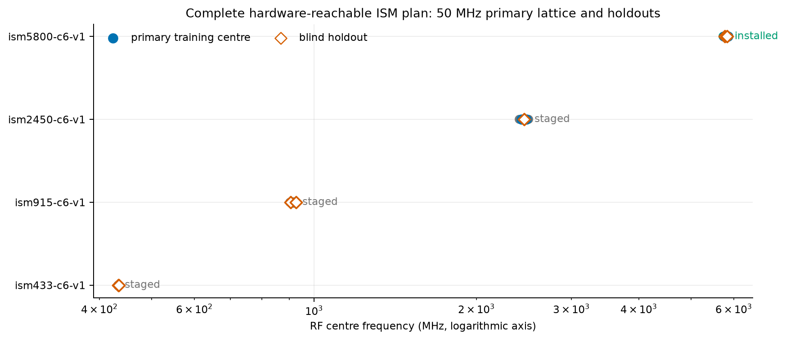
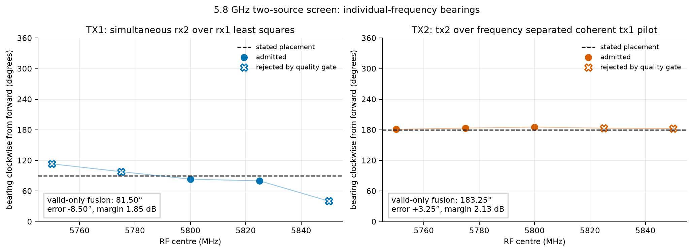
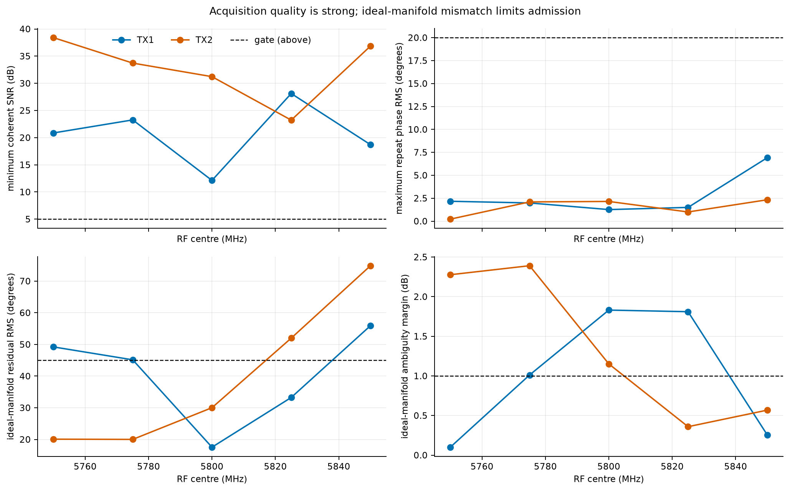
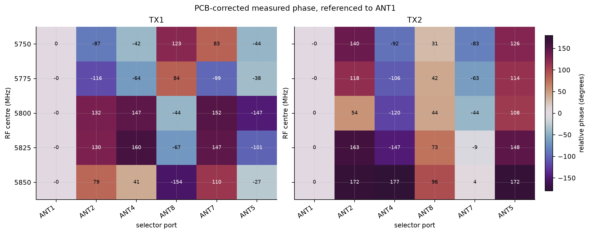
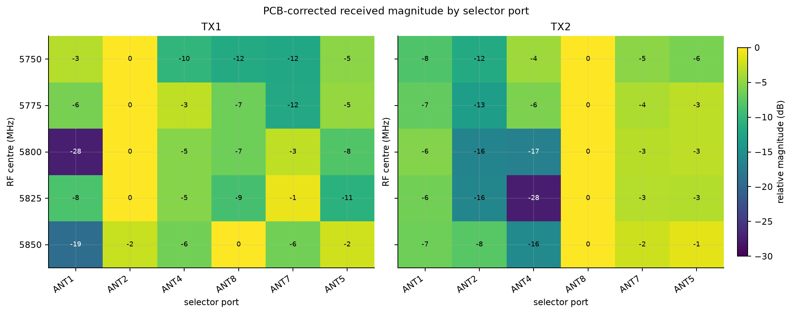
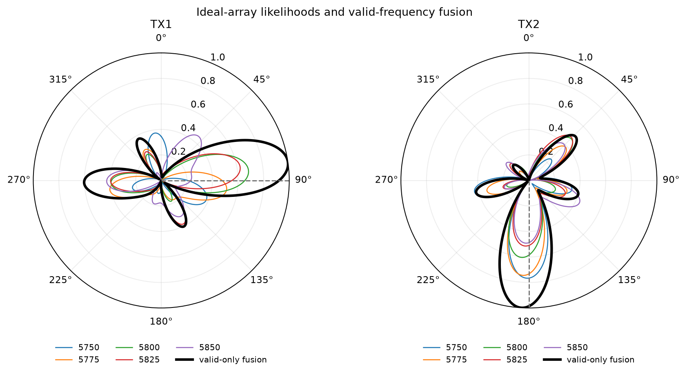
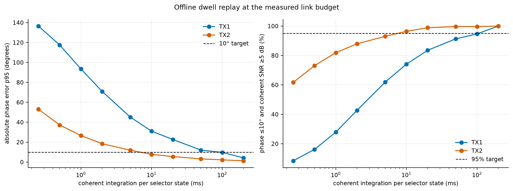

# Two-source direction-tracking verification and full ISM plan

- **Campaign:** `ism5800-two-source-continuous-v1`
- **Date:** 2026-09-03 UTC
- **Receiver/selector radio:** `104000b29905000e17000800065934759d`
- **Coherent two-channel source:** `104473b80a16000de6ff2000f8a6beca79`
- **Selector board:** `stm32c011-4c0055000950313950363920`
- **Installed array profile:** `ism5800-c6-v1`
- **Installed C6 port order:** ANT1, ANT2, ANT4, ANT8, ANT7, ANT5 clockwise
- **Raw evidence:** `/srv/bulk/samteway/lab-data/tracking-continuous`
- **Result:** the PCB, selector timing, TX1 estimator, and new TX2 coherent-pilot
  estimator work. A measured OTA array manifold is now the principal missing
  calibration.

## Executive result

The previous TX2 “phase coherence” failure was an estimator/reference failure,
not a failed PCB and not a requirement for absolute TX2 phase. A new lab mode
transmits a conducted TX1 reference pilot at -100 kHz and the TX2 test target at
+100 kHz. Both originate in the same two-channel Pluto and therefore share its
LO and sample clock. RX1 receives the conducted pilot; the switched array on
RX2 receives the TX2 target. Cross-frequency correlation cancels the arbitrary
source/receiver LO phase and separates TX2 from TX1 leakage.

Ten fresh continuous captures cover TX1 and TX2 at 5750, 5775, 5800, 5825, and
5850 MHz. These are the complete 50 MHz training lattice in the installed ISM
profile plus its interleaved 25 MHz blind frequency holdouts.

| Result | TX1 | TX2 |
| --- | ---: | ---: |
| Individual frequencies admitted by the ideal model | 2 / 5 | 3 / 5 |
| Valid-frequency fused bearing | **81.50°** | **183.25°** |
| Difference from stated placement | -8.50° | +3.25° |
| Fused ambiguity margin | 1.85 dB | 2.13 dB |
| Stated approximate placement | 90°, 0.30 m | 180°, 0.20 m |

TX2's individual peak remains between 181.0° and 185.5° at every frequency,
including the two frequencies rejected by quality gates. TX1's two admitted
frequencies fuse to 81.5°. The placement was approximate rather than surveyed,
and both emitters were in a reflective near-field room setup, so these
differences are closure observations—not metrology-grade angle errors.

All ten acquisitions completed with continuous FPGA sample counters. Across
both channels they contain 173.8 million complex samples. No admitted dwell
clipped, and every run ended with both TX paths muted and the selector in
`ALL_OFF` with no active lease.





## What has—and has not—been calibrated

The following distinction is central:

| Layer | Evidence | Status |
| --- | --- | --- |
| PCB common-to-port complex response | Dense 0.5–6.0 GHz direct-injection LUT with 5–6 GHz holdout | **Released** |
| Selector state and time | Exact OpenOCD acknowledgement brackets mapped to an ABI-2 FPGA sample counter | **Passed** |
| Continuous dual-RX acquisition | Ten fresh runs, every sample interval contiguous | **Passed** |
| TX1 same-tone reference estimator | RX2/RX1 least-squares transfer | **Passed** |
| TX2 laboratory test estimator | Frequency-separated, common-clock TX1 pilot | **Passed** |
| Installed cables, antenna phase centres, coupling, mounting | Not represented by direct-injection PCB calibration | **Uncalibrated** |
| Ideal C6 free-space manifold | Partially matches; quality gates reject 5 of 10 source/frequency conditions | **Diagnostic only** |
| Surveyed empirical OTA manifold | No angular turntable dataset yet | **Next blocker** |
| True unknown-emitter tracking | Requires RX1 to receive the same emitter, or another coherent reference architecture | **Not yet field-qualified** |

The direct-injection LUT should remain a separate electronics correction. It
cannot remove the installed cable delays, antenna phase-centre motion, mutual
coupling, or room multipath. Those effects explain why the PCB-corrected port
phase remains strongly frequency-dependent and why a simple ideal circle fails
some admission gates even when measurement repeatability is good.



The top panels in the quality figure show that the measurements themselves are
healthy: minimum coherent-estimator SNR is 12.1–38.4 dB, and worst
forward/reverse repeat phase is 0.22–6.92°. The bottom panels show the actual
blocker: ideal-manifold residual and angular ambiguity. It would be incorrect
to loosen those gates merely to make all ten points appear valid.

## Reference estimators

### TX1 development source

TX1 feeds both the conducted RX1 reference and the OTA antenna. During selector
dwell `i`, the least-squares transfer is

\[
\hat h_i =
\frac{\sum_n w[n]x_{2,i}[n]x_1[n]^*}
     {\sum_n w[n]|x_1[n]|^2+\epsilon}.
\]

The source waveform and the common source/receiver LO phase appear in both
channels and cancel sample by sample. No absolute transmitter phase is needed.

### TX2 laboratory target

For TX2 validation, TX1 emits a reference pilot at frequency `f_r=-100 kHz`
and TX2 emits the test target at `f_t=+100 kHz`. Define

\[
p_i[n]=x_{2,i}[n]x_1[n]^*
       e^{-j2\pi\widehat{(f_t-f_r)}n/f_s},
\qquad
\hat g_i=\frac{1}{N_i}\sum_{n\in i}p_i[n].
\]

The cross product cancels the common LO phase. The exponential removes the
remaining DDS tone separation. Terms caused by TX1 leaking into RX2 or TX2
leaking into RX1 remain at 0, -200, or -400 kHz after mixing and average away;
the desired TX2-array times TX1-reference term becomes DC.

The source DDS readback separation was 199,984 Hz. The joint fit measured
199,981.67 Hz, with a stable -2.327 to -2.331 Hz error across all five RF
centres. Fitting this small error on the global FPGA sample timeline prevents a
multi-second scan from accumulating a false port phase ramp.

This is an excellent **laboratory TX2 validation method**, but it is not a
magical reference for an unrelated field transmitter. It works because TX1 and
TX2 are channels of the same source Pluto. In deployment, RX1 should instead
carry a fixed reference antenna that receives the unknown emitter at the same
frequency as RX2. The original same-frequency estimator then cancels the
unknown transmitter phase directly.

```text
LAB TX1

source TX1 ── splitter ── attenuator ──> receiver RX1
       └──── antenna ── free space ──> C6 -> selector -> RX2
                   same 100 kHz tone; use RX2/RX1


LAB TX2

source TX1 (-100 kHz) ── splitter ─────> receiver RX1 pilot
source TX2 (+100 kHz) ── antenna ──────> C6 -> selector -> RX2 target
             shared source LO/clock; use cross-frequency correlation


DEPLOYMENT

unknown emitter ── free space ──┬─────> fixed reference antenna -> RX1
                                └─────> C6 -> selector -> RX2
                         same emitter and frequency; use RX2/RX1
```

## Complete 5.8 GHz campaign

Filled rows passed every ideal-model gate: score at least 0.5, ambiguity margin
at least 1 dB, and phase residual at most 45°. Rejected rows remain valid raw
measurements; they are not admitted as bearings from the ideal manifold.

| TX | MHz | Role | Bearing | Score | Margin dB | Residual ° | Min SNR dB | Repeat RMS ° | Ideal result |
| --- | ---: | --- | ---: | ---: | ---: | ---: | ---: | ---: | --- |
| TX1 | 5750 | primary | 113.25° | 0.384 | 0.10 | 49.2 | 20.9 | 2.17 | reject |
| TX1 | 5775 | holdout | 98.00° | 0.516 | 1.01 | 45.1 | 23.3 | 1.99 | reject |
| TX1 | 5800 | primary | **83.25°** | 0.686 | 1.83 | 17.5 | 12.1 | 1.26 | **admit** |
| TX1 | 5825 | holdout | **80.00°** | 0.625 | 1.81 | 33.2 | 28.1 | 1.50 | **admit** |
| TX1 | 5850 | primary | 40.25° | 0.452 | 0.25 | 55.9 | 18.7 | 6.92 | reject |
| TX2 | 5750 | primary | **181.00°** | 0.767 | 2.28 | 20.1 | 38.4 | 0.22 | **admit** |
| TX2 | 5775 | holdout | **183.50°** | 0.746 | 2.39 | 20.0 | 33.7 | 2.10 | **admit** |
| TX2 | 5800 | primary | **185.50°** | 0.606 | 1.15 | 30.0 | 31.2 | 2.15 | **admit** |
| TX2 | 5825 | holdout | 183.25° | 0.515 | 0.36 | 52.0 | 23.2 | 1.00 | reject |
| TX2 | 5850 | primary | 182.75° | 0.492 | 0.57 | 74.9 | 36.9 | 2.33 | reject |

The spherical-wave model evaluated at the approximate stated ranges changes
the admitted TX1 5800 MHz result from 83.25° to 85.0° and the TX2 results by
roughly 0.25–2.25°. It does not close the failed frequency points. Range model
choice is therefore secondary to measuring the installed array response.





TX2's ANT8 path is strongest at every frequency, exactly as its physical
placement predicts. TX1's strongest port and relative phases move substantially
with frequency. This can arise from the antenna/cable installation and room
multipath even after the PCB itself is corrected. A single per-port time delay
is not an adequate whole-system model.



Valid-frequency log-likelihood fusion gives the summary bearings at the start
of this report. Fusion does not require cross-frequency absolute phase: each
frequency produces its own normalized angular likelihood, and the likelihoods
are combined. Invalid frequency rows must not silently enter operational
fusion; first replace the ideal manifold with a qualified empirical one.

## Switching speed supported by these measurements

The host-controlled OpenOCD screen is deliberately conservative and takes
about 0.59 seconds per state, roughly seven seconds for a forward/reverse C6
pair. That is an instrumentation limitation, not an RF requirement.

To estimate a realistic coherent dwell, the campaign renderer replayed shorter
non-overlapping windows inside every raw admitted dwell. Each short estimate
was compared with its full-dwell phase. The admission target was phase error at
most 10° and coherent-estimator SNR at least 5 dB.

| Dwell per state | TX1 phase p95 | TX1 joint pass | TX2 phase p95 | TX2 joint pass |
| ---: | ---: | ---: | ---: | ---: |
| 1 ms | 93.4° | 27.9% | 26.7° | 81.9% |
| 2 ms | 70.9° | 42.7% | 18.4° | 87.9% |
| 5 ms | 45.2° | 61.9% | 11.9° | 93.0% |
| 10 ms | 31.0° | 74.1% | **7.8°** | **96.4%** |
| 20 ms | 22.7° | 83.5% | 5.5° | 98.9% |
| 50 ms | 12.0° | 91.3% | 3.2° | 99.7% |
| 100 ms | **9.7°** | 94.7% | 2.2° | 99.7% |
| 200 ms | 4.2° | **100%** | 1.3° | **100%** |



At the present power, geometry, and room link budget, use **200 ms per state as
the conservative initial universal dwell**. A forward/reverse C6 pair then
takes 2.4 seconds once selector command overhead is removed. TX2 demonstrates
that a healthy link can use 10 ms per state, or 120 ms per paired scan (8.3
paired scans/s). The production design should therefore use adaptive coherent
integration: stop a dwell when the estimator reaches its SNR/phase-variance
target, cap it at 200 ms, and fuse weak ports over successive scans.

The replay does not prove that a hardware scheduler can switch cleanly at these
rates. Firmware qualification must still measure RF-settling guard time after
each GPIO transition. Starting immediately at 500 microseconds would be
unsupported by the current link-budget data.

## Full ISM plan with a 50 MHz frequency spread

“50 MHz spread” means **sequential RF centre frequencies 50 MHz apart**, not a
single 50 MHz-wide waveform. The latter cannot fit the already qualified 25
MS/s complex stream and would require a different channelizer.

| Profile | Formal ISM allocation | Primary training centres | Blind holdouts | Current fixture |
| --- | --- | --- | --- | --- |
| `ism433-c6-v1` | 433.05–434.79 MHz, ITU Region 1 | 433.920 MHz | 433.500, 434.350 MHz | staged; below PCB LUT and requires 433 MHz array/antennas |
| `ism915-c6-v1` | 902–928 MHz, ITU Region 2 | 915 MHz | 905, 925 MHz | staged; needs low-band holdout and 915 MHz array/antennas |
| `ism2450-c6-v1` | 2.400–2.500 GHz, worldwide | 2425, 2475 MHz | 2450 MHz | staged; needs surveyed 2.4 GHz array/antennas |
| `ism5800-c6-v1` | 5.725–5.875 GHz, worldwide | 5750, 5800, 5850 MHz | 5775, 5825 MHz | **installed; ten-run screen complete** |

The 433 and 915 MHz allocations are narrower than 50 MHz, so it is impossible
to place two in-band centres 50 MHz apart. Their single primary centre and
closer auxiliary holdouts are deliberate. The lower 6.78, 13.56, 27.12, and
40.68 MHz ISM allocations are below this radio architecture; the 24.125 GHz
and higher allocations are above it. Common 868 MHz SRD operation is not an ITU
ISM allocation and belongs in a separate jurisdiction profile.

An ISM allocation does not itself authorize arbitrary transmission. Every OTA
campaign needs the applicable country profile, occupied-bandwidth guard, power
limit, and/or a shielded test environment. The machine plan intentionally
blocks the three uninstalled fixtures before hardware is opened.

### Array apertures by band

The current 25 mm-radius ring is appropriate near 5.8 GHz but becomes a very
small electrical aperture at lower frequencies. Use band-specific surveyed
arrays. The radii below keep adjacent elements no farther apart than about half
a wavelength at the top of each band.

| Band profile | Recommended C6 radius | Alias-safe maximum C8 radius | C6 ports | C8 ports |
| --- | ---: | ---: | --- | --- |
| 433 MHz | 310 mm | about 450 mm | 1, 2, 4, 8, 7, 5 | 1 through 8 clockwise |
| 915 MHz | 145 mm | about 211 mm | 1, 2, 4, 8, 7, 5 | 1 through 8 clockwise |
| 2.45 GHz | 54 mm | about 78 mm | 1, 2, 4, 8, 7, 5 | 1 through 8 clockwise |
| 5.8 GHz | 24.98 mm | about 32.6 mm | 1, 2, 4, 8, 7, 5 | 1 through 8 clockwise |

Start with C6. It excludes ANT3 and ANT6, the two paths with the weakest
wrong-state isolation margins in the selector matrix, and it already has a
working software profile. Move to C8 only after the C6 empirical manifold and
blind-angle tests pass; C8 offers redundancy and angular sampling but adds two
ports and a larger alias-safe aperture rather than fixing calibration by
itself.

## Recommended empirical calibration campaign

### 1. Freeze and survey the fixture

Record antenna model/serial, cable serial and routing, connector torque,
polarization, array centre, clockwise port order, element coordinates to about
1 mm, and source position/angle. A moved or replaced cable changes the system
manifold even though the PCB LUT remains valid.

Use a low-multipath range or absorber-lined setup. For the current 5.8 GHz C6,
begin at at least 1.5 m. Repeat one angular ring at a second range to determine
whether the far-field model is adequate. The current 20–30 cm placements are
excellent functional checks but poor manifold standards.

### 2. Train with TX1

For each primary centre, measure 0–350° in 10° increments, three repeats per
angle, with a forward/reverse selector pair. For 5.8 GHz this is:

| Dataset | Frequencies | Angles | Repeats | Paired C6 scans |
| --- | ---: | ---: | ---: | ---: |
| Training | 5750, 5800, 5850 MHz | 36 at 10° | 3 | 324 |
| Frequency holdout | 5775, 5825 MHz | 36 offset by 5° | 2 | 144 |
| Range/polarization closure | 5800 MHz | 12 at 30° | 2 per condition | 24 per condition |

Apply the released PCB correction first. Normalize every six-port vector by a
snapshot-common complex scalar. Store the remaining complex vector as the
installed-system manifold `M(theta,f)`. A periodic Fourier/spline model over
angle plus PCHIP over log magnitude and unwrapped phase in frequency is a good
compact representation. Preserve the measured table as ground truth and reject
frequency extrapolation.

### 3. Validate blindly with TX2

Keep calibration data frozen. Use the new dual-tone TX2 laboratory estimator
at randomly selected withheld angles, including angular midpoints and the two
frequency holdouts. Do not use TX2 observations to tune the model. Include at
least two ranges and repeat after a complete power cycle.

Initial release gates should include:

- 100% sample-counter continuity and fail-muted cleanup;
- no admitted clipping;
- coherent-estimator SNR at least 5 dB per admitted port;
- repeated-port phase RMS at most 10° (target 5° after link optimization);
- blind-angle median error at most 5° and 95th percentile at most 10°;
- ambiguity margin at least 3 dB for released bearings;
- explicit invalid output—not a guessed angle—when any gate fails.

### 4. Promote bands in order

1. Finish the 5.8 GHz empirical manifold on the installed C6.
2. Install and survey the 2.4 GHz C6, then run 2425/2475 MHz training and the
   2450 MHz blind holdout.
3. Install the 915 MHz aperture, collect a new PCB interpolation holdout, and
   qualify 915 MHz with 905/925 MHz auxiliary checks under the regional profile.
4. Extend direct-injection PCB calibration below 500 MHz, install the 433 MHz
   aperture, and only then enable the Region-1 433 MHz profile.

This order reuses the exact same estimator, quality model, data schema, and
tracking code at every band without pretending the same physical antenna ring
works everywhere.

## Runtime architecture after calibration

For each admitted snapshot:

1. map selector state to the exact FPGA sample interval;
2. compute TX1 same-emitter or TX2 lab cross-frequency transfers;
3. apply the PCB LUT and fixture identity;
4. compare the normalized complex vector to the empirical `M(theta,f)`;
5. return the full circular likelihood, bearing, ambiguity, residual, and
   validity reasons;
6. fuse only valid frequency likelihoods;
7. update the circular tracker, coasting for a bounded number of invalid scans.

Do not average phases directly across RF frequencies. Fuse angular
likelihoods. Do not interpolate beyond trained frequency support. Do not emit a
bearing from a geometry or cable identity different from the calibrated
fixture.

## Reproduction and evidence

The immutable campaign declaration is
[`data/campaign-manifest.json`](data/campaign-manifest.json). The normalized
results and dwell replay are in
[`data/campaign-summary.json`](data/campaign-summary.json). Regenerate every
figure and revalidate the referenced run records with:

```bash
PYTHONPATH=src .venv/bin/python scripts/render_tracking_verification_campaign.py
```

The machine-readable full-band schedule is
[`../tracking_development_plan/data/ism-frequency-plan.json`](../tracking_development_plan/data/ism-frequency-plan.json).
Its formal allocation basis is the
[ITU Radio Regulations, 2024 edition](https://www.itu.int/hub/publication/r-reg-rr-2024/)
and, for the United States ISM centres,
[47 CFR 18.301](https://www.ecfr.gov/current/title-47/chapter-I/subchapter-A/part-18/subpart-C/section-18.301).

## Immediate next experiment

Do not run another unsurveyed frequency sweep. Move TX1 to a measured 1.5 m
range at a surveyed 0° bearing, keep cable routing fixed, and capture three
forward/reverse scans at 5750, 5800, and 5850 MHz. Then rotate to 30°. Those six
conditions will tell us immediately whether the frequency failures follow the
installed manifold reproducibly and will seed the first empirical angular
model. Once that closes, automate the full 10° turntable campaign above.
